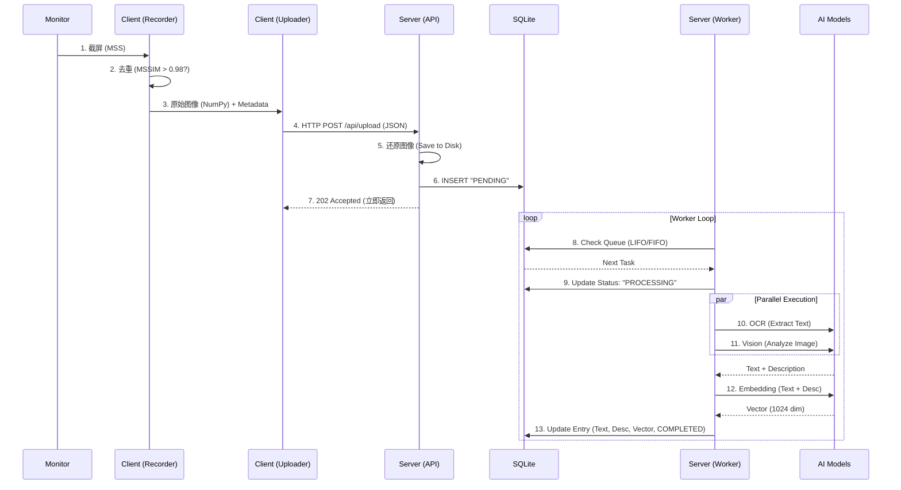

# OpenRecall 项目分析报告

> ⚠️ **已过时（Deprecated）**：本文档可能包含与当前实现不一致的描述（例如 FastAPI/JSON upload/单一数据目录等）。请以 `docs/MyRecall_V2_Analysis.md` 为准。
> ⚠️ **Deprecated**: This document may not match the current code (e.g., Flask + multipart upload + split client/server data dirs). See `docs/MyRecall_V2_Analysis.md`.

## 1. 项目概览

OpenRecall 是一个开源的隐私优先的屏幕记忆工具，采用 **Client-Server** 架构。
- **Client**: 负责定期截取屏幕截图，收集上下文信息（活动应用、窗口标题），并将数据上传到 Server。
- **Server**: 负责接收数据、异步处理（OCR、图像理解、Embedding）、存储数据，并提供 Web 界面和搜索 API。

## 2. 处理 Pipeline (Ingestion & Processing)

数据处理流程分为两个主要阶段：**同步摄入 (Ingestion)** 和 **异步处理 (Processing)**。

### 2.1 同步摄入 (Ingestion)
**入口**: `openrecall/server/api.py` -> `/api/upload`

1.  **接收数据**: 接收 Client 上传的 JSON 数据（包含图像数据、时间戳、应用名称、窗口标题）。
2.  **落盘**: 将图像数据还原为图片文件，保存到磁盘 (`settings.screenshots_path`)。
3.  **入库 (PENDING)**: 在 SQLite 数据库中插入一条状态为 `PENDING` 的记录。
4.  **立即响应**: 返回 HTTP 202 Accepted，不等待后续繁重的 AI 处理，确保 Client 端低延迟。

### 2.2 异步处理 (Processing)
**核心**: `openrecall/server/worker.py` -> `ProcessingWorker`

后台线程 `ProcessingWorker` 持续监控数据库中的任务队列。

1.  **任务调度**:
    -   默认使用 **FIFO** (先进先出) 处理任务。
    -   当积压任务超过阈值 (`settings.processing_lifo_threshold`，默认 10) 时，切换为 **LIFO** (后进先出)，优先处理最新的截图，保证用户感知的实时性。
2.  **处理步骤**:
    -   **Step 1: OCR (文字提取)**
        -   调用 `ocr_provider.extract_text()`。
        -   提取图片中的可见文本。
    -   **Step 2: Vision Analysis (图像理解)**
        -   调用 `ai_provider.analyze_image()`。
        -   生成图像的语义描述（例如："用户正在 VS Code 中编写 Python 代码"）。
    -   **Step 3: Embedding (向量化)**
        -   将 **OCR 文本** 与 **Vision 描述** 合并：`combined_text = f"{text}\n{description}"`。
        -   调用 `embedding_provider.embed_text(combined_text)` 生成高维向量。
    -   **Step 4: 完成 (Completion)**
        -   更新数据库记录：写入 OCR 文本、图像描述、Embedding 向量，并将状态更新为 `COMPLETED`。

## 3. 查询 Pipeline (Search & Query)

**入口**: `openrecall/server/app.py` -> `/search`

查询过程基于语义向量检索 (Vector Search)。

1.  **接收请求**: 获取查询关键词 `q` 和可选的时间范围 (`start_time`, `end_time`)。
2.  **初步筛选**: 根据时间范围从数据库中拉取候选记录 (`RecallEntry`)。
3.  **语义匹配**:
    -   **Query Embedding**: 调用 `NLPEngine` 将查询关键词 `q` 转换为向量。
    -   **Cosine Similarity**: 计算查询向量与所有候选记录向量的余弦相似度。
4.  **排序与返回**:
    -   按相似度从高到低排序。
    -   渲染 `search.html` 模板返回结果。

## 4. 模型与 AI 架构 (Models & Providers)

OpenRecall 采用插件式 AI 架构，支持本地运行和云端 API。

**代码位置**: `openrecall/server/ai/`

### 4.1 核心能力 (Capabilities)
系统定义了三种核心能力：
-   **OCR**: 文字提取
-   **Vision**: 图像理解
-   **Embedding**: 文本向量化

### 4.2 提供商 (Providers)

#### Local (默认，隐私优先)
本地模式依赖 `transformers`、`docTR` 和 `sentence-transformers` 库。

-   **OCR Model**:
    -   库: `docTR` (Document Text Recognition)
    -   检测模型: `db_mobilenet_v3_large`
    -   识别模型: `crnn_mobilenet_v3_large`
-   **Vision Model**:
    -   模型: **Qwen3-VL** (`Qwen3VLForConditionalGeneration`)
    -   用途: 生成图像的自然语言描述。
-   **Embedding Model**:
    -   模型: **Qwen3-Embedding-0.6B** (默认路径: `/Users/tiiny/models/Qwen3-Embedding-0.6B`)
    -   维度: 1024
    -   库: `SentenceTransformer`

#### Cloud (可选)
支持通过 API 调用云端大模型，适合性能有限的设备。
-   **OpenAI**: 支持兼容 OpenAI 协议的模型（如 GPT-4o, DeepSeek 等）。
-   **DashScope (阿里云)**: 支持 Qwen 系列云端模型。

## 5. 数据库设计

**存储**: SQLite (`settings.db_path`)

**表结构 (`entries`)**:
| 字段 | 类型 | 说明 |
| :--- | :--- | :--- |
| `id` | INTEGER | 主键 |
| `timestamp` | INTEGER | 截图时间戳 (索引, Unique) |
| `app` | TEXT | 活动应用名称 |
| `title` | TEXT | 窗口标题 |
| `text` | TEXT | OCR 提取的文本 |
| `description` | TEXT | AI 生成的图像描述 |
| `embedding` | BLOB | 序列化的向量数据 |
| `status` | TEXT | 状态 (`PENDING`, `PROCESSING`, `COMPLETED`, `FAILED`) |

## 6. 关键配置

配置通过 `openrecall/shared/config.py` 管理，支持环境变量覆盖。

-   `OPENRECALL_AI_PROVIDER`: 指定 AI 提供商 (`local`, `openai`, `dashscope`)。
-   `OPENRECALL_DEVICE`: 推理设备 (`cpu`, `cuda`, `mps`)。
-   `OPENRECALL_PROCESSING_LIFO_THRESHOLD`: 触发 LIFO 模式的队列阈值。

## 7. 详细数据流与 Pipeline 解析

本节深入剖析数据从采集到检索的完整生命周期。

### 7.1 数据流全景图 (Data Flow Overview)

### 7.2 关键环节深度解析

#### A. 客户端采集与去重 (Client Capture & Deduplication)
*   **采集**: 使用 `mss` 库捕获屏幕。
*   **去重算法**: **MSSIM (Mean Structural Similarity Index)**。
    *   客户端会缓存上一帧截图。
    *   将当前帧与上一帧计算 MSSIM 相似度。
    *   **阈值**: 默认 `0.98` (`settings.similarity_threshold`)。
    *   **效果**: 只有当屏幕内容发生显著变化时（如滚动页面、切换窗口），才会触发上传，极大节省了服务器计算资源。
*   **数据打包**: 图像被转换为 NumPy 数组，并序列化为 JSON 列表发送，附带 `active_app` 和 `active_window`。

#### B. 服务端数据重构 (Server Reconstruction)
*   **接收**: Server 接收到的不是 multipart 文件，而是 JSON Payload。
*   **重构**: 使用 `numpy.array()` 和 `reshape()` 将扁平数组还原为图像矩阵。
*   **设计考量**: 这种方式虽然 JSON 体积较大，但与 NumPy 生态结合紧密，便于后续直接传递给 AI 模型处理。

#### C. AI 处理逻辑 (AI Processing Logic)
Worker 线程执行以下具体逻辑：

1.  **Prompt 工程**:
    *   Vision 模型接收的 Prompt 固定为：**"In one sentence: What app is this and what is the user doing?"**
    *   这确保了生成的 `description` 简洁且专注于用户行为，而非无关的图像细节。

2.  **Embedding 融合策略**:
    *   系统不仅仅对 OCR 文本进行向量化，而是采用了 **"Context Fusion"** 策略。
    *   **输入内容**: `combined_text = f"{text}\n{description}"`
    *   **优势**: 即使 OCR 识别出的文本很少（例如只有图标），Vision 生成的描述也能提供语义信息，保证了向量检索的召回率。

#### D. 搜索匹配逻辑 (Search Matching Logic)
*   **当前实现**: **Brute-force Cosine Similarity** (暴力余弦相似度)。
*   **流程**:
    1.  加载所有（或经过时间筛选的）记录的 Embedding 到内存。
    2.  计算 Query Vector 与每一条记录的相似度。
    3.  NumPy 向量化运算确保了在数万条记录规模下的毫秒级响应。
*   **未来瓶颈**: 当记录数达到百万级时，可能需要引入 FAISS 或向量数据库。
