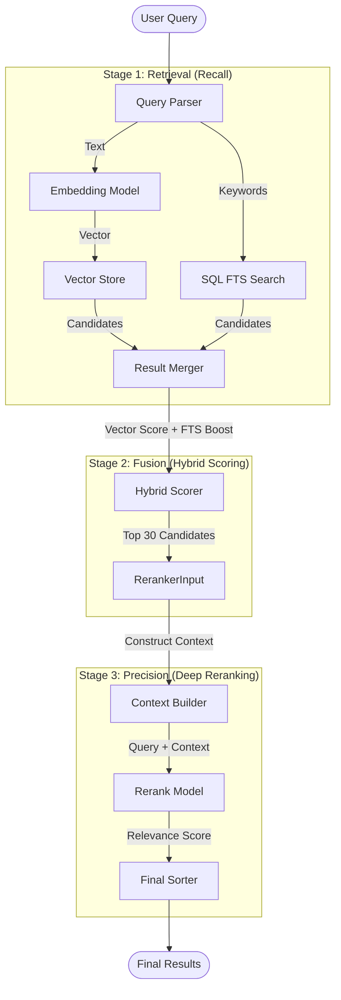

# OpenRecall Hybrid Search Pipeline & Data Flow

> ⚠️ **已过时（Deprecated）**：本文档可能包含与当前代码不一致的描述（例如向量库名称/Provider 细节）。请以 `docs/MyRecall_V2_Analysis.md` 中的 “Hybrid Search Pipeline / 混合检索流水线” 为准。
> ⚠️ **Deprecated**: This document may contain outdated details (e.g., vector store naming/provider specifics). See the “Hybrid Search Pipeline” section in `docs/MyRecall_V2_Analysis.md`.

This document details the search architecture implemented in OpenRecall V2. The system uses a **3-Stage Hybrid Search Pipeline** combining Semantic Search (Vector), Keyword Search (FTS), and Deep Reranking (Cross-Encoder) to deliver high-precision results.

## 1. Pipeline Overview

The search engine processes user queries through three distinct stages to balance recall (finding all relevant items) and precision (ranking the best items first).



## 2. Pipeline Stages Detail

### Stage 1: Query Parsing & Dual Retrieval

*   **Input**: Raw user query string (e.g., "python config last week").
*   **Query Parsing**:
    *   Extracts time filters (e.g., "last week", "yesterday").
    *   Identifies mandatory keywords (quoted terms).
    *   Separates remaining text for semantic embedding.
*   **Vector Search (Semantic)**:
    *   **Model**: `Qwen/Qwen3-Embedding-0.6B` (via OpenAI-compatible API).
    *   **Action**: Converts query text to a dense vector.
    *   **Store**: ChromaDB (Local Vector Store).
    *   **Output**: Top `limit * 2` candidates based on Cosine Similarity.
*   **FTS Search (Keyword)**:
    *   **Engine**: SQLite FTS5.
    *   **Action**: Performs exact keyword matching on OCR text, captions, and window titles.
    *   **Output**: Candidates matching the text pattern.

### Stage 2: Hybrid Fusion (Reciprocal Rank Fusion - Modified)

*   **Goal**: Combine semantic matches with exact keyword matches.
*   **Logic**:
    1.  Start with **Vector Score** (Cosine Similarity) as the base score.
    2.  If an item is found *only* in FTS (not in Vector top results), fetch it and assign a low base score (0.2).
    3.  Apply **FTS Boost**:
        *   If an item appears in FTS results, add a boost score.
        *   Boost formula: `0.3 * (1.0 - (fts_rank / fts_count))`
        *   Items appearing earlier in FTS results get a higher boost.
*   **Result**: A "Combined Score" and "Combined Rank".
*   **Output**: Top 30 candidates passed to Stage 3.

### Stage 3: Deep Reranking (Cross-Encoder)

*   **Goal**: Re-assess the top candidates using a powerful Cross-Encoder model to understand the nuance of the query vs. the document.
*   **Model**: `Qwen/Qwen3-Reranker-0.6B` (Local or API).
*   **Context Construction**:
    For each candidate, a rich context string is built:
    ```text
    [Metadata]
    App: VS Code
    Title: config.py - MyRecall
    Time: Friday, 2024-01-26 14:00
    
    [Visual Context]
    Scene: coding
    Summary: User is editing a python configuration file...
    
    [OCR Content]
    def search(self): ...
    ```
*   **Scoring**: The Reranker computes a relevance score (0.0 to 1.0) for the `(Query, Context)` pair.
*   **Final Sort**: Results are strictly re-ordered by this Rerank Score.

## 3. Data Flow & Scoring Breakdown

| Stage | Metric / Score Component | Description |
| :--- | :--- | :--- |
| **Vector** | `vector_score` | Cosine similarity from embedding model. |
| **FTS** | `fts_boost` | Bonus points for containing exact keywords. |
| **Fusion** | `combined_rank` | Rank based on `vector_score + fts_boost`. |
| **Rerank** | `rerank_score` | Final semantic relevance from Cross-Encoder. |

**Example Flow for a Document:**
1.  **Vector Search**: Returns Document A with score `0.75`.
2.  **FTS Search**: Document A matches keywords, rank #1. Boost = `0.3`.
3.  **Fusion**: Combined Score = `0.75 + 0.3 = 1.05`. (High Stage 2 Rank)
4.  **Rerank**: Model analyzes text, determines it's highly relevant. Score = `0.98`.
5.  **Final Result**: Document A is ranked #1 with score `0.98`.

## 4. Configuration

The pipeline behavior is controlled by `.env` variables:

| Variable | Description | Default / Example |
| :--- | :--- | :--- |
| `OPENRECALL_EMBEDDING_PROVIDER` | Embedding service provider | `openai` |
| `OPENRECALL_RERANKER_MODE` | Reranker execution mode | `api` or `local` |
| `OPENRECALL_RERANKER_MODEL` | Reranker model name | `Qwen/Qwen3-Reranker-0.6B` |
| `OPENRECALL_RERANKER_URL` | API Endpoint (if mode=api) | `https://api.siliconflow.cn/v1/rerank` |
| `OPENRECALL_RERANKER_API_KEY` | Dedicated API Key | `sk-...` |

## 5. Debugging

The Search UI (`/search`) exposes debug information when `OPENRECALL_DEBUG=true` (or implicitly in the current UI implementation):
*   **Vector**: Raw similarity score and rank.
*   **FTS**: BM25 score (if available) and calculated boost.
*   **Combined**: The intermediate rank before reranking.
*   **Rerank**: The final score assigned by the cross-encoder.
