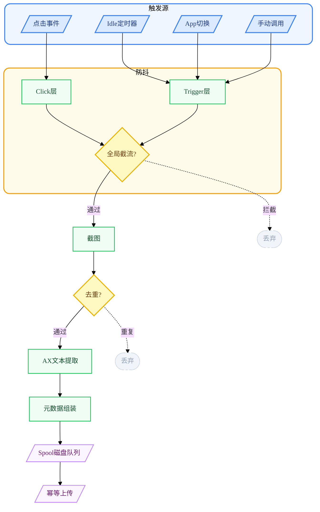
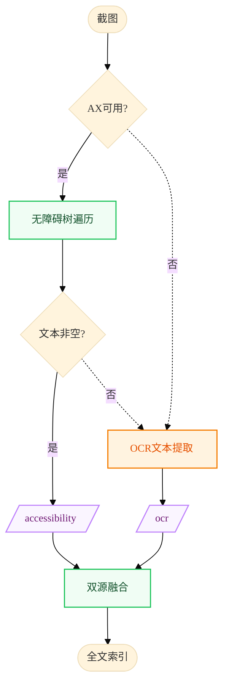
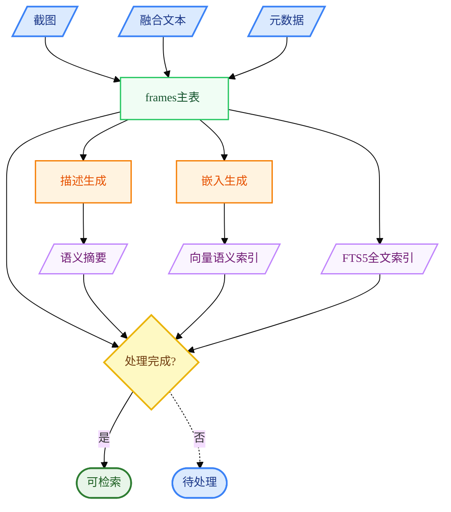
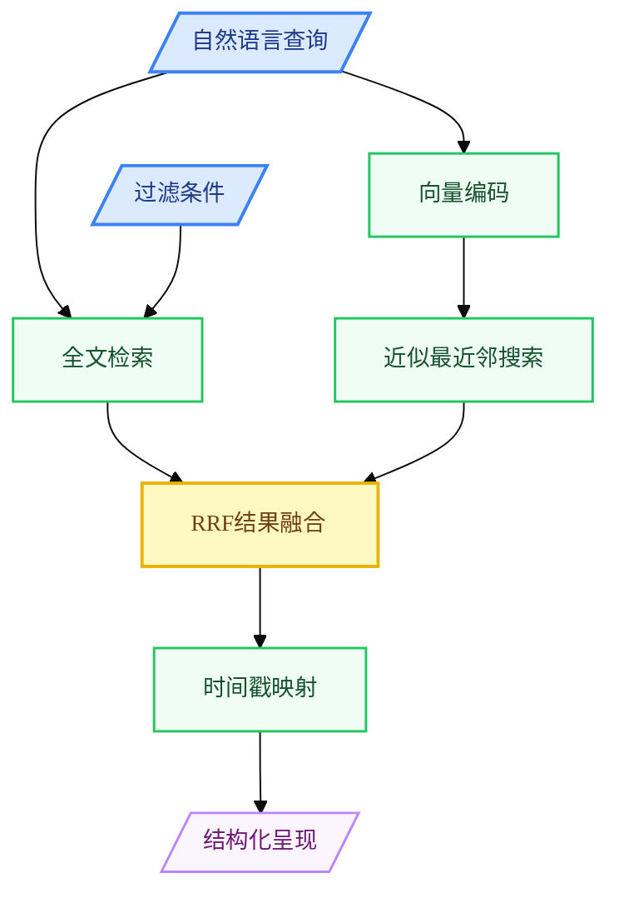
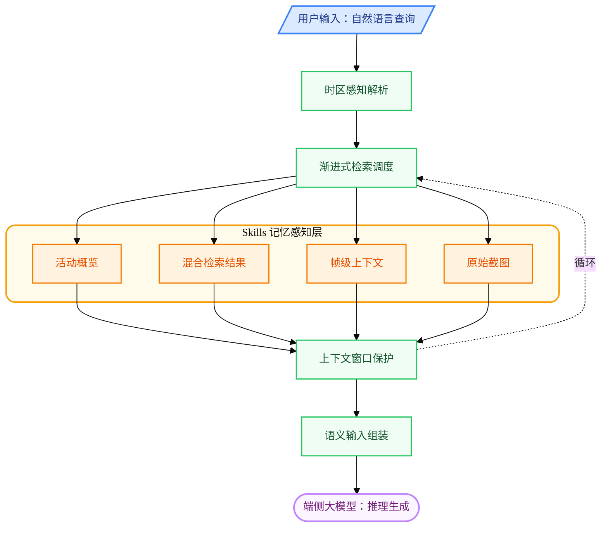
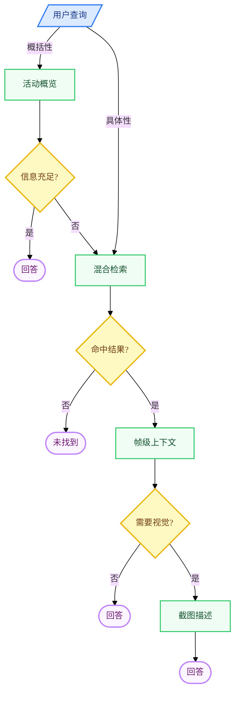

**图2.1 事件驱动屏幕采集与防抖流程图**



**图2.2 多源文本提取流程图**




**图2.3 记忆单元数据流图**



**图2.4 混合语义检索与证据定位流程图**



**图2.5 回忆推理框架图**



**图2.6 渐进式信息披露决策树**


---
config:
  theme: base
  themeVariables:
    fontFamily: ''
    fontSize: 14px
  layout: elk
---
flowchart LR
 subgraph Provider["模型推理层"]
    direction LR
        P1[/"云端模型"/]
        P2[/"本地模型"/]
  end
 subgraph Agent["智能体子进程"]
        A1["JSON-RPC通信<br>时区注入<br>Skills调用"]
  end
 subgraph Service["交互服务层"]
    direction LR
        S1["会话管理"]
        S2["并发控制"]
        S3["流式调度"]
  end
 subgraph UI["用户界面"]
    direction LR
        U1[/"消息输入"/]
        U2[/"会话列表"/]
  end
    U1 --> S2
    S2 --> S3
    S3 --> A1
    A1 --> P1 & P2
    S1 --> U2

     P1:::provider
     P2:::provider
     A1:::agent
     S1:::service
     S2:::service
     S3:::service
     U1:::ui
     U2:::ui
    classDef ui fill:#dbeafe,stroke:#3b82f6,stroke-width:1.5px,color:#1e3a8a
    classDef service fill:#f0fdf4,stroke:#22c55e,stroke-width:1.5px,color:#14532d
    classDef agent fill:#fff3e0,stroke:#f57c00,stroke-width:1.5px,color:#e65100
    classDef provider fill:#faf5ff,stroke:#c084fc,stroke-width:1.5px,color:#701a75
    style Provider fill:#faf5ff,stroke:#c084fc,stroke-width:2px,rx:12,ry:12
    style Agent fill:#fffbeb,stroke:#f59e0b,stroke-width:2px,rx:12,ry:12
    style Service fill:#f0fdf4,stroke:#22c55e,stroke-width:2px,rx:12,ry:12
    style UI fill:#eff6ff,stroke:#3b82f6,stroke-width:2px,rx:12,ry:12
```
**图2.7 自然语言交互框架图**
