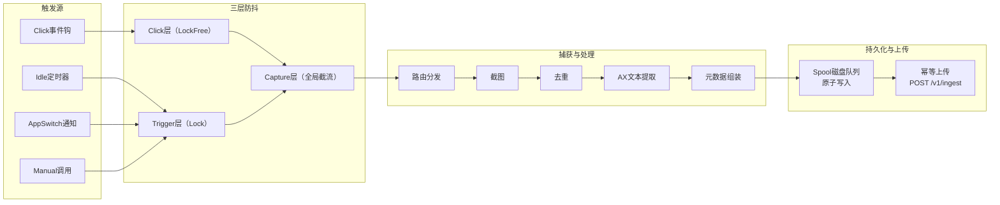
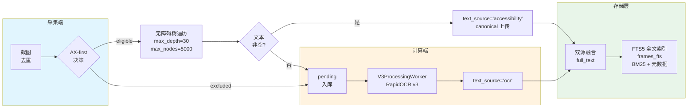
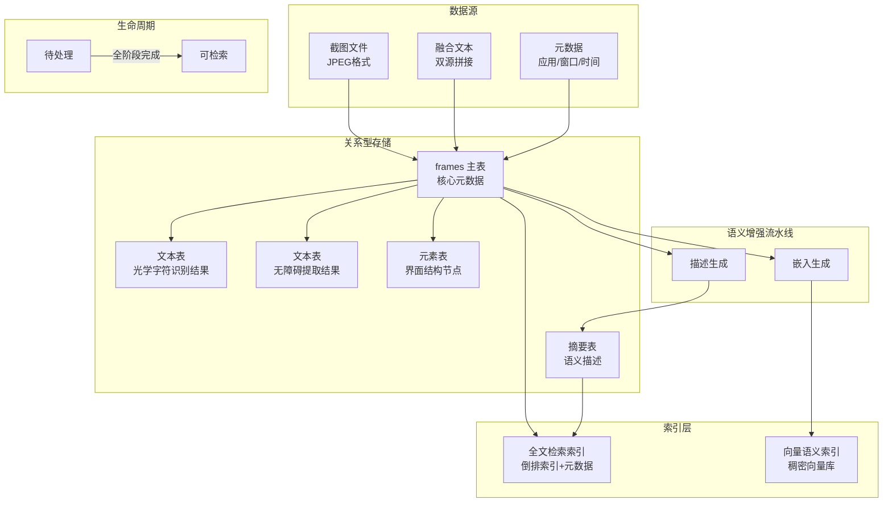
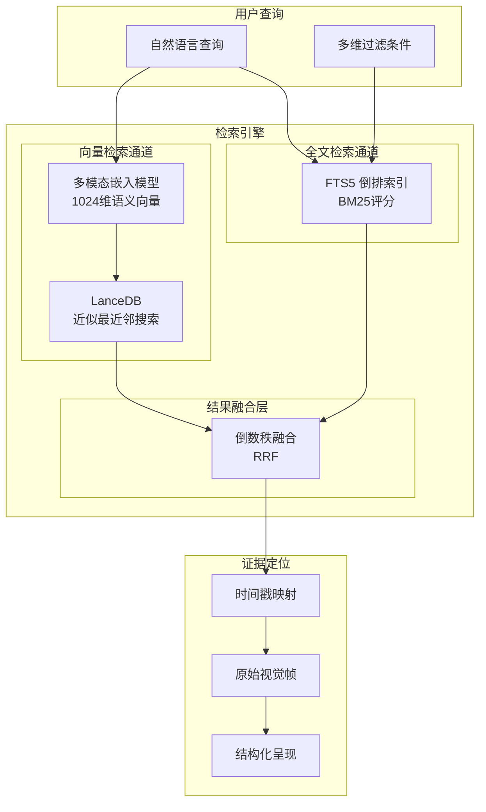
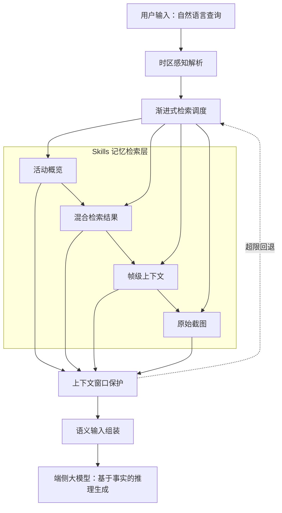
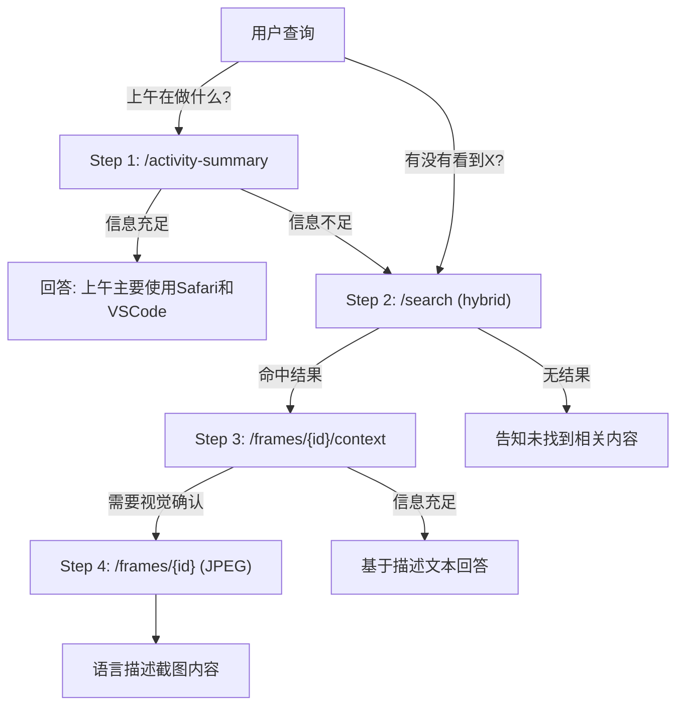
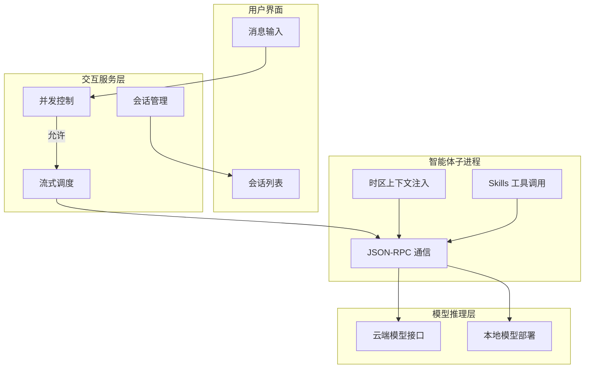

# 基于端侧大模型的个人回忆助手系统实现 —— 中期报告

Implementation of a Personal Memory Assistant System Based on On-Device LLMs — Mid-Term Report

> **学院（系）：** 计算机科学与技术学院
> **专业：** 计算机科学与技术
> **学生姓名：** 王奕芃
> **学号：** 20222241082
> **指导教师：** 张亮
> **中期报告日期：** 2026.4.22

---

## 1 课题计划及进度

### 1.1 进度计划

对照开题报告预定的研究进度，各阶段时间安排如下：

- 第一～三周：调研端侧大模型、屏幕数据采集与长期记忆相关技术，阅读文献，完成技术储备；
- 第四～五周：完成系统总体架构设计，明确采集端与计算端的职责边界，撰写并提交开题报告；
- 第六～八周：开发屏幕信息采集模块，基于事件驱动的混合采集机制，实现感知哈希去重与多源文本提取；
- 第九～十周：构建记忆库与索引体系，设计帧数据存储结构，搭建全文检索和向量语义索引；
- 第十一～十二周：实现语义检索与证据定位功能，设计混合融合策略，优化检索结果呈现；
- 第十三～十四周：开发回忆推理与自然语言交互模块，集成端侧大模型，实现流式对话；
- 第十五周：开展系统集成测试与性能调优，整理实验数据，撰写毕业论文；
- 第十六周：答辩。

### 1.2 课题进度

已经基本完成任务计划中的前五项。

回忆推理与自然语言交互模块已完成基础框架，包括SSE流式对话接口、会话管理与提示词构建，端侧大模型已集成并可进行基础问答，正在优化对话质量、响应延迟与上下文组装策略。

整体进度在预期范围内。

---

## 2 完成工作及成果

### 2.1 完成工作

课题现已完成的工作有：

1. 事件驱动的屏幕采集机制；
2. 多源文本提取；
3. 记忆单元构建与索引；
4. 混合语义检索与证据定位；
5. 端侧大模型回忆推理；
6. 自然语言交互基础框架。

### 2.2 课题成果

#### 2.2.1 事件驱动屏幕采集机制

屏幕信息采集是系统获取用户数字活动痕迹的入口。采集端作为轻量级感知进程，采用生产者–消费者模型组织采集流程：主循环负责监听系统事件、执行截图捕获与去重过滤，后台线程异步消费磁盘队列并向计算端传输数据。整体数据流如图2.1所示，依次经过事件触发、多层防抖、路由分发、截图捕获、多级去重、无障碍文本提取、元数据组装、磁盘队列持久化与幂等上传等环节。

**图2.1 事件驱动屏幕采集与防抖流程图**

为兼顾信息覆盖度与系统开销，本研究设计了多种触发机制协同工作。Idle触发作为定时兜底策略，在用户长时间无交互时周期性唤醒捕获，防止静默期信息遗漏；AppSwitch触发监听操作系统应用焦点切换通知，在用户切换应用时立即捕获新上下文；Click触发通过全局事件钩捕获鼠标点击行为，记录用户主动交互瞬间；Manual触发由Web界面或API调用发起，供用户主动回溯。事件触发与定时兜底形成互补：前者保证"变化即捕获"的响应性，后者确保长周期内记忆的连续性。

为避免高频事件导致重复捕获，系统实现了三层防抖架构，如图2.1所示。Click层防抖运行于系统事件的高优先级回调线程，采用无锁原子读写，避免线程阻塞导致系统卡顿。Trigger层防抖覆盖应用切换与空闲触发，以设备维度记录上次触发时间戳进行窗口过滤。Capture层防抖位于主捕获循环入口，以最近一次成功落盘时间为基准进行全局截流。Click层与Trigger层各自覆盖不同类型的触发源，分类并行处理后汇入事件通道，统一经过Capture层全局截流。系统还配置了独立配置监听线程，通过运行表与线程事件实现配置热重载，三层防抖间隔均可动态更新而无需重启进程。

在图像去重方面，系统采用多级策略降低存储冗余。第一层为内容哈希精确去重：对AX文本内容计算哈希值，短时间内相同哈希值直接丢弃。第二层为感知哈希模糊去重：对截图进行离散余弦变换，构建64位感知哈希，通过汉明距离度量视觉相似度。设两帧图像的感知哈希分别为$h_1$和$h_2$，其汉明距离为：

$$d(h_1, h_2) = \text{bit\_count}(h_1 \oplus h_2)$$

当距离不超过阈值时判定为相似帧并予以丢弃。缓存采用设备隔离的滑动窗口结构，并引入基于最近条目时间的相对TTL过期机制，避免相似内容被拦截。系统还设有安全阀机制，当某设备超过最大跳过时长仍未成功捕获时，强制跳过去重逻辑，确保不会因为过滤策略导致记忆断层。

去重通过后的帧数据进入磁盘队列，每张截图以临时文件写入后通过原子重命名落盘，配套的元数据以JSON格式存储，包含触发类型、时间戳、应用名称、窗口标题等上下文信息。后台上传线程轮询读取待处理的图像–元数据对，通过捕获标识符实现幂等上传，网络中断时自动积压于本地磁盘，恢复后续传，保证采集端在离线场景下持续可用。

#### 2.2.2 多源文本提取

屏幕截图的文本信息是语义索引的核心原料。不同场景下文本分布差异显著：办公软件以结构化文档为主，浏览器页面包含大量嵌套元素，终端应用则以等宽字体渲染代码。为兼顾精度与效率，本研究设计双源文本互补架构，优先通过 AX树提取结构化文本，在不适用场景下回退至 OCR 视觉识别，最终融合为统一全文索引。

**图2.2 多源文本提取流程图**

**AX决策** 采集端每次触发后依次进行类别判断：仅对聚焦显示器上的窗口采集；终端应用被直接标记为 OCR 偏好并跳过；遍历失败或无窗口则回退 OCR；空白文本保留元数据但标记为未采纳。通过检查的帧进行特殊标记，直接上传并跳过服务端 OCR。

**有界树遍历** 对通过类别判断的帧执行有界深度优先遍历。遍历中跳过装饰元素，提取有文本信息的节点内容。针对浏览器应用，读取窗口属性自动提取当前 URL，独立存储供域名筛选与来源溯源。

**OCR回退与融合。** 未通过 AX 策略的帧以待处理状态入库，调度OCR进行异步提取。系统为每帧维护来源。把双源文本进行拼接融合，建立全文索引，同时纳入元数据，实现文本内容与上下文属性的联合检索。

#### 2.2.3 记忆单元构建与索引

经过文本提取与融合的帧数据需要被组织为可长期存储、可高效检索的结构化记忆单元。本节从数据模型、生命周期管理、存储压缩、全文检索与向量语义索引四个层面阐述记忆库的构建方法。

**（1）记忆单元数据模型设计**

系统采用"一主多从"的关系型结构组织记忆数据，如图2.3所示。

**图2.3 记忆单元数据流图**

主表记录每帧截图的核心元数据，包括时间戳、应用名称、窗口标题、浏览器地址、触发类型和截图文件路径等。截图本身以文件形式存储于本地磁盘，主表仅保存路径引用，兼顾存储效率与访问速度。

从表分别承担不同的语义存储职责。两张文本从表分别记录光学字符识别回退路径和无障碍优先路径提取的文本内容，通过帧标识与主表关联。元素从表存储无障碍树的结构化节点信息，保留元素的角色、文本、坐标和层级关系，支撑界面结构的细粒度重建。摘要从表存储大模型生成的结构化描述，包含场景叙述、内容概括和主题标签。查询时按需连接从表，避免数据冗余。

**（2）多阶段处理状态与生命周期管理**

一帧数据从入库到可被检索，需要经过多个异步处理阶段。系统为每帧维护一组独立的状态字段，分别追踪文本提取、语义摘要生成和向量嵌入生成三个阶段的完成情况。

三个阶段相互独立、异步推进。当且仅当所有阶段均成功完成时，该帧的可见状态自动由"待处理"晋升为"可检索"，此时该帧正式进入检索候选集；任一阶段发生永久失败（达到最大重试次数），则整体标记为"失败"，不对外暴露。

这种设计的意义在于：检索接口只需判断"可检索"状态即可保证数据完整性，无需感知底层各阶段的复杂细节；各阶段失败可独立重试，互不影响；同时为后续扩展新的处理阶段预留了状态扩展空间。

**（3）存储压缩策略**

个人数字记忆具有持续积累的特性，长期运行会产生大量截图和文本数据，存储压缩是控制磁盘占用的必要手段。目前系统从三个层面实施压缩：第一，采集端去重压缩，如 2.2.1 节所述，系统通过内容哈希精确去重和感知哈希模糊去重，在数据入库前拦截重复帧，实测表明日常办公场景下约有三至五成的截图因界面静止或微小变动而被过滤；第二，格式选择与结构化替代，截图采用有损压缩格式存储，同时优先提取无障碍结构化文本替代纯视觉存储，其数据量远小于原始截图；第三，开题报告中预期的基于重要性评估和访问频率分析的主动压缩策略——对老旧或低频访问的记忆保留高价值文本语义和核心视觉信息、压缩或丢弃冗余数据——目前仍处于方案设计阶段，计划作为后期优化工作实现。

**（4）全文检索与向量语义双轨索引**

针对用户通过关键词定位记忆的需求，系统构建基于全文检索的倒排索引。索引覆盖融合后的双源文本以及应用名称、窗口标题、浏览器地址等元数据字段，实现文本内容与上下文属性的联合检索。分词环节采用支持万国码字符集的分词器，能够对中文界面文本、英文内容和混合文本进行有效切分。评分采用内置的概率排序函数，综合考虑词项在文档中的出现频率、文档长度以及词项在整个集合中的稀有程度，对检索结果按相关性排序。索引通过数据库触发器与主表保持自动同步，插入、更新和删除操作均实时反映到索引中，保证数据一致性。除全文匹配外，系统还在时间戳、应用名称、窗口标题等字段上建立树形索引，支持时间范围、应用类型、焦点状态等维度的精确过滤，与全文检索联合执行。

关键词检索难以应对"语义相似但字面不同"的查询场景。例如用户搜索"上周看的论文"，但文本中实际出现的是某篇具体论文的标题，此时需要基于语义理解而非字面匹配来定位记忆。系统引入向量语义索引作为全文检索的补充，采用本地向量数据库存储帧的语义向量，该数据库具备列式存储和高效的近似最近邻搜索能力，适合端侧部署。嵌入模型选择千问视觉语言模型的嵌入版本，将截图图像与提取文本融合为单一的语义向量表示，生成的向量维度为 1024。上述嵌入向量和语义摘要均由后台异步线程生成——嵌入生成线程轮询任务队列，调用多模态嵌入模型生成向量并写入向量数据库；描述生成线程独立运行，生成结构化语义摘要（含场景叙述、内容概括与主题标签）。两条流水线均采用先进先出的处理顺序，失败时启用渐进式重试，最多三次。向量索引不替代全文索引，二者在混合检索模式下通过倒数秩融合策略进行结果融合，具体方法在下一节详述。

#### 2.2.4 混合语义检索与证据定位

用户的回忆请求往往具有模糊性和语义跨越特征。例如查询"上周看的论文"，文档标题中未必包含"论文"一词；又如查询"那个红色的报错界面"，用户描述的是视觉印象而非文本内容。单一的全文检索依赖字面匹配，难以应对语义漂移；纯向量检索虽能捕捉语义相似性，却缺乏对精确关键词的敏感度和元数据过滤能力。为此，本研究设计了三模式协同的混合检索架构，如图2.4所示。

**图2.4 混合语义检索与证据定位流程图**

**（1）双轨检索架构**

系统构建两条互补的检索通道。全文检索通道基于数据库内置的全文检索引擎，采用概率排序模型对文档进行相关性评分。该评分综合考虑词项在文档中的出现频率、文档长度以及词项在整个集合中的稀有程度，对关键词匹配具有良好的区分能力。检索覆盖融合后的双源文本（无障碍提取文本与光学字符识别结果）以及应用名称、窗口标题、浏览器地址等元数据字段，实现文本内容与上下文属性的联合检索。

向量检索通道依托本地向量数据库，采用多模态嵌入模型将截图图像与提取文本融合为单一的语义向量表示，生成的向量维度为1024。查询时，系统将用户输入文本通过同一嵌入模型编码为查询向量，在向量空间中执行近似最近邻搜索，以余弦距离度量语义相似度。该通道的优势在于能够跨越字面差异捕捉语义关联——即使查询词与文档内容用词不同，只要语义相近即可被召回。

系统同时支持三种检索模式：全文模式适用于精确关键词定位；向量模式适用于语义模糊查询；混合模式（默认）则融合双通道结果，兼顾精确性与语义泛化能力。

**（2）倒数秩融合策略**

双轨检索产生两套独立排序的结果序列，需要一种不依赖原始评分尺度的融合方法。系统采用倒数秩融合策略，其核心思想是将每个候选帧在各自检索通道中的排名转化为统一量纲的融合分数。设某帧在全文检索结果中的排名为 $r_{\text{fts}}$，在向量检索结果中的排名为 $r_{\text{vec}}$，则该帧的融合分数为：

$$S_{\text{RRF}} = \frac{w_{\text{fts}}}{k + r_{\text{fts}}} + \frac{w_{\text{vec}}}{k + r_{\text{vec}}}$$

其中 $k$ 为平滑参数，用于控制低排名项对总分的影响程度，取值越大则排名差异对分数的衰减越平缓；$w_{\text{fts}}$ 和 $w_{\text{vec}}$ 分别为全文通道和向量通道的权重系数，满足 $w_{\text{fts}} + w_{\text{vec}} = 1$。该策略的优势在于：仅依赖排名而非原始评分值，避免了不同检索通道评分尺度不统一的问题；对高排名结果给予显著更高的分数贡献，符合用户通常更关注前位结果的行为模式；权重参数可动态调节，适应不同查询场景对精确匹配与语义泛化的偏好差异。

**（3）元数据多维过滤**

用户的回忆请求往往带有明确的时间或应用上下文约束，例如"昨天在浏览器里看到的那篇文章"或"上周会议里的方案"。系统在检索流程中支持元数据维度的精确过滤，与全文检索联合执行。过滤条件包括时间范围（起始与截止时间戳）、应用名称、窗口标题、浏览器地址以及焦点状态。这些条件在数据库查询层通过树形索引直接筛选，不参与排序计算，从而在保证检索精度的同时维持较低的查询延迟。元数据过滤与文本检索的结合，使系统能够处理"语义内容 + 结构化上下文"的复合查询需求。

**（4）证据定位与结果呈现**

检索结果需要向用户提供可追溯的证据链。每帧记忆数据在入库时即与精确时间戳和原始截图文件建立一一映射关系。检索结果返回时，包含该帧的唯一标识、时间戳、融合评分以及指向原始截图的访问路径。用户可通过时间戳在时间轴视图中快速定位该记忆的发生时刻，亦可直接查看原始视觉帧以核验检索结果。

为进一步增强结果的可解释性，系统在混合模式下返回多维度评分信息：融合后的综合分数反映该帧的整体相关性；原始全文评分和向量相似度分别揭示该帧在关键词匹配和语义相似两个维度上的表现；各维度排名则辅助用户理解结果排序依据。这种透明化的评分展示不仅提升了用户对检索结果的信任度，也为后续调优权重参数提供了数据支撑。

#### 2.2.5 端侧大模型回忆推理

回忆推理模块承担着将检索到的碎片化记忆数据转化为连贯、可信自然语言回答的核心职责。用户以自然语言发起回忆请求（如"昨天看的论文是什么"或"上午在做什么"），系统需先理解其时间语义与意图，再从记忆库中定位相关证据，最终组织为结构化输入引导端侧大模型生成基于事实的推理回答。本节从时区感知提示词构建、渐进式信息检索、上下文窗口保护和语义输入组装四个方面阐述回忆推理的设计与实现。

**图2.5 回忆推理框架图**

**（1）时区感知提示词注入**

用户的回忆请求中大量使用自然语言时间表达，如"今天""昨天""最近""一小时前"等。这些表达具有强烈的本地时区依赖性——同一时刻，不同时区的"今天"对应的UTC时间范围完全不同。若直接将用户原始查询传递给大模型，模型缺乏本地时区上下文，难以正确将自然语言时间转换为可用于数据库查询的UTC时间戳，导致检索范围偏差。

为此，系统在每次对话前向大模型注入一组时区上下文提示词，包含当前本地日期、时区名称与UTC偏移量、本地当天午夜对应的UTC时间锚点、本地昨天午夜对应的UTC时间锚点以及当前UTC时间。这些锚点信息使大模型能够将"今天"准确映射为"从本地午夜到当前时刻的UTC区间"，将"昨天"映射为"从昨天午夜到今天午夜前1秒的UTC区间"，从而生成精确的时间范围查询参数。

该注入机制采用透明化设计——时区上下文以格式化文本头部形式附加在每轮对话消息之前，大模型可自动提取所需锚点进行时间转换，无需额外的工具调用或外部计算模块。实测表明，注入时区上下文后，大模型对"今天""昨天"等相对时间表达的解析准确率显著提升，检索时间范围的误匹配率大幅下降。

**（2）渐进式信息披露策略**

用户回忆请求的粒度差异显著：有的询问宏观活动概况（"上午在做什么"），有的寻找特定信息片段（"那篇论文的标题"），还有的请求查看原始视觉证据（"截图里显示了什么"）。若对所有请求均返回完整的检索结果集，不仅会浪费大模型的上下文窗口，还可能引入无关信息干扰推理质量。

本研究设计了一种四步递进的信息披露策略，根据查询意图动态决定信息获取的深度：

第一步，活动概览。对于宏观概况类查询，系统首先调用活动摘要接口，获取指定时间范围内的应用使用统计和场景描述概览。该接口返回的数据量小、信息密度高，足以回答"在做什么""用了哪些应用"等粗粒度问题。

第二步，混合检索。当用户询问具体内容（"有没有看到关于X的信息"）或第一步的结果不足以回答时，系统执行混合语义检索，返回与查询语义最相关的若干记忆帧。检索支持全文、向量和混合三种模式，默认采用混合模式以兼顾精确匹配与语义泛化。

第三步，帧级上下文。对于第二步返回的高相关度帧，系统进一步获取该帧的详细上下文，包括完整提取文本、AI生成的场景描述、浏览器地址等结构化信息。场景描述（narrative字段）经过语义摘要模型生成，是对该帧内容的最高质量自然语言概括，优先用于理解用户在该时刻的活动。

第四步，原始视觉帧。当用户明确要求查看截图或前三步仍无法确认信息时，系统获取原始JPEG截图。由于截图数据量较大（约100–200 KB），该步骤仅在必要时触发，且大模型以语言描述方式汇报截图内容，不将原始图像数据嵌入上下文。

**图2.6 渐进式信息披露决策树**

渐进式披露的核心优势在于：信息获取量与查询需求精准匹配，避免过度检索；每一步的决策由大模型根据已有信息自主判断，无需预设固定规则；上下文窗口占用随查询复杂度线性增长，而非恒定满载。

**（3）上下文窗口保护**

端侧大模型的上下文窗口通常有限（数K至数十K tokens），而记忆检索的响应可能包含大量文本内容（单帧提取文本可达数千字符，多帧搜索结果总量轻易超过窗口容量）。若不加控制地将检索结果全部塞入提示词，不仅浪费tokens，还可能导致关键信息被截断或稀释。

系统从三个层面实施上下文窗口保护。第一，接口级截断：活动摘要接口通过参数控制返回描述条目的数量；搜索接口默认限制返回结果数量，并在混合模式下自动截断文本字段；帧上下文接口将文本内容硬性上限设为5000字符，超长内容以省略号后缀截断。第二，响应级截断：大模型在读取API响应前检查数据大小，对超过约5KB的响应执行头部截断，仅保留最关键信息进入上下文。第三，按需加载原则：仅在明确需要时才请求包含完整文本的响应，默认情况下搜索不返回文本内容，仅返回元数据和评分信息。

窗口保护策略可形式化描述为：设第$i$帧的文本长度为$l_i$，检索返回$N$帧，则未经保护的总文本量为$L = \sum_{i=1}^{N} l_i$。经截断后，每帧文本上限为$L_{\max}$，总上下文占用为$L' = \sum_{i=1}^{N} \min(l_i, L_{\max})$。当$L' > C_{\text{window}}$（窗口容量阈值）时，系统优先保留排名靠前的帧，逐步削减靠后帧的文本配额，确保核心证据不被挤出上下文。

**（4）语义输入组装与推理质量控制**

检索到的记忆数据具有碎片化特征：同一查询可能返回多帧不连续的截图信息，每帧包含不同质量的文本来源（无障碍提取或OCR回退）、不同置信度的语义描述以及多维度的相关性评分。如何将这些异构信息有效组织为大模型可理解的结构化输入，直接影响最终回答的准确性与可信度。

系统在语义输入组装环节遵循以下原则。来源质量区分：无障碍提取文本（accessibility）的结构化程度和准确度通常优于OCR回退文本（ocr），系统在组装输入时标注每帧的文本来源，使大模型能够依据来源质量判断信息的可靠程度。多维度评分展示：在混合检索模式下，每帧返回融合评分、全文评分、向量相似度及其各自排名。这些评分以结构化形式呈现，帮助大模型理解不同帧在关键词匹配和语义相似两个维度上的相对表现。时间序列组织：多帧结果按时间戳排序呈现，维护记忆的时间先后关系，便于大模型推断用户活动的时序逻辑。

推理质量控制方面，系统通过提示词设计引导大模型严格基于本地检索到的客观事实进行回答，避免幻觉生成。具体策略包括：要求模型在回答中引用具体的帧标识或时间戳作为证据支撑；当无障碍提取与OCR结果存在冲突时，优先采信前者；对于检索结果不足以回答的问题，明确告知用户而非编造信息；场景描述（narrative）作为对帧内容的高质量概括，优先于原始文本用于理解用户活动。

语义输入组装可视为一个证据选择函数：

$$E_{\text{context}} = \text{Assemble}\left(\{f_i\}_{i=1}^{N}, \{s_i^{\text{fts}}, s_i^{\text{vec}}, r_i\}_{i=1}^{N}, \{t_i, a_i\}_{i=1}^{N}\right)$$

其中$f_i$为第$i$帧的内容信息，$s_i^{\text{fts}}$和$s_i^{\text{vec}}$分别为全文与向量评分，$r_i$为来源质量标识，$t_i$为时间戳，$a_i$为应用元数据。Assemble函数按相关度排序、按来源质量筛选、按时间序列组织，最终输出结构化的证据上下文$E_{\text{context}}$，供大模型进行基于事实的推理生成。

#### 2.2.6 自然语言交互基础框架

回忆推理模块（2.2.5节）解决了"如何基于检索证据生成回答"的问题，而自然语言交互框架则负责将这一过程封装为可持续、可管理、可恢复的用户对话体验。本研究设计的交互框架涵盖模型集成、流式对话、并发控制、容错恢复和会话管理五个层面，整体架构如图2.7所示。

**图2.7 自然语言交互框架图**

**（1）多提供商模型集成架构**

端侧大模型的部署方式存在多样性：部分场景依赖本地轻量化模型以保障隐私与离线可用性，部分场景通过远程接口调用云端能力以获取更强的推理性能。为兼容上述两种模式并支持灵活切换，系统采用"宿主进程—智能体子进程"的分离架构。

宿主进程负责业务编排与会话状态管理，智能体子进程专注于大模型推理与工具调用。二者通过标准输入输出建立基于 JSON 的远程过程调用通道。该设计的优势在于：推理进程与宿主进程完全隔离，模型推理过程中的异常崩溃不会导致主服务中断；子进程运行时使用独立运行时环境，与宿主实现语言解耦；切换模型配置时，系统自动终止当前子进程并启动新实例加载对应配置，整个过程对用户透明。

在配置管理方面，系统维护统一的认证配置存储，支持按提供商分别保存接口密钥与模型标识。用户通过前端界面完成配置后，系统自动将其持久化至本地配置文件，并触发智能体子进程的重启以生效新配置。对于本地部署场景，系统支持通过自定义服务端点连接本地推理服务，无需额外密钥即可接入私有化模型。

**（2）流式对话接口设计**

大语言模型的推理具有显著的流式生成特征——输出内容逐词产生而非一次性返回。若采用传统的请求-响应模式，用户在模型生成完整回答前将长时间处于等待状态，交互体验极差。为此，系统采用服务器推送事件协议实现流式对话接口。

该协议以文本事件流格式传输数据，定义了三类核心事件类型。文本增量事件用于传输模型生成的内容片段，前端接收到后可实时追加渲染，实现"打字机"式的逐字呈现效果。思考增量事件用于传输推理模型的中间思维链内容，帮助用户理解模型的推理过程。对话结束事件标识当前轮次的生成完毕，触发后端的消息持久化操作。

为防止长连接因长时间无数据而被中间代理或防火墙断开，系统实现了心跳保活机制：当超过设定时间无新事件产生时，自动向客户端发送注释型心跳包维持连接活性。同时设置总超时上限，若模型推理或工具调用在超时窗口内仍未完成，则向客户端返回超时错误并释放请求锁，避免僵尸连接占用系统资源。

**（3）并发控制与容错恢复**

自然语言对话本质上是顺序交互——同一时刻用户通常只发送一条消息，模型也逐条处理。若允许多个请求并发进入，可能导致上下文混乱（如后发送的消息先获得回复）或资源竞争（如多个请求同时操作会话文件）。系统通过互斥锁机制实现单会话级别的并发保护：当存在活跃请求时，新请求被拒绝并返回忙状态提示。

智能体子进程在运行过程中可能因网络波动、模型服务异常或配置错误等原因退出。系统设计了自动恢复机制：当检测到子进程不可用时，按照指数退避策略进行重试，首次等待较短时间后重连，若连续失败则逐步延长等待间隔，最多尝试有限次数。这种设计在快速恢复与避免频繁重试造成资源浪费之间取得平衡。

错误处理方面，系统实现了分级错误码体系。认证类错误提示用户检查配置；速率限制类错误建议稍后重试；模型不可用类错误引导用户更换配置；网络类错误则提示检查连接状态。每类错误均附带建议操作，降低用户排查成本。

**（4）会话管理与持久化**

系统支持多会话并行管理，每个会话以独立文件形式存储于本地目录，采用原子写入策略（临时文件写入后重命名）避免写入过程中的数据损坏。会话数据包含唯一标识、标题、消息历史及时间戳信息。

会话标题自动生成于首条用户消息，提取前若干字符作为摘要，便于用户在会话列表中快速定位。会话支持创建、读取、更新和删除操作，列表按最近更新时间降序排列。切换会话时，系统自动向智能体子进程发送会话重置指令，清除上一轮对话的上下文记忆，确保不同会话间的隔离性。

消息持久化发生在每轮对话结束时：用户消息在请求开始时保存，助手消息在接收到结束事件后保存。若对话过程中发生错误（如超时、模型崩溃），已保存的用户消息保留，助手消息不写入，避免不完整的回复污染会话历史。

**（5）与回忆推理的衔接**

交互框架与2.2.5节的回忆推理模块通过 Skills 机制实现深度衔接。Skills 是一组以结构化文档形式描述的外部工具规范，其中定义了记忆检索接口的调用方法、参数格式和返回语义。智能体子进程加载该规范后，可自主根据用户查询的意图判断调用哪一级检索接口——从宏观活动概览到具体帧上下文，再到原始视觉证据，实现渐进式信息获取策略的自动化执行。时区感知提示词由交互框架在每次对话前自动注入，确保模型对时间表达的正确解析。

---

## 3 后期拟完成的研究工作及进度安排

就现在进展情况，整体进度与原计划基本一致，后续工作安排如下。

具体要完成的任务有：回忆推理与自然语言交互模块的深度优化，重点改进对话质量、响应延迟与上下文窗口保护策略；主动存储压缩策略的设计与实现，基于重要性评估和访问频率分析对老旧记忆进行压缩；系统集成测试与性能评估，围绕信息采集准确率、检索召回率和模型推理延迟三个核心指标整理实验数据；撰写毕业论文。

---

## 4 存在的困难与问题

---

## 5 如期完成全部论文工作的可能性

---