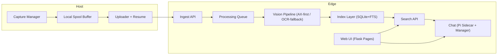

# MyRecall-v3 架构规范（SSOT）

- 版本：v1.0
- 日期：2026-03-03
- 适用范围：MyRecall-v3（vision-only）
- 关联：[`spec.md`](./spec.md), [`decisions.md`](./decisions.md), [`data_model.md`](./data_model.md), [`api_contract.md`](./api_contract.md)

## 1. 目标与边界

- 目标：在 vision-only 范围内，对齐 screenpipe 的视觉能力与行为，并强制落地 Edge-Centric 架构。
- 范围：capture -> processing -> search -> chat（不含 audio）。
- 拓扑约束：Host 与 Edge 默认同 LAN，但架构必须支持远端化。

### ARCH-001 对齐策略

- 决策：只做“能力与行为对齐”，不做“拓扑完全对齐”。
- 依据：screenpipe 主干偏单机闭环，而 v3 强制 Edge 参与。
- 引用：DEC-001A。

### ARCH-002 模型位置

- 决策：模型选择权在 Edge（本地模型或云 API），Host 不做 OCR/Embedding/Chat 推理。
- 依据：若 Host 推理，会破坏 Edge-Centric。
- 引用：DEC-005A。

## 2. 总体拓扑

## 3. 职责边界

### ARCH-010 Host 职责（严格）

- 采集：截图 + 基础上下文（app/window/monitor/timestamp/trigger）。
- 轻处理：压缩、去重哈希、可选 accessibility 文本快照（仅采集，不推理）。
- 传输：断点续传、重试、幂等上传。
- 缓存：本地 spool 与提交位点（offset/checkpoint）。

### ARCH-011 Host 禁止项（P1~P3）

- OCR 推理。
- Embedding/Rerank。
- Chat 推理。
- 页面/UI 承载。

### ARCH-020 Edge 职责（严格）

- 重处理：AX-first + OCR-fallback。
- 索引：SQLite + FTS（见 `data_model.md`）。
- 检索：FTS 召回 + 元数据过滤 + 排序（见 `api_contract.md`）。
- Chat：RAG 编排、工具调用、引用回溯、流式输出。
- UI：P1~P3 继续承载现有 Flask 页面。

## 4. 关键流程

### ARCH-030 Capture/Processing

1. Host 采集并生成 `capture_id`（UUID v7）。
2. Host 调用 `/v1/ingest` 单帧幂等上传。
3. Edge 入队并处理：AX 成功写 `accessibility` 路径，AX 失败走 OCR fallback。
4. 搜索通过 `content_type` 路由到 `search_ocr/search_accessibility/search_all`。

引用：DEC-018C, DEC-019A, DEC-022C, DEC-025A。

### ARCH-031 Chat

1. 前端请求 `/v1/chat`。
2. Edge Python Manager 与 Pi Sidecar 通过 JSON Lines 通信。
3. 事件经 SSE 透传到前端。
4. 通过 Skill 触发检索；回答引用必须可回溯。

引用：DEC-002A, DEC-005A, DEC-013A。

## 5. 阶段策略（架构层）

### ARCH-040 Phase 1

- 完成全功能闭环（capture/processing/search/chat）。
- 串行子阶段推进：P1-S1 -> P1-S7。
- 每子阶段必须通过 Gate。

### ARCH-041 Phase 2/3

- 功能冻结，不新增业务功能。
- Phase 2：LAN 稳定性与重放正确性。
- Phase 3：Debian 生产化部署与运维闭环。

引用：DEC-008A, DEC-009A。

## 6. Non-goals

- 实时远程桌面流媒体。
- 音频转写（audio 路径不在 v3 承诺内）。
- 多租户 SaaS 权限系统。

## 7. 风险与可验证性

### 风险

- Edge 不可达导致 Host backlog 膨胀。
- 事件风暴导致过采样与 LAN 拥塞。
- Edge 高负载导致 UI 与处理争用。

### 验证

- 断网恢复 + 幂等去重验证。
- 队列可观测性（pending/processing/completed/failed）。
- UI 最小可用 Gate（路由、状态可见、关键路径回溯）。

## 8. 禁止重复项

- 本文是“架构边界 SSOT”；其他文档不得复制完整架构规则。
- 决策历史与取舍细节必须引用 `decisions.md` 或 `adr/*.md`，不得在此重写。
- DDL/SQL/API schema 细节必须引用 `data_model.md` 与 `api_contract.md`，不得在此重复定义。
