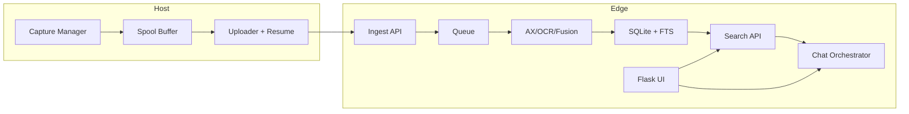

# MyRecall-v3 规格（SSOT, Draft v0.2）

- 日期：2026-02-26
- 适用范围：vision-only（`capture -> processing -> search -> chat`，不含 audio）
- 对齐策略：与 screenpipe 做**能力/行为对齐**，不做部署拓扑对齐
- 文档角色：本文件是 v3 的**唯一事实源（SSOT）**

## 1. 目标与边界

### 1.1 目标
- 在 Edge-Centric 架构下，完成可验证的视觉主链路闭环。
- 在 P1 完成全部功能闭环；P2/P3 仅做稳定性、部署与运维收敛。

### 1.2 Non-goals
- 音频转写与音频检索。
- 实时远程桌面流媒体。
- 多租户 SaaS 权限系统。
- P1~P3 内的 UI 重构与 Host 侧 UI 迁移。

## 2. 术语

- Host：采集端，仅负责轻处理、缓存、上传、重传。
- Edge：处理与服务端，负责 ingest/processing/index/search/chat/UI。
- Capture：一次采集事件（截图 + 元信息 + 可选 AX 文本）。
- Citation：回答可追溯锚点，至少包含 `capture_id/frame_id/timestamp`。
- TTS（Time-To-Searchable）：从 capture 产生到可被 search 命中的时间。

## 3. 架构与职责边界

### 3.1 Host（允许）
- 采集截图与元信息：`app/window/monitor/timestamp/trigger`。
- 采集可选 accessibility 文本并随 capture 上传。
- 断点续传、重试、幂等上传、本地 spool 缓冲。

### 3.2 Host（禁止）
- OCR、caption、embedding、rerank、chat 推理。
- P1~P3 承载页面/UI。

### 3.3 Edge（允许）
- ingest、队列、AX/OCR/fusion 处理、索引、检索、chat 编排。
- 承载 P1~P3 页面/UI（Flask）。
- 本地/云模型路由与可选 fallback（仅在 Edge）。

## 4. 协议契约（事实定义）

### 4.1 Ingest（Host -> Edge）
- `POST /v1/ingest/session`：创建上传会话。
- `PUT /v1/ingest/chunk/{session_id}`：分片上传。
- `POST /v1/ingest/commit`：原子提交。
- `GET /v1/ingest/checkpoint`：断点恢复。
- 幂等键：`capture_id`。
- 一致性要求：重复包可重放，不可重复入库。
- 安全策略：P1 `token + TLS optional`；P2+ `mTLS required`。

### 4.2 Search（Edge）
- `GET /v1/search`：FTS + 元数据过滤（vision-only）。
- `GET /v1/search/keyword`：关键词高性能路径。
- 线上主路径不依赖 vector/rerank。
- 最小返回字段：`capture_id/frame_id/timestamp`（用于回溯）。

### 4.3 Chat（Edge）
- 接口形态：OpenAI-compatible + tool schema。
- 编排能力：`search`、`frame lookup`、`time range expansion`。
- 回答要求：必须提供 citation（可拒答或标记无依据）。
- 路由能力：local/cloud 切换，可选 fallback。
- 支持流式输出；暴露路由/降级状态。

## 5. Capability Dictionary（`C-*`）

| ID | 能力名称 | 定义 | 适用阶段 |
|---|---|---|---|
| C-ING-001 | Host Spool + Resume Upload | Host 具备本地缓存、断点续传、重试 | P1-S1, P2, P3 |
| C-ING-002 | Ingest 四段式协议 | session/chunk/commit/checkpoint 可用 | P1-S1, P2, P3 |
| C-ING-003 | Ingest 队列可观测 | 至少可见 `pending/processing/completed` | P1-S1, P2, P3 |
| C-CAP-001 | 事件驱动采集 | app switch/click/typing pause/idle + idle fallback | P1-S2 |
| C-CAP-002 | Host AX 文本采集上传 | AX 文本随 capture 上传，不在 Host 推理 | P1-S2 |
| C-CAP-003 | Timeline 状态可见 | 上传中/入队/失败重试可见 | P1-S2 |
| C-PRO-001 | AX-first + OCR-fallback | Edge 侧处理决策链路可执行 | P1-S3 |
| C-PRO-002 | OCR 偏好名单 | `ocr_preferred_apps` 生效 | P1-S3 |
| C-PRO-003 | Fusion 文本产物 | 生成可检索的 `fusion_text` | P1-S3 |
| C-PRO-004 | 处理来源可解释 | frame 详情可见来源与时间戳 | P1-S3 |
| C-SCH-001 | `/v1/search` 过滤语义 | time/app/window/content_type 等过滤完整 | P1-S4 |
| C-SCH-002 | `/v1/search/keyword` 路径 | 关键词快速检索路径可用 | P1-S4 |
| C-SCH-003 | 检索回溯字段 | 返回包含 `capture_id/frame_id/timestamp` | P1-S4 |
| C-SCH-004 | Search UI/API 契约映射 | UI 过滤项与 API 参数 1:1，对结果可回溯 | P1-S4 |
| C-CHT-001 | Chat 工具编排 | search/frame lookup/time expansion 可调用 | P1-S5 |
| C-CHT-002 | 引用强制策略 | 无引用回答可拒绝或标记 | P1-S5, P1-S7, P3 |
| C-CHT-003 | 模型路由能力 | local/cloud 可切换，支持超时降级 | P1-S6 |
| C-CHT-004 | 流式输出能力 | 协议一致，具备终止与错误帧 | P1-S6 |
| C-CHT-005 | 路由与降级可见 | UI 可见当前路由、降级原因、恢复状态 | P1-S6 |
| C-UI-001 | 基线路由可达 | `/`、`/search`、`/timeline` 可达 | P1-S1 |
| C-UI-002 | 健康/错误态可见 | 正常与异常态均可见且可恢复 | P1-S1 |
| C-UI-003 | 关键路径闭环 | `timeline -> search -> chat -> citation -> frame` 脚本化通过 | P1-S7, P2, P3 |
| C-OPS-001 | Debian 服务化部署 | systemd/容器部署与启动流程稳定 | P3 |
| C-OPS-002 | 回滚能力 | 灰度升级失败时可回滚 | P3 |

## 6. Gate Metrics Dictionary（`M-*`）

> 所有阈值仅在本节定义。其它文档不得复制阈值正文。

| ID | 名称 | 定义/公式 | 数据来源 | 适用阶段 | 阈值 | 失败处理 |
|---|---|---|---|---|---|---|
| M-ING-001 | Capture 入队延迟 P95 | `capture_created -> edge_queue_pending` 的 P95 | Host/Edge 日志与事件时间戳 | P1-S2 | `<= 3s` | 优先排查上传重试状态机与队列入站瓶颈 |
| M-ING-002 | Host CPU 压测占用 | 300 events/min 场景下 Host CPU | Host 监控指标 | P1-S2 | `< 25%` | 调整去抖、采样间隔与批量上传参数 |
| M-ING-003 | Capture 丢失率 | `(预期 capture - 最终入库 capture)/预期 capture` | 对账任务与入库统计 | P1-S2, P2 | P1-S2 `< 0.3%`; P2 `<= 0.2%` | 立即阻塞 Gate，修复丢包链路并重测 |
| M-ING-004 | 去重正确率 | 重放重复 `capture_id` 无重复入库比例 | ingest 对账日志 | P1-S1 | `= 100%` | 回滚幂等逻辑，禁止进入下阶段 |
| M-ING-005 | 重放一致性通过率 | 同一 `capture_id` 多次回放结果一致 | 回放校验任务 | P2 | `= 100%` | 阻塞 P2 退出，修复序列化/幂等缺陷 |
| M-PRO-001 | 处理决策可追溯率 | 可追溯到 AX/OCR/fallback 原因的记录占比 | processing 日志 | P1-S3 | `>= 95%` | 补齐决策日志字段并重跑样本 |
| M-PRO-002 | 处理来源字段完整率 | frame 详情中来源字段完整记录占比 | UI/API 抽样检查 | P1-S3 | `= 100%` | 视为契约缺陷，必须修复后复验 |
| M-SCH-001 | Search P95 | 标准时间窗下 `/v1/search` P95 | API 指标 | P1-S4 | `<= 1.8s` | 优化 FTS 查询计划与索引 |
| M-SCH-002 | 精确词对齐基线 | 精确词查询结果相对基线 | 离线评测集 | P1-S4 | `>= 对齐基线` | 阻塞 Gate，先修复检索一致性 |
| M-SCH-003 | 检索引用字段完整率 | search 结果中 citation 字段完整占比 | API 合同校验 | P1-S4 | `= 100%` | 视为协议破坏，必须修复 |
| M-SCH-004 | 检索回溯成功率 | 结果点击回溯到 frame/timeline 成功占比 | UI E2E 脚本 | P1-S4 | `>= 95%` | 修复路由/索引关联后复测 |
| M-CHT-001 | Chat 引用覆盖率 | 有 citation 的回答占比 | chat 日志 + 抽样 | P1-S5, P1-S7, P3 | P1-S5 `>= 85%`; P1-S7/P3 `>= 92%` | 降级为拒答/低置信，修复检索与编排 |
| M-CHT-002 | Chat 引用回溯成功率 | chat citation 点击回溯成功占比 | UI E2E | P1-S5, P1-S7 | `>= 95%` | 修复 citation 链路与 UI 路由 |
| M-CHT-003 | 无依据回答拦截命中率 | 无证据问题被拒答/标记的占比 | 不可回答测试集 | P1-S5 | `>= 95%` | 加强网关策略与工具约束 |
| M-CHT-004 | Chat 首 token P95 | 首 token 延迟 P95 | chat 指标 | P1-S6 | `<= 3.5s` | 优化路由策略与 provider 超时阈值 |
| M-CHT-005 | 路由场景覆盖率 | local->cloud/cloud->local/timeout fallback 覆盖 | 故障注入报告 | P1-S6 | `= 100%` | 补齐测试矩阵并修复缺口 |
| M-CHT-006 | 流式协议一致性通过率 | 顺序、终止、错误帧一致性用例通过 | 协议测试 | P1-S6 | `= 100%` | 修复协议实现后重跑 |
| M-SYS-001 | TTS P95 | capture 到 searchable 的 P95 | 端到端追踪 | P1-S7 | `<= 12s` | 定位瓶颈（ingest/processing/index）并复测 |
| M-SYS-002 | 验收记录完整率 | 计划阶段对应验收文档完整比例 | acceptance 归档检查 | P1-S7, P2, P3 | `= 100%` | 文档不完整即 Gate Fail |
| M-UI-001 | 基线路由可达率 | `/`、`/search`、`/timeline` 可达率 | UI 健康检查 | P1-S1 | `= 100%` | 修复路由/部署错误后复验 |
| M-UI-002 | 健康/错误态可见通过率 | 正常与异常态展示用例通过占比 | UI 用例 | P1-S1 | `= 100%` | 补齐错误态展示与恢复逻辑 |
| M-UI-003 | UI 关键路径脚本通过率 | 关键路径脚本通过率 | E2E 报告 | P1-S7 | `= 100%` | 阻塞 P1 退出，修复后重跑 |
| M-SEC-001 | mTLS 演练通过率 | 握手与证书轮换演练通过率 | 安全演练报告 | P2 | `= 100%` | 阻塞 P2 退出 |
| M-OPS-001 | 致命中断次数 | 指定观察窗口内 UI 关键路径致命中断次数 | 运行期监控 | P2, P3 | P2（24h）`= 0`; P3（7天）`= 0` | 立即进入故障复盘与回滚策略 |
| M-OPS-002 | Debian 部署成功率 | systemd/容器部署脚本一次成功占比 | 部署流水线 | P3 | `= 100%` | 修复脚本与环境探测 |
| M-OPS-003 | 回滚演练通过率 | 灰度失败后回滚成功占比 | 回滚演练报告 | P3 | `= 100%` | 禁止生产推进 |

## 7. 阶段能力与指标映射（执行引用）

| 阶段 | 必达能力（`C-*`） | 必达指标（`M-*`） |
|---|---|---|
| P1-S1 | C-ING-001, C-ING-002, C-ING-003, C-UI-001, C-UI-002 | M-ING-004, M-UI-001, M-UI-002 |
| P1-S2 | C-CAP-001, C-CAP-002, C-CAP-003 | M-ING-001, M-ING-002, M-ING-003 |
| P1-S3 | C-PRO-001, C-PRO-002, C-PRO-003, C-PRO-004 | M-PRO-001, M-PRO-002 |
| P1-S4 | C-SCH-001, C-SCH-002, C-SCH-003, C-SCH-004 | M-SCH-001, M-SCH-002, M-SCH-003, M-SCH-004 |
| P1-S5 | C-CHT-001, C-CHT-002 | M-CHT-001, M-CHT-002, M-CHT-003 |
| P1-S6 | C-CHT-003, C-CHT-004, C-CHT-005 | M-CHT-004, M-CHT-005, M-CHT-006 |
| P1-S7 | C-UI-003 + P1 能力基线冻结 | M-CHT-001, M-SYS-001, M-UI-003, M-SYS-002 |
| P2 | C-ING-001, C-ING-002, C-ING-003, C-UI-003 | M-ING-003, M-ING-005, M-SEC-001, M-OPS-001, M-SYS-002 |
| P3 | C-OPS-001, C-OPS-002, C-UI-003 | M-CHT-001, M-OPS-001, M-OPS-002, M-OPS-003, M-SYS-002 |

## 8. 已决策索引（OQ -> ADR）

| OQ | 结论 | ADR |
|---|---|---|
| OQ-001 | 行为/能力对齐，非拓扑对齐 | `adr/ADR-0001-edge-centric-responsibility-split.md` |
| OQ-002 | Chat API 采用 OpenAI-compatible + tool schema | `adr/ADR-0004-chat-rag-orchestration-on-edge.md` |
| OQ-003 | Search 线上仅 FTS+过滤，舍弃 hybrid | `adr/ADR-0005-search-screenpipe-vision-only.md` |
| OQ-004 | Host 采集 AX 文本（不推理） | `adr/ADR-0001-edge-centric-responsibility-split.md` |
| OQ-005 | Edge 支持本地/云端模型并可 fallback | `adr/ADR-0004-chat-rag-orchestration-on-edge.md` |
| OQ-006 | P1 token+TLS optional，P2+ mTLS required | `adr/ADR-0002-host-edge-ingest-protocol.md` |
| OQ-007 | P1~P3 UI 保持 Edge 承载 | `adr/ADR-0006-ui-placement-edge-first.md` |
| OQ-008 | P1 完成功能，P2/P3 功能冻结 | `adr/ADR-0007-phase-functional-freeze.md` |
| OQ-009 | P1 拆分 S1~S7 串行 Gate | `adr/ADR-0008-phase1-serial-substages.md` |
| OQ-010 | 验收记录强制 Markdown 归档 | `adr/ADR-0009-acceptance-markdown-records.md` |
| OQ-011 | Gate 双轨：数值放宽 + 功能强化 | `adr/ADR-0010-gate-dual-track-metrics.md` |
| OQ-012 | UI Gate 采用最小可用集 | `adr/ADR-0011-ui-minimal-gates-phase1.md` |

## 9. TBD / 需实验 / 需查证

- TBD：Embedding 离线实验开关的保留策略（不进入线上 search 主路径）。
- 需实验：AX-first 相比 OCR-only 的净收益（Recall/NDCG）。
- 需查证：Debian 端 OCR/VL 组合在 24h/7d 运行中的稳定性。
