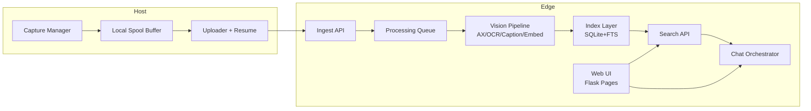

# MyRecall-v3 规格草案（Draft v0.1）

- 日期：2026-02-26
- 目标：在 vision-only 范围内，与 screenpipe 的视觉能力对齐，并强制落地 Edge-Centric 架构（Host 轻、Edge 重）。
- 范围：capture -> processing -> search -> chat（不含 audio）。
- 部署边界：Host 与 Edge 当前默认同一局域网（LAN），但必须保持可远端化。

## 1. 先把矛盾讲清楚（必须取舍）

### 1.1 矛盾 A："对齐 screenpipe" vs "Edge-Centric"
- screenpipe 当前主干是单机本地闭环（capture/processing/search/chat 多在同节点完成）。
- 你要求的 MyRecall-v3 是强制 Edge 参与，Host 仅做轻处理。
- 结论：只能做"能力与行为对齐"，不能做"拓扑完全对齐"。
- 已确认（001A）：v3 以"行为对齐优先"为准，否则需求自相矛盾。

### 1.2 矛盾 B："可选本地/云端模型" vs "Edge 必须参与"
- 若模型在 Host 本地推理，会破坏 Edge-Centric（Host 变重）。
- 结论：模型选择权放在 Edge（本地模型或云 API），Host 不做 OCR/Embedding/Chat 推理。

## 2. 总体架构（Edge-Centric）

### 2.1 Host 职责（严格）
- 采集：截图 + 基础上下文（app/window/monitor/timestamp/trigger）。
- 轻处理：压缩、去重哈希、可选 accessibility 文本快照（仅采集，不推理）。
- 传输：断点续传、重试、幂等上传。
- 缓存：本地 spool 与提交位点（offset/checkpoint）。
- 不允许：OCR、caption、embedding、rerank、chat 推理、页面/UI 承载（P1~P3）。

### 2.2 Edge 职责（严格）
- 重处理：OCR、结构化抽取、caption、keyword、embedding。
- 索引：元数据表 + FTS。
- 检索：FTS 召回 + 元数据过滤 + 排序。
- Chat：RAG 编排、工具调用、引用回溯、流式输出。
- UI：继续承载现有 Flask 页面与静态资源（P1~P3）。

## 3. 决策点逐项评审（含 screenpipe 对齐）

## 3.1 使用场景与 non-goals

### screenpipe 怎么做
- 主打"被动记忆"与"自然语言检索"，vision 结果可用于 timeline/search/chat。
- 支持多来源（OCR/UI/audio），但本次我们仅取 vision 路径。

### MyRecall-v3 决策
- 场景：开发/知识工作者对屏幕历史的检索与问答。
- non-goals：
  - 实时远程桌面流媒体。
  - 音频转写。
  - 多租户 SaaS 权限系统（v3 不做）。

### 对齐结论
- 能对齐：是（能力层）。
- 不能对齐：拓扑层（screenpipe 单机优先，v3 强制 Edge）。

### 风险
- 目标过宽导致 chat 需求蔓延。

### 验证
- 需求验收仅用 vision 数据集；audio 用例全部排除。

## 3.2 Capture pipeline（Host/Edge 边界）

### screenpipe 怎么做
- `event_driven_capture.rs`：事件驱动触发（app switch/click/typing/idle）。
- `paired_capture.rs`：截图 + accessibility 同步采集，必要时 OCR fallback。

### MyRecall-v3 决策
- Phase 1：完成事件驱动 capture（app switch/click/typing/idle）+ idle fallback，并补齐 trigger 字段与采集事件总线。
- Phase 2/3：capture 功能冻结，不新增采集能力，只做 LAN/Debian 稳定性验证与参数调优。
- 上传协议改为"幂等 + 可续传"：`capture_id` 唯一、chunk ACK、断点续传。
- 已拍板（OQ-004=A）：Host 采集 accessibility 文本并随 capture 上传；Host 不做 OCR/embedding 推理。

### 对齐结论
- 对齐级别：高度对齐（P1 即达到行为对齐）。

### 风险
- 事件风暴导致过采样与 LAN 拥塞。

### 验证
- 指标：切窗场景 95% capture 在 3 秒内入 Edge 队列。
- 压测：每分钟 300 次事件下，Host CPU < 25%，丢包率 < 0.3%。

## 3.3 Vision processing（与 screenpipe 对齐）

### screenpipe 怎么做
- accessibility 有文本时优先使用，OCR 作为 fallback（并对 terminal 类 app 做 OCR 偏好）。

### MyRecall-v3 决策
- Edge 执行"AX-first + OCR-fallback"。
- 对关键 app 维护 `ocr_preferred_apps`（TBD 初始名单）。
- 生成统一 `fusion_text` 供 chat grounding（embedding 不作为线上 search 依赖）。

### 对齐结论
- 对齐级别：可对齐。

### 风险
- accessibility 文本质量不稳定，导致召回波动。

### 验证
- A/B：AX-first vs OCR-only，在同一数据集比较 Recall@20 与 NDCG@10。

## 3.4 索引与存储（Host/Edge 边界）

### screenpipe 怎么做
- SQLite 主表 + FTS（`frames_fts`/`ocr_text_fts` 等），snapshot 直接落盘并在 DB 记录路径。

### MyRecall-v3 决策
- Edge 作为唯一事实源（source of truth）：
  - `captures`（原始采集元数据）
  - `vision_docs`（OCR/caption/keywords/fusion）
  - `fts`（全文）
- Host 仅保留短期 spool，不做长期索引。

### 对齐结论
- 对齐级别：部分对齐（存储组织不同，但检索行为对齐）。

### 风险
- 索引与原始文档同步延迟导致检索可见性抖动。

### 验证
- 每小时对账任务：`vision_docs` 与 `fts` 文档数差异必须为 0。

## 3.5 Search（召回与排序）

### screenpipe 怎么做
- `/search` 提供多过滤条件（time/app/window/content_type 等），以 FTS 检索为核心。

### MyRecall-v3 决策
- Search 完全对齐 screenpipe（vision-only）：线上只保留 FTS + 过滤，不走 hybrid。
- 新 API（Edge）：
  - `GET /v1/search`（过滤参数与返回 schema 含 frame/citation 信息）
  - `GET /v1/search/keyword`（纯关键词高性能路径，可与 `/v1/search` 合并实现）

### 对齐结论
- 对齐级别：高对齐（行为与主算法路径都对齐）。

### 风险
- 语义型查询（抽象描述、长尾表述）召回能力下降。

### 验证
- 离线评测集拆分“精确词查询/语义查询”两组；保证精确词查询不低于对齐基线，并量化语义退化幅度。

## 3.6 Chat（核心能力）

### screenpipe 怎么做
- 前端 chat 代理（Pi）调用 `/search` 等工具完成上下文检索；可选 `/ai/chat/completions`。

### MyRecall-v3 决策
- Edge 增加 `Chat Orchestrator`（核心服务）：
  - 工具：search/frame lookup/time range expansion。
  - 强制引用：每段回答附 `capture_id/frame_id/timestamp`。
  - 模型路由：本地与云端都支持，按配置切换（可选 fallback；在 Edge 完成，不在 Host）。
- P1~P3：chat UI 与会话输入输出由 Edge 页面承载；Host 不负责 UI 与推理。
- 上述 Chat 能力要求在 P1 达成；P2/P3 不新增 Chat 功能，仅做稳定性与性能治理。
- Post-P3（可选，不纳入当前里程碑）：再评估 UI 是否迁移到 Host。

### 对齐结论
- 对齐级别：可对齐（并更符合 Edge-Centric）。

### 风险
- 无引用回答会快速失去可信度。

### 验证
- 指标：引用覆盖率 >= 92%，人工抽检 hallucination rate 持续下降。

## 3.7 同步与传输（LAN 主链路，断连恢复）

### screenpipe 怎么做
- 有 sync provider（批次导入导出 + 标记同步），但不是 Host/Edge LAN 主链路模型。

### MyRecall-v3 决策
- LAN 主链路协议：
  - `POST /v1/ingest/session`（创建会话）
  - `PUT /v1/ingest/chunk/{session_id}`（分片上传）
  - `POST /v1/ingest/commit`（原子提交）
  - `GET /v1/ingest/checkpoint`（断点恢复）
- 幂等键：`capture_id`；重复包可重放但不可重复入库。
- 已拍板（OQ-006=A->B）：P1 使用 token 鉴权 + TLS 可选；P2+ 升级为 mTLS 强制。

### 对齐结论
- 对齐级别：概念对齐（可恢复传输），实现不对齐。

### 风险
- 去重键设计错误会造成漏写或重复写。

### 验证
- 故障注入：断网/重启/乱序/重复包场景下，最终一致性通过。

## 3.8 UI 能力与阶段 Gate（A：最小可用集）

### screenpipe 怎么做
- UI 通过稳定 API 契约驱动核心交互（search/chat/timeline），而不是把“页面存在”当作完成标准。
- 典型模式是以 `/search`、`/search/keyword`、`/ai/chat/completions` 作为 UI 主链路依赖点。

### MyRecall-v3 决策（012A）
- 保持 007A：P1~P3 UI 继续在 Edge，不迁移到 Host。
- 在 P1 强制引入最小 UI Gate，只覆盖可用性与可解释性，不做 UI 重构：
  - 路由可达 + 健康态/错误态可见
  - timeline 可见 capture/ingest/processing 状态
  - search 过滤项与 API 参数契约对齐，结果可回溯
  - chat 引用可点击回溯，路由/降级状态可见
  - 端到端关键路径脚本化回归
- P2/P3 功能冻结，仅验证 LAN/Debian 下 UI 稳定性与恢复行为。

### 对齐结论
- 对齐级别：中高（API 驱动交互与关键链路闭环对齐；UI 技术栈不要求一致）。

### 风险
- 最小 Gate 可能遗漏复杂交互问题。
- Edge 高负载下 UI 仍有资源争用风险。

### 验证
- 每个 P1 子阶段验收文档必须包含 UI 证据（截图/录屏 + 步骤 + 结论）。
- UI 关键路径通过率与异常可见性指标纳入阶段 Gate。

## 4. 演进路线（固定三阶段）

1. 本机模拟 Edge（进程级隔离）
- Host 与 Edge 不共享进程，不共享业务内存。
- 使用独立端口、独立数据目录、独立日志。
- 完成 v3 功能闭环（capture/processing/search/chat 全功能）。
- 采用串行子阶段：P1-S1（基础链路）-> P1-S2（采集）-> P1-S3（处理）-> P1-S4（检索）-> P1-S5（Chat grounding/引用）-> P1-S6（Chat 路由/流式/降级）-> P1-S7（端到端验收）。
- 阶段规则：每个子阶段必须通过 Gate 验收，方可进入下一子阶段。
- 其中 P1-S7 只做端到端验收与回归，不新增业务功能。

2. 另一台 Mac 作为 Edge
- Host 指向 LAN Edge。
- 验证断点续传、延迟、稳定性。
- 功能冻结：不新增业务功能，仅做 LAN 稳定性与重放正确性。

3. Debian 盒子作为目标 Edge（生产）
- 完成 OCR/模型/索引运行时适配。
- 完成 systemd 与可观测性（queue/latency/error budgets）。
- 功能冻结：不新增业务功能，仅做部署、运维与回滚能力收敛。
- 验收记录要求：每个阶段/子阶段必须输出 Markdown 详细记录，归档到 `MyRecall/docs/v3/acceptance/`，并使用统一模板 `TEMPLATE.md`。

## 5. 可验证 SLO（首版）

- TTS（time-to-searchable）P95 <= 12s（capture 到可检索）。
- Capture 丢失率 <= 0.2%。
- Search P95 <= 1.8s（不含超大时间窗）。
- Chat 首 token P95 <= 3.5s（已有索引命中场景）。
- Chat 引用覆盖率 >= 92%。

### 5.1 功能完成度/完善度 Gate 指标（强制）

- 功能清单完成率 = 100%。
- API/Schema 契约完成率 = 100%。
- 关键异常与降级场景通过率 >= 95%。
- 可观测性检查项完成率 = 100%（日志/指标/错误码）。
- UI 关键路径通过率 = 100%（按阶段定义关键路径）。
- 验收记录完整率 = 100%（基于 `acceptance/` 归档文件）。

## 6. 明确 TBD / 需实验 / 需查证

- TBD：是否保留 embedding 计算作为离线实验开关（不进入线上 search 主路径）。
- 需实验：AX-first 在多应用场景下对召回质量的净收益。
- 需查证：Debian 上 RapidOCR 与候选本地 VL 模型的稳定组合。

## 7. 已拍板基线（2026-02-26）

1. 001A：与 screenpipe 做行为/能力对齐，不做拓扑对齐。
2. 002A：Chat 接口统一为 OpenAI-compatible + tool schema。
3. 003A（覆盖）：Search 完全对齐 screenpipe（vision-only），线上仅 FTS+过滤，舍弃 hybrid。
4. 004A：Host 采集 accessibility 文本（采集端轻处理），Edge 负责重处理与推理。
5. 005A：Edge 支持本地/云端模型并按配置切换（可选 fallback），与 screenpipe provider 策略对齐。
6. 006A->B：传输安全按阶段升级，P1 token + TLS 可选，P2+ mTLS 强制。
7. 007A：P1~P3 页面继续在 Edge，Host 不负责 UI；UI 迁移到 Host 仅作为 Post-P3 可选项。
8. 008A：功能开发集中在 Phase 1 完成；Phase 2/3 功能冻结，仅做部署与稳定性。
9. 009A：Phase 1 拆分为串行子阶段（P1-S1~S7），其中 P1-S2/P1-S3 为采集/处理拆分，Chat 拆分为多子阶段，端到端验收独立为最后阶段。
10. 010A：每个阶段/子阶段验收都必须有 Markdown 详细记录，并作为 Gate 输入。
11. 011A：Gate 采用“数值指标适度放宽 + 功能完成度/完善度指标强化”的双轨策略。
12. 012A：UI Gate 采用“最小可用集”策略，增强阶段可用性验收，不引入 UI 重构。
