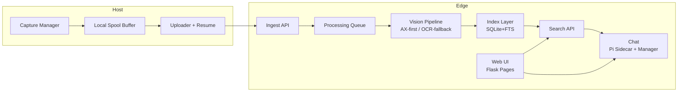

# MyRecall-v3 规格草案（Draft v0.1）

- 日期：2026-02-26
- 目标：在 vision-only 范围内，与 screenpipe 的视觉能力对齐，并强制落地 Edge-Centric 架构（Host 轻、Edge 重）。
- 范围：capture -> processing -> search -> chat（不含 audio）。
- 部署边界：Host 与 Edge 当前默认同一局域网（LAN），但必须保持可远端化。

## 1. 先把矛盾讲清楚（必须取舍）

### 1.1 矛盾 A："对齐 screenpipe" vs "Edge-Centric"
- screenpipe 当前主干是单机本地闭环（capture/processing/search/chat 多在同节点完成）。
- 你要求的 MyRecall-v3 是强制 Edge 参与，Host 仅做轻处理。
- 结论：只能做"能力与行为对齐"，不能做"拓扑完全对齐"。
- 已确认（001A）：v3 以"行为对齐优先"为准，否则需求自相矛盾。

### 1.2 矛盾 B："可选本地/云端模型" vs "Edge 必须参与"
- 若模型在 Host 本地推理，会破坏 Edge-Centric（Host 变重）。
- 结论：模型选择权放在 Edge（本地模型或云 API），Host 不做 OCR/Embedding/Chat 推理。

## 2. 总体架构（Edge-Centric）


```mermaid
flowchart LR
  subgraph Host
    C[Capture Manager]
    B[Local Spool Buffer]
    U[Uploader + Resume]
    C --> B --> U
  end

  subgraph Edge
    W[Web UI\nFlask Pages]
    I[Ingest API]
    Q[Processing Queue]
    P[Vision Pipeline\nAX-first / OCR-fallback]
    IDX[Index Layer\nSQLite+FTS]
    S[Search API]
    CH[Chat\nPi Sidecar + Manager]
    I --> Q --> P --> IDX
    IDX --> S --> CH
    W --> S
    W --> CH
  end

  U --> I
```

### 2.1 Host 职责（严格）
- 采集：截图 + 基础上下文（app/window/monitor/timestamp/trigger）。
- 轻处理：压缩、去重哈希、可选 accessibility 文本快照（仅采集，不推理）。
- 传输：断点续传、重试、幂等上传。
- 缓存：本地 spool 与提交位点（offset/checkpoint）。
- 不允许：OCR、embedding、rerank、chat 推理、页面/UI 承载（P1~P3）。

### 2.2 Edge 职责（严格）
- 重处理：OCR（AX-first + OCR-fallback），仅存储原始文本，不做索引时 AI 增强（与 screenpipe 对齐）。
- 索引：`frames` 元数据表 + `ocr_text` + `frames_fts` / `ocr_text_fts`（FTS5）。
- 检索：FTS 召回 + 元数据过滤 + 排序。
- Chat：RAG 编排（Orchestrator 在查询时将原始文本送入 LLM 实时推理）、工具调用、引用回溯、流式输出。
- UI：继续承载现有 Flask 页面与静态资源（P1~P3）。

## 3. 数据模型（Edge SQLite，主路径对齐 screenpipe vision-only，差异显式）

### 3.0.1 设计原则

| 原则 | 说明 |
|------|------|
| Edge 是唯一事实源 | 所有持久化表在 Edge 的 `edge.db`（单一 SQLite 文件），Host 只有 spool 文件 |
| 表名/字段名对齐 screenpipe | P1 主路径同名：`frames` / `ocr_text` / `frames_fts` / `ocr_text_fts`；`ocr_text_embeddings` 为 P2+ 可选实验表（同名保留，P1 不建） |
| 索引时零 AI 调用 | 仅存储 OCR raw text + accessibility text，不预计算 caption/keywords/fusion（与 screenpipe 一致） |
| capture_id 全局幂等 | UUID v7（Host 生成），Edge 去重，贯穿全链路 |
| v3 全新起点 | 不做 v2 数据迁移 |

### 3.0.2 capture_id 生成规则

```
格式：UUID v7（RFC 9562）
生成方：Host（采集时生成）
特性：时间有序 + 全局唯一 + 无需中心协调
示例：019528a0-73c4-7abc-8def-1234567890ab
```

### 3.0.3 DDL（Edge SQLite）

#### Table 1: frames（对齐 screenpipe frames，vision-only 子集）

```sql
CREATE TABLE frames (
    id                    INTEGER PRIMARY KEY AUTOINCREMENT,
    timestamp             TIMESTAMP NOT NULL,
    app_name              TEXT DEFAULT NULL,
    window_name           TEXT DEFAULT NULL,
    browser_url           TEXT DEFAULT NULL,
    focused               BOOLEAN DEFAULT NULL,
    device_name           TEXT NOT NULL DEFAULT '',
    snapshot_path         TEXT DEFAULT NULL,
    capture_trigger       TEXT DEFAULT NULL,       -- 'idle'|'app_switch'|'manual'|'window_focus'|'click' (P1); P2+: 'typing_pause'|'scroll_stop'|'clipboard'|'visual_change'
    accessibility_text    TEXT DEFAULT NULL,
    text_source           TEXT DEFAULT NULL,       -- 'ocr'|'accessibility'
    content_hash          TEXT DEFAULT NULL,       -- sha256:hex，Edge 去重辅助
    simhash               INTEGER DEFAULT NULL,    -- 感知哈希，近似重复检测

    -- v3 Edge-Centric 追加
    capture_id            TEXT NOT NULL UNIQUE,    -- UUID v7，Host 生成，幂等键
    image_size_bytes      INTEGER,
    ingested_at           TEXT NOT NULL
                          DEFAULT (strftime('%Y-%m-%dT%H:%M:%fZ', 'now')),
    status                TEXT NOT NULL DEFAULT 'pending',  -- 'pending'|'processing'|'completed'|'failed'
    error_message         TEXT,
    retry_count           INTEGER DEFAULT 0,
    processed_at          TEXT
);

-- B-tree 索引（精确过滤 / 时间范围）
CREATE INDEX idx_frames_timestamp     ON frames(timestamp);
CREATE INDEX idx_frames_app_name      ON frames(app_name);
CREATE INDEX idx_frames_window_name   ON frames(window_name);
CREATE INDEX idx_frames_browser_url   ON frames(browser_url);
CREATE INDEX idx_frames_focused       ON frames(focused);
CREATE INDEX idx_frames_snapshot_path ON frames(snapshot_path)
    WHERE snapshot_path IS NOT NULL;
CREATE INDEX idx_frames_status        ON frames(status)
    WHERE status IN ('pending', 'processing', 'failed');
CREATE INDEX idx_frames_content_hash  ON frames(content_hash)
    WHERE content_hash IS NOT NULL;
```

#### Table 2: ocr_text（对齐 screenpipe ocr_text，仅 OCR-fallback 帧写入）

```sql
CREATE TABLE ocr_text (
    id                    INTEGER PRIMARY KEY AUTOINCREMENT,
    frame_id              INTEGER NOT NULL,
    text                  TEXT NOT NULL DEFAULT '',
    text_json             TEXT,                    -- bounding box JSON（可选）
    ocr_engine            TEXT,
    text_length           INTEGER DEFAULT 0,
    app_name              TEXT DEFAULT NULL,       -- 对齐 screenpipe，写入时从 CapturePayload 取值
    window_name           TEXT DEFAULT NULL,       -- 对齐 screenpipe，写入时从 CapturePayload 取值
    -- 注：与 frames.app_name/window_name 来源相同（同一 CapturePayload）；
    --     若 frames 行后续被修正，ocr_text 不联动更新（接受 drift，对齐 screenpipe 行为）。
    FOREIGN KEY (frame_id) REFERENCES frames(id) ON DELETE CASCADE
);

CREATE INDEX idx_ocr_text_frame_id ON ocr_text(frame_id);
```

#### Table 3: frames_fts（对齐 screenpipe frames_fts，FTS 全文语义过滤）

```sql
-- app_name/window_name/browser_url/focused/accessibility_text 走 FTS 全文语义（选 C）
-- 去掉 screenpipe 的 name 字段（v3 无 frames.name）
CREATE VIRTUAL TABLE frames_fts USING fts5(
    app_name,
    window_name,
    browser_url,
    focused,
    accessibility_text,
    id UNINDEXED,
    tokenize='unicode61'
);

-- INSERT 触发器
CREATE TRIGGER frames_ai AFTER INSERT ON frames BEGIN
    INSERT INTO frames_fts(id, app_name, window_name, browser_url, focused, accessibility_text)
    VALUES (
        NEW.id,
        COALESCE(NEW.app_name, ''),
        COALESCE(NEW.window_name, ''),
        COALESCE(NEW.browser_url, ''),
        COALESCE(NEW.focused, 0),
        COALESCE(NEW.accessibility_text, '')
    );
END;

-- UPDATE 触发器（任一字段变更时同步）
CREATE TRIGGER frames_au AFTER UPDATE ON frames
WHEN (NEW.app_name IS NOT NULL)
  OR (NEW.window_name IS NOT NULL)
  OR (NEW.browser_url IS NOT NULL)
  OR (NEW.focused IS NOT NULL)
  OR (NEW.accessibility_text IS NOT NULL)
BEGIN
    INSERT OR REPLACE INTO frames_fts(id, app_name, window_name, browser_url, focused, accessibility_text)
    VALUES (
        NEW.id,
        COALESCE(NEW.app_name, ''),
        COALESCE(NEW.window_name, ''),
        COALESCE(NEW.browser_url, ''),
        COALESCE(NEW.focused, 0),
        COALESCE(NEW.accessibility_text, '')
    );
END;

-- DELETE 触发器
CREATE TRIGGER frames_ad AFTER DELETE ON frames BEGIN
    DELETE FROM frames_fts WHERE id = OLD.id;
END;
```

#### Table 4: ocr_text_fts（对齐 screenpipe）

```sql
-- 对齐 screenpipe：保留 app_name/window_name
-- 注：search_ocr() 的 ocr_text_fts MATCH 只传文字搜索词，不做列过滤；
--     app/window 过滤由 frames_fts 承担（选 C）。
--     保留两列的理由：FTS5 加列代价高（需 rebuild），预留未来列过滤扩展；当前无负面影响。
CREATE VIRTUAL TABLE ocr_text_fts USING fts5(
    text,
    app_name,
    window_name,
    frame_id UNINDEXED,
    tokenize='unicode61'
);

-- INSERT 触发器
-- 注：ocr_text 现有 app_name/window_name 列（对齐 screenpipe），直接取 NEW 值，无需 JOIN frames
CREATE TRIGGER ocr_text_ai AFTER INSERT ON ocr_text
WHEN NEW.text IS NOT NULL AND NEW.text != '' AND NEW.frame_id IS NOT NULL
BEGIN
    INSERT OR IGNORE INTO ocr_text_fts(frame_id, text, app_name, window_name)
    VALUES (
        NEW.frame_id,
        NEW.text,
        COALESCE(NEW.app_name, ''),
        COALESCE(NEW.window_name, '')
    );
END;

-- UPDATE 触发器
CREATE TRIGGER ocr_text_update AFTER UPDATE ON ocr_text
WHEN NEW.text IS NOT NULL AND NEW.text != ''
BEGIN
    UPDATE ocr_text_fts
    SET text = NEW.text,
        app_name = COALESCE(NEW.app_name, ''),
        window_name = COALESCE(NEW.window_name, '')
    WHERE frame_id = OLD.frame_id;
END;

-- DELETE 触发器
CREATE TRIGGER ocr_text_delete AFTER DELETE ON ocr_text BEGIN
    DELETE FROM ocr_text_fts WHERE frame_id = OLD.frame_id;
END;
```
#### Table 5: chat_messages（v3 独有）

```sql
CREATE TABLE chat_messages (
    id                    TEXT PRIMARY KEY,         -- UUID v4
    session_id            TEXT NOT NULL,
    role                  TEXT NOT NULL,            -- 'user'|'assistant'|'tool'
    content               TEXT NOT NULL,
    citations             TEXT,                     -- JSON 数组，frame_id 引用
    tool_calls            TEXT,                     -- JSON，tool use（P2+）
    model                 TEXT,
    latency_ms            INTEGER,
    created_at            TEXT NOT NULL
                          DEFAULT (strftime('%Y-%m-%dT%H:%M:%fZ', 'now'))
);

CREATE INDEX idx_chat_session ON chat_messages(session_id, created_at);
```

#### ~~Table 6: ocr_text_embeddings~~ （P1 不建）

screenpipe migration 中存在此表，但主检索路径未使用（实验性保留）。v3 P1 Search 为纯 FTS5，**P1 不建此表**；P2+ 若有 embedding 需求，通过独立 migration 新增，且默认不进入线上主路径。

#### ~~Table 7: elements~~ （P1 不建）

screenpipe v0.3.160 新增 `elements` 表（migration `20260301000000`），将 OCR+AX 逐元素结构化存储（含 bbox、element_type、FTS5），与 `ocr_text` 并行双写。v3 P1 Search/Chat 均基于 `ocr_text` 全文，无逐元素消费者；**P1 不建此表**；P2+ 若需细粒度 UI 元素检索（如按钮/标签级定位），通过独立 migration 新增，并同步实现双写逻辑与 `/elements` API。

#### Table 8: accessibility（Scheme C，P0 建表，对齐 screenpipe migration 20250202000000 + v3 增强）

screenpipe 中 `accessibility` 表由独立 `ui_recorder` 树遍历器写入（`ui_recorder.rs:542-633`），与 `paired_capture` 完全独立。v3 Scheme C 下，`paired_capture` 在 AX 成功时写入此表（代替 `ocr_text`），未来 P1+ 可增加独立 walker 管线。

```sql
CREATE TABLE accessibility (
    id                    INTEGER PRIMARY KEY AUTOINCREMENT,
    timestamp             DATETIME NOT NULL DEFAULT CURRENT_TIMESTAMP,
    app_name              TEXT NOT NULL,
    window_name           TEXT NOT NULL,
    text_content          TEXT NOT NULL,
    browser_url           TEXT,

    -- v3 增强（screenpipe 无以下两列）
    frame_id              INTEGER DEFAULT NULL,    -- paired_capture 写入时填入 frames.id；独立 walker 写入时留 NULL
    focused               BOOLEAN DEFAULT NULL,    -- P0 修复：screenpipe accessibility 表无此列，导致 focused/browser_url 搜索强制降级到 OCR（db.rs:1870-1872）

    FOREIGN KEY (frame_id) REFERENCES frames(id) ON DELETE SET NULL
);

-- B-tree 索引（对齐 screenpipe migration lines 22-27 + v3 追加）
CREATE INDEX idx_accessibility_timestamp  ON accessibility(timestamp);
CREATE INDEX idx_accessibility_app_name   ON accessibility(app_name);
CREATE INDEX idx_accessibility_frame_id   ON accessibility(frame_id)
    WHERE frame_id IS NOT NULL;
CREATE INDEX idx_accessibility_focused    ON accessibility(focused)
    WHERE focused IS NOT NULL;
```

**写入语义（Scheme C）**：
- AX 成功 → `frames` 行（`text_source='accessibility'`）+ `accessibility` 行（`frame_id` = 对应 `frames.id`）+ **无 `ocr_text` 行**
- AX 失败/OCR fallback → `frames` 行（`text_source='ocr'`）+ `ocr_text` 行 + **无 `accessibility` 行**

**P0 修复说明**：screenpipe `search_accessibility()` 不接受 `focused` 参数（`db.rs:3408-3416`），`focused`/`browser_url` 存在时强制降级到 `content_type=ocr`（`db.rs:1870-1872`）。在 AX-first 模式下 ~90%+ 帧无 `ocr_text` 行，`search_ocr()` 用 `INNER JOIN ocr_text` 会漏掉这些帧。v3 通过在 `accessibility` 表增加 `focused` 列并让 `search_accessibility()` 支持过滤，修复此限制。

#### Table 9: accessibility_fts（基于 screenpipe + browser_url 增强，FTS 全文检索）

```sql
CREATE VIRTUAL TABLE accessibility_fts USING fts5(
    text_content,
    app_name,
    window_name,
    browser_url,
    content='accessibility',
    content_rowid='id',
    tokenize='unicode61'
);

-- INSERT 触发器
CREATE TRIGGER accessibility_ai AFTER INSERT ON accessibility BEGIN
    INSERT INTO accessibility_fts(rowid, text_content, app_name, window_name, browser_url)
    VALUES (
        NEW.id,
        COALESCE(NEW.text_content, ''),
        COALESCE(NEW.app_name, ''),
        COALESCE(NEW.window_name, ''),
        COALESCE(NEW.browser_url, '')
    );
END;

-- UPDATE 触发器
CREATE TRIGGER accessibility_au AFTER UPDATE ON accessibility BEGIN
    INSERT INTO accessibility_fts(accessibility_fts, rowid, text_content, app_name, window_name, browser_url)
    VALUES ('delete', OLD.id, OLD.text_content, OLD.app_name, OLD.window_name, OLD.browser_url);
    INSERT INTO accessibility_fts(rowid, text_content, app_name, window_name, browser_url)
    VALUES (
        NEW.id,
        COALESCE(NEW.text_content, ''),
        COALESCE(NEW.app_name, ''),
        COALESCE(NEW.window_name, ''),
        COALESCE(NEW.browser_url, '')
    );
END;

-- DELETE 触发器
CREATE TRIGGER accessibility_ad AFTER DELETE ON accessibility BEGIN
    INSERT INTO accessibility_fts(accessibility_fts, rowid, text_content, app_name, window_name, browser_url)
    VALUES ('delete', OLD.id, OLD.text_content, OLD.app_name, OLD.window_name, OLD.browser_url);
END;
```

**注**：`accessibility_fts` 使用 `content='accessibility'` + `content_rowid='id'`（content-sync 模式，对齐 screenpipe migration lines 30-37）。trigger 使用 delete command 而非 DELETE FROM（FTS5 content-sync 要求）。v3 `accessibility_fts` 比 screenpipe 多一列 `browser_url`（screenpipe 仅 `text_content, app_name, window_name` 3 列），此为有意偏离——确保 `browser_url` 参数在所有 `content_type` 路径下统一为 FTS token 序列匹配语义。

#### FTS 分工总结

**注**：Scheme C（025A）引入 `content_type` 参数路由。以下按路径分表说明。

##### `content_type=ocr`（search_ocr 路径）

| 过滤参数 | 走哪张表 | 方式 |
|---------|---------|------|
| `q`（文字搜索） | `ocr_text_fts` | `text MATCH ?` + BM25 排序 |
| `app_name` | `frames_fts` | `app_name:? MATCH` |
| `window_name` | `frames_fts` | `window_name:? MATCH` |
| `browser_url` | `frames_fts` | `browser_url:? MATCH` |
| `focused` | `frames_fts` | `focused:1 MATCH` |
| `start_time`/`end_time` | `frames` B-tree | `timestamp >= ? AND timestamp <= ?` |
| `min_length`/`max_length` | `ocr_text` | `text_length >= ? AND text_length <= ?` |

##### `content_type=accessibility`（search_accessibility 路径）

| 过滤参数 | 走哪张表 | 方式 |
|---------|---------|------|
| `q`（文字搜索） | `accessibility_fts` | `text_content MATCH ?` + BM25 排序 |
| `app_name` | `accessibility` | `app_name = ?`（B-tree 精确匹配） |
| `window_name` | `accessibility` | `window_name = ?`（B-tree 精确匹配） |
| `browser_url` | `accessibility_fts` | `browser_url:? MATCH`（FTS token 序列匹配，对齐 search_ocr 路径语义） |
| `focused` | `accessibility` | `focused = ?`（B-tree 精确匹配，**v3 P0 修复**，screenpipe 不支持） |
| `start_time`/`end_time` | `accessibility` B-tree | `timestamp >= ? AND timestamp <= ?` |
| `min_length`/`max_length` | — | 不适用（accessibility 行无 `text_length` 列） |

##### `content_type=all`（search_all 路径，默认）

并行执行 `search_ocr()` + `search_accessibility()`，结果按 `timestamp DESC` 合并。各路径内部路由同上。

##### 路由规则

当 `q` 为空时（search_ocr 路径）：只 JOIN `frames_fts`（若有 app/window/browser/focused 条件），ORDER BY `frames.timestamp DESC`。
当 `q` 非空时（search_ocr 路径）：JOIN `ocr_text_fts`（必须，MATCH 只传文字搜索词），按需 JOIN `frames_fts`，ORDER BY `ocr_text_fts.rank, frames.timestamp DESC`。
当 `q` 为空时（search_accessibility 路径）：B-tree 过滤（app_name/window_name/focused/timestamp）；若有 `browser_url` 条件则 JOIN `accessibility_fts`（`browser_url:? MATCH`），ORDER BY `accessibility.timestamp DESC`。
当 `q` 非空时（search_accessibility 路径）：JOIN `accessibility_fts`（MATCH 传文字搜索词 + browser_url 列前缀（若有）），按需追加 B-tree 过滤（app_name/window_name/focused/timestamp），ORDER BY `accessibility_fts.rank, accessibility.timestamp DESC`。

**注**：`ocr_text_fts` 保留 `app_name`/`window_name` 列（对齐 screenpipe），但当前查询路径不对这两列做 MATCH。预留 P2+ 列过滤扩展（FTS5 加列代价高，先建好）。

**注**：v3 **不做** screenpipe 的 `focused/browser_url → force content_type=ocr` 降级（db.rs:1870-1872）。`focused` 过滤在 `search_accessibility()` 直接由 `accessibility.focused` 列支持（P0 修复，见 ADR-0012）。

#### FTS 查询规范化（对齐 screenpipe `text_normalizer`，D1=B）

##### sanitize_fts5_query（防注入，必须）

用户输入的 `q` 在构造 `ocr_text_fts MATCH ?` 前必须经过 sanitize：
- 按空白分词
- 每个 token 去除内部双引号后用 `"token"` 包裹
- 防止 FTS5 运算符（`OR`/`AND`/`NOT`/`*`/`(`/`)`/`:`/`.`）被误解释

```python
def sanitize_fts5_query(query: str) -> str:
    tokens = query.strip().split()
    return " ".join(f'"{t.replace(chr(34), "")}"' for t in tokens if t.replace('"', ''))
```

| 输入 | 输出 |
|------|------|
| `hello world` | `"hello" "world"` |
| `100.100.0.42` | `"100.100.0.42"` |
| `foo(bar)` | `"foo(bar)"` |
| `C++` | `"C++"` |

##### expand_search_query（OCR 黏连词拆分 + 前缀匹配，必须）

用于主搜索路径。对每个 token：
1. 驼峰拆分：`ActivityPerformance` → `Activity` + `Performance`
2. 数字边界拆分：`test123` → `test` + `123`
3. 每个部分生成 `"part"*` 前缀匹配子句
4. 多部分用 `OR` 连接

```python
def expand_search_query(query: str) -> str:
    # 对每个 word：
    #   拆分 → parts
    #   if len(parts) > 1: ("original"* OR "part1"* OR "part2"*)
    #   else: "word"*
    # 多 word 结果用 OR 连接并加括号
```

| 输入 | 输出 |
|------|------|
| `test` | `"test"*` |
| `proStart` | `("proStart"* OR "pro"* OR "Start"*)` |
| `test123` | `("test123"* OR "test"* OR "123"*)` |
| `hello world` | `("hello"* OR "world"*)` |

##### 调用时机

| 场景 | 用哪个函数 |
|------|-----------|
| `q` 非空 → `ocr_text_fts MATCH ?` | `sanitize_fts5_query(q)` |
| 元数据过滤（app_name/window_name/browser_url/focused）→ `frames_fts MATCH ?` | 直接构造列限定短语（同 screenpipe `search_ocr()`），不经过 expand |
| 未来 fuzzy_match 场景（P2+） | `expand_search_query(q)` 替代 `sanitize_fts5_query(q)` |

**注**：P1 主路径 `q` 使用 `sanitize_fts5_query`；`expand_search_query` 同步实现但默认不启用，作为 P2 fuzzy_match 的基础设施。

#### Search SQL JOIN 策略（Scheme C 三路径分发，覆盖原 Q2 单路径）

Scheme C（025A）将搜索拆为三条独立路径，由 `content_type` 参数路由（对齐 screenpipe `ContentType` 枚举）。

##### 路径 1：`search_ocr()`（`content_type=ocr`）

对齐 screenpipe `search_ocr()`（db.rs:2117-2119），仅搜索 OCR fallback 帧。

```sql
-- 骨架（无条件 INNER JOIN，对齐 screenpipe）
SELECT frames.*, ocr_text.text, ocr_text.text_length, ocr_text.ocr_engine
FROM frames
INNER JOIN ocr_text ON frames.id = ocr_text.frame_id
{frame_fts_join}   -- 仅 app/window/browser/focused 非空时追加
{ocr_fts_join}     -- 仅 q 非空时追加
WHERE 1=1
    {frame_fts_condition}
    {ocr_fts_condition}
    AND (? IS NULL OR frames.timestamp >= ?)
    AND (? IS NULL OR frames.timestamp <= ?)
    AND (? IS NULL OR ocr_text.text_length >= ?)
    AND (? IS NULL OR ocr_text.text_length <= ?)
ORDER BY {order_clause}
LIMIT ? OFFSET ?
```

| 条件 | `frame_fts_join` | `ocr_fts_join` | `order_clause` |
|------|-----------------|----------------|----------------|
| `q` 空，无 app/window/browser/focused | 无 | 无 | `frames.timestamp DESC` |
| `q` 空，有 app/window/browser/focused | `JOIN frames_fts ON frames.id = frames_fts.id` | 无 | `frames.timestamp DESC` |
| `q` 非空，无 app/window/browser/focused | 无 | `JOIN ocr_text_fts ON ocr_text.frame_id = ocr_text_fts.frame_id` | `ocr_text_fts.rank, frames.timestamp DESC` |
| `q` 非空，有 app/window/browser/focused | `JOIN frames_fts ON frames.id = frames_fts.id` | `JOIN ocr_text_fts ON ocr_text.frame_id = ocr_text_fts.frame_id` | `ocr_text_fts.rank, frames.timestamp DESC` |

**INNER JOIN 语义**：`status = 'pending'/'processing'/'failed'` 的帧，`ocr_text` 行尚不存在，自然不出现在搜索结果。AX 成功帧无 `ocr_text` 行，同样被 INNER JOIN 排除（正确行为——这些帧由 `search_accessibility()` 覆盖）。

##### 路径 2：`search_accessibility()`（`content_type=accessibility`）

对齐 screenpipe `search_accessibility()`（db.rs:3408-3483），搜索 AX 成功帧 + 独立 walker 数据。

```sql
SELECT a.id, a.text_content, a.timestamp, a.app_name, a.window_name,
       a.browser_url, a.focused, a.frame_id,
       f.snapshot_path, f.device_name
FROM accessibility a
LEFT JOIN frames f ON a.frame_id = f.id
{accessibility_fts_join}   -- q 非空或 browser_url 非空时追加
WHERE 1=1
    AND (? IS NULL OR a.app_name = ?)
    AND (? IS NULL OR a.window_name = ?)
    AND (? IS NULL OR a.focused = ?)
    AND (? IS NULL OR a.timestamp >= ?)
    AND (? IS NULL OR a.timestamp <= ?)
    {accessibility_fts_condition}
ORDER BY {order_clause}
LIMIT ? OFFSET ?
```

| 条件 | `accessibility_fts_join` | `accessibility_fts_condition` | `order_clause` |
|------|------------------------|-------------------------------|----------------|
| `q` 空 且无 `browser_url` | 无 | 无 | `a.timestamp DESC` |
| `q` 空 但有 `browser_url` | `JOIN accessibility_fts ON a.id = accessibility_fts.rowid` | `AND accessibility_fts MATCH 'browser_url:"..."'` | `a.timestamp DESC` |
| `q` 非空，无 `browser_url` | `JOIN accessibility_fts ON a.id = accessibility_fts.rowid` | `AND accessibility_fts MATCH ?`（text_content 列） | `accessibility_fts.rank, a.timestamp DESC` |
| `q` 非空，有 `browser_url` | `JOIN accessibility_fts ON a.id = accessibility_fts.rowid` | `AND accessibility_fts MATCH ?`（text_content + browser_url 列前缀组合） | `accessibility_fts.rank, a.timestamp DESC` |

**browser_url FTS 语义说明**：`browser_url` 过滤统一走 `accessibility_fts` 的 `browser_url:? MATCH`（FTS token 序列匹配），与 search_ocr 路径的 `frames_fts` `browser_url:? MATCH` 语义一致。v3 `accessibility_fts` 比 screenpipe 多一列 `browser_url`（screenpipe `accessibility_fts` 仅 3 列），此为有意偏离，确保 API 契约中 `browser_url` 参数在所有 `content_type` 路径下语义一致。

**browser_url NULL 行为**：触发器写入时 `COALESCE(NEW.browser_url, '')` 将 NULL 转为空串；FTS5 `unicode61` 对空串不产生 token，因此非浏览器 app 的 accessibility 行（`browser_url IS NULL`）不会被任何 `browser_url` 查询命中。这是**预期行为**：用户传 `browser_url` 过滤时，只应返回有 URL 的记录（浏览器 app 产生的 AX 数据）。实现者不应将此误判为 bug 并修改 COALESCE 逻辑。`content_type=all` 时 OCR 路径与 AX 路径各自独立过滤后合并，浏览器页面上的帧（AX 成功或 OCR fallback）均被覆盖，无遗漏。

**LEFT JOIN frames 说明**：`accessibility.frame_id` 为 `DEFAULT NULL`（方案 3）。`paired_capture` 写入的行有 `frame_id`，精确关联 frames；未来独立 walker 写入的行 `frame_id = NULL`，LEFT JOIN 返回 NULL 字段（`snapshot_path`/`device_name` 等为 NULL）。避免 screenpipe 的 ±1s 时间窗口 JOIN 模糊性。

**注**：screenpipe `search_accessibility()` 不接受 `focused` 参数（db.rs:3408-3483）。v3 `search_accessibility()` 支持 `focused` 过滤（P0 修复，见 ADR-0012），不做 screenpipe 的 `focused → force content_type=ocr` 降级。

##### 路径 3：`search_all()`（`content_type=all`，默认）

并行执行 `search_ocr()` + `search_accessibility()`，结果按 `timestamp DESC` 合并（Scheme C 写入语义保证两条路径结果集天然互斥——AX 成功帧无 `ocr_text` 行，OCR fallback 帧无 `accessibility` 行——无需去重）。

```python
def search_all(params: SearchQuery) -> SearchResult:
    # 过量拉取：各路径传 fetch_limit = limit + offset，offset = 0
    # 确保合并后全局排序窗口内的数据完整（对齐 screenpipe db.rs:1880, 2043-2050）
    fetch_limit = params.limit + params.offset
    ocr_results = search_ocr(params._replace(limit=fetch_limit, offset=0))
    ax_results = search_accessibility(params._replace(limit=fetch_limit, offset=0))
    # 合并 + 全局按 timestamp DESC 排序
    merged = sorted(ocr_results + ax_results, key=lambda r: r.timestamp, reverse=True)
    # 统一应用一次分页（skip offset，take limit）
    return apply_pagination(merged, skip=params.offset, take=params.limit)
```

**注**：各路径分别拉取 `limit+offset` 行（`offset=0`），最坏情况内存中合并 `2×(limit+offset)` 行。P1 场景 `limit≤100`、`offset` 通常小，内存可控——前提是 UI 采用"加载更多"而非跳页（**OQ-026=A 已决**，对齐 screenpipe）。screenpipe UI 为纯"加载更多"模式（`search-modal.tsx: hasMoreOcr/loadMoreOcr`），offset 单调递增步长=limit，实际不超过几百。P2+ 可升级为 keyset cursor 分页（`before_timestamp`），彻底消除过量拉取，届时需改 API 契约。对齐 screenpipe `db.rs:1876-1880, 2043-2050`。

**注**：`min_length`/`max_length` 仅转发给 `search_ocr()`；`search_accessibility()` 函数签名不接受这两个参数（accessibility 表无 `text_length` 列），`content_type=all` 时 accessibility 结果不受 `min_length`/`max_length` 过滤影响。对齐 screenpipe `db.rs:1894-1895, 1911-1919`。

**注**：`content_type=all` 的 `pagination.total` = `count_search_ocr()` + `count_search_accessibility()`，分别独立 COUNT 再求和。

**注**：screenpipe 明确注释"Avoid LEFT JOIN ocr_text — it forces a scan of the entire ocr_text"（db.rs line 3133）。v3 `search_ocr()` 路径遵循同样规则，主搜索路径不使用 LEFT JOIN。`search_accessibility()` 的 LEFT JOIN frames 是对 `frames` 表（非 `ocr_text`），且 `frame_id` 有索引，性能可控。

#### COUNT 查询（Scheme C 三路径，D3=A）

`pagination.total` 通过独立 COUNT 查询获得，按 `content_type` 分支：

##### `content_type=ocr` → `count_search_ocr()`

```sql
SELECT COUNT(DISTINCT frames.id)
FROM frames
INNER JOIN ocr_text ON frames.id = ocr_text.frame_id
{frame_fts_join}
{ocr_fts_join}
WHERE 1=1
    {frame_fts_condition}
    {ocr_fts_condition}
    AND (? IS NULL OR frames.timestamp >= ?)
    AND (? IS NULL OR frames.timestamp <= ?)
    AND (? IS NULL OR ocr_text.text_length >= ?)
    AND (? IS NULL OR ocr_text.text_length <= ?)
```

##### `content_type=accessibility` → `count_search_accessibility()`

```sql
SELECT COUNT(*)
FROM accessibility a
{accessibility_fts_join}
WHERE 1=1
    AND (? IS NULL OR a.app_name = ?)
    AND (? IS NULL OR a.window_name = ?)
    AND (? IS NULL OR a.focused = ?)
    AND (? IS NULL OR a.timestamp >= ?)
    AND (? IS NULL OR a.timestamp <= ?)
    {accessibility_fts_condition}
```

`accessibility_fts_join` / `accessibility_fts_condition` 路由规则同 `search_accessibility()`（browser_url 走 FTS MATCH）。

##### `content_type=all` → SUM

```python
total = count_search_ocr(params) + count_search_accessibility(params)
```

**性能兜底**：`idx_frames_timestamp` 和 `idx_accessibility_timestamp` B-tree 索引覆盖主过滤维度；100k 行级别 COUNT 预期 < 50ms（TBD-03 待实现后 benchmark 验证）。

**P1 不实现搜索缓存**（D2=A），COUNT 每次实时计算。P2 引入 LRU 缓存时 COUNT 结果一并缓存。

### 3.0.4 screenpipe 对齐映射

| screenpipe 字段 | v3 字段 | 表 | 对齐 |
|----------------|---------|-----|------|
| `frames.id` (auto-int) | `frames.id` (auto-int) | frames | 100% |
| `frames.timestamp` | `frames.timestamp` | frames | 100% |
| `frames.app_name` | `frames.app_name` | frames | 100% |
| `frames.window_name` | `frames.window_name` | frames | 100% |
| `frames.browser_url` | `frames.browser_url` | frames | 100% |
| `frames.focused` | `frames.focused` | frames | 100% |
| `frames.device_name` | `frames.device_name` | frames | 100% |
| `frames.snapshot_path` | `frames.snapshot_path` | frames | 100% |
| `frames.capture_trigger` | `frames.capture_trigger` | frames | 100% |
| `frames.accessibility_text` | `frames.accessibility_text` | frames | 100% |
| `frames.text_source` | `frames.text_source` | frames | 100% |
| `frames.content_hash` | `frames.content_hash` | frames | 100% |
| `frames.simhash` | `frames.simhash` | frames | 100% |
| `ocr_text.frame_id` | `ocr_text.frame_id` | ocr_text | 100% |
| `ocr_text.text` | `ocr_text.text` | ocr_text | 100% |
| `ocr_text.text_json` | `ocr_text.text_json` | ocr_text | 100% |
| `ocr_text.ocr_engine` | `ocr_text.ocr_engine` | ocr_text | 100% |
| `ocr_text.text_length` | `ocr_text.text_length` | ocr_text | 100% |
| `ocr_text.app_name` | `ocr_text.app_name` | ocr_text | 100% |
| `ocr_text.window_name` | `ocr_text.window_name` | ocr_text | 100% |
| `frames_fts` 6 indexed 列（name/browser_url/app_name/window_name/focused/accessibility_text） | `frames_fts` 5 indexed 列（去掉 `name`） | FTS | 有意偏离：v3 无视频 chunk，`frames.name` 不建；DDL line 152 注释说明（screenpipe `20260220000000_event_driven_capture.sql`） |
| `ocr_text_fts` 3 indexed 列 | `ocr_text_fts` 3 indexed 列 | FTS | 100% |
| `accessibility.id` | `accessibility.id` | accessibility | 100% |
| `accessibility.timestamp` | `accessibility.timestamp` | accessibility | 100% |
| `accessibility.app_name` | `accessibility.app_name` | accessibility | 100% |
| `accessibility.window_name` | `accessibility.window_name` | accessibility | 100% |
| `accessibility.text_content` | `accessibility.text_content` | accessibility | 100% |
| `accessibility.browser_url` | `accessibility.browser_url` | accessibility | 100% |
| *(无)* | `accessibility.frame_id` | accessibility | v3 增强（方案 3，screenpipe 用 ±1s 时间窗口 JOIN） |
| *(无)* | `accessibility.focused` | accessibility | v3 P0 修复（screenpipe 无此列，导致 focused→force OCR limitation） |
| `accessibility_fts` 3 indexed 列 | `accessibility_fts` 4 indexed 列（+browser_url） | FTS | v3 增强（screenpipe 3 列；v3 加 browser_url 确保 API 语义一致） |
| `ocr_text_embeddings` | `ocr_text_embeddings` | embeddings | P2+ 可选（P1 不建） |
| `frames.video_chunk_id` | *(不适用)* | — | v3 无视频录制 |
| `frames.name` (= video file path) | *(不适用)* | — | v3 无视频 chunk；screenpipe 全栈暴露但零实际消费者使用（TBD-02 核查结论） |
| `frames.sync_id/machine_id` | *(Post-P3)* | — | v3 当前单 Host |

### 3.0.5 v3 追加字段（非 screenpipe 对齐，Edge-Centric 必需）

| 字段 | 表 | 用途 |
|------|-----|------|
| `capture_id` | frames | UUID v7 幂等去重键（Host→Edge 传输） |
| `image_size_bytes` | frames | 传输与存储管理 |
| `ingested_at` | frames | 入库时间戳（TTS 测量用） |
| `status` | frames | 处理队列状态机（PENDING→PROCESSING→COMPLETED/FAILED） |
| `error_message` | frames | 处理失败原因 |
| `retry_count` | frames | 重试计数 |
| `processed_at` | frames | 处理完成时间 |
| `chat_messages` 全表 | — | v3 Chat 一等能力（screenpipe 无等价表） |

### 3.0.6 Host 上传 Payload

```python
class CapturePayload(BaseModel):
    """Host → Edge 上传的单条 capture 数据。"""
    capture_id: str                    # UUID v7, Host 生成
    timestamp: float                   # UNIX epoch 秒
    app_name: Optional[str] = None
    window_name: Optional[str] = None
    browser_url: Optional[str] = None
    device_name: str = ""
    focused: Optional[bool] = True
    capture_trigger: Optional[str] = None  # "idle" | "app_switch" | "manual" | "window_focus" | "click" (P1); P2+: "typing_pause" | "scroll_stop" | "clipboard" | "visual_change"
    accessibility_text: Optional[str] = None
    content_hash: Optional[str] = None    # sha256 hex，用于 Edge 去重
    simhash: Optional[int] = None         # 感知哈希，用于近似重复检测
    # image_data: 通过 multipart/form-data 的 file 字段传输
```

**字段验证规则：**

| 字段 | 类型约束 | 必填 | 验证规则 |
|------|----------|------|---------|
| `capture_id` | string | ✅ | UUID v7 格式；重复时返回 `ALREADY_EXISTS`（幂等） |
| `timestamp` | float | ✅ | UNIX epoch 秒；不得早于当前时间 30 天，不得晚于当前时间 60 秒 |
| `device_name` | string | ✅ | 非空，最长 128 字符 |
| `app_name` | string｜null | ❌ | 最长 256 字符 |
| `window_name` | string｜null | ❌ | 最长 512 字符 |
| `browser_url` | string｜null | ❌ | 若非 null 则必须为合法 URL；最长 2048 字符 |
| `capture_trigger` | string｜null | ❌ | P1 枚举：`"idle"` / `"app_switch"` / `"manual"` / `"window_focus"` / `"click"`；P2+ 追加：`"typing_pause"` / `"scroll_stop"` / `"clipboard"` / `"visual_change"`；其他值→ `INVALID_PARAMS` |
| `content_hash` | string｜null | ❌ | 若非 null 则必须为 `sha256:` 前缀 + 64 位十六进制 |
| `simhash` | int｜null | ❌ | 若非 null 则必须为非负 64 位整数 |
| `image_data` | multipart file | ✅ | JPEG/PNG；最大 10MB；缺失→ `INVALID_PARAMS` |

**幂等语义：**
- `capture_id` 重复时，Edge 不重新处理，直接返回 `HTTP 200` + `{"status": "already_exists", "code": "ALREADY_EXISTS", ...}`。
- `content_hash` 相同但 `capture_id` 不同时，Edge **仍处理**（不跨 capture_id 去重）。

### 3.0.7 Migration 策略（Q3）

#### 机制：手写 SQL + `schema_migrations` 跟踪表

v3 不引入 Alembic（无 SQLAlchemy ORM 依赖），使用标准库 `sqlite3` + 手写迁移文件，风格对齐 screenpipe 的 sqlx migrate 命名规范。

```sql
-- 启动时自动创建，记录已执行的迁移
CREATE TABLE IF NOT EXISTS schema_migrations (
    version     TEXT PRIMARY KEY,        -- YYYYMMDDHHMMSS，对齐 screenpipe 迁移文件命名
    description TEXT NOT NULL,
    applied_at  TEXT NOT NULL DEFAULT (strftime('%Y-%m-%dT%H:%M:%fZ', 'now'))
);
```

#### 迁移文件规范

```
openrecall/server/database/migrations/
├── 20260227000001_initial_schema.sql    -- P1 完整初始表结构（本文件 §3.0.3 所有 DDL）
└── 20260227000002_add_embeddings.sql    -- P2+，新增 ocr_text_embeddings 表
```

- 文件名：`YYYYMMDDHHMMSS_描述.sql`，纯 UP migration（不写 DOWN）
- 每个文件只做一件事，原子操作
- 已执行的迁移文件**不得修改**（通过 `schema_migrations.version` 检测）

#### 启动时执行逻辑（伪代码）

```python
def run_migrations(conn: sqlite3.Connection, migrations_dir: Path) -> None:
    conn.execute(CREATE_SCHEMA_MIGRATIONS_SQL)
    applied = {row[0] for row in conn.execute("SELECT version FROM schema_migrations")}
    for sql_file in sorted(migrations_dir.glob("*.sql")):
        version = sql_file.stem.split("_")[0]
        if version not in applied:
            conn.executescript(sql_file.read_text())
            conn.execute(
                "INSERT INTO schema_migrations(version, description) VALUES (?, ?)",
                (version, sql_file.stem)
            )
    conn.commit()
```

#### P1→P2 已知迁移

| 版本 | 文件 | 内容 |
|------|------|------|
| 20260227000001 | `initial_schema.sql` | P1 全量 DDL（frames/ocr_text/frames_fts/ocr_text_fts/chat_messages） |
| P2+ 时确定 | `add_embeddings.sql` | 新增 `ocr_text_embeddings` 表 |

## 4. 决策点逐项评审（含 screenpipe 对齐）

## 3.1 使用场景与 non-goals

### screenpipe 怎么做
- 主打"被动记忆"与"自然语言检索"，vision 结果可用于 timeline/search/chat。
- 支持多来源（OCR/UI/audio），但本次我们仅取 vision 路径。

### MyRecall-v3 决策
- 场景：开发/知识工作者对屏幕历史的检索与问答。
- non-goals：
  - 实时远程桌面流媒体。
  - 音频转写。
  - 多租户 SaaS 权限系统（v3 不做）。

### 对齐结论
- 能对齐：是（能力层）。
- 不能对齐：拓扑层（screenpipe 单机优先，v3 强制 Edge）。

### 风险
- 目标过宽导致 chat 需求蔓延。

### 验证
- 需求验收仅用 vision 数据集；audio 用例全部排除。

## 3.2 Capture pipeline（Host/Edge 边界）

### screenpipe 怎么做
- `event_driven_capture.rs`：事件驱动触发（app switch/click/typing/idle）。
- `paired_capture.rs`：截图 + accessibility 同步采集，必要时 OCR fallback。

### MyRecall-v3 决策
- Phase 1：完成事件驱动 capture（app switch/click/typing/idle）+ idle fallback，并补齐 trigger 字段与采集事件总线。
- Phase 2/3：capture 功能冻结，不新增采集能力，只做 LAN/Debian 稳定性验证与参数调优。
- 上传协议改为"幂等 + 可续传"：`capture_id` 唯一、chunk ACK、断点续传。
- 已拍板（OQ-004=A）：Host 采集 accessibility 文本并随 capture 上传；Host 不做 OCR/embedding 推理。

### 对齐结论
- 对齐级别：高度对齐（P1 即达到行为对齐）。

### 风险
- 事件风暴导致过采样与 LAN 拥塞。

### 验证
- 指标：切窗场景 95% capture 在 3 秒内入 Edge 队列。
- 压测：每分钟 300 次事件下，Host CPU < 25%，丢包率 < 0.3%。

## 3.3 Vision processing（与 screenpipe 对齐，Scheme C）

### screenpipe 怎么做
- accessibility 有文本时优先使用，OCR 作为 fallback（并对 terminal 类 app 做 OCR 偏好）。
- AX 成功帧：`frames.accessibility_text` = AX 文本，`frames.text_source = 'accessibility'`，**不写 `ocr_text` 行**（`paired_capture.rs:153-154`，`db.rs:1538` 的 `if let Some(...)` 不执行）。
- AX 失败帧：OCR fallback → 写 `ocr_text` 行，`frames.text_source = 'ocr'`。
- 独立 `ui_recorder` 树遍历器（每 ~500ms）：写入独立 `accessibility` 表（`db.rs:5287-5311`），与 `paired_capture` 完全解耦。

### MyRecall-v3 决策（Scheme C，025A）
- Edge 执行"AX-first + OCR-fallback"（与 screenpipe 完全对齐）。
- 对关键 app 维护 `ocr_preferred_apps`（TBD 初始名单）。
- Edge 仅存储原始 OCR text 与 accessibility text，不做索引时 AI 增强（不生成 caption/keywords/fusion_text，不写入 embedding）。
- Chat grounding 由 Orchestrator 在查询时将原始文本送入 LLM 实时推理（与 screenpipe Pi agent 模式对齐）。
- 已拍板（014A）：删除 fusion_text，索引时零 AI 调用，完全对齐 screenpipe vision-only 处理链路。

#### 写入路径（Scheme C 分表写入）

```
paired_capture 处理一帧:
  ├─ AX 成功 → frames 行 (text_source='accessibility', accessibility_text=AX文本)
  │            + accessibility 行 (text_content=AX文本, frame_id=frames.id, focused=...)
  │            + 无 ocr_text 行
  │
  └─ AX 失败 → OCR fallback
               → frames 行 (text_source='ocr')
               + ocr_text 行 (text=OCR文本, frame_id=frames.id)
               + 无 accessibility 行
```

- 处理链产物白名单（P1）：`ocr_text.text`、`ocr_text.text_json`、`frames.text_source`、`accessibility.text_content`。
- 禁止产物（P1）：`caption`、`keywords`、`fusion_text`、`ocr_text_embeddings` 写入。

### 对齐结论
- 对齐级别：完全对齐（数据流与存储结构均与 screenpipe vision-only 一致；分表写入语义对齐 screenpipe `paired_capture` + `accessibility` 独立表架构）。
- v3 增强：`accessibility.focused` 列（P0 修复，ADR-0012）、`accessibility.frame_id` 精确关联（方案 3）。

### 风险
- accessibility 文本质量不稳定，导致召回波动。

### 验证
- A/B：AX-first vs OCR-only，在同一数据集比较 Recall@20 与 NDCG@10。
- P1-S3 Gate：AX 成功帧写入 `accessibility` 表的正确率 = 100%。

## 3.4 索引与存储（Host/Edge 边界）

### screenpipe 怎么做
- SQLite 主表 + FTS（`frames_fts`/`ocr_text_fts` 等），snapshot 直接落盘并在 DB 记录路径。

### MyRecall-v3 决策
- Edge 作为唯一事实源（source of truth），使用单一 `edge.db`（SQLite）：
  - `frames`（原始采集元数据 + 处理队列状态）← 对齐 screenpipe frames
  - `ocr_text`（OCR fallback 原文 + bbox）← 对齐 screenpipe ocr_text（Scheme C：仅 AX 失败帧写入）
  - `accessibility`（AX 成功帧文本 + 独立 walker 数据）← 对齐 screenpipe accessibility 表（Scheme C，025A）
  - `frames_fts` / `ocr_text_fts` / `accessibility_fts`（FTS5 全文索引）← 对齐 screenpipe（`accessibility_fts` 增加 `browser_url` 列，确保 API 语义一致）
  - `chat_messages`（Chat 会话记录）← v3 独有
  - `ocr_text_embeddings`（P2+ 可选离线实验表，P1 不建）← 参考 screenpipe 预留
- Host 仅保留短期 spool，不做长期索引。
- 详细 DDL 见 §3.0.3。

### 对齐结论
- 对齐级别：主路径高对齐（P1 已落地表与核心字段对齐 screenpipe vision-only，含 `accessibility` 表 + FTS）；`ocr_text_embeddings` 为 P2+ 可选，不计入 P1"100% 对齐"定义。

### 风险
- 索引与原始文档同步延迟导致检索可见性抖动。

### 验证
- 每小时对账任务：`ocr_text` 行数 + `accessibility` 行数（paired_capture 写入）≈ `frames`（status=COMPLETED）行数（允许独立 walker 带来的 accessibility 行多出）。

## 3.5 Search（召回与排序）

### screenpipe 怎么做
- `GET /search`：15+ 过滤参数，底层纯 FTS5（vision-only 路径无 embedding 参与，`search_ocr()` SQL 不 JOIN `ocr_text_embeddings`）。
- `GET /search/keyword`：独立快速路径（FTS 分组/高亮），仍是 SQL/FTS 逻辑，不涉及索引时 AI 推理。
- Response 字段：`frame_id`, `text`, `timestamp`, `file_path`（磁盘绝对路径）, `app_name`, `window_name`, `browser_url`, `focused`, `device_name`, `tags`, `frame`（base64，可选）。

### MyRecall-v3 决策（020A）
- Search 完全对齐 screenpipe（vision-only）：线上只保留 FTS5 + 过滤，不走 hybrid。
- `/v1/search/keyword` 合并到 `/v1/search`（P1 无 embedding，拆分无意义；P2+ 若引入 embedding 再拆）。
- 检索/推理边界：索引时仅入库 raw OCR + `text_source`；Chat/Orchestrator 仅在查询时实时推理。

#### API 命名空间冻结（P0-01）
- MyRecall-v3 对外 HTTP 契约统一使用 `/v1/*`。
- `/api/*` 仅用于描述 v2 历史路径，不属于 v3 对外接口，不纳入 P1~P3 Gate。
- 兼容 alias（如存在）必须标记为 legacy，且不得作为文档、SDK、验收脚本默认入口。

#### `GET /v1/search` — 完整契约

**Query Parameters：**

| 参数 | 类型 | 默认 | 说明 |
|------|------|------|------|
| `q` | string | `""` | FTS5 全文检索，空值返回全部 |
| `content_type` | string | `"all"` | 搜索路径路由：`"ocr"` / `"accessibility"` / `"all"`（Scheme C，对齐 screenpipe `ContentType`） |
| `limit` | uint32 | `20` | 分页大小，最大 100 |
| `offset` | uint32 | `0` | 分页偏移。UI 采用"加载更多"模式（OQ-026=A，对齐 screenpipe），offset 单调递增步长=limit，实际不超过几百；P2+ 升级为 keyset cursor 后本字段废弃 |
| `start_time` | ISO8601 | null | 时间范围起点（UTC） |
| `end_time` | ISO8601 | null | 时间范围终点（UTC） |
| `app_name` | string | null | 应用名过滤（精确匹配） |
| `window_name` | string | null | 窗口名过滤（精确匹配） |
| `browser_url` | string | null | 浏览器 URL 过滤（FTS token 序列匹配，对齐 screenpipe `frames_fts MATCH`；`unicode61` 按非字母数字字符断词后做短语连续匹配） |
| `focused` | bool | null | 仅返回前台焦点帧 |
| `min_length` | uint | null | OCR 文本最小字符数（仅作用于 `content_type=ocr/all` 的 OCR 路径；`search_accessibility()` 函数不接受此参数，对齐 screenpipe） |
| `max_length` | uint | null | OCR 文本最大字符数（仅作用于 `content_type=ocr/all` 的 OCR 路径；`search_accessibility()` 函数不接受此参数，对齐 screenpipe） |
| `include_frames` | bool | `false` | true 时内嵌 base64 图像；P1 预留字段，不实现（始终返回 null） |

**Response 200 OK：**

```json
{
  "data": [
    {
      "type": "OCR",
      "content": {
        "frame_id": 123,
        "text": "提取的 OCR 文字",
        "timestamp": "2026-02-26T10:00:00Z",
        "file_path": "/data/screenshots/abc.png",
        "frame_url": "/v1/frames/123",
        "app_name": "Safari",
        "window_name": "GitHub - main",
        "browser_url": "https://github.com",
        "focused": true,
        "device_name": "MacBook-Pro",
        "tags": []
      }
    },
    {
      "type": "UI",
      "content": {
        "id": 456,
        "text": "AX 提取的 UI 文本",
        "timestamp": "2026-02-26T10:00:01Z",
        "file_path": "/data/screenshots/def.png",
        "frame_url": "/v1/frames/789",
        "app_name": "VS Code",
        "window_name": "spec.md — MyRecall",
        "browser_url": null,
        "focused": true,
        "device_name": "MacBook-Pro",
        "tags": []
      }
    }
  ],
  "pagination": {
    "limit": 20,
    "offset": 0,
    "total": 142
  }
}
```

**字段说明：**
- `file_path`：Edge 本地磁盘绝对路径（对齐 screenpipe；P1 WebUI/Chat 均在 Edge 侧可直接使用）
- `frame_url`：`/v1/frames/:frame_id` 相对路径（P2+ 跨机器时可替代 `file_path`）；`type=UI` 且 `frame_id` 为 NULL 时返回 `null`
- `type`：`"OCR"`（来自 `search_ocr()` 路径）或 `"UI"`（来自 `search_accessibility()` 路径）；对齐 screenpipe `ContentType::OCR` / `ContentType::Accessibility`。P2+ 预留 `"Audio"`
- `content_type=ocr` 时 response 只含 `type=OCR`；`content_type=accessibility` 时只含 `type=UI`；`content_type=all` 时混合
- `type=UI` 的 `content.text` 来源于 `accessibility.text_content`；`content.id` 为 `accessibility.id`（非 `frame_id`）；`file_path`/`frame_url`/`device_name` 通过 LEFT JOIN frames 获取（`frame_id` 为 NULL 时这些字段为 null）
- `include_frames=true` 时 `content` 中追加 `"frame": "<base64>"` 字段；P1 不实现，始终为 null

**错误响应：** 见 §3.9 统一错误格式。

### 对齐结论
- **高对齐**：query params 对齐 screenpipe `SearchQuery`（含 `content_type` 路由），response 对齐 `OCRContent` + `UiContent`。
- **差异**：去掉 audio/speaker/input 相关参数（P1 无音频/输入）；新增 `frame_url` 字段；`/v1/search/keyword` 合并。
- **v3 改进**：`content_type=accessibility` + `focused` 过滤不做 screenpipe 的 force-OCR 降级。

### 风险
- 语义型查询（抽象描述、长尾表述）召回能力下降。

### 验证
- 离线评测集拆分"精确词查询/语义查询"两组；保证精确词查询不低于对齐基线，并量化语义退化幅度。

## 3.6 Chat（核心能力）

### screenpipe 怎么做
- screenpipe 的 Chat 主回答链路由 Pi 代理驱动（通过工具调用 `/search` 等检索端点）；`/ai/chat/completions` 仅用于 follow-up suggestions 辅助分支，不是主回答必经链路。

### MyRecall-v3 决策
- Edge 增加 **Pi Sidecar**（bun 进程，`--mode rpc`）+ **Python Manager**（进程管理 + 协议桥接）：
  - 内层协议（Manager ↔ Pi）：Pi stdin/stdout JSON Lines（对齐 screenpipe `pi.rs` RPC 模式）。
  - 外层协议（前端 ↔ Edge）：HTTP SSE（拓扑适配，per Decision 001A）。
  - 请求：简单 JSON `{message, session_id, images?}`；响应：SSE 透传 Pi 原生事件（`message_update`/`tool_execution_*`/`agent_start/end`/`response`），不做 OpenAI format 翻译。
  - 工具以 Pi SKILL.md 格式定义（对齐 screenpipe），P1-S5 最小集为 `myrecall-search` Skill（对标 `screenpipe-search`），`frame_lookup` 和 `time_range_expansion` 按需在 P1-S7 后拆分。
  - 软约束引用（DA-8=A）：系统提示与 `myrecall-search` Skill 显式要求输出可解析 deep link：默认使用 `myrecall://frame/{frame_id}`；当结果缺少 `frame_id` 时回退为 `myrecall://timeline?timestamp=ISO8601`。`frame_id`/`timestamp` 必须直接拷贝自检索结果，禁止伪造。P1-S5 不做结构化 citation（`chat_messages.citations` 留空），评估是否在 P1-S7 增加 DA-8B。
  - 模型路由：通过 Pi `--provider`/`--model` 启动参数 + `models.json` 配置控制（对齐 screenpipe）。P1 不做自动 fallback chain（对齐 screenpipe）。
- P1~P3：chat UI 与会话输入输出由 Edge 页面承载；Host 不负责 UI 与推理。
- 上述 Chat 能力要求在 P1 达成；P2/P3 不新增 Chat 功能，仅做稳定性与性能治理。
- Post-P3（可选，不纳入当前里程碑）：再评估 UI 是否迁移到 Host。

### 对齐结论
- 对齐级别：可对齐（并更符合 Edge-Centric）。

### 风险
- 无引用回答会快速失去可信度。

### 验证
- 观测指标（non-blocking）：
  - P1-S5：引用覆盖率目标 >= 85%
  - P1-S7 / P2 / P3：引用覆盖率目标 >= 92%
  - Stretch 目标：>= 95%
  - 人工抽检 hallucination rate 持续下降

## 3.7 同步与传输（LAN 主链路，断连恢复）

### screenpipe 怎么做
- 有 sync provider（批次导入导出 + 标记同步），但不是 Host/Edge LAN 主链路模型。

### MyRecall-v3 决策（019A）

#### P1 协议：单次幂等上传（方案 A）

```
POST /v1/ingest
Content-Type: multipart/form-data

Fields:
  capture_id  string    UUID v7，Host 生成，必填
  metadata    JSON      CapturePayload（除 image_data 的所有字段）
  file        binary    PNG/WebP 图像

Response:
  201 Created  → {"capture_id": "...", "frame_id": 123, "status": "queued"}
  200 OK       → {"capture_id": "...", "frame_id": 123, "status": "already_exists"}
  400          → {"error": "...", "code": "INVALID_PAYLOAD"}
  413          → {"error": "image too large", "code": "PAYLOAD_TOO_LARGE"}
  503          → {"error": "queue full", "code": "QUEUE_FULL", "retry_after": 30}

GET /v1/ingest/queue/status
Response:
  200 OK →
  {
    "pending": 5,
    "processing": 1,
    "completed": 1023,
    "failed": 2,
    "capacity": 200,
    "oldest_pending_timestamp": "2026-02-26T10:00:00Z"
  }
  字段说明：
  - pending：等待 OCR 处理的帧数
  - processing：当前正在 OCR 处理的帧数
  - completed：本次进程启动后累计成功入库帧数（重启清零）
  - failed：本次进程启动后累计失败帧数（重启清零）
  - capacity：队列最大容量（固定配置值）；pending >= capacity 时 ingest 返回 503 QUEUE_FULL
  - oldest_pending_timestamp：最早一条 pending 帧的 timestamp（UTC ISO8601）；null 表示队列为空；
    Host 可用此字段判断队列是否卡死（如超过 5 分钟未推进则告警）
```

**幂等语义**：重复 `capture_id` 返回 `200 OK` + `"status": "already_exists"`，客户端无需区分新建/重复，直接删除 buffer 项。

**去重机制**：`frames.capture_id` UNIQUE 约束（DB 层），Edge 收到重复 capture_id 时 INSERT OR IGNORE，返回 200。

**Client 重试策略（P1）**：
- exponential backoff：1s → 2s → 4s → 8s → 上限 60s
- buffer 不删除，直到收到 201 或 200（already_exists）
- 503 QUEUE_FULL：遵守 `retry_after`，不立即重试
- 网络不通：无限重试，保留 buffer

**P1 鉴权**：token + TLS 可选（006A->B）

#### P2+ 协议升级路径（不破坏 P1 契约）

P2 LAN 弱网场景下新增分片批量模式，P1 单帧快速通道 `POST /v1/ingest` 继续保留，P1 Host 无需改动：

```
POST /v1/ingest/session      # 新增（P2，批量/分片模式）
PUT  /v1/ingest/chunk/{id}   # 新增（P2）
POST /v1/ingest/commit        # 新增（P2）
GET  /v1/ingest/checkpoint    # 新增（P2）
POST /v1/ingest               # 保留（P1 单帧快速通道）
GET  /v1/ingest/queue/status  # P1 已有，P2+ 继续使用
```

P2+ 升级为 mTLS 强制（006A->B）。

### 对齐结论
- 对齐级别：概念对齐（可恢复传输），实现不对齐（screenpipe 同进程直写，无 HTTP 传输层）。

### 风险
- 去重键设计错误会造成漏写或重复写。
- QUEUE_FULL 背压失效会导致 Host buffer 无限积压（需配合 spool 容量管理）。

### 验证
- 故障注入：断网/重启/乱序/重复包场景下，最终一致性通过。
- 重复包去重正确率 = 100%（相同 capture_id 不重复入库）。
- 503 背压场景：Host 遵守 retry_after，buffer 不丢、不爆。

## 3.8 UI 能力与阶段 Gate（A：最小可用集）

### screenpipe 怎么做
- UI 通过稳定 API 契约驱动核心交互（search/chat/timeline），而不是把“页面存在”当作完成标准。
- 典型主回答链路依赖点是检索端点（如 `/search`、`/search/keyword`）与 Pi RPC；`/ai/chat/completions` 在 chat 中属于辅助建议能力，不是主回答必经链路。

### MyRecall-v3 决策（012A）
- 保持 007A：P1~P3 UI 继续在 Edge，不迁移到 Host。
- 在 P1 强制引入最小 UI Gate，只覆盖可用性与可解释性，不做 UI 重构：
  - 路由可达 + 健康态/错误态可见
  - timeline 可见 capture/ingest/processing 状态
  - search 过滤项与 API 参数契约对齐，结果可回溯
  - chat 引用可点击回溯，路由/降级状态可见
  - 端到端关键路径脚本化回归
- P2/P3 功能冻结，仅验证 LAN/Debian 下 UI 稳定性与恢复行为。

### 对齐结论
- 对齐级别：中高（API 驱动交互与关键链路闭环对齐；UI 技术栈不要求一致）。

### 风险
- 最小 Gate 可能遗漏复杂交互问题。
- Edge 高负载下 UI 仍有资源争用风险。

### 验证
- 每个 P1 子阶段验收文档必须包含 UI 证据（截图/录屏 + 步骤 + 结论）。
- UI 关键路径通过率与异常可见性指标纳入阶段 Gate。

## 3.9 API 契约总览（P1 端点完整清单）

### 端点清单

| 端点 | 方法 | 说明 | 对齐 screenpipe |
|------|------|------|----------------|
| `/v1/ingest` | POST | 单帧幂等上传 | 概念对齐（019A） |
| `/v1/ingest/queue/status` | GET | 队列状态 | 概念对齐 |
| `/v1/search` | GET | FTS5 搜索 | 高对齐（020A） |
| `/v1/frames/:frame_id` | GET | 图像二进制 | 高对齐（020A） |
| `/v1/frames/:frame_id/metadata` | GET | 帧 JSON 元数据 | 部分对齐（020A） |
| `/v1/health` | GET | 服务健康检查 | 高对齐 |

### `GET /v1/frames/:frame_id` 契约（020A）

**Response：** `Content-Type: image/jpeg`，返回图像二进制（对齐 screenpipe `GET /frames/:id` 行为）。

**错误：**
- `404`：`{"error": "frame not found", "code": "NOT_FOUND", "request_id": "uuid"}`

### `GET /v1/frames/:frame_id/metadata` 契约（020A）

**Response 200 OK：**

```json
{
  "frame_id": 123,
  "timestamp": "2026-02-26T10:00:00Z",
  "app_name": "Safari",
  "window_name": "GitHub - main",
  "browser_url": "https://github.com",
  "focused": true,
  "device_name": "MacBook-Pro",
  "ocr_text": "提取的文字",
  "file_path": "/data/screenshots/abc.png",
  "capture_trigger": "app_switch",
  "content_hash": "sha256:abcdef...",
  "status": "completed"
}
```

**字段说明：**
- `status`：`"pending"` / `"processing"` / `"completed"` / `"failed"`
- `capture_trigger`：P1 为 `"idle"` / `"app_switch"` / `"manual"` / `"window_focus"` / `"click"`；P2+ 追加 `"typing_pause"` / `"scroll_stop"` / `"clipboard"` / `"visual_change"`；对应 CapturePayload（§3.0.6）

### `GET /v1/health` 契约（对齐 screenpipe `HealthCheckResponse` 子集）

**Response 200 OK：**

```json
{
  "status": "ok",
  "last_frame_timestamp": "2026-02-26T10:00:00Z",
  "frame_status": "ok",
  "message": "",
  "queue": {
    "pending": 0,
    "processing": 0,
    "failed": 0
  }
}
```

**字段说明：**
- `status`：`"ok"` / `"degraded"` / `"error"`
- `frame_status`：`"ok"` / `"stale"`（超过 5 分钟无新帧）/ `"error"`

### 统一错误响应格式（020A，不对齐 screenpipe）

所有端点错误统一返回：

```json
{"error": "human readable message", "code": "SNAKE_CASE_CODE", "request_id": "uuid-v4"}
```

**错误码清单：**

| `code` | HTTP 状态 | 触发场景 |
|--------|-----------|---------|
| `INVALID_PARAMS` | 400 | 参数格式错误或缺失必填项 |
| `NOT_FOUND` | 404 | 资源（帧/文件）不存在 |
| `PAYLOAD_TOO_LARGE` | 413 | 图像超过大小限制 |
| `QUEUE_FULL` | 503 | ingest 队列满（附带 `retry_after` 秒） |
| `INTERNAL_ERROR` | 500 | 未预期的服务器错误 |
| `ALREADY_EXISTS` | 200 | capture_id 重复（ingest 幂等响应） |

**说明：** screenpipe 只返回 `{"error": "message"}`（无 `code`、无 `request_id`），v3 增加 `code` 和 `request_id` 用于日志追踪与客户端差异化处理。


## 4. 演进路线（固定三阶段）

1. 本机模拟 Edge（进程级隔离）
- Host 与 Edge 不共享进程，不共享业务内存。
- 使用独立端口、独立数据目录、独立日志。
- 完成 v3 功能闭环（capture/processing/search/chat 全功能）。
- 采用串行子阶段：P1-S1（基础链路）-> P1-S2（采集）-> P1-S3（处理）-> P1-S4（检索）-> P1-S5（Chat grounding/引用）-> P1-S6（Chat 路由/流式/降级）-> P1-S7（端到端验收）。
- 阶段规则：每个子阶段必须通过 Gate 验收，方可进入下一子阶段。
- 其中 P1-S7 只做端到端验收与回归，不新增业务功能。

2. 另一台 Mac 作为 Edge
- Host 指向 LAN Edge。
- 验证断点续传、延迟、稳定性。
- 功能冻结：不新增业务功能，仅做 LAN 稳定性与重放正确性。

3. Debian 盒子作为目标 Edge（生产）
- 完成 OCR/模型/索引运行时适配。
- 完成 systemd 与可观测性（queue/latency/error budgets）。
- 功能冻结：不新增业务功能，仅做部署、运维与回滚能力收敛。
- 验收记录要求：每个阶段/子阶段必须输出 Markdown 详细记录，归档到 `MyRecall/docs/v3/acceptance/`，并使用统一模板 `TEMPLATE.md`。

## 5. 可验证 SLO（首版）

- TTS（time-to-searchable）P95 <= 12s（capture 到可检索）。
- Capture 丢失率 <= 0.2%。
- Search P95 <= 1.8s（不含超大时间窗）。
- Chat 首 token P95 <= 3.5s（已有索引命中场景）。

### 5.1 Chat 引用覆盖率（Soft KPI，non-blocking）

- P1-S5：目标 >= 85%
- P1-S7 / P2 / P3：目标 >= 92%
- Stretch：>= 95%
- 说明：该指标用于质量观测与回归，不作为阶段 Gate Fail 条件。

### 5.2 功能完成度/完善度 Gate 指标（强制）

- 功能清单完成率 = 100%。
- API/Schema 契约完成率 = 100%。
- 关键异常与降级场景通过率 >= 95%。
- 可观测性检查项完成率 = 100%（日志/指标/错误码）。
- UI 关键路径通过率 = 100%（按阶段定义关键路径）。
- 验收记录完整率 = 100%（基于 `acceptance/` 归档文件）。

### 5.3 指标口径（SSOT）

- 所有 Gate/SLO 的定义、样本数、时间窗、统计方法与 Pass/Fail 规则以 `MyRecall/docs/v3/gate_baseline.md` 为准。
- 若本文件与 `gate_baseline.md` 冲突，以 `gate_baseline.md` 为准，并在 48 小时内修订冲突内容。

## 6. 明确 TBD / 需实验 / 需查证

- 已拍板（015A）：embedding 保留为离线实验表 `ocr_text_embeddings`（对齐 screenpipe），不进入线上 search 主路径。
- 已拍板（016A）：v3 全新数据起点，不做 v2 数据迁移。
- 需实验：AX-first 在多应用场景下对召回质量的净收益。
- 需查证：Debian 上 RapidOCR 与候选本地 VL 模型的稳定组合。

## 7. 已拍板基线（2026-02-26）

1. 001A：与 screenpipe 做行为/能力对齐，不做拓扑对齐。
2. 002A（修订）：Chat 请求为简单 JSON，响应为 SSE 透传 Pi 原生事件（不做 OpenAI format 翻译）。Tool 以 Pi SKILL.md 格式定义。
3. 003A（覆盖）：Search 完全对齐 screenpipe（vision-only），线上仅 FTS+过滤，舍弃 hybrid。
4. 004A：Host 采集 accessibility 文本（采集端轻处理），Edge 负责重处理与推理。
5. 005A（修订）：Edge 支持本地/云端模型，通过 Pi `--provider`/`--model` + `models.json` 配置切换（对齐 screenpipe）；P1 不做自动 fallback。
6. 006A->B：传输安全按阶段升级，P1 token + TLS 可选，P2+ mTLS 强制。
7. 007A：P1~P3 页面继续在 Edge，Host 不负责 UI；UI 迁移到 Host 仅作为 Post-P3 可选项。
8. 008A：功能开发集中在 Phase 1 完成；Phase 2/3 功能冻结，仅做部署与稳定性。
9. 009A：Phase 1 拆分为串行子阶段（P1-S1~S7），其中 P1-S2/P1-S3 为采集/处理拆分，Chat 拆分为多子阶段，端到端验收独立为最后阶段。
10. 010A：每个阶段/子阶段验收都必须有 Markdown 详细记录，并作为 Gate 输入。
11. 011A：Gate 采用“数值指标适度放宽 + 功能完成度/完善度指标强化”的双轨策略。
12. 012A：UI Gate 采用“最小可用集”策略，增强阶段可用性验收，不引入 UI 重构。
13. 013A：引用覆盖率采用 screenpipe 对齐的软约束：分阶段目标（P1-S5>=85%，P1-S7/P2/P3>=92%，Stretch 95%）仅用于观测与回归，不作为 Gate Fail 条件；统计口径由 `gate_baseline.md` 定义。
14. 014A：删除 fusion_text/caption/keywords 索引时预计算，完全对齐 screenpipe vision-only 处理链路（索引时零 AI 调用，Chat grounding 由 LLM 查询时实时推理）。
15. 015A：embedding 保留为离线实验表 `ocr_text_embeddings`（对齐 screenpipe），不进入线上 search 主路径。
16. 016A：v3 全新数据起点，不做 v2 数据迁移。
17. 017A：数据模型采用“主路径对齐 + 差异显式”策略：P1 对齐 `frames`/`ocr_text`/`frames_fts`/`ocr_text_fts` 的表名与核心字段；`ocr_text_embeddings` 保留为 P2+ 可选实验表（同名，不纳入 P1 完成定义）；仅追加 Edge-Centric 必需字段（`capture_id`/`status`/`retry_count` 等）与 `chat_messages` 表。
18. 018A → **018C（覆盖）**：Scheme C 分表写入 — AX 成功帧写入 `accessibility` 表（无 `ocr_text` 行），OCR fallback 帧写入 `ocr_text` 表（无 `accessibility` 行）；`text_source` 仍在 `frames` 表。`ocr_text` 与 `frames` 不再保持 1:1（AX 成功帧无 `ocr_text` 行）。详见 ADR-0012。
19. 019A：P1 ingest 协议采用单次幂等上传（`POST /v1/ingest`）+ 队列状态端点（`GET /v1/ingest/queue/status`）；重复 capture_id 返回 `200 OK + "status": "already_exists"`（幂等语义）；session/chunk/commit/checkpoint 4 端点推迟到 P2 LAN 弱网场景实现，不破坏 P1 契约。
20. 020A：API 契约定义（P1 端点完整 schema）：`/v1/search` 合并 `/v1/search/keyword`，13 个 query params 对齐 screenpipe `SearchQuery`，response 含 `file_path`（Edge 本地路径）+ `frame_url`（`/v1/frames/:id`）双字段；`GET /v1/frames/:frame_id` 返回图像二进制（对齐 screenpipe）；`GET /v1/frames/:frame_id/metadata` 返回 JSON 元数据；Chat tool schema 已由 DA-3/DA-7 决定（Pi SKILL.md 格式）；统一错误响应 `{"error", "code", "request_id"}`（不对齐 screenpipe，v3 更严谨）；`CapturePayload` 补全字段验证规则与幂等语义。
21. 021A：`ocr_text` 表新增 `app_name`/`window_name` 两列，完全对齐 screenpipe（screenpipe 通过历史 migration 20240716/20240815 逐步加入）；写入时从同一 `CapturePayload` 取值，与 `frames` 同源；接受与 `frames.app_name`/`window_name` 的潜在 drift（frames 行后续修正时 `ocr_text` 不联动，对齐 screenpipe 行为）。
22. 022A → **022C（覆盖）**：Search SQL 拆为三路径分发（Scheme C）：`search_ocr()`（INNER JOIN ocr_text，`content_type=ocr`）、`search_accessibility()`（accessibility + accessibility_fts，`content_type=accessibility`）、`search_all()`（并行合并 by timestamp DESC，`content_type=all` 默认）。v3 不做 screenpipe 的 `focused/browser_url → force content_type=ocr` 降级。详见 ADR-0012。
23. 023A：Migration 策略采用手写 SQL + `schema_migrations` 跟踪表（零额外依赖，对齐 screenpipe sqlx migrate 命名规范 `YYYYMMDDHHMMSS_描述.sql`）；P1 全量 DDL 放入单一初始迁移文件 `20260227000001_initial_schema.sql`；`ocr_text_embeddings` 表推迟至 P2+ migration 新增；已执行迁移文件不得修改。
24. 024A：API 命名空间冻结：v3 对外 HTTP 契约统一 `/v1/*`；`/api/*` 仅用于 v2 历史描述，不纳入 P1~P3 Gate 与客户端默认调用路径。
25. **025A（新增）**：`accessibility` 表 P0 建表（Scheme C），含 `focused BOOLEAN DEFAULT NULL`（P0 修复 screenpipe db.rs:1870-1872 limitation）+ `frame_id INTEGER DEFAULT NULL`（方案 3，paired_capture 精确关联，独立 walker 留 NULL）。DDL 对齐 screenpipe migration `20250202000000` 并增强。`accessibility_fts` + content-sync triggers 基于 screenpipe 并增加 `browser_url` 列（4 indexed 列 vs screenpipe 3 列，确保 API 语义一致）。详见 ADR-0012。
