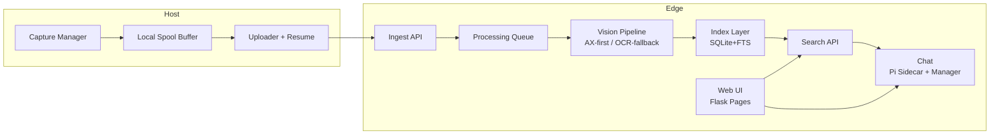

# MyRecall-v3 规格草案（v1.0）

- 日期：2026-02-26
- 目标：在 vision-only 范围内，与 screenpipe 的视觉能力对齐，并强制落地 Edge-Centric 架构（Host 轻、Edge 重）。
- 范围：capture -> processing -> search -> chat（不含 audio）。
- 部署边界：Host 与 Edge 当前默认同一局域网（LAN），但必须保持可远端化。

## 0. 文档导航

| 文档 | 职责（SSOT） | 路径 |
|------|-------------|------|
| **本文件** (spec.md) | 架构总览、矛盾取舍、决策评审、API 契约 | — |
| [data-model.md](data-model.md) | 数据模型（DDL、FTS、screenpipe 对齐映射、Payload、Migration） | §3 提取 |
| [roadmap.md](roadmap.md) | 阶段目标、里程碑、子阶段定义、风险清单、退出条件 | §5 → 引用 |
| [gate_baseline.md](gate_baseline.md) | Gate/SLO 指标口径、统计规则、验收证据 | §6 → 引用 |
| [open_questions.md](open_questions.md) | 待决问题 + 已拍板决策（当前范围：001A–026A） | §8 → 引用 |

> **引用规则**：跨文档引用使用相对路径 + heading slug，例如 `[data-model.md#303-ddledge-sqlite](data-model.md#303-ddledge-sqlite)`。禁止引用行号。
> **依赖规则**：front matter 的 `depends_on` 仅用于自动化拓扑依赖（必须可 DAG 排序）；文档互引请使用 `references` 字段，不得用互相 `depends_on` 表达。
> **参考基准**：本文档中所有 screenpipe 代码引用（如 `db.rs:1850-2054`、`paired_capture.rs`）均基于仓库内路径 `_ref/screenpipe`；审计/复现时以此路径为准。

## 1. 先把矛盾讲清楚（必须取舍）

### 1.1 矛盾 A："对齐 screenpipe" vs "Edge-Centric"
- screenpipe 当前主干是单机本地闭环（capture/processing/search/chat 多在同节点完成）。
- 你要求的 MyRecall-v3 是强制 Edge 参与，Host 仅做轻处理。
- 结论：只能做"能力与行为对齐"，不能做"拓扑完全对齐"。
- 已确认（001A）：v3 以"行为对齐优先"为准，否则需求自相矛盾。

### 1.2 矛盾 B："可选本地/云端模型" vs "Edge 必须参与"
- 若模型在 Host 本地推理，会破坏 Edge-Centric（Host 变重）。
- 结论：模型选择权放在 Edge（本地模型或云 API），Host 不做 OCR/Embedding/Chat 推理。

## 2. 总体架构（Edge-Centric）


```mermaid
flowchart LR
  subgraph Host
    C[Capture Manager]
    B[Local Spool Buffer]
    U[Uploader + Resume]
    C --> B --> U
  end

  subgraph Edge
    W[Web UI\nFlask Pages]
    I[Ingest API]
    Q[Processing Queue]
    P[Vision Pipeline\nAX-first / OCR-fallback]
    IDX[Index Layer\nSQLite+FTS]
    S[Search API]
    CH[Chat\nPi Sidecar + Manager]
    I --> Q --> P --> IDX
    IDX --> S --> CH
    W --> S
    W --> CH
  end

  U --> I
```

### 2.1 Host 职责（严格）
- 采集：截图 + 基础上下文（app/window/monitor/timestamp/trigger）。
- 语义约束：`app/window` 必须来自同一次 capture 的同源上下文快照；禁止 app/window 分别独立查询后拼接。
- 轻处理：压缩、去重哈希、可选 accessibility 文本快照（仅采集，不推理）。
- 传输：断点续传、重试、幂等上传。
- 缓存：本地 spool 与提交位点（offset/checkpoint）。
- 不允许：OCR、embedding、rerank、chat 推理、页面/UI 承载（P1~P3）。

### 2.2 Edge 职责（严格）
- 重处理：OCR（AX-first + OCR-fallback），仅存储原始文本，不做索引时 AI 增强（与 screenpipe 对齐）。
- 索引：`frames` 元数据表 + `ocr_text` + `frames_fts` / `ocr_text_fts`（FTS5）。
- 检索：FTS 召回 + 元数据过滤 + 排序。
- Chat：RAG 编排（Orchestrator 在查询时将原始文本送入 LLM 实时推理）、工具调用、引用回溯、流式输出。
- UI：继续承载现有 Flask 页面与静态资源（P1~P3）。

## 3. 数据模型

> **SSOT**: [data-model.md](data-model.md)
> 
> 数据模型的完整定义（DDL、FTS 策略、screenpipe 对齐映射、Host Payload、Migration 策略）已提取至独立文档。

## 4. 决策点逐项评审（含 screenpipe 对齐）

> **screenpipe 参考位置**：`_ref/screenpipe`。本节所有代码引用、行号标注均基于该路径。

### 4.1 使用场景与 non-goals

### screenpipe 怎么做
- 主打"被动记忆"与"自然语言检索"，vision 结果可用于 timeline/search/chat。
- 支持多来源（OCR/UI/audio），但本次我们仅取 vision 路径。

### MyRecall-v3 决策
- 场景：开发/知识工作者对屏幕历史的检索与问答。
- non-goals：
  - 实时远程桌面流媒体。
  - 音频转写。
  - 多租户 SaaS 权限系统（v3 不做）。

### 对齐结论
- 能对齐：是（能力层）。
- 不能对齐：拓扑层（screenpipe 单机优先，v3 强制 Edge）。

### 风险
- 目标过宽导致 chat 需求蔓延。

### 验证
- 需求验收仅用 vision 数据集；audio 用例全部排除。

### 4.2 Capture pipeline（Host/Edge 边界）

### screenpipe 怎么做
- `event_driven_capture.rs`：事件驱动触发（app switch/click/typing/idle）。
- `paired_capture.rs`：截图 + accessibility 同步采集，必要时 OCR fallback。

### MyRecall-v3 决策
- Phase 1：完成事件驱动 capture（app switch/click/idle）+ manual trigger + idle fallback，并补齐 trigger 字段与采集事件总线（触发枚举以 `capture_trigger` P1 契约为准：`idle/app_switch/manual/click`）。`window_focus` 不纳入 P1；若 P2+ 启用，按 screenpipe `capture_window_focus` 语义对齐（默认关闭，高频场景按需开启）。
- P1-S2a+ ingest 约束：新上报 capture 的 `capture_trigger` 必填且不得为 `null`；缺失/null/非法值返回 `400 INVALID_PARAMS`。
- 历史兼容边界：`frames.capture_trigger` 列保留 `NULL` 以承载 P1-S1 历史数据；该兼容仅限存量数据，不适用于 S2a+ 新上报。
- 语义约束（P1）：禁止将固定频率轮询作为主触发机制；固定频率仅可用于 `idle` fallback 或兼容/实验路径。
- 参数契约（P1，有意偏离 screenpipe Performance 模式）：
  - `min_capture_interval_ms`（默认 `1000`，有意偏离 screenpipe Performance 200ms）：全触发共享最小间隔去抖。
  - `idle_capture_interval_ms`（默认 `30000`）：无事件时触发 `idle` fallback 的最大空窗。
  - 兼容映射：若未显式设置 `idle_capture_interval_ms` 且存在 `OPENRECALL_CAPTURE_INTERVAL`（秒），则按 `idle_capture_interval_ms = OPENRECALL_CAPTURE_INTERVAL * 1000` 解释；该映射仅用于兼容路径。
- idle 语义约束（P1-S2a+）：`idle` fallback 必须仅由 `idle_capture_interval_ms` 超时触发，不依赖用户活跃判定。
- Phase 2/3：capture 功能冻结，不新增采集能力，只做 LAN/Debian 稳定性验证与参数调优。
- 上传协议改为"幂等 + 可续传"：`capture_id` 唯一、chunk ACK、断点续传。
- 已拍板（OQ-004=A）：Host 采集 accessibility 文本并随 capture 上传；Host 不做 OCR/embedding 推理。
- 事件风暴抑制（有意偏离 screenpipe Performance 模式）：
  - 全触发共享最小间隔去抖（`min_capture_interval_ms`，默认 1000ms，有意偏离 screenpipe Performance 200ms）；
  - 非 `idle/manual` 触发启用内容去重（`content_hash` 相同则跳过写入），并保留 30s 强制落盘保底；
  - 触发通道有界，lag 时折叠为一次兜底触发，避免高频事件拖垮处理链路。

**内容去重实现（对齐 screenpipe event_driven_capture.rs）**：
```
# Edge /v1/ingest 伪代码（P1-S1 已实现 capture_id 幂等；content_hash 去重留在 P1-S2+）
def handle_ingest(payload):
    # 1. capture_id 幂等（已实现：DB UNIQUE 约束 + DB-first claim/finalize）
    if _exists_capture_id(payload.capture_id):
        return {"status": "already_exists"}

    # 2. 内容去重（非 idle/manual + 30s 保底）
    # 允许跨 capture_id 去重（capture_id 幂等与 content_hash 去重是两层语义）
    device = payload.device_name
    if payload.capture_trigger not in ('idle', 'manual'):
        last_hash = _get_last_content_hash(device)
        last_write = _get_last_write_time(device)

        # 30s 强制写入保底
        if (now - last_write).total_seconds() < 30:
            if _is_valid_hash(payload.content_hash) and payload.content_hash == last_hash:
                _record_dedup_skip(device)  # 计数器
                return {"status": "dedup_skipped", "capture_id": payload.capture_id}

    # 3. 写入 DB
    _insert_frame(payload)
    _set_last_content_hash(device, payload.content_hash)
    _set_last_write_time(device, now)
    return {"status": "created"}
```

**纯内存状态与重启语义（P1-S2b）**：
- `last_content_hash/last_write_time` 为 per-device 纯内存运行态，不跨 Edge 重启持久化。
- Edge 重启后 dedup 进入冷启动，重启边界附近允许出现额外写入；该现象为预期行为，不视为缺陷。
- 30s 保底写入语义始终成立，用于保证 timeline 连续性。

**关键参数对齐**：
| 参数 | screenpipe | MyRecall v3 P1 |
|------|-----------|----------------|
| `min_capture_interval_ms` | 200 | 1000（有意偏离：Python 实现安全起点） |
| `idle_capture_interval_ms` | 30000 | 30000 |
| dedup 保底写入窗口 | 30s | 30s |
| dedup 排除触发 | idle, manual | idle, manual |

### 对齐结论
- 对齐级别：高度对齐（P1 即达到行为对齐）。

### 风险
- 事件风暴导致过采样与 LAN 拥塞。

### 验证
- 指标：切窗场景 95% capture 在 3 秒内入 Edge 队列。
- 压测：每分钟 300 次事件下，Capture 丢失率 < 0.3%；Host CPU 作为容量观测项记录（参考 [gate_baseline.md §3.2](gate_baseline.md#32)）。
- 去抖校验：同 monitor 连续 `app_switch/click` 入库间隔 < `min_capture_interval_ms` 的违规数应为 0。
- 去重校验：重复内容压测中应观测到 dedup skip，且 30s 保底写入仍成立（timeline 不空洞）。

### 4.2.1 Monitor 动态监测（与 screenpipe 对齐）

> 本节补充说明 device_name 的运行时监测机制。

### screenpipe 怎么做
- Monitor Watcher：每 5 秒轮询一次 monitor 列表（`monitor_watcher.rs`）
- 监测内容：
  - 新增 monitor → 自动启动对应 monitor 的录制
  - 断开 monitor → 自动停止录制
  - 重新连接 → 恢复录制
- 识别方式：OS 级别 monitor id（CGDirectDisplayID / xcap Monitor.id）
- 限制：不对历史数据做回溯验证

### MyRecall-v3 方案
- Host 端实现类似的 monitor 监测机制：
  - 使用 mss 库定期枚举显示器
  - 检测到 monitor 变化时调整采集任务
  - device_name 生成规则见 [data-model.md §3.0.6](data-model.md#306-host-上传-payload)
- 对齐方式：
  - 使用 OS 级别 monitor id（通过 mss + ctypes 获取）
  - 格式与 screenpipe 一致：`monitor_{id}`
- 限制说明：
  - OS 级别 monitor id 稳定性依赖操作系统
  - 历史数据的 device_name 不做回溯验证（screenpipe 亦如此）

### 对齐结论
- 对齐级别：完全对齐（运行时监测机制 + 识别方式 + 格式）
- 差异：无（v3 Host 端实现与 screenpipe 等效的监测逻辑）

### 4.3 Vision processing（与 screenpipe 对齐，Scheme C）

### screenpipe 怎么做
- accessibility 有文本时优先使用，OCR 作为 fallback（并对 terminal 类 app 做 OCR 偏好）。
- AX 成功帧：`frames.accessibility_text` = AX 文本，`frames.text_source = 'accessibility'`，**不写 `ocr_text` 行**（`paired_capture.rs:153-154`，`db.rs:1538` 的 `if let Some(...)` 不执行）。
- AX 失败帧：OCR fallback → 写 `ocr_text` 行，`frames.text_source = 'ocr'`。
- 独立 `ui_recorder` 树遍历器（每 ~500ms）：写入独立 `accessibility` 表（`db.rs:5287-5311`），与 `paired_capture` 完全解耦。

### MyRecall-v3 决策（Scheme C，025A）
- Edge 执行"AX-first + OCR-fallback"（与 screenpipe 完全对齐）。
- P1 OCR fallback 引擎固定为 RapidOCR（single-engine policy），不纳入多引擎切换与对比验收。
- 对关键 app 维护 `ocr_preferred_apps`（P1 初版见 OQ-034：`wezterm`、`iterm`、`terminal`、`alacritty`、`kitty`、`hyper`、`warp`、`ghostty`）。
- Edge 仅存储原始 OCR text 与 accessibility text，不做索引时 AI 增强（不生成 caption/keywords/fusion_text，不写入 embedding）。
- Chat grounding 由 Orchestrator 在查询时将原始文本送入 LLM 实时推理（与 screenpipe Pi agent 模式对齐）。
- 已拍板（014A）：删除 fusion_text，索引时零 AI 调用，完全对齐 screenpipe vision-only 处理链路。

#### AX/OCR 决策契约（P1-S3 SSOT）

注：P1 阶段第 4 步中的 "OCR fallback" 统一指 RapidOCR 路径。

对每一帧，最终持久化 `frames.text_source` 必须按以下优先级确定：

1. 若 `app_name` 命中 `ocr_preferred_apps`，则该帧必须走 OCR 路径（`text_source='ocr'`）。
2. 否则，令 `ax_text_normalized = TRIM(COALESCE(accessibility_text, ''))`。
3. 若 `ax_text_normalized != ''`，则该帧必须归类为 `text_source='accessibility'`。
4. 否则必须执行 OCR fallback；OCR 成功时归类为 `text_source='ocr'`。

边界条件（P1 强约束）：

- 仅空白字符的 `accessibility_text` 视为“空文本”。
- AX 文本允许“部分/截断”；只要归一化后非空，仍按 `accessibility` 处理，不因“质量主观判断”改走 OCR。
- AX 超时时使用超时前已收集文本：非空则 `accessibility`，为空则 OCR fallback。
- Electron/Chromium 首次遍历空文本场景，不做同帧 AX 重试；该帧走 OCR fallback，后续事件可再次获得 AX 文本。
- 截图持久化独立于 AX/OCR 结果，任何一侧失败均不得阻塞截图落盘。

#### 写入路径（Scheme C 分表写入）

```
paired_capture 处理一帧:
  ├─ AX 成功 → frames 行 (text_source='accessibility', accessibility_text=AX文本)
  │            + accessibility 行 (text_content=AX文本, frame_id=frames.id, focused=...)
  │            + 无 ocr_text 行
  │
  └─ AX 失败 → OCR fallback
               → frames 行 (text_source='ocr')
               + ocr_text 行 (text=OCR文本, frame_id=frames.id)
               + 无 accessibility 行
```

#### AX 降级策略（与 screenpipe 对齐）

| 场景 | 处理方式 |
|------|----------|
| **截图** | 始终写入磁盘（永不阻塞） |
| **AX 树遍历超时** | 500ms 超时保护，超时后继续处理已获取部分 |
| **AX 返回有文本** | 使用 AX 文本，跳过 OCR |
| **AX 返回空文本** | 执行 OCR fallback |
| **AX 完全失败** | 记录错误，尝试 OCR fallback |
| **text_source 标记** | `accessibility` / `ocr` |

**与 screenpipe 对齐点**：
- 截图永不阻塞
- AX-first + OCR-fallback 逻辑完全对齐
- text_source 字段语义一致
- terminal 类 app 偏好 OCR

- 处理链产物白名单（P1）：`ocr_text.text`、`ocr_text.text_json`、`frames.text_source`、`accessibility.text_content`。
- 禁止产物（P1）：`caption`、`keywords`、`fusion_text`、`ocr_text_embeddings` 写入。

### 对齐结论
- 对齐级别：完全对齐（数据流与存储结构均与 screenpipe vision-only 一致；分表写入语义对齐 screenpipe `paired_capture` + `accessibility` 独立表架构）。
- v3 增强：`accessibility.focused` 列（P0 修复，ADR-0012）、`accessibility.frame_id` 精确关联（方案 3）。

### 风险
- accessibility 文本质量不稳定，导致召回波动。

### 验证
- A/B：AX-first vs OCR-only，在同一数据集比较 Recall@20 与 NDCG@10。
- P1-S3 Gate：AX 成功帧写入 `accessibility` 表的正确率 = 100%。

### 4.4 索引与存储（Host/Edge 边界）

### screenpipe 怎么做
- SQLite 主表 + FTS（`frames_fts`/`ocr_text_fts` 等），snapshot 直接落盘并在 DB 记录路径。

### MyRecall-v3 决策
- Edge 作为唯一事实源（source of truth），使用单一 `edge.db`（SQLite）：
  - `frames`（原始采集元数据 + 处理队列状态）← 对齐 screenpipe frames
  - `ocr_text`（OCR fallback 原文 + bbox）← 对齐 screenpipe ocr_text（Scheme C：仅 AX 失败帧写入）
  - `accessibility`（AX 成功帧文本 + 独立 walker 数据）← 对齐 screenpipe accessibility 表（Scheme C，025A）
  - `frames_fts` / `ocr_text_fts` / `accessibility_fts`（FTS5 全文索引）← 对齐 screenpipe（`accessibility_fts` 增加 `browser_url` 列，确保 API 语义一致）
  - `chat_messages`（Chat 会话记录）← v3 独有
  - `ocr_text_embeddings`（P2+ 可选离线实验表，P1 不建）← 参考 screenpipe 预留
- Host 仅保留短期 spool，不做长期索引。
- 详细 DDL 见 [data-model.md §3.0.3](data-model.md#303-ddledge-sqlite)。

### 对齐结论
- 对齐级别：主路径高对齐（P1 已落地表与核心字段对齐 screenpipe vision-only，含 `accessibility` 表 + FTS）；`ocr_text_embeddings` 为 P2+ 可选，不计入 P1"100% 对齐"定义。

### 风险
- 索引与原始文档同步延迟导致检索可见性抖动。

### 验证
- 每小时对账任务：`ocr_text` 行数 + `accessibility` 行数（paired_capture 写入）≈ `frames`（status=COMPLETED）行数（允许独立 walker 带来的 accessibility 行多出）。

### 4.5 Search（召回与排序）

### screenpipe 怎么做
- `GET /search`：15+ 过滤参数，底层纯 FTS5（vision-only 路径无 embedding 参与，`search_ocr()` SQL 不 JOIN `ocr_text_embeddings`）。
- `GET /search/keyword`：独立快速路径（FTS 分组/高亮），仍是 SQL/FTS 逻辑，不涉及索引时 AI 推理。
- Response 字段：`frame_id`, `text`, `timestamp`, `file_path`（磁盘绝对路径）, `app_name`, `window_name`, `browser_url`, `focused`, `device_name`, `tags`, `frame`（base64，可选）。

### MyRecall-v3 决策（020A）
- Search 完全对齐 screenpipe（vision-only）：线上只保留 FTS5 + 过滤，不走 hybrid。
- `/v1/search/keyword` 合并到 `/v1/search`（P1 无 embedding，拆分无意义；P2+ 若引入 embedding 再拆）。
- 检索/推理边界：索引时仅入库 raw OCR + `text_source`；Chat/Orchestrator 仅在查询时实时推理。

#### API 命名空间冻结（P0-01）
- MyRecall-v3 对外 HTTP 契约统一使用 `/v1/*`。
- `/api/*` 为 v2 历史路径：P1-S1~P1-S3 对 `POST /api/upload` 返回 308、对其余 3 个 legacy GET 端点返回 301（均重定向至对应 `/v1/*` 并记录 `[DEPRECATED]` 日志）；自 P1-S4 起返回 410 Gone 完全废弃。
- 重要澄清（P1 Gate scope）：legacy `/api/*` 渐进废弃的验收口径只覆盖 4 个端点：`POST /api/upload`、`GET /api/search`、`GET /api/queue/status`、`GET /api/health`（其余 `/api/*` 行为不纳入 P1 Gate 口径）。完整范围以 [http_contract_ledger.md](./http_contract_ledger.md) §4.0 与各阶段验收文档为准。
- 兼容 alias（如存在）必须标记为 legacy，且不得作为文档、SDK、验收脚本默认入口。

#### `GET /v1/search` — 完整契约

**Query Parameters：**

| 参数 | 类型 | 默认 | 说明 |
|------|------|------|------|
| `q` | string | `""` | FTS5 全文检索，空值返回全部 |
| `content_type` | string | `"all"` | 搜索路径路由：`"ocr"` / `"accessibility"` / `"all"`（Scheme C，对齐 screenpipe `ContentType`） |
| `limit` | uint32 | `20` | 分页大小，最大 100 |
| `offset` | uint32 | `0` | 分页偏移。UI 采用"加载更多"模式（OQ-026=A，对齐 screenpipe），offset 单调递增步长=limit，实际不超过几百；P2+ 升级为 keyset cursor 后本字段废弃 |
| `start_time` | ISO8601 | null | 时间范围起点（UTC） |
| `end_time` | ISO8601 | null | 时间范围终点（UTC） |
| `app_name` | string | null | 应用名过滤（精确匹配） |
| `window_name` | string | null | 窗口名过滤（精确匹配） |
| `browser_url` | string | null | 浏览器 URL 过滤（FTS token 序列匹配，对齐 screenpipe `frames_fts MATCH`；`unicode61` 按非字母数字字符断词后做短语连续匹配） |
| `focused` | bool | null | 仅返回前台焦点帧 |
| `min_length` | uint | null | OCR 文本最小字符数（仅作用于 `content_type=ocr/all` 的 OCR 路径；`search_accessibility()` 函数不接受此参数，对齐 screenpipe） |
| `max_length` | uint | null | OCR 文本最大字符数（仅作用于 `content_type=ocr/all` 的 OCR 路径；`search_accessibility()` 函数不接受此参数，对齐 screenpipe） |
| `include_frames` | bool | `false` | true 时内嵌 base64 图像；P1 预留字段，不实现（始终返回 null） |

**Response 200 OK：**

```json
{
  "data": [
    {
      "type": "OCR",
      "content": {
        "frame_id": 123,
        "text": "提取的 OCR 文字",
        "timestamp": "2026-02-26T10:00:00Z",
        "file_path": "/data/screenshots/abc.jpg",
        "frame_url": "/v1/frames/123",
        "app_name": "Safari",
        "window_name": "GitHub - main",
        "browser_url": "https://github.com",
        "focused": true,
        "device_name": "monitor_0",
        "tags": []
      }
    },
    {
      "type": "UI",
      "content": {
        "id": 456,
        "text": "AX 提取的 UI 文本",
        "timestamp": "2026-02-26T10:00:01Z",
        "file_path": "/data/screenshots/def.jpg",
        "frame_url": "/v1/frames/789",
        "app_name": "VS Code",
        "window_name": "spec.md — MyRecall",
        "browser_url": null,
        "focused": true,
        "device_name": "monitor_0",
        "tags": []
      }
    }
  ],
  "pagination": {
    "limit": 20,
    "offset": 0,
    "total": 142
  }
}
```

**字段说明：**
- `file_path`：Edge 本地磁盘绝对路径（对齐 screenpipe；P1 WebUI/Chat 均在 Edge 侧可直接使用）
- `frame_url`：`/v1/frames/:frame_id` 相对路径（P2+ 跨机器时可替代 `file_path`）；`type=OCR` 时 frame_id 始终有值；`type=UI` 时 frame_id 来源于 `accessibility.frame_id`（v3 改进，外键精确关联），当为 NULL 时返回 `null`
- `type`：`"OCR"`（来自 `search_ocr()` 路径）或 `"UI"`（来自 `search_accessibility()` 路径）；对齐 screenpipe `ContentType::OCR` / `ContentType::Accessibility`。P2+ 预留 `"Audio"`
- `type=OCR` 的引用锚点字段为 `frame_id` + `timestamp`（P1-S4 Hard Gate 口径）；`type=UI` 的引用锚点字段为 `frame_id` + `timestamp`（P1-S4 Hard Gate 口径）
- `content_type=ocr` 时 response 只含 `type=OCR`；`content_type=accessibility` 时只含 `type=UI`；`content_type=all` 时混合
- `type=UI` 的 `content.text` 来源于 `accessibility.text_content`；`content.frame_id` 为 `accessibility.frame_id`（v3 改进，通过外键精确关联截图，避免 screenpipe 的 ±1s 时间窗口模糊匹配）；当 `accessibility.frame_id` 为 NULL 时，`frame_url` 返回 `null`；`file_path`/`frame_url`/`device_name` 通过 LEFT JOIN frames 获取
- `capture_id`：v3 增强可选字段（可由 `frames.capture_id` 回传），用于观测与回归；不作为 Search 对齐硬门槛
- `include_frames=true` 时 `content` 中追加 `"frame": "<base64>"` 字段；P1 不实现，始终为 null

**错误响应：** 见 §4.9 统一错误响应格式。

### 对齐结论
- **高对齐**：query params 对齐 screenpipe `SearchQuery`（含 `content_type` 路由），response 对齐 `OCRContent` + `UiContent`。
- **差异**：去掉 audio/speaker/input 相关参数（P1 无音频/输入）；新增 `frame_url` 字段；`/v1/search/keyword` 合并。
- **v3 改进**：`content_type=accessibility` + `focused` 过滤不做 screenpipe 的 force-OCR 降级。

### 风险
- 语义型查询（抽象描述、长尾表述）召回能力下降。

### 验证
- 离线评测集拆分"精确词查询/语义查询"两组；保证精确词查询不低于对齐基线，并量化语义退化幅度。

### 4.6 Chat（核心能力）

### screenpipe 怎么做
- screenpipe 的 Chat 主回答链路由 Pi 代理驱动（通过工具调用 `/search` 等检索端点）；`/ai/chat/completions` 仅用于 follow-up suggestions 辅助分支，不是主回答必经链路。

### MyRecall-v3 决策
- Edge 增加 **Pi Sidecar**（bun 进程，`--mode rpc`）+ **Python Manager**（进程管理 + 协议桥接）：
  - 内层协议（Manager ↔ Pi）：Pi stdin/stdout JSON Lines（对齐 screenpipe `pi.rs` RPC 模式）。
  - 外层协议（前端 ↔ Edge）：HTTP SSE（拓扑适配，per Decision 001A）。
  - 请求：简单 JSON `{message, session_id, images?}`；响应：SSE 透传 Pi 顶层事件（核心 11 种：`message_update`、`tool_execution_start`、`tool_execution_update`、`tool_execution_end`、`agent_start`、`agent_end`、`turn_start`、`turn_end`、`message_start`、`message_end`、`response`），不做 OpenAI format 翻译。`message_update` 内层的 `assistantMessageEvent.type` 子事件（如 `text_delta`、`thinking_start`、`thinking_delta`、`thinking_end`、`content_block_delta`）单独解析，不与顶层事件枚举混用；未知扩展顶层事件按前向兼容处理（记录并忽略或降级展示）。
  - 工具以 Pi SKILL.md 格式定义（对齐 screenpipe），P1-S5 最小集为 `myrecall-search` Skill（对标 `screenpipe-search`），统一包含搜索、时间范围渐进扩展、帧详情获取等能力。
  - 软约束引用（DA-8=A）：系统提示与 `myrecall-search` Skill 显式要求输出可解析 deep link：
    - OCR 结果：使用 `myrecall://frame/{frame_id}`（frame_id 始终有值）
    - UI 结果：优先使用 `myrecall://frame/{accessibility.frame_id}`（v3 改进，通过外键精确关联）
    - 当 `accessibility.frame_id` 为 NULL 时回退 `myrecall://timeline?timestamp=ISO8601`（仅未来独立 walker 场景，P1 不触发）
  - UI 落点规则：不新增独立 `/frame/:id` 页面；`myrecall://frame/{id}` 在前端统一落到 `/timeline`，并通过 `GET /v1/frames/:frame_id/metadata`（timestamp resolver，最小稳定契约）解析 `timestamp` 后定位。
    - `frame_id`/`timestamp` 必须直接拷贝自检索结果，禁止伪造。P1-S5 不做结构化 citation（`chat_messages.citations` 留空），评估是否在 P1-S7 增加 DA-8B。
  - 模型路由：通过 Pi `--provider`/`--model` 启动参数 + `models.json` 配置控制（对齐 screenpipe）。P1 不做自动 fallback chain（对齐 screenpipe）。
- P1~P3：chat UI 与会话输入输出由 Edge 页面承载；Host 不负责 UI 与推理。
- 上述 Chat 能力要求在 P1 达成；P2/P3 不新增 Chat 功能，仅做稳定性与性能治理。
- Post-P3（可选，不纳入当前里程碑）：再评估 UI 是否迁移到 Host。

### 对齐结论
- 对齐级别：可对齐（并更符合 Edge-Centric）。

### 风险
- 无引用回答会快速失去可信度。

### 验证
- 观测指标（non-blocking）：
  - P1-S5：引用覆盖率目标 >= 85%
  - P1-S7 / P2 / P3：引用覆盖率目标 >= 92%
  - Stretch 目标：>= 95%
  - 人工抽检 hallucination rate 持续下降

### 4.7 同步与传输（LAN 主链路，断连恢复）

### screenpipe 怎么做
- 有 sync provider（批次导入导出 + 标记同步），但不是 Host/Edge LAN 主链路模型。

### MyRecall-v3 决策（019A）

#### P1 协议：单次幂等上传（方案 A）

```
POST /v1/ingest
Content-Type: multipart/form-data

Fields:
  capture_id  string    UUID v7，Host 生成，必填
  metadata    JSON      CapturePayload（除 image_data 的所有字段；必须包含 `event_ts` 用于 latency 观测）
  file        binary    JPEG 图像（主契约，`image/jpeg`；兼容模式可接收 PNG/WebP，但入库前统一转码为 JPEG）

Response:
  201 Created  → {"capture_id": "...", "frame_id": 123, "status": "queued", "request_id": "uuid-v4"}
  200 OK       → {"capture_id": "...", "frame_id": 123, "status": "already_exists", "request_id": "uuid-v4"}
  400          → {"error": "invalid ingest payload", "code": "INVALID_PARAMS", "request_id": "uuid-v4"}
  413          → {"error": "image too large", "code": "PAYLOAD_TOO_LARGE", "request_id": "uuid-v4"}
  503          → {"error": "queue full", "code": "QUEUE_FULL", "retry_after": 30, "request_id": "uuid-v4"}
  500          → {"error": "internal error", "code": "INTERNAL_ERROR", "request_id": "uuid-v4"}

语义约束（P1-S1，SSOT）：
- 400/413/503：Edge MUST NOT 创建/修改任何 `frames` 行（因此也 MUST NOT 影响 queue/status 计数）。
- 201/200：表示该 capture 已被 Edge “接受为幂等成功”（新建或重复），Host 可安全删除对应 spool 项。

语义约束（P1-S2a+，latency 观测）：
- `event_ts` 表示 Host 触发时刻（UTC ISO8601），用于 `capture_latency_ms = (frames.ingested_at - event_ts) * 1000`。
- 若 `event_ts` 缺失、非法或晚于入库时刻（会导致负延迟），Edge MAY 接受该 ingest 请求，但该样本 MUST NOT 进入 `capture_latency_p95` 统计，并 MUST 计入观测异常计数。

GET /v1/ingest/queue/status
Response:
  200 OK →
  {
    "pending": 5,
    "processing": 1,
    "completed": 1023,
    "failed": 2,
    "processing_mode": "noop",
    "capacity": 200,
    "oldest_pending_ingested_at": "2026-02-26T10:00:00Z",
    "trigger_channel": {
      "queue_depth": 3,
      "queue_capacity": 64,
      "collapse_trigger_count": 12,
      "overflow_drop_count": 0
    }
  }
  字段说明：
  - pending：DB 中 `frames.status='pending'` 的行数（实时）。
  - processing：DB 中 `frames.status='processing'` 的行数（实时）。在 `processing_mode=noop` 下该值允许长期为 0（瞬态不可观测不视为异常）。
  - completed：DB 中 `frames.status='completed'` 的行数（实时）。
  - failed：DB 中 `frames.status='failed'` 的行数（实时）。
  - processing_mode：处理模式（SSOT）。
    - noop：P1-S1 固定值；仅驱动队列状态机流转与可观测性闭环，不做 AX/OCR/Embedding 等任何推理路径。
    - ax_ocr：P1-S3+ 可用；启用 AX-first + OCR-fallback 管线与 Scheme C 分表写入。
  - capacity：队列最大容量（固定配置值）；pending >= capacity 时 ingest 返回 503 QUEUE_FULL
  - oldest_pending_ingested_at：最早一条 pending 帧的 `frames.ingested_at`（UTC ISO8601）；null 表示队列为空；
    Host 可用此字段判断队列是否卡死（如超过 5 分钟未推进则告警）
  - trigger_channel.queue_depth：触发通道当前深度（用于背压观测）
  - trigger_channel.queue_capacity：触发通道容量（用于背压观测）
  - trigger_channel.collapse_trigger_count：过载折叠累计计数
  - trigger_channel.overflow_drop_count：过载溢出丢弃累计计数

背压采样口径（P1-S2a Gate）：
- `queue_saturation_ratio` 的统计基于 `trigger_channel` 数据，按 1Hz 采样、连续 5 分钟窗口计算。
- 分母定义为窗口内有效采样点总数（剔除窗口外样本）。

计数一致性约束（P1-S1，SSOT）：
- `GET /v1/ingest/queue/status` 的四个计数 MUST 与 DB 中对应 status 的行数一致（不允许使用“进程启动后累计计数器”替代）。
```

#### P1-S1 处理语义：QueueDriver（noop）

P1-S1 的 "processing" 定义为 noop/轻量处理，其目标仅是驱动状态机流转与可观测性闭环。
本阶段不引入 AX-first/OCR-fallback 与任何模型/推理路径（P1-S3 才启用）。

- Edge MUST 启动一个后台 QueueDriver（worker），用于异步推进状态：
  pending -> completed
  （允许实现上经过 processing，但 Gate/脚本不得依赖 processing 的可观测性）
- Edge MUST 在 `/v1/ingest/queue/status` 响应中返回 `processing_mode` 字段：
  `"noop"` | `"ax_ocr"`。
  P1-S1 固定为 `"noop"`；P1-S3+ 允许为 `"ax_ocr"`。

当 `processing_mode="noop"` 时：

- Edge MUST NOT：初始化/加载任何 OCR/embedding/vision provider 或模型（包括启动期 preload）。
- Edge MUST NOT：写入任何 AI 衍生产物（如 caption/keywords/fusion_text/embedding 等）。
- Edge MUST：`failed` 仅允许由 ingest 基础错误触发（例如 payload 校验、幂等冲突、落盘/IO、队列满/背压、DB 写入失败）。
  不允许因 AI provider 初始化失败或模型加载失败导致 `failed`。

**可验证日志锚点（P1-S1 Gate，SSOT）**：
- Edge 在启动完成（HTTP server ready）后，必须输出且仅输出一次：`MRV3 processing_mode=noop`
- Gate/脚本判定以该行的字面匹配为准；不接受其他“等价表述”。

**持久化语义（P1-S1 Gate，SSOT）**：
- Edge MUST：在 `noop` 下仍创建 `frames` 行并持久化 snapshot JPEG（用于 `/v1/frames/:frame_id` 主读取链路与幂等去重验证）。
- Edge MUST NOT：写入任何 AI/文本处理产物字段/表（AX/OCR/embedding 等均在 P1-S3+）。

**失败原因分类（P1-S1 Gate，SSOT）**：
- 任一事件导致 `/v1/ingest/queue/status.failed` 计数增加时，Edge MUST 输出一条结构化日志：
  - `MRV3 frame_failed reason=<REASON> request_id=<uuid-v4> capture_id=<uuid-v7> frame_id=<int_optional>`
- `<REASON>`（P1-S1 允许枚举）：`DB_WRITE_FAILED|IO_ERROR|STATE_MACHINE_ERROR`
- 禁止出现任何 AI/OCR/provider/model 相关失败原因（如 `AI_INIT_FAILED|MODEL_LOAD_FAILED|OCR_INIT_FAILED` 等）。

**幂等语义**：重复 `capture_id` 返回 `200 OK` + `"status": "already_exists"`，客户端无需区分新建/重复，直接删除 buffer 项。

**去重机制**：`frames.capture_id` UNIQUE 约束（DB 层），Edge 收到重复 capture_id 时 INSERT OR IGNORE，返回 200。

**图片格式口径（P1）**：主采集/主读取链路统一 JPEG。`frames.snapshot_path` 指向 JPEG 文件（推荐 `.jpg`），`GET /v1/frames/:frame_id` 固定返回 `Content-Type: image/jpeg`。

**Host spool 实现**：
- spool 路径：`~/MRC/spool`
- 持久化策略：磁盘文件（`.jpg`/`.jpeg` + `.json`），原子写入（`.tmp -> rename`）
- 兼容读取：若 spool 中存在历史遗留的（`.webp` + `.json`）项，仅用于 drain 清空；新写入不再产生 `.webp`
- 进程重启/断电/断网恢复后自动续传
- 幂等依赖 Edge `/v1/ingest` 的 `capture_id` + DB UNIQUE 约束
- metadata 兼容键：Edge 接受 `app_name/app/active_app` 与 `window_name/window/active_window`，统一写入 `frames.app_name/window_name`
- 兼容键语义不变：键名可兼容映射，但 `app_name/window_name` 必须保持同源上下文语义；当 window 归属不确定时写 `NULL/None`，不得写错值。
- WebUI 桥接输出：`/api/memories/latest|recent` 对 `status` 使用大写归一化（`PENDING|PROCESSING|COMPLETED|FAILED`）以避免前端统计口径漂移

**Client 重试策略（P1）**：
- exponential backoff：1s → 2s → 4s → 8s → 上限 60s
- buffer 不删除，直到收到 201 或 200（already_exists）
- 503 QUEUE_FULL：遵守 `retry_after`，不立即重试
- 网络不通：无限重试，保留 buffer

**P1 鉴权**：token + TLS 可选（006A->B）

#### P2+ 协议升级路径（不破坏 P1 契约）

P2 LAN 弱网场景下新增分片批量模式，P1 单帧快速通道 `POST /v1/ingest` 继续保留，P1 Host 无需改动：

```
POST /v1/ingest/session      # 新增（P2，批量/分片模式）
PUT  /v1/ingest/chunk/{id}   # 新增（P2）
POST /v1/ingest/commit        # 新增（P2）
GET  /v1/ingest/checkpoint    # 新增（P2）
POST /v1/ingest               # 保留（P1 单帧快速通道）
GET  /v1/ingest/queue/status  # P1 已有，P2+ 继续使用
```

P2+ 升级为 mTLS 强制（006A->B）。

### 对齐结论
- 对齐级别：概念对齐（可恢复传输），实现不对齐（screenpipe 同进程直写，无 HTTP 传输层）。

### 风险
- 去重键设计错误会造成漏写或重复写。
- QUEUE_FULL 背压失效会导致 Host buffer 无限积压（需配合 spool 容量管理）。

### 验证
- 故障注入：断网/重启/乱序/重复包场景下，最终一致性通过。
- 重复包去重正确率 = 100%（相同 capture_id 不重复入库）。
- 503 背压场景：Host 遵守 retry_after，buffer 不丢、不爆。

### 4.8 UI 能力与阶段 Gate（A：最小可用集）

### screenpipe 怎么做
- UI 通过稳定 API 契约驱动核心交互（search/chat/timeline），而不是把“页面存在”当作完成标准。
- 典型主回答链路依赖点是检索端点（如 `/search`、`/search/keyword`）与 Pi RPC；`/ai/chat/completions` 在 chat 中属于辅助建议能力，不是主回答必经链路。

### MyRecall-v3 决策（012A）
- 保持 007A：P1~P3 UI 继续在 Edge，不迁移到 Host。
- 在 P1 强制引入最小 UI Gate，只覆盖可用性与可解释性，不做 UI 重构：
  - 路由可达 + 健康态/错误态可见
  - Grid（`/`）可见 capture/ingest/processing 状态（状态主视图）
  - timeline（`/timeline`）可见新帧与时间定位（浏览主视图）
  - search 过滤项与 API 参数契约对齐，结果可回溯
  - chat 引用可点击回溯，路由/降级状态可见
  - 端到端关键路径脚本化回归
- P2/P3 功能冻结，仅验证 LAN/Debian 下 UI 稳定性与恢复行为。

### 对齐结论
- 对齐级别：中高（API 驱动交互与关键链路闭环对齐；UI 技术栈不要求一致）。

### 风险
- 最小 Gate 可能遗漏复杂交互问题。
- Edge 高负载下 UI 仍有资源争用风险。

### 验证
- 每个 P1 子阶段验收文档必须包含 UI 证据（截图/录屏 + 步骤 + 结论）。
- UI 关键路径通过率与异常可见性指标纳入阶段 Gate。

### 4.8.1 UI 健康态/错误态：最小实现标准（P1-S1 Gate）

> 目的：将“健康态/错误态可见 + 自动恢复”收敛为可脚本化、可截图取证的 UI 契约，避免主观判定。

**适用页面（P1-S1）：**
- `/`、`/search`、`/timeline` 首屏必须可见“服务状态”组件（不得要求点击展开才能看到）。

**数据源（SSOT）：**
- `GET /v1/health`（见 §4.9 `GET /v1/health` 契约）。
- P1-S1 最小实现使用前端轮询；允许未来演进为 WS/SSE 推送，但不得改变本节的“状态判定口径”与“可验证锚点”。

**刷新与防抖（P1-S1 默认值，作为验收口径的一部分）：**
- 参数 SSOT：[gate_baseline.md](./gate_baseline.md) §3.3.1。

**状态判定（P1-S1 Gate 口径，WebUI 视角）：**
- `healthy`
  - 条件：浏览器可成功请求 `/v1/health` 且 `status == "ok"` 且 `frame_status == "ok"` 且 `queue.failed == 0`
  - UI 文案要求：必须包含 `服务健康/队列正常`
- `unreachable`
  - 条件：浏览器请求 `/v1/health` 失败或超时，且连续持续时间 >= `unreachable_grace_ms`
  - UI 文案要求：必须包含 `Edge 不可达`
- `degraded`
  - 条件：浏览器可成功请求 `/v1/health`，但 `status != "ok"` 或 `queue.failed > 0` 或 `frame_status != "ok"`
  - UI 文案要求：必须为明确错误提示（例如“服务异常/队列异常/等待首帧”）；建议附带 queue 计数（pending/processing/failed）便于定位
  - 空库口径（P1-S1）：当 `last_frame_timestamp == null` 时，`frame_status="stale"` 且 `status="degraded"`，UI 应显示 degraded（等待首帧），而非 unreachable

**自动恢复：**
- 从 `unreachable` / `degraded` 状态，只要任意一次后续刷新满足 `healthy`，UI 必须在不刷新页面的情况下自动回到 `healthy`。

**可验证锚点（用于 Gate 100%）：**
- 每个页面必须存在稳定 DOM 选择器：`id="mr-health"`
- 必须暴露稳定状态字段：`data-state="healthy|unreachable|degraded"`
- Gate 脚本以 `#mr-health` 与 `data-state` 判定为准；文案用于人类可解释性，但不作为唯一判定依据。

**“Edge 不可达”的验收前提：**
- 指的是：页面已完成首屏渲染后（不刷新页面），浏览器侧对 `/v1/health` 不可达/超时应被 UI 明确展示；不要求在 Edge 无法提供页面（首屏无法加载）的前提下展示“错误态 UI”。

### 4.8.2 Timeline/Grid 数据源与状态同步口径（P1-S2a+）

> 目的：避免“timeline 可见性”与“状态同步”混用导致 Gate 争议。

**视图职责（强制）：**
- Grid（`/`）是状态同步主视图：用于判定 `PENDING/PROCESSING/COMPLETED/FAILED` 可见性与收敛。
- Timeline（`/timeline`）是时间轴浏览主视图：用于判定新帧可见与时间定位正确，不作为状态同步 Gate 主依据。

**数据源口径（P1）：**
- Grid 动态刷新：`/api/memories/latest|recent`（桥接输出；`status` 大写归一化）。
- Timeline 首屏数据：服务端从 `frames` 读取时间序列并渲染；帧图片读取统一走 `/v1/frames/:frame_id`。

**状态同步延迟预算（P1-S2a 验收口径）：**
- 预算组成：QueueDriver 轮询（默认 2s）+ Grid 前端轮询（默认 5s）+ 渲染余量。
- 验收阈值：Grid 端 `pending -> completed` 状态可见收敛 P95 <= 8s（观测与验收记录必填）。
- 说明：该阈值用于 UI 同步可验证性，不替代 `capture_latency_p95` 指标定义。

### 4.9 API 契约总览（P1 端点完整清单）

### 端点清单

| 端点 | 方法 | 说明 | 对齐 screenpipe |
|------|------|------|----------------|
| `/v1/ingest` | POST | 单帧幂等上传 | 概念对齐（019A） |
| `/v1/ingest/queue/status` | GET | 队列状态 | 概念对齐 |
| `/v1/search` | GET | FTS5 搜索（P1-S4+） | 高对齐（020A） |
| `/v1/chat` | POST | Chat 请求（JSON）+ SSE 事件流响应（P1-S5+） | 高对齐（DA-2/DA-7） |
| `/v1/frames/:frame_id` | GET | 图像二进制 | 高对齐（020A） |
| `/v1/frames/:frame_id/metadata` | GET | 深链导航元数据（timestamp resolver，P1-S5+） | 高对齐（020A） |
| `/v1/frames/:frame_id/context` | GET | 帧上下文（text/urls；P1-S5+，P2+ 扩展 nodes） | 对齐（020B） |
| `/v1/health` | GET | 服务健康检查 | 高对齐 |

### `POST /v1/chat` 契约（DA-2/DA-7，P1-S5）

**Request：** `Content-Type: application/json`

```json
{
  "message": "帮我总结今天在 VS Code 里改了什么",
  "session_id": "session_20260303_001",
  "images": []
}
```

**字段说明：**
- `message`：必填，用户问题文本。
- `session_id`：必填，会话标识，用于多轮上下文与 `chat_messages` 持久化关联。
- `images`：可选，图像输入数组（P1 可为空数组）。

**Response 200 OK：** `Content-Type: text/event-stream`

```text
data: {"type":"message_update","text":"我先检索一下相关记录..."}

data: {"type":"tool_execution_start","tool":"myrecall-search"}

data: {"type":"tool_execution_end","tool":"myrecall-search","success":true}

data: {"type":"response","success":true}
```

**流式语义：**
- 事件流按 Pi 原生事件透传（不做 OpenAI format 翻译）；事件类型与顺序规则遵循 §4.6 与 ADR-0004。
- 终止事件为 `type="response"`（`success=true/false`）。
- Provider timeout、Pi crash 等运行时故障通过 SSE 错误事件/失败 `response` 表达，不引入额外 Chat 专用 HTTP 成功码分支。

**错误：**
- `400`：`{"error": "invalid chat payload", "code": "INVALID_PARAMS", "request_id": "uuid"}`
- `500`：`{"error": "chat manager unavailable", "code": "INTERNAL_ERROR", "request_id": "uuid"}`

### `GET /v1/frames/:frame_id` 契约（020A）

**Response：** `Content-Type: image/jpeg`，返回图像二进制（对齐 screenpipe `GET /frames/:id` 行为）。

**错误：**
- `404`：`{"error": "frame not found", "code": "NOT_FOUND", "request_id": "uuid"}`

### `GET /v1/frames/:frame_id/metadata` 契约（020A）

用途：deep link 导航解析（`myrecall://frame/{frame_id}` -> `timestamp` -> `/timeline` 定位）。对齐 screenpipe：该端点的最小稳定契约仅用于 frame_id -> timestamp 解析。

**Response 200 OK（最小稳定契约）：**

```json
{
  "frame_id": 123,
  "timestamp": "2026-02-26T10:00:00Z"
}
```

**扩展字段（P1，best-effort，非稳定契约）：**
- 服务端可以在 200 OK 中附带额外字段（便于调试/观测/演进），但客户端必须忽略未知字段。
- 任何“上下文/URL/结构化元素”能力不得依赖 `/metadata` 的扩展字段，统一走 `/v1/frames/:frame_id/context`。

**Response 200 OK（含扩展字段示例，非稳定）：**

```json
{
  "frame_id": 123,
  "timestamp": "2026-02-26T10:00:00Z",
  "app_name": "Safari",
  "window_name": "GitHub - main",
  "browser_url": "https://github.com",
  "focused": true,
  "device_name": "monitor_0",
  "ocr_text": "提取的文字",
  "file_path": "/data/screenshots/abc.jpg",
  "capture_trigger": "app_switch",
  "content_hash": "sha256:abcdef...",
  "status": "completed"
}
```

**字段说明：**
- `status`：`"pending"` / `"processing"` / `"completed"` / `"failed"`
- `capture_trigger`：P1 为 `"idle"` / `"app_switch"` / `"manual"` / `"click"`；P2+ 追加 `"window_focus"` / `"typing_pause"` / `"scroll_stop"` / `"clipboard"` / `"visual_change"`；其中 `window_focus` 若启用需与 screenpipe `capture_window_focus` 语义对齐（默认关闭）；对应 CapturePayload（[data-model.md §3.0.6](data-model.md#306-host-上传-payload)）
- ingest 校验（P1-S2a+）：`capture_trigger` 缺失/null/非法值 → `400 INVALID_PARAMS`；仅历史存量行允许在 DB 中保持 `NULL`。

### `GET /v1/frames/:frame_id/context` 契约（020B）

用途：获取某一帧的“可读上下文”，用于 URL 提取与后续更细粒度 UI grounding。对齐 screenpipe：a11y 优先，OCR fallback。

**Response 200 OK（P1）：**

```json
{
  "frame_id": 123,
  "text": "AX/OCR 文字（可为空）",
  "urls": ["https://github.com"],
  "text_source": "accessibility"
}
```

**字段说明：**
- `text`：a11y 成功时为 accessibility 文本；否则为 OCR 文本（或为 null）
- `urls`：仅包含从内容中提取的 URL（a11y link/文本 regex，去重）；不强制并入 `browser_url`
- `text_source`：`"accessibility"` / `"ocr"`
- `browser_url`：页面主 URL 若需展示，使用 search/metadata 路径中的独立字段，不与 `urls` 语义混用

**P2+ 扩展点（对齐 screenpipe `/frames/{id}/context` 完整语义）：**
- 增加 `nodes`（role/text/depth/bounds）需要先引入 accessibility tree 存储（数据模型与采集链路扩展）

### `GET /v1/health` 契约（对齐 screenpipe `HealthCheckResponse` 子集）

**Response 200 OK：**

```json
{
  "status": "ok",
  "last_frame_timestamp": "2026-02-26T10:00:00Z",
  "frame_status": "ok",
  "capture_permission_status": "granted",
  "capture_permission_reason": null,
  "last_permission_check_ts": "2026-02-26T10:00:00Z",
  "message": "服务健康/队列正常",
  "queue": {
    "pending": 0,
    "processing": 0,
    "failed": 0
  }
}
```

**字段说明：**
- `status`：`"ok"` / `"degraded"` / `"error"`
- `last_frame_timestamp`：最新一条帧的 capture 时间（来自 `frames.timestamp`，即 `SELECT MAX(timestamp) FROM frames`，UTC ISO8601）；当 `frames` 为空时返回 `null`；不用于 stale 判定
- `frame_status`：`"ok"` / `"stale"`（超过 5 分钟无新帧入库；判定基于 `frames.ingested_at`，即 `now_utc - SELECT MAX(ingested_at) FROM frames`）/ `"error"`
- `capture_permission_status`：`"granted"` / `"transient_failure"` / `"denied_or_revoked"` / `"recovering"`
- `capture_permission_reason`：权限异常原因（例如 `accessibility_denied`、`input_monitoring_denied`、`tcc_transient_failure`）；正常时为 `null`
- `last_permission_check_ts`：最近一次权限轮询时间（UTC ISO8601）
- 权限字段完整性约束：响应 MUST 同时包含 `capture_permission_status`、`capture_permission_reason`、`last_permission_check_ts`
- `message`：面向 UI 的可读状态文案（P1-S1 推荐值：`服务健康/队列正常`、`等待首帧`、`队列异常`、`数据延迟`、`服务异常`）
- P1-S1 判定约束：`status="ok"` 当且仅当 `queue.failed == 0` 且 `frame_status == "ok"`；否则 `status="degraded"`
- 空库判定约束：当 `frames` 为空（`last_frame_timestamp=null`）时，`frame_status="stale"`，并据上条规则返回 `status="degraded"`
- P1-S2a+ 权限判定约束：当 `capture_permission_status in ("denied_or_revoked", "recovering")` 时，`status` 至少为 `"degraded"`（不得返回 `"ok"`）
- P1-S2a+ 快照时效约束：当 `now_utc - last_permission_check_ts > 60s` 时，`status` 至少为 `"degraded"`，且 `capture_permission_reason="stale_permission_state"`

### Capture Permission State Machine（P1-S2a+）

- 目的：将“权限暂态抖动”与“权限真实丢失”区分，避免 Gate 误判与提示风暴。
- 状态定义：
  - `granted`：权限可用，采集能力完整。
  - `transient_failure`：短时检测失败（未达失效门槛），继续观测。
  - `denied_or_revoked`：判定为权限被拒绝/撤销，进入受控降级。
  - `recovering`：用户已恢复授权，等待连续成功确认后回到 `granted`。
- 参数（强制）：
  - `REQUIRED_CONSECUTIVE_FAILURES = 2`
  - `REQUIRED_CONSECUTIVE_SUCCESSES = 3`
  - `EMIT_COOLDOWN_SEC = 300`
  - `permission_poll_interval_sec = 10`
- 状态转移：
  - `granted -> transient_failure`：单次失败。
  - `transient_failure -> denied_or_revoked`：连续失败达到阈值（2 次）。
  - `denied_or_revoked -> recovering`：检测到权限恢复（首次成功）。
  - `recovering -> granted`：连续成功达到阈值（3 次）。
- 语义边界：
  - `accessibility_text` 为空不等于权限丢失；空文本属于数据质量分支（后续 OCR fallback），权限状态仍按权限检测链路判定。

### 统一错误响应格式（020A，不对齐 screenpipe）

所有端点错误统一返回：

```json
{"error": "human readable message", "code": "SNAKE_CASE_CODE", "request_id": "uuid-v4"}
```

**错误码清单：**

| `code` | HTTP 状态 | 触发场景 |
|--------|-----------|---------|
| `INVALID_PARAMS` | 400 | 参数格式错误或缺失必填项 |
| `NOT_FOUND` | 404 | 资源（帧/文件）不存在 |
| `PAYLOAD_TOO_LARGE` | 413 | 图像超过大小限制 |
| `QUEUE_FULL` | 503 | ingest 队列满（附带 `retry_after` 秒） |
| `INTERNAL_ERROR` | 500 | 未预期的服务器错误 |

**说明：** screenpipe 只返回 `{"error": "message"}`（无 `code`、无 `request_id`），v3 增加 `code` 和 `request_id` 用于日志追踪与客户端差异化处理。
**补充：** `2xx` 成功响应不使用错误 `code` 字段。`capture_id` 重复属于幂等成功，使用 `HTTP 200 + "status": "already_exists"` 表达（可附 `request_id` 便于追踪）。


## 5. 演进路线

> **SSOT**: [roadmap.md](roadmap.md)
> 
> 三阶段路线图（Phase 1 本机模拟、Phase 2 LAN 双机、Phase 3 Debian 生产）及子阶段定义详见 roadmap.md。

## 6. 可验证 SLO

> **SSOT**: [gate_baseline.md](gate_baseline.md)
> 
> 所有 Gate/SLO 指标定义、统计口径、采样规则与验收证据要求以 gate_baseline.md 为准。

## 7. 明确 TBD / 需实验 / 需查证

- 已拍板（015A）：embedding 保留为离线实验表 `ocr_text_embeddings`（对齐 screenpipe），不进入线上 search 主路径。
- 已拍板（016A）：v3 全新数据起点，不做 v2 数据迁移。
- 需实验：AX-first 在多应用场景下对召回质量的净收益。
- 需查证：Debian 上 RapidOCR 与候选本地 VL 模型的稳定组合。
- 需验证：TTS 分层指标在 P1/P2 场景下的可达性（AX路径<=8s为Hard Gate，OCR路径<=15s为Soft KPI）。

## 8. 已拍板决策

> **SSOT**: [open_questions.md](open_questions.md) — "已拍板结论" 各节
> 
> 所有已锁定决策（当前范围：001A–026A）的完整内容与历史变更以 open_questions.md 为唯一事实源。
