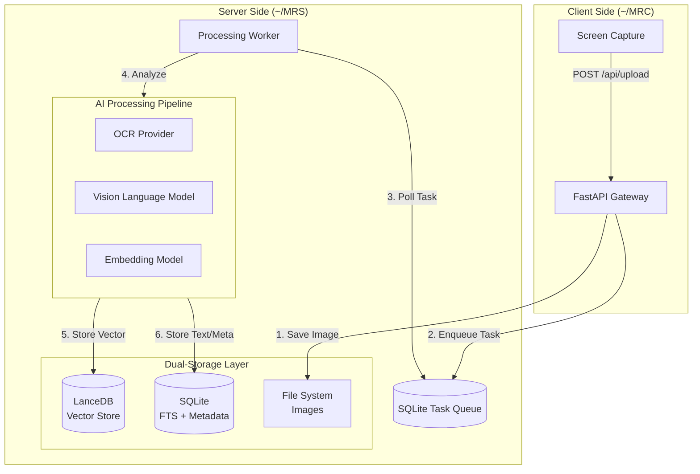
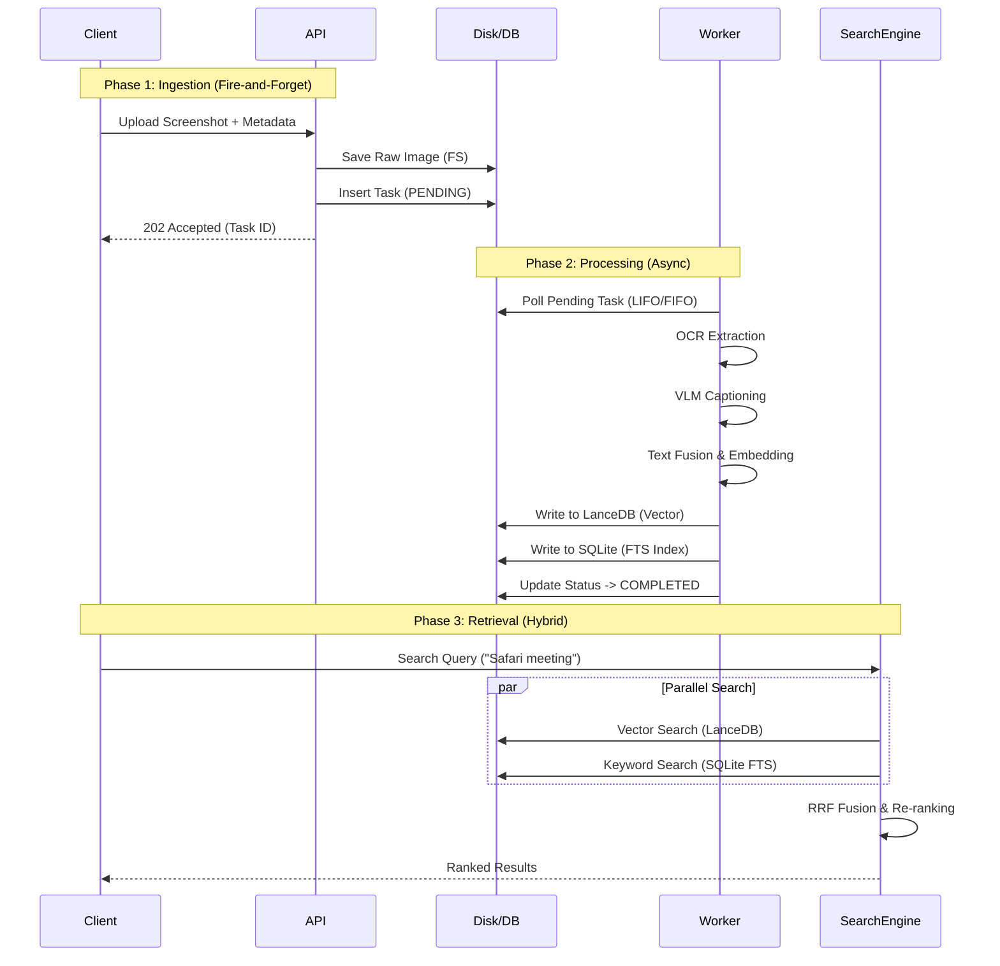

# MyRecall V2 Project Analysis Report

## 1. System Architecture

MyRecall V2 adopts a decoupled Client-Server architecture designed for scalability and data isolation. The system is split into a lightweight collection client and a robust processing server, communicating via a RESTful API.

### 1.1 High-Level Architecture



### 1.2 Data Separation Strategy

To support multi-client setups and clean state management, data directories are strictly separated:

*   **Server Data (`MRS`)**: Located at `~/MRS` (configurable via `OPENRECALL_SERVER_DATA_DIR`). Contains the central databases (`openrecall.db`, `lancedb`), raw screenshot storage, and server logs.
*   **Client Data (`MRC`)**: Located at `~/MRC` (configurable via `OPENRECALL_CLIENT_DATA_DIR`). Contains client-specific configurations and temporary buffers if needed.

---

## 2. Data Flow Analysis

The lifecycle of a memory record ("Snapshot") involves three distinct phases: **Ingestion**, **Processing**, and **Retrieval**.

### 2.1 Lifecycle of a Memory



### 2.2 Data Transformation Map

| Stage | Data Representation | Storage Location |
| :--- | :--- | :--- |
| **1. Input** | Raw PNG Bytes + JSON Metadata | RAM (API) |
| **2. Persisted** | File (`timestamp.png`) + DB Row (`PENDING`) | `~/MRS/screenshots/` + SQLite |
| **3. Extracted** | Raw Text Strings | RAM (Worker) |
| **4. Analyzed** | Structured Caption (`summary`, `scene`, `action`) | RAM (Worker) |
| **5. Fused** | "Fusion Text" (Metadata + OCR + Caption) | RAM (Worker) |
| **6. Vectorized** | 1024-dim Float32 Array | LanceDB |
| **7. Indexed** | Inverted Index (Tokens) | SQLite FTS5 |

---

## 3. Pipeline Deep Dive

### 3.1 Ingestion Pipeline (`api.py`)
The ingestion layer is optimized for **low latency**.
-   **Blocking Operations**: Minimal. Only file I/O (saving the image) and a single lightweight SQL insert happen synchronously.
-   **Response**: Returns immediately after persistence. AI processing is fully decoupled.

### 3.2 Processing Pipeline (`worker.py`)
The `ProcessingWorker` runs as a background daemon, consuming tasks from the SQLite queue. It implements a robust "Dual-Write" strategy to ensure data consistency between the vector store and relational database.

#### 3.2.1 Queue Strategy (Dynamic Priority)
*   **LIFO Mode (Newest First)**: Activated when `Queue Size >= 10`. This prioritization ensures that the user's most recent screenshots appear in search results almost immediately, preventing a backlog from stalling the "live" experience.
*   **FIFO Mode (Oldest First)**: Activated when `Queue Size < 10`. This mode clears out older tasks when the system is under low load.

#### 3.2.2 Pipeline Steps (Detailed)

1.  **OCR Extraction (`ocr_provider`)**:
    *   The raw image path is passed to the configured OCR provider (e.g., Apple Vision Framework on macOS or Tesseract).
    *   Returns raw text strings found in the image.

2.  **Vision Analysis (`ai_provider`)**:
    *   The image is sent to a Vision Language Model (VLM).
    *   **Output**: A structured JSON object containing:
        *   `caption`: A descriptive summary of the visual content.
        *   `scene`: A high-level tag (e.g., "coding", "meeting", "browsing").
        *   `action`: The inferred user activity (e.g., "debugging", "writing email").
    *   **Fallback**: If the AI provider fails, empty strings are used to prevent pipeline blockage.

3.  **Keyword Extraction (`KeywordExtractor`)**:
    *   **Algorithm**: Local regex-based extraction.
    *   **Process**:
        1.  Tokenizes OCR text (lowercase, word characters only).
        2.  Filters out stopwords (common English words + programming keywords like `def`, `class`).
        3.  Filters out short words (< 3 chars) and pure digits.
        4.  Returns the top 10 most frequent terms.

4.  **Data Fusion (`build_fusion_text`)**:
    *   Constructs a single, rich text block for embedding. This "Fusion Text" ensures the embedding model "sees" all context types.
    *   **Format**:
        ```text
        [APP] VS Code
        [TITLE] worker.py - MyRecall
        [SCENE] coding
        [ACTION] debugging
        [CAPTION] A screenshot of Python code showing a class definition.
        [KEYWORDS] python, class, worker, thread
        [OCR_HEAD] import logging... (first 300 chars)
        ```

5.  **Vector Embedding (`embedding_provider`)**:
    *   The Fusion Text is sent to the embedding model (default: `qwen-text-v1`).
    *   **Output**: A fixed-size float32 vector (Dimension: 1024).

6.  **Dual-Write Persistence**:
    *   **LanceDB**: Stores the `SemanticSnapshot` (Vector + structured metadata).
    *   **SQLite**:
        *   Updates the `entries` table with status `COMPLETED`.
        *   Updates the `ocr_fts` virtual table for keyword search.
    *   *Note*: While not strictly transactional across two DBs, the worker handles failures by marking the task as `FAILED` if either write fails, allowing for retry logic.

### 3.3 Search Pipeline (`engine.py`)
The search engine employs a **Hybrid Reciprocal Rank Fusion (RRF)** strategy, merging semantic understanding with precise keyword matching.

#### 3.3.1 Query Parsing (`QueryParser`)
Before searching, the user query is parsed to extract intent:
*   **Mandatory Keywords**: Text inside double quotes (e.g., `"error 500"`) is treated as a required exact match.
*   **Time Filters**: Natural language terms like "today", "yesterday", or "last week" are converted into Unix timestamp ranges (`start_time`, `end_time`).

#### 3.3.2 Parallel Retrieval
Two searches are executed in parallel:
1.  **Vector Search (Semantic)**:
    *   Query text is embedded into a 1024d vector.
    *   LanceDB finds the nearest neighbors (Cosine Similarity).
    *   *Goal*: Find concepts (e.g., "coding" finds "Python script").
2.  **FTS Search (Keyword)**:
    *   SQLite FTS5 executes a BM25 query on OCR text, captions, and keywords.
    *   *Goal*: Find exact strings (e.g., specific variable names or error codes).

#### 3.3.3 Hybrid Fusion Algorithm
The results are merged using a custom scoring formula:

1.  **Base Score**: Derived from the Vector Similarity score (0.0 to 1.0).
2.  **Rescue Mechanism (FTS-Only)**:
    *   If a result is found in FTS but *not* in the Vector results, it is "rescued" and added to the list.
    *   **Base Score**: Assigned a low fixed score of **0.2**.
    *   *Why?* Ensures that specific keyword matches (like a unique ID) are never lost, even if the embedding model thinks they are semantically irrelevant.
3.  **Boosting (FTS Overlap)**:
    *   If a result appears in *both* lists, its score is boosted.
    *   **Formula**:
        $$ Score_{final} = Score_{vector} + 0.3 \times (1.0 - \frac{Rank_{fts}}{Count_{fts}}) $$
    *   *Effect*: A semantic match that also has a high-ranking keyword match gets a significant score bump (up to +0.3).

This approach prioritizes semantic relevance but guarantees that exact keyword matches can "tip the scales" or rescue otherwise missed results.

---

## 4. Schema Design

### 4.1 Relational Schema (SQLite)

**Table: `entries`** (Task Management & Metadata)
| Column | Type | Description |
| :--- | :--- | :--- |
| `id` | UUID | Primary Key |
| `timestamp` | REAL | Unique Unix timestamp |
| `status` | TEXT | State: `PENDING`, `PROCESSING`, `COMPLETED`, `FAILED` |
| `app` | TEXT | Application Name (e.g., "VS Code") |
| `title` | TEXT | Window Title |
| `text` | TEXT | Raw OCR Output |
| `description`| TEXT | AI Generated Caption |

**Table: `ocr_fts`** (Full-Text Search Index)
-   Virtual table using `FTS5` extension.
-   Indexed Columns: `ocr_text`, `caption`, `keywords`.

### 4.2 Vector Schema (LanceDB)

**Model: `SemanticSnapshot`**
```json
{
  "id": "uuid-string",
  "context": {
    "app_name": "string",
    "window_title": "string",
    "timestamp": float,
    "time_bucket": "YYYY-MM-DD-HH"
  },
  "content": {
    "ocr_text": "string",
    "caption": "string",
    "keywords": ["list", "of", "strings"],
    "scene_tag": "string"
  },
  "embedding_vector": [0.0, ..., 0.0]  // 1024 floats
}
```

---

## 5. Technology Stack & Configuration

### 5.1 Core Stack
-   **Framework**: FastAPI (Server), Pydantic V2 (Validation).
-   **Database**: SQLite (Relational), LanceDB (Vector).
-   **ORM**: Peewee (SQLite Interaction).

### 5.2 AI Models (Default)
-   **Embedding**: `qwen-text-v1` (1024 dimensions).
-   **Vision/OCR**: Local providers (extensible to OpenAI/Ollama).

### 5.3 Configuration (`config.py`)
-   **Path Management**: All paths are resolved to absolute paths using `pathlib.Path.expanduser().resolve()`.
-   **Environment Variables**:
    -   `OPENRECALL_SERVER_DATA_DIR`: Overrides `~/MRS`.
    -   `OPENRECALL_CLIENT_DATA_DIR`: Overrides `~/MRC`.
    -   `OPENRECALL_AI_PROVIDER`: Selects the backend (e.g., `local`, `openai`).
