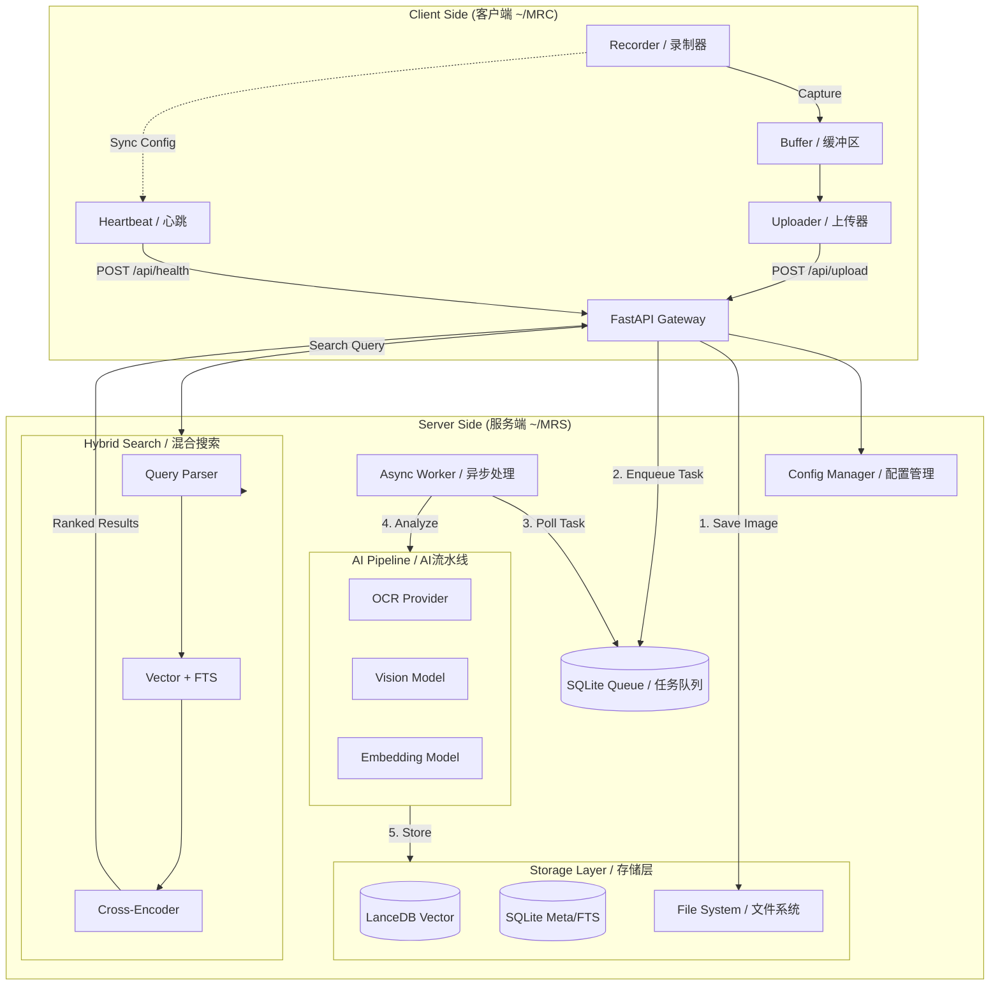
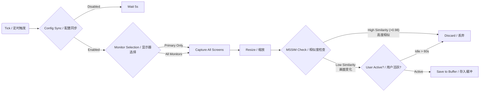
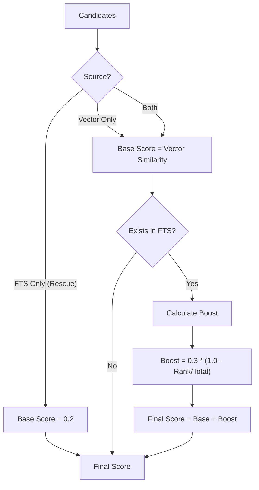

# MyRecall V2 Project Analysis Report / 项目分析报告

## 1. System Architecture / 系统架构

MyRecall V2 adopts a decoupled **Client-Server Architecture**, designed for high scalability and strict data isolation.
MyRecall V2 采用解耦的 **客户端-服务端架构**，旨在实现高扩展性和严格的数据隔离。

### 1.1 High-Level Overview / 宏观架构图



### 1.2 Component Roles / 组件角色

*   **Client (客户端)**: Lightweight and resilient. Focuses on capturing screen data, deduplicating frames, and ensuring data delivery even in unstable network conditions.
    *   **客户端**: 轻量且健壮。专注于屏幕捕获、帧去重，并确保在网络不稳定时的可靠数据传输。
*   **Server (服务端)**: Heavy lifting. Handles AI processing, indexing, and complex search queries.
    *   **服务端**: 负责核心计算。处理 AI 分析、索引构建以及复杂的搜索请求。

---

## 2. Client-Side Mechanics / 客户端机制深度解析

The client is designed to be "always-on" but resource-efficient.
客户端设计为“常驻运行”但资源占用极低。

### 2.1 Capture & Filter Logic / 捕获与过滤逻辑



*   **Heartbeat & Config Sync**: Before capturing, the client checks the `recording_enabled` flag synced from the server.
    *   **心跳与配置同步**: 每次捕获前，客户端会检查从服务端同步来的 `recording_enabled` 标志。
*   **Monitor Selection**: Captures either the primary monitor or all monitors based on `OPENRECALL_PRIMARY_MONITOR_ONLY` setting.
    *   **显示器选择**: 根据配置决定是仅捕获主显示器还是所有显示器。
*   **MSSIM Deduplication**: Instead of saving every frame, the client calculates the **Mean Structural Similarity (MSSIM)** between the current and previous frame. Only frames with significant changes are kept.
    *   **MSSIM 去重**: 客户端不盲目保存每一帧，而是计算当前帧与上一帧的 **平均结构相似性 (MSSIM)**。只有画面发生显著变化时才会被保留。
*   **Idle Detection**: Pauses recording when no mouse/keyboard activity is detected for a set period (default 60s).
    *   **闲置检测**: 当检测到一段时间（默认60秒）没有鼠标/键盘活动时，暂停录制以节省空间。

### 2.2 Resilient Buffering / 健壮的缓冲机制

*   **Atomic Writes**: Metadata is written to `.json.tmp` first, then renamed to `.json`. This prevents corrupted files if the app crashes mid-write.
    *   **原子写入**: 元数据先写入 `.json.tmp`，完成后重命名为 `.json`。防止写入中途崩溃导致文件损坏。
*   **Offline Queue**: If the server is down, data accumulates in `~/MRC/buffer`. The `Uploader` retries indefinitely until the server is reachable.
    *   **离线队列**: 若服务端宕机，数据会堆积在 `~/MRC/buffer`。`Uploader` 会无限重试直到服务恢复，确保**零数据丢失**。

---

## 3. Server Processing Pipeline / 服务端处理流水线 (Strictly Verified)

The server pipeline transforms raw images into searchable semantic data through a multi-stage process.
服务端流水线通过多阶段处理，将原始图像转化为可搜索的语义数据。

### 3.1 Task Queue & Flow Control / 任务队列与流控

*   **State Machine (状态机)**: Tasks transition through `PENDING` (Waiting) -> `PROCESSING` (Locked) -> `COMPLETED` or `FAILED`.
    *   **状态流转**: 任务状态从 `PENDING` (等待) -> `PROCESSING` (锁定) -> `COMPLETED` (完成) 或 `FAILED` (失败)。

    ```mermaid
    stateDiagram-v2
        [*] --> PENDING: New Task
        PENDING --> PROCESSING: Worker Locks
        PROCESSING --> COMPLETED: Success
        PROCESSING --> FAILED: Error
        FAILED --> PENDING: Retry Policy
        COMPLETED --> [*]
    ```

*   **Dynamic Queue Strategy (动态队列策略)**:
    *   **LIFO (Burst Mode)**: When the queue backlog exceeds `lifo_threshold` (default 10), the worker processes the **newest** tasks first (`ORDER BY timestamp DESC`). This ensures recent user activity is indexed immediately.
        *   **LIFO (爆发模式)**: 当队列积压超过阈值（默认10）时，优先处理**最新**任务。保证用户刚发生的操作能被立即搜索到。
    *   **FIFO (Catch-up Mode)**: Standard processing for backlog clearing during idle times (`ORDER BY timestamp ASC`).
        *   **FIFO (追赶模式)**: 标准模式，在空闲时按顺序处理积压的历史任务。

    ```mermaid
    flowchart TD
        Start[Worker Loop] --> CheckCount{Queue Size > Threshold?}
        
        CheckCount -- "Yes (Burst Mode)" --> LIFO[LIFO Strategy]
        LIFO --> GetNew[Pop NEWEST Task]
        GetNew --> Note1[Prioritize User's Current Context]
        
        CheckCount -- "No (Catch-up Mode)" --> FIFO[FIFO Strategy]
        FIFO --> GetOld[Pop OLDEST Task]
        GetOld --> Note2[Clear Backlog History]
        
        GetNew --> Process[Execute AI Pipeline]
        GetOld --> Process
    ```

*   **Concurrency Control (并发控制)**: Uses SQLite atomic updates to "lock" tasks, preventing multiple workers from processing the same image.
    *   **并发控制**: 使用 SQLite 原子更新锁定任务，防止多 Worker 争抢同一图片。

### 3.2 AI Processing Implementation / AI 处理链实现

```mermaid
flowchart TD
    Input[Raw Screenshot] --> Parallel_Start
    
    subgraph OCR_Branch [OCR Extraction]
        Native{OS Native API?}
        Native -- Yes --> Apple[Apple Vision]
        Native -- No --> Tesseract[Tesseract / EasyOCR]
        Apple --> OCR_Text
        Tesseract --> OCR_Text
    end
    
    subgraph VLM_Branch [Visual Understanding]
        Model[Qwen-VL / OpenAI] --> Prompt[Strict JSON Prompt]
        Prompt --> Raw_Res[Raw Response]
        Raw_Res --> Clean[Strip Markdown/Regex]
        Clean --> JSON[Structured Data\n(Scene, Action, Caption)]
    end
    
    Parallel_Start --> OCR_Branch
    Parallel_Start --> VLM_Branch
    
    OCR_Text --> Fusion[Data Fusion Builder]
    JSON --> Fusion
    Meta[Metadata\n(App, Window Title, Time)] --> Fusion
    
    Fusion --> Result[Fusion Text Block]
    Result --> Note[Input for Embedding Model]
```

1.  **OCR Extraction (文字提取)**:
    *   **Implementation**: Wraps `openrecall.server.ocr` module.
    *   **Strategy**: Uses native OS APIs (Apple Vision on macOS) for speed and privacy, falling back to Tesseract/EasyOCR if unavailable.
    *   **实现**: 封装 `openrecall.server.ocr` 模块。优先使用原生 OS API (如 macOS Apple Vision) 以兼顾速度与隐私，不可用时回退至 Tesseract。

2.  **VLM Analysis (视觉理解)**:
    *   **Model**: Supports `Qwen-VL` (Local) or OpenAI/DashScope (Cloud).
    *   **Prompt Engineering**: Enforces strict JSON output (`caption`, `scene`, `action`) to ensure the response is machine-readable. Includes robustness logic to strip Markdown formatting (```json) from responses.
    *   **VLM 分析**: 支持 Qwen-VL (本地) 或 OpenAI (云端)。通过 Prompt 强制要求输出 JSON 格式，并包含清洗逻辑以移除 Markdown 标记。

3.  **Data Fusion (数据融合)**:
    *   **Function**: `build_fusion_text` in `worker.py`.
    *   **Format**: Explicitly constructs a "Fusion Text" block combining all context layers. This single text block allows the Embedding model to "see" the full picture.
    *   **数据融合**: `worker.py` 中的 `build_fusion_text` 函数显式构建“融合文本”，将所有上下文层（元数据、OCR、AI描述）组合成一个文本块，供 Embedding 模型理解。
    *   **Template / 模板**:
        ```text
        [APP] VS Code
        [TITLE] worker.py - MyRecall
        [SCENE] coding
        [ACTION] debugging
        [CAPTION] A screenshot of Python code showing a class definition.
        [OCR] import logging...
        ```

---

## 4. Hybrid Search Engine / 混合搜索引擎 (Strictly Verified)

The search engine employs a **Weighted Linear Fusion** strategy (not RRF) to balance semantic understanding and exact keyword matching.
搜索引擎采用 **加权线性融合** 策略（而非 RRF），以平衡语义理解与精确关键词匹配。

### 4.1 Search Pipeline Diagram / 搜索流程图

```mermaid
graph TD
    Query[User Query / 用户查询] --> Parser{Query Parser / 查询解析}
    
    Parser --> |Extract Text| Text[Search Text]
    Parser --> |Extract Time| Time[Time Range]
    Parser --> |Extract Keywords| Keys[Mandatory Keywords]
    
    Text --> Vector_Branch
    Text & Keys --> FTS_Branch
    
    subgraph Vector_Branch [Vector Search]
        Embed[Embed Query] --> ANN[LanceDB Search]
        Time --> ANN
        ANN --> Vec_Res[Top 100 (Score/Distance)]
    end
    
    subgraph FTS_Branch [Keyword Search]
        Token[Tokenize] --> BM25[SQLite FTS5]
        BM25 --> FTS_Res[Top 100 (BM25 Score)]
    end
    
    Vec_Res --> Fusion[Stage 2: Weighted Fusion / 加权融合]
    FTS_Res --> Fusion
    
    Fusion --> |Base + Boost| Candidates[Top 30 Candidates]
    
    Candidates --> Context[Build Context\n(Meta + Visual + OCR)]
    Context --> Rerank{Stage 3: Deep Reranking / 深度重排}
    Rerank --> |Cross-Encoder Model| Final[Final Results / 最终结果]
```

### 4.2 Stage 1: Parallel Retrieval / 第一阶段：并行召回

*   **Vector Branch**: Uses LanceDB to find semantically similar images based on Embedding vectors. Good for concepts (e.g., "coding").
    *   **向量分支**: 使用 LanceDB 基于 Embedding 向量查找语义相似的图像。擅长概念搜索（如“编程”）。
*   **FTS Branch**: Uses SQLite FTS5 to find exact keyword matches in OCR text and metadata. Good for identifiers (e.g., "Error 500").
    *   **FTS 分支**: 使用 SQLite FTS5 在 OCR 文本和元数据中查找精确关键词。擅长标识符搜索（如“Error 500”）。

### 4.3 Stage 2: Weighted Linear Fusion / 第二阶段：加权线性融合

**Note**: The system uses a custom weighted boosting algorithm, **NOT** Reciprocal Rank Fusion (RRF).
**注意**: 系统使用自定义的加权提升算法，**而非** RRF。



*   **The Logic (算法逻辑)**:
    1.  **Base Score (基础分)**: 
        *   **Vector Match**: Uses the Cosine Similarity score (0.0 to 1.0).
        *   **FTS Rescue**: If a document is found *only* by keyword search (missed by vector), it gets a fixed `0.2` base score to ensure it enters the candidate pool.
    2.  **Boost Calculation (提升计算)**:
        *   **Goal**: Reward documents that match exact keywords (FTS) in addition to semantic meaning.
        *   **Formula**: $$ Boost = 0.3 \times (1.0 - \frac{Rank_{fts}}{Total_{fts}}) $$
        *   **Explanation**: 
            *   `Rank 0` (Best match) gets nearly `+0.3` score.
            *   `Rank N` (Last match) gets nearly `+0.0` score.
            *   This linear decay ensures high-quality keyword matches significantly influence the ranking.
        *   **Effect**: A semantic match that is also an exact keyword match gets a significant score bump (up to +0.3).
        *   **效果**: 既符合语义又是精确匹配的结果会获得显著加分（最高 +0.3）。

        ```mermaid
        xychart-beta
            title "Impact of FTS Boosting (Linear Decay) / FTS 提升效果 (线性衰减)"
            x-axis [Rank 1, Rank 10, Rank 20, Rank 30]
            y-axis "Boost Score" 0 --> 0.3
            bar [0.30, 0.20, 0.10, 0.00]
        ```


### 4.4 Stage 3: Deep Reranking / 第三阶段：深度重排

*   **Model**: Cross-Encoder (`Qwen/Qwen3-Reranker-0.6B`).
*   **Context Construction (上下文构建)**:
    The reranker sees a richer context than the embedding model.
    Reranker 模型会看到比 Embedding 模型更丰富的上下文。
    
    **Template / 模板代码**:
    ```python
    def construct_rerank_context(snapshot):
        return f"""
    [Metadata]
    App: {snapshot.context.app_name}
    Title: {snapshot.context.window_title}
    Time: {formatted_time}

    [Visual Context]
    Scene: {snapshot.content.scene_tag}
    Summary: {snapshot.content.caption}

    [OCR Content]
    {snapshot.content.ocr_text}
    """
    ```

*   **Scoring (打分)**:
    *   The model inputs `(Query, Context)` pairs and outputs a relevance probability (0-1).
    *   This score **overwrites** the fusion score for the final ranking.
    *   **打分**: 模型输入 (Query, Context) 对，输出相关性概率，该分数直接**覆盖**之前的融合分数。

---

## 5. Data Schema / 数据结构

### 5.1 Relational (SQLite) / 关系型数据
Stored in `~/MRS/db/recall.db`.
存储于 `~/MRS/db/recall.db`。

| Table | Purpose / 用途 | Key Columns / 关键列 |
| :--- | :--- | :--- |
| `entries` | Metadata & Status | `id`, `timestamp`, `app`, `status`, `caption` |
| `ocr_fts` | Full-Text Index | `ocr_text`, `caption`, `keywords` (Virtual Table) |

### 5.2 Vector (LanceDB) / 向量数据
Stored in `~/MRS/lancedb`.
存储于 `~/MRS/lancedb`。

*   **Model**: `SemanticSnapshot`
*   **Dimension**: 1024 (default for `qwen-text-v1`)
*   **Fields**: Contains the Embedding Vector plus a copy of metadata for fast filtering.
    *   **字段**: 包含嵌入向量 (Embedding) 以及元数据的副本，用于快速过滤。

---

## 6. Configuration / 配置说明

Managed via `.env` file or Environment Variables.
通过 `.env` 文件或环境变量管理。

| Variable (变量名) | Description (描述) | Default (默认值) |
| :--- | :--- | :--- |
| `OPENRECALL_SERVER_DATA_DIR` | Server data storage path / 服务端数据存储路径 | `~/MRS` |
| `OPENRECALL_CLIENT_DATA_DIR` | Client data storage path / 客户端数据存储路径 | `~/MRC` |
| `OPENRECALL_AI_PROVIDER` | AI Provider (local/openai) / AI 提供商 | `local` |
| `OPENRECALL_RERANKER_MODE` | Reranker mode (api/local) / 重排模式 | `api` |
| `OPENRECALL_RERANKER_URL` | Reranker API Endpoint / 重排 API 地址 | `http://localhost:8080/rerank` |
