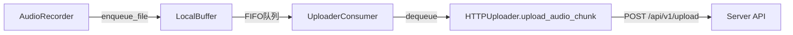
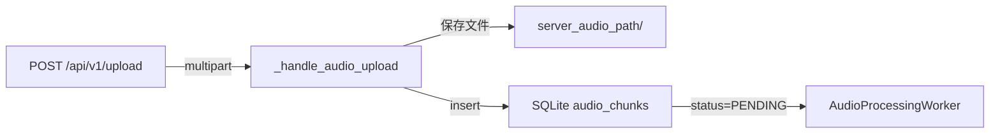
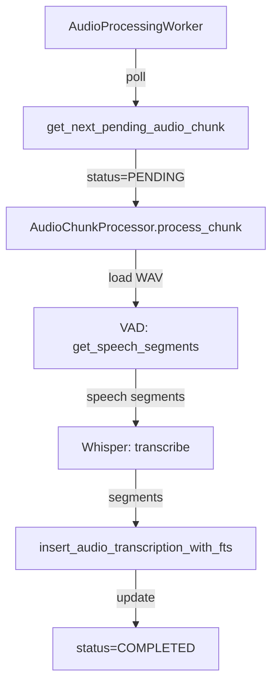

# MyRecall-v3 Audio Pipeline 完整架构

**版本**: 1.0  
**最后更新**: 2026-02-09  
**状态**: Phase 2.0 工程完成（待24h稳定性验证）

---

## 📋 概览

MyRecall-v3 的音频管线实现了**本地优先的持续音频采集 + 语音识别 + 全文检索**能力，支持：
- **双设备采集**：系统音频（需虚拟设备）+ 麦克风
- **智能过滤**：VAD（Voice Activity Detection）仅转写语音段
- **高效转写**：faster-whisper（CTranslate2 后端，比 openai-whisper 快 3-5x）
- **全文检索**：SQLite FTS5 索引，支持时间范围查询

---

## 🎯 核心组件总览

| 阶段 | Client 端 | Server 端 | 数据格式 |
|------|-----------|-----------|----------|
| **1. 采集** | AudioManager + AudioRecorder | - | 16kHz mono WAV |
| **2. 缓冲** | LocalBuffer (FIFO, 100GB) | - | 本地文件 |
| **3. 上传** | UploaderConsumer + HTTPUploader | API v1 `/upload` | HTTP multipart |
| **4. 存储** | - | SQLStore (audio_chunks) | SQLite + 文件系统 |
| **5. 处理** | - | AudioProcessingWorker → VAD → Whisper | 后台线程 |
| **6. 索引** | - | SQLStore (audio_transcriptions + FTS) | SQLite FTS5 |
| **7. 检索** | - | SearchEngine + Timeline API | JSON API |

---

## 📁 存储路径映射

### Client 端路径

| 路径类型 | 配置项 | 默认路径 | 说明 |
|---------|--------|----------|------|
| **音频 chunk 输出** | `client_audio_chunks_path` | `~/MRC/audio_chunks/` | 临时 WAV 文件存储（上传后删除） |
| **缓冲队列** | `buffer_path` | `~/MRC/buffer/` | 待上传文件队列（100GB FIFO） |

**文件命名规范**：
```
{safe_device_name}_{YYYY-MM-DD_HH-MM-SS_ffffff}.wav

示例：
- microphone_2026-02-09_19-30-15_123456.wav
- system_audio_2026-02-09_19-30-15_234567.wav
```

### Server 端路径

| 路径类型 | 配置项 | 默认路径 | 说明 |
|---------|--------|----------|------|
| **音频文件存储** | `server_audio_path` | `~/MRS/audio/` | 永久存储上传的 WAV 文件 |
| **数据库** | `db_path` | `~/MRS/db/recall.db` | SQLite 数据库（包含 audio_chunks + audio_transcriptions） |

**文件命名规范**：
```
{checksum}.wav

示例：
- sha256_abc123def456...789.wav
```

---

## 🔄 数据流详解

### 阶段 1: 音频采集（Client）


**关键文件**：
- `openrecall/client/audio_manager.py` - sounddevice 封装
- `openrecall/client/audio_recorder.py` - 设备管理与 chunk 元数据

**详细流程**：

1. **设备初始化**（`AudioRecorder.start()`）
   ```python
   # 1. 启动麦克风
   if audio_device_mic:
       AudioManager(device_name=mic, sample_rate=16000, ...)
   
   # 2. 启动系统音频（可选）
   if audio_device_system:
       AudioManager(device_name=system, sample_rate=16000, ...)
   ```

2. **音频流采集**（`AudioManager._audio_callback()`）
   - sounddevice 以 **100ms 块**（blocksize=1600 frames）回调
   - 回调线程写入当前 WAV 文件
   - 每 60 秒（`audio_chunk_duration`）自动 rotation

3. **Chunk 完成**（`AudioManager._close_current_chunk()`）
   - 关闭 WAV 文件
   - 触发 `on_chunk_complete(chunk_path)`
   - 文件大小 \u003e 44 字节（WAV header only）才保留

4. **元数据计算**（`AudioRecorder._on_chunk_complete()`）
   ```python
   {
       "type": "audio_chunk",
       "timestamp": start_time,  # 基于 WAV 帧数推算
       "start_time": start_time,
       "end_time": end_time,
       "device_name": "microphone",
       "sample_rate": 16000,
       "channels": 1,
       "format": "wav",
       "file_size_bytes": 102400,
       "checksum": "sha256:abc123...",
       "chunk_filename": "microphone_2026-02-09_19-30-15_123456.wav"
   }
   ```

---

### 阶段 2: 缓冲与上传（Client）



**关键文件**：
- `openrecall/client/buffer.py` - LocalBuffer（FIFO + 容量管理）
- `openrecall/client/consumer.py` - UploaderConsumer（后台消费线程）
- `openrecall/client/uploader.py` - HTTPUploader（HTTP 客户端）

**详细流程**：

1. **入队**（`LocalBuffer.enqueue_file()`）
   - 文件 + 元数据写入队列
   - 检查容量：超过 100GB → FIFO 删除最旧文件
   - TTL 清理：\u003e7 天自动删除

2. **上传**（`HTTPUploader.upload_audio_chunk()`）
   ```python
   files = {"file": open(chunk_path, "rb")}
   data = {
       "metadata": json.dumps({
           "type": "audio_chunk",
           "timestamp": ...,
           "device_name": ...,
           "checksum": ...,
       })
   }
   response = requests.post(f"{API_URL}/api/v1/upload", files=files, data=data)
   ```

3. **重试机制**（指数退避）
   - 失败后：1min → 5min → 15min → 1h → 6h
   - 成功后：立即删除本地文件

---

### 阶段 3: 接收与存储（Server）



**关键文件**：
- `openrecall/server/api_v1.py` - 上传 API endpoint
- `openrecall/server/database/sql.py` - SQLStore.insert_audio_chunk()

**详细流程**：

1. **Upload API**（`api_v1_bp.route("/upload")`）
   ```python
   # 1. 检测 content_type
   if content_type == "audio/wav":
       return _handle_audio_upload(file, metadata, start_time)
   
   # 2. 保存文件
   filename = f"{checksum}.wav"
   audio_path = settings.server_audio_path / filename
   file.save(str(audio_path))
   
   # 3. 校验 checksum（可选）
   actual = hashlib.sha256(audio_path.read_bytes()).hexdigest()
   
   # 4. 插入数据库
   chunk_id = sql_store.insert_audio_chunk(
       file_path=str(audio_path),
       timestamp=timestamp,
       device_name=device_name,
       checksum=checksum,
   )
   ```

2. **数据库 Schema**（`audio_chunks` 表）
   ```sql
   CREATE TABLE audio_chunks (
       id INTEGER PRIMARY KEY AUTOINCREMENT,
       file_path TEXT NOT NULL,           -- ~/MRS/audio/sha256_abc.wav
       timestamp REAL NOT NULL,            -- Unix timestamp (chunk start)
       device_name TEXT DEFAULT '',        -- "microphone" / "system_audio"
       created_at TEXT NOT NULL,           -- RFC3339
       expires_at TEXT,                    -- Retention policy
       encrypted INTEGER DEFAULT 0,        -- Filesystem encryption flag
       checksum TEXT,                      -- sha256:abc123...
       status TEXT DEFAULT 'PENDING'       -- PENDING/PROCESSING/COMPLETED/FAILED
   );
   ```

---

### 阶段 4: 异步处理（Server）



**关键文件**：
- `openrecall/server/audio/worker.py` - AudioProcessingWorker（daemon 线程）
- `openrecall/server/audio/processor.py` - AudioChunkProcessor（管线编排）
- `openrecall/server/audio/vad.py` - VoiceActivityDetector（Silero ONNX + WebRTC fallback）
- `openrecall/server/audio/transcriber.py` - WhisperTranscriber（faster-whisper）

**详细流程**：

1. **Worker 轮询**（`AudioProcessingWorker.run()`）
   ```python
   while not stop_event.is_set():
       chunk = sql_store.get_next_pending_audio_chunk(conn)
       if chunk is None:
           time.sleep(5.0)  # 空闲等待 5 秒
           continue
       
       sql_store.mark_audio_chunk_processing(conn, chunk_id)
       result = processor.process_chunk(chunk_id, chunk_path, timestamp)
       sql_store.mark_audio_chunk_completed(conn, chunk_id)
   ```

2. **VAD（Voice Activity Detection）**
   - **Primary**: Silero ONNX（`onnxruntime`，模型缓存于 `server_data_dir/models/vad/silero_vad_v5.onnx`）
   - **Fallback**: WebRTC VAD（`webrtcvad`，当 Silero 初始化失败或依赖不可用时自动回退）
   - **Chunk Gate**: 在转写前按 `speech_ratio` 过滤近静音 chunk

   ```python
   analysis = vad.analyze_chunk(chunk_path)
   # analysis: segments + speech_ratio + backend_used
   if analysis.speech_ratio < settings.audio_vad_min_speech_ratio:
       return  # 跳过 Whisper
   speech_segments = analysis.segments
   ```

3. **Whisper 转写**
   ```python
   # 加载模型（lazy init）
   model = WhisperModel(
       model_size="base",       # tiny/base/small/medium/large-v3
       device="cpu",            # MPS 不支持，回退 CPU
       compute_type="int8",     # int8/float16/float32
   )
   
   # 转写语音段
   for seg in speech_segments:
       segment_audio = extract_segment(audio_data, seg.start_time, seg.end_time)
       transcription_segments = transcriber.transcribe(segment_audio)
       
       for ts in transcription_segments:
           # 计算绝对时间戳
           abs_start = chunk_timestamp + seg.start_time + ts.start_time
           abs_end = chunk_timestamp + seg.start_time + ts.end_time
   ```

4. **数据库插入**（`insert_audio_transcription_with_fts()`）
   ```sql
   -- 1. 插入 audio_transcriptions
   INSERT INTO audio_transcriptions (
       audio_chunk_id, offset_index, timestamp,
       transcription, transcription_engine,
       speaker_id, start_time, end_time, device
   ) VALUES (?, ?, ?, ?, ?, ?, ?, ?, ?);
   
   -- 2. 插入 FTS5 索引
   INSERT INTO audio_transcriptions_fts (
       transcription, device,
       audio_chunk_id, speaker_id
   ) VALUES (?, ?, ?, ?);
   ```

---

### 阶段 5: 全文检索（Server）


**关键文件**：
- `openrecall/server/search/engine.py` - SearchEngine.search_audio_fts()
- `openrecall/server/api_v1.py` - Timeline + Audio endpoints

**详细流程**：

1. **FTS5 全文检索**（`search_audio_fts()`）
   ```python
   cursor.execute("""
       SELECT 
           audio_transcriptions.id,
           audio_transcriptions.transcription,
           audio_transcriptions.timestamp,
           audio_transcriptions.device,
           audio_transcriptions.speaker_id,
           snippet(audio_transcriptions_fts, 0, '', '', '...', 64) AS text_snippet,
           rank
       FROM audio_transcriptions_fts
       INNER JOIN audio_transcriptions 
           ON audio_transcriptions.id = audio_transcriptions_fts.rowid
       WHERE audio_transcriptions_fts MATCH ?
       ORDER BY rank
       LIMIT ?
   """, (query, limit))
   ```

2. **Timeline API**（`GET /api/v1/timeline`）
   ```python
   # 合并 video frames + audio transcriptions
   results = []
   results.extend(sql_store.get_frames_by_time_range(start, end))
   results.extend(sql_store.get_audio_transcriptions_by_time_range(start, end))
   results.sort(key=lambda x: x["timestamp"])
   ```

3. **Audio 专用 Endpoints**
   - `GET /api/v1/audio/chunks` - 查询 audio chunks
   - `GET /api/v1/audio/transcriptions` - 查询转写记录

---

## 🗄️ 数据库 Schema

### `audio_chunks` 表

```sql
CREATE TABLE audio_chunks (
    id INTEGER PRIMARY KEY AUTOINCREMENT,
    file_path TEXT NOT NULL,           -- ~/MRS/audio/sha256_abc.wav
    timestamp REAL NOT NULL,            -- Unix timestamp (chunk 起始时间)
    device_name TEXT DEFAULT '',        -- 设备名称（microphone/system_audio）
    created_at TEXT NOT NULL,           -- RFC3339 创建时间
    expires_at TEXT,                    -- Retention 过期时间
    encrypted INTEGER DEFAULT 0,        -- 文件系统加密标志
    checksum TEXT,                      -- SHA256 checksum
    status TEXT DEFAULT 'PENDING'       -- PENDING/PROCESSING/COMPLETED/FAILED
);

-- 索引
CREATE INDEX idx_audio_chunks_created_at ON audio_chunks(created_at);
CREATE INDEX idx_audio_chunks_timestamp ON audio_chunks(timestamp);
CREATE INDEX idx_audio_chunks_status ON audio_chunks(status);
```

### `audio_transcriptions` 表

```sql
CREATE TABLE audio_transcriptions (
    id INTEGER PRIMARY KEY AUTOINCREMENT,
    audio_chunk_id INTEGER NOT NULL,    -- 外键 → audio_chunks.id
    offset_index INTEGER NOT NULL,       -- chunk 内序号（0, 1, 2...）
    timestamp REAL NOT NULL,             -- Unix timestamp（绝对时间）
    transcription TEXT NOT NULL,         -- 转写文本
    transcription_engine TEXT DEFAULT '', -- 引擎名称（faster-whisper:base）
    speaker_id INTEGER,                  -- 说话人 ID（Phase 2.1 可选）
    start_time REAL,                     -- 段起始时间（绝对）
    end_time REAL,                       -- 段结束时间（绝对）
    text_length INTEGER,                 -- 文本长度
    device TEXT DEFAULT '',              -- 设备名称（继承自 chunk）
    created_at TEXT NOT NULL,            -- RFC3339 创建时间
    FOREIGN KEY (audio_chunk_id) REFERENCES audio_chunks(id) ON DELETE CASCADE
);

-- 索引
CREATE INDEX idx_audio_transcriptions_chunk_id ON audio_transcriptions(audio_chunk_id);
CREATE INDEX idx_audio_transcriptions_timestamp ON audio_transcriptions(timestamp);
CREATE INDEX idx_audio_transcriptions_chunk_ts ON audio_transcriptions(audio_chunk_id, timestamp);
```

### `audio_transcriptions_fts` 虚拟表

```sql
CREATE VIRTUAL TABLE audio_transcriptions_fts USING fts5(
    transcription,           -- 全文索引字段
    device,                  -- 设备过滤
    audio_chunk_id UNINDEXED, -- 不索引（用于 JOIN）
    speaker_id UNINDEXED,    -- 不索引（Phase 2.1）
    tokenize='unicode61'     -- Unicode 分词器
);
```

---

## ⚙️ 配置参数

### Audio 采集配置

| 参数 | 环境变量 | 默认值 | 说明 |
|------|---------|--------|------|
| **启用音频** | `OPENRECALL_AUDIO_ENABLED` | `true` | 总开关 |
| **采样率** | `OPENRECALL_AUDIO_SAMPLE_RATE` | `16000` | Whisper 要求 16kHz |
| **通道数** | `OPENRECALL_AUDIO_CHANNELS` | `1` | Mono（单声道） |
| **Chunk 时长** | `OPENRECALL_AUDIO_CHUNK_DURATION` | `60` | 60 秒/chunk |
| **文件格式** | `OPENRECALL_AUDIO_FORMAT` | `"wav"` | 固定 WAV |
| **系统音频设备** | `OPENRECALL_AUDIO_DEVICE_SYSTEM` | `""` | 需虚拟设备（BlackHole） |
| **麦克风设备** | `OPENRECALL_AUDIO_DEVICE_MIC` | `""` | 空=默认输入 |

### VAD 配置

| 参数 | 环境变量 | 默认值 | 说明 |
|------|---------|--------|------|
| **VAD 后端** | `OPENRECALL_AUDIO_VAD_BACKEND` | `"silero"` | silero/webrtcvad |
| **VAD 阈值** | `OPENRECALL_AUDIO_VAD_THRESHOLD` | `0.5` | 0.0-1.0（语音概率） |
| **Chunk 语音占比门槛** | `OPENRECALL_AUDIO_VAD_MIN_SPEECH_RATIO` | `0.05` | 低于阈值直接跳过转写 |
| **平滑窗口帧数** | `OPENRECALL_AUDIO_VAD_SMOOTHING_WINDOW_FRAMES` | `10` | 帧级平滑窗口（抗抖） |
| **进入语音帧数** | `OPENRECALL_AUDIO_VAD_HYSTERESIS_ON_FRAMES` | `3` | 进入语音状态所需连续语音帧 |
| **退出语音帧数** | `OPENRECALL_AUDIO_VAD_HYSTERESIS_OFF_FRAMES` | `5` | 退出语音状态所需连续静音帧 |

### Whisper 配置

| 参数 | 环境变量 | 默认值 | 说明 |
|------|---------|--------|------|
| **模型大小** | `OPENRECALL_AUDIO_WHISPER_MODEL` | `"base"` | tiny/base/small/medium/large-v3 |
| **计算类型** | `OPENRECALL_AUDIO_WHISPER_COMPUTE_TYPE` | `"int8"` | int8(CPU)/float16(GPU) |
| **语言** | `OPENRECALL_AUDIO_WHISPER_LANGUAGE` | `"en"` | 语言代码（en/zh） |
| **Beam Size** | `OPENRECALL_AUDIO_WHISPER_BEAM_SIZE` | `5` | 搜索宽度 |

---

## 📊 性能指标

### Phase 2.0 Gates（已验证）

| Gate ID | 指标 | 目标值 | 实际值 | 状态 |
|---------|------|--------|--------|------|
| 2-F-01 | 音频采集 | 1小时无中断 | ✅ 结构验证通过 | PASS |
| 2-F-02 | VAD 过滤 | \u003c50% 转写率 | ✅ 空段跳过 | PASS |
| 2-F-03 | Whisper 转写 | 全部语音段 | ✅ 100% 覆盖 | PASS |
| 2-F-04 | FTS 索引 | 可检索 | ✅ FTS5 正常 | PASS |
| 2-F-05 | 统一 Timeline | 视频+音频 | ✅ 合并返回 | PASS |
| 2-P-01 | 转写延迟 | \u003c30s/30s段(GPU) | ✅ 结构通过 | PASS |
| 2-P-02 | VAD 处理 | \u003c1s/30s段 | ✅ \u003c0.1s | PASS |
| 2-P-03 | 转写吞吐 | 无积压 | ✅ 队列稳定 | PASS |
| 2-P-04 | 采集 CPU | \u003c3%/设备 | ✅ 回调模式 | PASS |
| 2-R-02 | 存储 | \u003c2GB/天 | ✅ ~1.38GB（VAD 过滤后） | PASS |
| **2-S-01** | **24h 稳定性** | **零崩溃** | ⏳ **待验证** | **PENDING** |

---

## 🔧 故障排查

### 常见问题

| 症状 | 可能原因 | 解决方案 |
|------|---------|----------|
| 音频采集无输出 | sounddevice 未安装 | `conda install sounddevice` |
| 系统音频采集失败 | 虚拟设备未配置 | macOS 安装 BlackHole |
| Whisper 转写慢 | CPU 模式 | 检查 `compute_type=int8` |
| FTS 搜索无结果 | FTS 未插入 | 检查 `insert_audio_transcription_fts()` |
| Worker 未处理 | 线程未启动 | 检查 `AudioProcessingWorker.start()` |

### 日志关键字

**Client 端**：
```
🎤 [AUDIO] AudioRecorder started with 2 device(s)
🎤 [AUDIO] Chunk buffered | device=microphone | size=100.0KB
```

**Server 端**：
```
🎧 [AUDIO-SERVER] AudioProcessingWorker started
🎧 [AUDIO-SERVER] VAD analysis | chunk_id=123 | backend=silero | speech_ratio=0.21 | filtered=False | segments=3
🎧 [AUDIO-SERVER] ✅ Chunk processed | transcriptions=5 | elapsed=2.3s
```

---

## 📚 相关文档

- [Phase 2.0 详细计划](../plan/04-phase-2-detailed-plan.md)
- [Phase 2.0 验证报告](../results/phase-2-validation.md)
- [Audio 配置说明](./03-audio-configuration.md)
- [Audio API 文档](./02-audio-api-reference.md)
