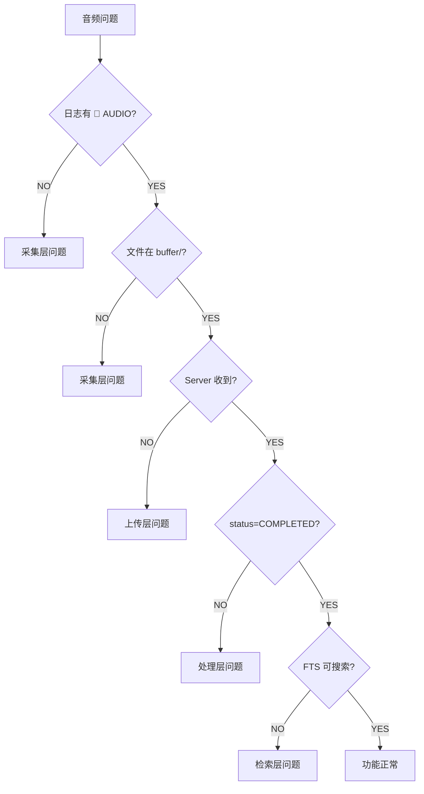

# MyRecall-v3 Audio 故障排查手册

**版本**: 1.0  
**最后更新**: 2026-02-09  
**适用范围**: Phase 2.0 音频系统

---

## 📋 目录

- [1. 故障诊断流程](#1-故障诊断流程)
- [2. 采集问题](#2-采集问题)
- [3. 上传问题](#3-上传问题)
- [4. 处理问题](#4-处理问题)
- [5. 检索问题](#5-检索问题)
- [6. 性能问题](#6-性能问题)
- [7. 诊断工具](#7-诊断工具)
- [8. 常见错误码](#8-常见错误码)

---

## 1. 故障诊断流程

### 1.1 快速定位问题层



### 1.2 分层检查清单

| 层次 | 检查点 | 预期结果 |
|------|--------|----------|
| **1. 采集** | Client 日志有 `🎤 [AUDIO]` | ✅ 每60s一条 "Chunk buffered" |
| **2. 缓冲** | `~/MRC/audio_chunks/` 有文件 | ✅ 文件大小 ~1.9MB |
| **3. 上传** | `~/MRS/audio/` 有文件 | ✅ checksum 命名文件 |
| **4. 存储** | `SELECT * FROM audio_chunks` | ✅ status=PENDING |
| **5. 处理** | Server 日志有 `🎧 [AUDIO-SERVER]` | ✅ "Chunk processed" |
| **6. 索引** | `SELECT * FROM audio_transcriptions_fts` | ✅ 有转写文本 |
| **7. 检索** | `curl .../search?q=test` | ✅ 返回结果 |

---

## 2. 采集问题

### 2.1 症状：无音频输出

**表现**：
- Client 日志无 `🎤 [AUDIO]` 输出
- `~/MRC/audio_chunks/` 目录为空
- 启动日志显示 "Audio disabled"

**诊断步骤**：

```bash
# 1. 检查音频是否启用
grep "OPENRECALL_AUDIO_ENABLED" myrecall_client.env
# 预期: OPENRECALL_AUDIO_ENABLED=true

# 2. 检查启动日志
tail -100 ~/MRC/logs/client.log | grep "AUDIO"
# 预期: 🎤 [AUDIO] AudioRecorder started with N device(s)

# 3. 验证 sounddevice 安装
conda activate v3
python3 -c "import sounddevice as sd; print(sd.__version__)"
# 预期: 0.4.x 版本号

# 4. 列出可用设备
python3 -c "import sounddevice as sd; print(sd.query_devices())"
# 预期: 列出系统音频设备
```

**解决方案**：

| 原因 | 解决方法 |
|------|----------|
| **AUDIO_ENABLED=false** | 修改 `myrecall_client.env`：`OPENRECALL_AUDIO_ENABLED=true` |
| **sounddevice 未安装** | `conda install sounddevice` 或 `pip install sounddevice` |
| **无可用音频设备** | 插入麦克风或配置虚拟设备 |
| **权限不足（macOS）** | System Settings → Privacy → Microphone → 允许终端 |

---

### 2.2 症状：设备未找到

**表现**：
- Client 日志显示 "Device not found" 或 "Invalid device"
- 启动失败并退出

**诊断步骤**：

```bash
# 1. 查看设备配置
echo $OPENRECALL_AUDIO_DEVICE_MIC
echo $OPENRECALL_AUDIO_DEVICE_SYSTEM

# 2. 列出所有设备（带索引）
python3 << 'EOF'
import sounddevice as sd
devices = sd.query_devices()
for i, dev in enumerate(devices):
    print(f"{i}: {dev['name']} ({dev['max_input_channels']} in, {dev['max_output_channels']} out)")
EOF

# 3. 测试设备可用性
python3 << 'EOF'
import sounddevice as sd
device = "MacBook Pro Microphone"  # 替换为你的设备名
try:
    info = sd.query_devices(device)
    print(f"✅ Device found: {info}")
except Exception as e:
    print(f"❌ Error: {e}")
EOF
```

**解决方案**：

| 原因 | 解决方法 |
|------|----------|
| **设备名称拼写错误** | 使用精确设备名（或部分匹配） |
| **设备索引变化** | 使用设备名而非索引（索引会变） |
| **设备被占用** | 关闭其他使用音频的应用（Zoom、Teams） |
| **虚拟设备未安装** | macOS: 安装 BlackHole，Windows: 安装 VB-Audio Cable |

**推荐配置**：

```bash
# 使用默认麦克风（最稳定）
export OPENRECALL_AUDIO_DEVICE_MIC=""

# 如需指定设备，使用部分匹配
export OPENRECALL_AUDIO_DEVICE_MIC="MacBook"  # 匹配 "MacBook Pro Microphone"
```

---

### 2.3 症状：音频文件过小或为空

**表现**：
- 文件大小 = 44 bytes（仅 WAV header）
- 日志显示 "Empty chunk discarded"

**诊断步骤**：

```bash
# 1. 检查文件大小
ls -lh ~/MRC/audio_chunks/*.wav
# 预期: 每个文件 ~1.9MB（60s chunk）

# 2. 使用 ffprobe 分析音频
ffprobe -v error -show_format -show_streams ~/MRC/audio_chunks/<filename>.wav
# 预期: duration=60.0, sample_rate=16000, channels=1

# 3. 查看采集日志
tail -f ~/MRC/logs/client.log | grep "audio_callback"
# 预期: 每100ms一条回调日志（DEBUG模式）

# 4. 测试设备录音
python3 << 'EOF'
import sounddevice as sd
import numpy as np

duration = 5  # 录5秒测试
recording = sd.rec(int(duration * 16000), samplerate=16000, channels=1, dtype='int16')
sd.wait()
print(f"录音完成，数据量: {len(recording)} samples")
print(f"非零样本: {np.count_nonzero(recording)}")
EOF
# 预期: 非零样本 > 0
```

**解决方案**：

| 原因 | 解决方法 |
|------|----------|
| **麦克风静音** | 检查系统音量设置，取消静音 |
| **设备无输入** | 确认麦克风接入，说话测试 |
| **采样率不匹配** | 保持 `OPENRECALL_AUDIO_SAMPLE_RATE=16000` |
| **回调线程崩溃** | 查看 Client 日志完整错误栈 |

---

### 2.4 症状：音频断续或有杂音

**表现**：
- 播放录音有卡顿
- 日志显示 "input overflow" 或 "buffer underrun"

**诊断步骤**：

```bash
# 1. 检查 CPU 占用
top -pid $(pgrep -f "run_client")
# 预期: CPU < 5%

# 2. 查看系统负载
uptime
# 预期: load average < CPU 核心数

# 3. 检查磁盘 I/O
iostat -d 1 5
# 预期: 写入速度稳定

# 4. 查看 sounddevice 缓冲区日志
tail -f ~/MRC/logs/client.log | grep "overflow\|underrun"
```

**解决方案**：

| 原因 | 解决方法 |
|------|----------|
| **CPU 过载** | 关闭其他应用，降低视频 FPS |
| **磁盘慢** | 使用 SSD，检查磁盘健康 |
| **USB 麦克风问题** | 使用 USB 3.0 接口，避免 USB hub |
| **blocksize 过小** | 当前固定 1600 frames（100ms），无需调整 |

---

## 3. 上传问题

### 3.1 症状：文件堆积在 buffer

**表现**：
- `~/MRC/buffer/` 文件数持续增长
- `~/MRS/audio/` 无新文件
- Client 日志显示 "Upload failed" 或 "Connection refused"

**诊断步骤**：

```bash
# 1. 检查 buffer 队列状态
ls -1 ~/MRC/buffer/*.wav | wc -l
# 正常值: < 10（网络良好时）

# 2. 验证 API 连通性
curl -I http://localhost:18083/api/v1/upload
# 预期: HTTP/1.1 200 OK 或 405 Method Not Allowed（GET 不支持）

# 3. 测试上传接口
curl -X POST http://localhost:18083/api/v1/upload \
  -F "file=@/path/to/test.wav" \
  -F 'metadata={"type":"audio_chunk","timestamp":1234567890}'
# 预期: 返回 chunk_id

# 4. 查看上传日志
tail -f ~/MRC/logs/client.log | grep "upload\|Upload"
# 预期: "✅ Upload successful"

# 5. 检查 Server 是否运行
curl http://localhost:18083/api/health
# 预期: {"status":"ok"}
```

**解决方案**：

| 原因 | 解决方法 |
|------|----------|
| **Server 未启动** | 启动 Server：`./run_server.sh` |
| **端口不匹配** | 确认 `OPENRECALL_API_URL` 和 `OPENRECALL_PORT` 一致 |
| **网络隔离** | 检查防火墙，测试 `telnet localhost 18083` |
| **Server 响应慢** | 增加 `OPENRECALL_UPLOAD_TIMEOUT=600` |
| **磁盘满（Server）** | 清理 `~/MRS/`，检查 `df -h` |

---

### 3.2 症状：上传超时

**表现**：
- Client 日志显示 "Upload timeout after 300s"
- 大文件上传失败（4K 视频 + 音频）

**诊断步骤**：

```bash
# 1. 检查超时配置
echo $OPENRECALL_UPLOAD_TIMEOUT
# 默认: 300（5分钟）

# 2. 测试实际上传速度
time curl -X POST http://localhost:18083/api/v1/upload \
  -F "file=@~/MRC/audio_chunks/<filename>.wav" \
  -F 'metadata={...}'
# 记录实际耗时

# 3. 检查网络带宽（远程 Server）
iperf3 -c <server_ip>
# 预期: > 10 Mbps

# 4. 查看 Server 接收日志
tail -f ~/MRS/logs/server.log | grep "upload"
```

**解决方案**：

| 场景 | 解决方法 |
|------|----------|
| **本地部署超时** | 检查 Server 磁盘写入速度，可能磁盘故障 |
| **远程部署超时** | 增加超时：`OPENRECALL_UPLOAD_TIMEOUT=1800`（30min） |
| **网络抖动** | 配置重试策略（已内置指数退避） |
| **并发上传过多** | 降低 `buffer_consumer_threads`（当前固定1） |

---

### 3.3 症状：Checksum 不匹配

**表现**：
- Server 日志显示 "Checksum mismatch"
- 上传失败但文件已传输

**诊断步骤**：

```bash
# 1. 计算本地 checksum
sha256sum ~/MRC/audio_chunks/<filename>.wav

# 2. 对比 Server 端文件
ssh user@server "sha256sum ~/MRS/audio/<checksum>.wav"

# 3. 检查文件完整性
ffprobe ~/MRC/audio_chunks/<filename>.wav
ffprobe ~/MRS/audio/<checksum>.wav

# 4. 查看传输日志
tail -f ~/MRC/logs/client.log | grep "checksum"
```

**解决方案**：

| 原因 | 解决方法 |
|------|----------|
| **文件传输中损坏** | 检查网络质量，使用有线连接 |
| **磁盘错误** | 运行磁盘检查：`fsck`（Linux）或磁盘工具（macOS） |
| **边录边传** | 当前设计不会发生（录完才上传） |
| **多端同时写** | 确保只有一个 Client 实例运行 |

---

## 4. 处理问题

### 4.1 症状：Worker 未处理

**表现**：
- `audio_chunks` 表中 status=PENDING 持续增长
- Server 日志无 `🎧 [AUDIO-SERVER]` 输出
- `/api/v1/queue/status` 显示 pending_audio_chunks 增加

**诊断步骤**：

```bash
# 1. 检查 Worker 状态
curl http://localhost:18083/api/v1/queue/status | jq
# 查看 pending_audio_chunks 和 failed_audio_chunks

# 2. 查看 Server 启动日志
head -50 ~/MRS/logs/server.log | grep "AudioProcessingWorker"
# 预期: "🎧 [AUDIO-SERVER] AudioProcessingWorker started"

# 3. 检查数据库
sqlite3 ~/MRS/db/recall.db << 'SQL'
SELECT status, COUNT(*) FROM audio_chunks GROUP BY status;
SQL
# 预期: PENDING/PROCESSING/COMPLETED 分布

# 4. 查看 Worker 轮询日志
tail -f ~/MRS/logs/server.log | grep "Polling for pending"
# 预期: 每5秒一条（空闲时）

# 5. 检查线程存活
ps aux | grep run_server | grep -v grep
pstree -p $(pgrep -f run_server)
# 预期: 看到子线程
```

**解决方案**：

| 原因 | 解决方法 |
|------|----------|
| **Worker 未启动** | 检查 Server 启动错误，查看完整日志 |
| **Worker 崩溃** | 查找异常栈，修复 bug 或提 issue |
| **数据库锁** | 检查是否有其他进程占用 DB：`lsof ~/MRS/db/recall.db` |
| **模型加载失败** | 查看 Whisper/VAD 加载日志，检查网络（torch.hub） |

---

### 4.2 症状：VAD 过滤所有音频

**表现**：
- status=COMPLETED 但无 transcription
- 日志显示 "No speech detected" 或 "All segments skipped"

**诊断步骤**：

```bash
# 1. 检查 VAD 配置
grep "VAD" myrecall_server.env
# 确认: OPENRECALL_AUDIO_VAD_THRESHOLD=0.5

# 2. 手动测试 VAD
python3 << 'EOF'
from openrecall.server.audio.vad import VoiceActivityDetector
vad = VoiceActivityDetector(backend="silero", threshold=0.5)
segments = vad.get_speech_segments("~/MRS/audio/<checksum>.wav")
print(f"检测到 {len(segments)} 个语音段")
for seg in segments:
    print(f"  {seg.start_time:.2f}s - {seg.end_time:.2f}s")
EOF

# 3. 播放音频验证
ffplay ~/MRS/audio/<checksum>.wav
# 人工确认是否有语音

# 4. 降低阈值重试
export OPENRECALL_AUDIO_VAD_THRESHOLD=0.3
./run_server.sh --debug

# 5. 切换 VAD 后端
export OPENRECALL_AUDIO_VAD_BACKEND=webrtcvad
./run_server.sh --debug
```

**解决方案**：

| 原因 | 解决方法 |
|------|----------|
| **阈值过高** | 降低至 `0.3` 或 `0.2`（嘈杂环境） |
| **音频确实无语音** | 正常行为，检查采集源 |
| **Silero 模型问题** | 切换到 `webrtcvad` fallback |
| **非英文语音** | Silero 支持多语言，无需调整 |

---

### 4.3 症状：Whisper 转写失败

**表现**：
- status=FAILED
- 日志显示 "Transcription error" 或 "Model loading failed"

**诊断步骤**：

```bash
# 1. 查看错误日志
tail -100 ~/MRS/logs/server.log | grep -A 10 "FAILED\|Error"

# 2. 手动测试 Whisper
python3 << 'EOF'
from faster_whisper import WhisperModel
model = WhisperModel("base", device="cpu", compute_type="int8")
segments, info = model.transcribe("~/MRS/audio/<checksum>.wav")
for seg in segments:
    print(f"[{seg.start:.2f}s - {seg.end:.2f}s] {seg.text}")
EOF

# 3. 检查模型下载
ls ~/.cache/huggingface/hub/models--guillaumekln--faster-whisper-*/
# 预期: 看到模型文件

# 4. 测试网络连通性
curl -I https://huggingface.co
# 预期: HTTP/2 200

# 5. 检查磁盘空间
df -h ~/.cache
# 预期: 有足够空间（base 模型 ~140MB）
```

**解决方案**：

| 原因 | 解决方法 |
|------|----------|
| **模型下载失败** | 手动下载或配置 HF_ENDPOINT 镜像 |
| **内存不足** | 降低模型：`OPENRECALL_AUDIO_WHISPER_MODEL=tiny` |
| **GPU 不可用** | 确认 `compute_type=int8`（CPU 模式） |
| **音频格式错误** | 检查 WAV 完整性：`ffprobe <file>` |
| **CTranslate2 版本** | 升级：`pip install -U faster-whisper` |

---

### 4.4 症状：处理速度慢

**表现**：
- 转写延迟 >60s/30s音频
- 队列积压（pending 持续增长）

**诊断步骤**：

```bash
# 1. 测量单个 chunk 处理时间
tail -f ~/MRS/logs/server.log | grep "elapsed"
# 预期: elapsed=10-30s/60s chunk（base 模型）

# 2. 检查 CPU 占用
top -p $(pgrep -f run_server)
# 预期: CPU 100-400%（多线程）

# 3. 查看内存使用
free -h
# 预期: 有足够可用内存（base 模型 ~1GB）

# 4. 测试 Whisper 性能基线
time python3 << 'EOF'
from faster_whisper import WhisperModel
model = WhisperModel("base", device="cpu", compute_type="int8")
segments, _ = model.transcribe("~/MRS/audio/<checksum>.wav")
list(segments)  # 强制执行
EOF
# 预期: real 10-30s（60s 音频）

# 5. 检查模型配置
echo $OPENRECALL_AUDIO_WHISPER_MODEL
echo $OPENRECALL_AUDIO_WHISPER_COMPUTE_TYPE
```

**解决方案**：

| 原因 | 解决方法 |
|------|----------|
| **模型过大** | 降级：`base` → `tiny` |
| **compute_type 不当** | CPU 用 `int8`，GPU 用 `float16` |
| **beam_size 过大** | 降低：`5` → `1` |
| **并发不足** | 增加 Worker：`OPENRECALL_AUDIO_WORKER_THREADS=2` |
| **磁盘 I/O 慢** | 使用 SSD，检查 iostat |

**性能参考**（60s 音频）：

| 配置 | 处理时间 | 适用场景 |
|------|---------|----------|
| **tiny + int8 + beam=1** | ~5s | 实时转写 |
| **base + int8 + beam=5** | ~10s | 默认推荐 |
| **small + float16 + beam=5** | ~5s (GPU) | GPU 环境 |

---

## 5. 检索问题

### 5.1 症状：FTS 搜索无结果

**表现**：
- `GET /api/v1/search?q=...` 返回空数组
- 明确知道音频中有该词

**诊断步骤**：

```bash
# 1. 确认转写已完成
curl "http://localhost:18083/api/v1/audio/transcriptions?limit=10" | jq
# 预期: 返回转写记录

# 2. 检查 FTS 表
sqlite3 ~/MRS/db/recall.db << 'SQL'
SELECT COUNT(*) FROM audio_transcriptions_fts;
SELECT * FROM audio_transcriptions_fts LIMIT 5;
SQL
# 预期: COUNT > 0，有文本内容

# 3. 测试简单查询
curl "http://localhost:18083/api/v1/search?q=the&content_type=audio" | jq
# 预期: 返回结果（"the" 是高频词）

# 4. 直接查询 FTS
sqlite3 ~/MRS/db/recall.db << 'SQL'
SELECT transcription FROM audio_transcriptions_fts 
WHERE audio_transcriptions_fts MATCH 'test' LIMIT 5;
SQL

# 5. 检查 tokenizer
sqlite3 ~/MRS/db/recall.db << 'SQL'
SELECT * FROM audio_transcriptions_fts WHERE audio_transcriptions_fts MATCH 'tokenize="unicode61"';
SQL
```

**解决方案**：

| 原因 | 解决方法 |
|------|----------|
| **FTS 表未插入** | 检查 `insert_audio_transcription_with_fts()` 调用 |
| **查询语法错误** | FTS5 语法：`word`（单词），`"exact phrase"`（短语） |
| **分词问题** | unicode61 对中文支持有限，考虑自定义 tokenizer |
| **大小写敏感** | FTS5 默认不区分大小写，无需调整 |
| **content_type 过滤** | 确认传递 `content_type=audio` 参数 |

**FTS5 查询语法示例**：

```bash
# 单词查询
curl "http://localhost:18083/api/v1/search?q=hello"

# 短语查询（精确匹配）
curl "http://localhost:18083/api/v1/search?q=\"hello world\""

# 布尔查询
curl "http://localhost:18083/api/v1/search?q=hello AND world"
curl "http://localhost:18083/api/v1/search?q=hello OR world"
curl "http://localhost:18083/api/v1/search?q=hello NOT goodbye"

# 前缀查询
curl "http://localhost:18083/api/v1/search?q=hel*"
```

---

### 5.2 症状：Timeline 无音频数据

**表现**：
- `GET /api/v1/timeline` 只返回视频帧
- `content_type` 过滤无效

**诊断步骤**：

```bash
# 1. 测试 Timeline API
curl "http://localhost:18083/api/v1/timeline?start_time=0&end_time=999999999999" | jq

# 2. 单独查询音频
curl "http://localhost:18083/api/v1/audio/transcriptions?limit=100" | jq

# 3. 检查时间范围
sqlite3 ~/MRS/db/recall.db << 'SQL'
SELECT MIN(timestamp), MAX(timestamp) FROM audio_transcriptions;
SELECT MIN(timestamp), MAX(timestamp) FROM video_frames;
SQL

# 4. 检查数据合并逻辑
grep -n "get_audio_transcriptions_by_time_range" openrecall/server/api_v1.py
```

**解决方案**：

| 原因 | 解决方法 |
|------|----------|
| **时间范围不对** | 使用实际时间戳：`start_time=<min_ts>&end_time=<max_ts>` |
| **合并逻辑 bug** | 查看 Timeline 实现，确认调用了音频查询 |
| **content_type 过滤** | 不传 `content_type` 或传 `audio` |
| **无转写数据** | 先解决 VAD/Whisper 问题 |

---

### 5.3 症状：搜索结果不准确

**表现**：
- 返回无关结果
- 相关结果未返回

**诊断步骤**：

```bash
# 1. 查看 rank 分数
curl "http://localhost:18083/api/v1/search?q=test" | jq '.[] | {text: .text_snippet, rank: .rank}'

# 2. 测试不同查询模式
curl "http://localhost:18083/api/v1/search?q=test"           # 模糊匹配
curl "http://localhost:18083/api/v1/search?q=\"test\""       # 精确匹配
curl "http://localhost:18083/api/v1/search?q=test*"          # 前缀匹配

# 3. 检查原始转写
sqlite3 ~/MRS/db/recall.db << 'SQL'
SELECT transcription FROM audio_transcriptions LIMIT 10;
SQL

# 4. 分析 Whisper 转写质量
# 播放音频，对比转写文本准确性
```

**解决方案**：

| 原因 | 解决方法 |
|------|----------|
| **Whisper 转写错误** | 升级模型：`tiny` → `base` → `small` |
| **FTS rank 算法** | FTS5 BM25 已优化，无需调整 |
| **语言不匹配** | 设置正确语言：`OPENRECALL_AUDIO_WHISPER_LANGUAGE=zh` |
| **查询词拼写** | 检查查询词是否正确 |

---

## 6. 性能问题

### 6.1 症状：高 CPU 占用

**表现**：
- Server CPU > 80% 持续
- 系统卡顿

**诊断步骤**：

```bash
# 1. 定位高 CPU 进程
top -o %CPU
# 或
htop

# 2. 查看线程分布
ps -eLf | grep run_server | wc -l
# 预期: ~10 线程（含 Flask、Worker、DB）

# 3. 分析 Python profiling
python3 -m cProfile -o profile.stats openrecall/server/app.py
# 需要修改启动脚本

# 4. 查看 Whisper CPU 占用
tail -f ~/MRS/logs/server.log | grep "elapsed"
# 如果 elapsed 时间很长 → CPU 瓶颈
```

**解决方案**：

| 原因 | 解决方法 |
|------|----------|
| **Whisper 模型过大** | 降级模型或增加硬件 |
| **并发 Worker 过多** | 降低 `OPENRECALL_AUDIO_WORKER_THREADS` |
| **VAD 计算密集** | 切换到 `webrtcvad`（更轻量） |
| **FFmpeg 转码** | 视频问题，非音频相关 |

---

### 6.2 症状：高内存占用

**表现**：
- Server 内存 > 8GB
- OOM Killer 触发

**诊断步骤**：

```bash
# 1. 查看进程内存
ps aux | grep run_server | awk '{print $6/1024 " MB"}'

# 2. 分析内存分布
python3 << 'EOF'
import tracemalloc
tracemalloc.start()
# ... 运行 Server 一段时间 ...
snapshot = tracemalloc.take_snapshot()
top_stats = snapshot.statistics('lineno')
for stat in top_stats[:10]:
    print(stat)
EOF

# 3. 检查模型加载
lsof -p $(pgrep -f run_server) | grep "\.pt$\|\.bin$"
# 预期: 看到 Whisper/Silero 模型文件

# 4. 查看 Worker 数量
echo $OPENRECALL_AUDIO_WORKER_THREADS
```

**解决方案**：

| 原因 | 解决方法 |
|------|----------|
| **多 Worker 重复加载模型** | 降低 Worker 数（每个 Worker 独立模型实例） |
| **大模型占用** | 使用 `tiny`（~1GB） 或 `base`（~1GB） |
| **音频 buffer 堆积** | 增加处理速度或限制队列长度 |
| **内存泄漏** | 升级 faster-whisper，检查 PyTorch 版本 |

**内存占用参考**：

| 组件 | 内存占用 |
|------|---------|
| **Silero VAD** | ~200MB |
| **Whisper tiny** | ~1GB |
| **Whisper base** | ~1.5GB |
| **Whisper small** | ~3GB |
| **Flask + DB** | ~500MB |
| **总计（base）** | ~3-4GB |

---

### 6.3 症状：磁盘占用过大

**表现**：
- `~/MRS/audio/` 占用数百 GB
- 磁盘空间不足

**诊断步骤**：

```bash
# 1. 查看磁盘占用
du -sh ~/MRS/audio
du -sh ~/MRS/db

# 2. 统计文件数量
ls -1 ~/MRS/audio/*.wav | wc -l
sqlite3 ~/MRS/db/recall.db "SELECT COUNT(*) FROM audio_chunks;"

# 3. 检查 Retention Policy
sqlite3 ~/MRS/db/recall.db << 'SQL'
SELECT expires_at FROM audio_chunks LIMIT 5;
SQL

# 4. 估算日均增长
# 音频: 2.7 GB/天（24小时 × 60s chunk × 1.9MB）
# 数据库: ~100 MB/天（转写文本）
```

**解决方案**：

| 原因 | 解决方法 |
|------|----------|
| **无 Retention Policy** | 配置过期时间（当前未实现自动删除） |
| **VAD 未过滤** | 确认 VAD 启用，阈值合理 |
| **重复上传** | 检查 checksum 去重逻辑 |
| **手动清理** | 定期删除旧数据：`find ~/MRS/audio -mtime +30 -delete` |

**存储估算**：

| 场景 | 音频数据 | 数据库 | 总计/月 |
|------|---------|--------|---------|
| **24/7 录制（VAD 40%）** | 32.4 GB | 3 GB | **35.4 GB** |
| **工作时间（8h/天）** | 10.8 GB | 1 GB | **11.8 GB** |

---

## 7. 诊断工具

### 7.1 健康检查脚本

```bash
#!/bin/bash
# audio_health_check.sh

echo "=== MyRecall Audio 健康检查 ==="

# 1. Client 采集
echo -n "Client 采集: "
if tail -10 ~/MRC/logs/client.log | grep -q "🎤.*Chunk buffered"; then
    echo "✅ 正常"
else
    echo "❌ 异常"
fi

# 2. 缓冲队列
buffer_count=$(ls -1 ~/MRC/buffer/*.wav 2>/dev/null | wc -l)
echo "缓冲队列: $buffer_count 个文件"
if [ "$buffer_count" -lt 100 ]; then
    echo "  ✅ 正常"
else
    echo "  ⚠️ 积压"
fi

# 3. Server 接收
audio_count=$(sqlite3 ~/MRS/db/recall.db "SELECT COUNT(*) FROM audio_chunks;" 2>/dev/null)
echo "Server 音频: $audio_count 个 chunks"

# 4. Worker 处理
pending=$(sqlite3 ~/MRS/db/recall.db "SELECT COUNT(*) FROM audio_chunks WHERE status='PENDING';" 2>/dev/null)
completed=$(sqlite3 ~/MRS/db/recall.db "SELECT COUNT(*) FROM audio_chunks WHERE status='COMPLETED';" 2>/dev/null)
echo "处理状态: PENDING=$pending, COMPLETED=$completed"
if [ "$pending" -gt 50 ]; then
    echo "  ⚠️ 处理积压"
fi

# 5. FTS 索引
fts_count=$(sqlite3 ~/MRS/db/recall.db "SELECT COUNT(*) FROM audio_transcriptions_fts;" 2>/dev/null)
echo "FTS 索引: $fts_count 条记录"

# 6. 磁盘空间
disk_usage=$(du -sh ~/MRS/audio 2>/dev/null | awk '{print $1}')
echo "磁盘占用: $disk_usage"

echo "=== 检查完成 ==="
```

**使用方法**：

```bash
chmod +x audio_health_check.sh
./audio_health_check.sh
```

---

### 7.2 日志分析工具

```bash
# 统计采集速率（Client）
tail -1000 ~/MRC/logs/client.log | grep "Chunk buffered" | wc -l
# 预期: ~16 条/最近1000行（每60s一条）

# 统计上传成功率（Client）
tail -1000 ~/MRC/logs/client.log | grep -c "✅ Upload successful"
tail -1000 ~/MRC/logs/client.log | grep -c "❌.*upload"
# 计算成功率

# 统计处理延迟（Server）
tail -1000 ~/MRS/logs/server.log | grep "elapsed" | awk -F'elapsed=' '{print $2}' | awk -F's' '{print $1}' | awk '{sum+=$1; n++} END {print "平均延迟: " sum/n "s"}'

# 查找错误（Server）
tail -5000 ~/MRS/logs/server.log | grep -i "error\|exception\|failed" | tail -20
```

---

### 7.3 性能基准测试

```bash
#!/bin/bash
# audio_benchmark.sh

echo "=== Audio 性能基准测试 ==="

# 1. VAD 速度测试
echo "1. VAD 性能测试..."
time python3 << 'EOF'
from openrecall.server.audio.vad import VoiceActivityDetector
vad = VoiceActivityDetector(backend="silero")
vad.get_speech_segments("~/MRS/audio/<test_file>.wav")
EOF

# 2. Whisper 速度测试
echo "2. Whisper 性能测试..."
time python3 << 'EOF'
from faster_whisper import WhisperModel
model = WhisperModel("base", device="cpu", compute_type="int8")
list(model.transcribe("~/MRS/audio/<test_file>.wav")[0])
EOF

# 3. FTS 查询性能
echo "3. FTS 查询性能..."
time sqlite3 ~/MRS/db/recall.db << 'SQL'
SELECT COUNT(*) FROM audio_transcriptions_fts WHERE audio_transcriptions_fts MATCH 'test';
SQL

echo "=== 测试完成 ==="
```

---

## 8. 常见错误码

### 8.1 Client 错误码

| 错误码 | 说明 | 原因 | 解决方法 |
|--------|------|------|----------|
| **DeviceNotFoundError** | 音频设备未找到 | 设备名错误或设备未连接 | 检查设备名，插入设备 |
| **BufferOverflowError** | 缓冲区溢出 | CPU 过载，回调处理慢 | 降低并发，检查 CPU |
| **UploadTimeoutError** | 上传超时 | 网络慢或 Server 无响应 | 增加超时，检查网络 |
| **ChecksumMismatchError** | Checksum 不匹配 | 文件传输损坏 | 重传，检查磁盘 |

### 8.2 Server 错误码

| HTTP 状态码 | 说明 | 原因 | 解决方法 |
|------------|------|------|----------|
| **202** | 已接受，待处理 | 正常（异步处理） | 无需操作 |
| **400** | 请求格式错误 | metadata 格式错误 | 检查 JSON 格式 |
| **409** | 冲突（重复上传） | checksum 已存在 | 正常（去重） |
| **500** | 服务器内部错误 | DB 写入失败等 | 查看 Server 日志 |

### 8.3 Worker 错误日志

| 日志关键字 | 说明 | 解决方法 |
|-----------|------|----------|
| **"Model loading failed"** | Whisper 模型加载失败 | 检查网络，手动下载模型 |
| **"VAD initialization failed"** | VAD 初始化失败 | 切换 backend 或重启 |
| **"Database locked"** | SQLite 锁 | 检查并发访问，增加 timeout |
| **"Out of memory"** | OOM | 降低模型大小或增加内存 |

---

## 📚 相关文档

- [Audio Pipeline 架构](./01-audio-pipeline-overview.md)
- [Audio 配置指南](./03-audio-configuration.md)
- [Audio API 文档](./02-audio-api-reference.md)
- [Audio 性能调优](./05-audio-performance-tuning.md)（待创建）

---

## 🔄 版本历史

| 日期 | 版本 | 变更 |
|------|------|------|
| 2026-02-09 | 1.0 | 初始版本（完整故障排查手册） |
