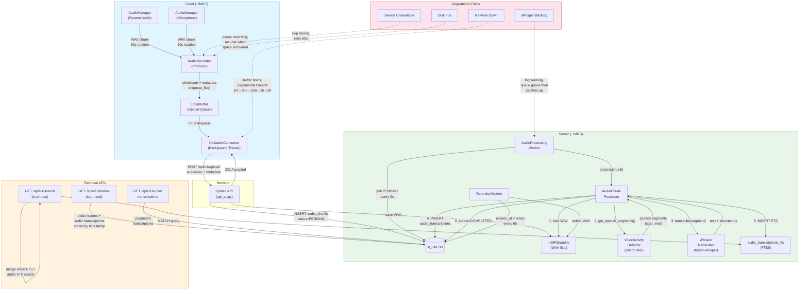

# Phase 2.0 Detailed Plan — Audio MVP (No Speaker ID)

**Phase**: 2.0 (Audio Recording + Transcription + Search)
**Version**: 1.0
**Status**: Frozen Historical Plan (superseded for MVP critical path by ADR-0005)
**Scope Type**: historical
**Superseded By**: ADR-0005 (Vision-only Chat Pivot + Audio Freeze)
**Governed By**: `v3/decisions/ADR-0007-phase-2.6-audio-freeze-governance.md` + `v3/metrics/phase-gates.md`
**Timeline**: Week 7-8 (10 working days, 2026-02-09 to 2026-02-20)
**Owner**: Solo Developer
**Authority**: `v3/metrics/phase-gates.md` (gate thresholds are canonical and immutable)
**ADR References**: ADR-0001 (Python-first), ADR-0002 (Thin client, remote-first API), ADR-0004 (Speaker ID optional), ADR-0007 (Phase 2.6 audio freeze governance)

---

> Historical note: this plan records completed audio engineering work. Under current MVP strategy, audio is frozen and not on the critical path for Phase 3/4/5. Any re-entry, exception, or unfreeze decision must follow Phase 2.6 governance artifacts and gates.

## 1. Goal / Non-Goals

### Goal

Deliver a working audio capture, transcription, and search pipeline that runs alongside the existing video pipeline. At the end of Phase 2.0, a user can record system audio and microphone input continuously, have speech segments automatically transcribed by Whisper, search transcriptions via full-text search, and view audio events interleaved with video frames on a unified timeline.

### Non-Goals

1. **Speaker Identification** — `speaker_id` remains NULL in all `audio_transcriptions` rows. Diarization is deferred to Phase 2.1 (ADR-0004).
2. **Audio-Visual Sync** — No frame-level alignment of audio waveform to video frames. Timeline co-location is by timestamp proximity only.
3. **Audio Embedding / Semantic Search** — No vector embedding of transcriptions. Audio search is FTS5 only (BM25). Semantic search is Phase 3 scope.
4. **Audio Playback UI** — No waveform viewer or in-browser audio player. Web UI shows transcription text only.
5. **Audio Streaming / Real-Time Display** — All processing is batch (chunk-based), not streaming.
6. **Cross-Device Audio Dedup** — Out of scope (Phase 2.1).
7. **Noise Reduction / Audio Enhancement** — Raw audio only; Whisper handles noisy input natively.

---

## 2. Scope (In / Out)

### In Scope

| Area | Deliverable |
|------|-------------|
| **Audio Capture (Client)** | `AudioManager` (sounddevice wrapper), `AudioRecorder` (chunk rotation, metadata, buffer enqueue) |
| **Audio Upload** | Extend `UploaderConsumer` + `HTTPUploader` to route `audio_chunk` type |
| **Server Ingestion** | Extend `POST /api/v1/upload` to detect and store audio WAV files, insert `audio_chunks` row with PENDING status |
| **VAD Filtering** | `VoiceActivityDetector` class using silero-vad (primary) with py-webrtcvad fallback |
| **Whisper Transcription** | `WhisperTranscriber` class using faster-whisper (CTranslate2), CPU and GPU paths |
| **Audio Processing Worker** | `AudioProcessingWorker` (daemon thread polling PENDING audio_chunks) |
| **Audio Chunk Processor** | `AudioChunkProcessor` (VAD filter → Whisper transcribe → write audio_transcriptions + FTS) |
| **FTS Indexing** | Insert into existing `audio_transcriptions_fts` virtual table |
| **Search Extension** | Extend `SearchEngine` and `SQLStore.search_audio_fts()` to include audio FTS results |
| **Timeline Extension** | Extend `GET /api/v1/timeline` to return audio transcriptions alongside video frames |
| **Retention Extension** | Extend `RetentionWorker` to delete expired `audio_chunks` + cascade to `audio_transcriptions` |
| **Configuration** | New settings: audio device names, sample rate, chunk duration, VAD threshold, Whisper model size |
| **Migration** | `v3_006_add_audio_chunk_status.sql` — add `status` column to `audio_chunks` |
| **Tests** | Unit, integration, performance, quality (WER), stability, resource, degradation |
| **Gate Validation** | All Phase 2.0 gates from `phase-gates.md` |

### Out of Scope

| Area | Reason |
|------|--------|
| Speaker diarization | Phase 2.1 (ADR-0004) |
| Audio vector embeddings | Phase 3 |
| Web UI audio player | Phase 3+ |
| Real-time streaming transcription | Batch-only in MVP |
| Audio noise reduction | Whisper handles natively |

---

## 3. Inputs (from Phase 1) / Outputs (for Phase 3/4/5)

### Inputs from Phase 0 + Phase 1

| Input | Source | Used By |
|-------|--------|---------|
| `audio_chunks` table schema | `server/database/migrations/v3_001_add_multimodal_tables.sql` | Server ingestion, worker, retention |
| `audio_transcriptions` table schema | Same migration | Processor write target |
| `audio_transcriptions_fts` FTS5 table | Same migration | Search, FTS indexing |
| `AudioChunk`, `AudioTranscription` Pydantic models | `shared/models.py` | Server API serialization |
| `UploaderConsumer` dispatch pattern | `client/consumer.py` (`item_type` routing) | Audio chunk upload dispatch |
| `HTTPUploader.upload_video_chunk()` pattern | `client/uploader.py` | Template for `upload_audio_chunk()` |
| `VideoProcessingWorker` pattern | `server/video/worker.py` | Template for `AudioProcessingWorker` |
| `VideoChunkProcessor` pattern | `server/video/processor.py` | Template for `AudioChunkProcessor` |
| `RetentionWorker` | `server/retention.py` | Extend for audio cleanup |
| `SearchEngine.search_video_fts()` pattern | `server/search/engine.py` | Template for audio FTS integration |
| Upload API (`POST /api/v1/upload`) | `server/api_v1.py` | Extend for audio MIME detection |
| Timeline API (`GET /api/v1/timeline`) | Same file | Extend for audio events |
| `Settings` (Pydantic config) | `shared/config.py` | Add audio settings |
| `LocalBuffer` + upload queue | `client/buffer.py` | Audio chunk buffering |
| `FFmpegManager` subprocess pattern | `client/ffmpeg_manager.py` | Conceptual reference for AudioManager |
| `MigrationRunner` | `server/database/migrations/runner.py` | Run v3_006 migration |

### Outputs for Phase 3/4/5

| Output | Consumer | Purpose |
|--------|----------|---------|
| `audio_transcriptions` rows with text | Phase 3 Multi-Modal Search | Audio content for unified ranking |
| `audio_transcriptions_fts` indexed text | Phase 3 | BM25 search across audio |
| `GET /api/v1/timeline` with audio events | Phase 3+ Web UI | Interleaved timeline |
| `GET /api/v1/search` with audio results | Phase 3 | Multi-modal search foundation |
| `AudioChunk` / `AudioTranscription` models | Phase 4 Chat | Chat tool can reference audio context |
| Audio retention lifecycle | Phase 5 Deployment | Audio data governed by retention policy |
| Audio processing metrics (latency, throughput) | Phase 5 | Capacity planning for remote deployment |

---

## 4. Week 7-8 Day-by-Day Plan (10 Working Days)

### Day 1 (Mon 2026-02-09): Audio Capture Foundation — Config + AudioManager

**Objective**: Establish configuration settings and the low-level audio device wrapper.

| Task | Details |
|------|---------|
| Add audio settings to `shared/config.py` | `audio_enabled`, `audio_sample_rate` (16000), `audio_channels` (1), `audio_chunk_duration` (60), `audio_device_system`, `audio_device_mic`, `audio_vad_threshold` (0.5), `audio_whisper_model` ("base"), `audio_whisper_compute_type` ("int8"), `audio_whisper_language` ("en"), `audio_whisper_beam_size` (5), `audio_vad_backend` ("silero"), `client_audio_chunks_path`, `server_audio_path` |
| Create `client/audio_manager.py` | `AudioManager` class: wraps `sounddevice.InputStream`, records to WAV 16kHz mono, supports device selection by name/index, exposes `start()`, `stop()`, `is_alive()`, chunk file rotation callbacks |
| Device enumeration utility | `list_audio_devices()` function returning available input devices |
| Unit tests | `tests/test_phase2_audio_manager.py`: device listing, WAV output format validation, start/stop lifecycle, graceful handling of unavailable device |

**Output files**:
- Modified: `openrecall/shared/config.py`
- New: `openrecall/client/audio_manager.py`
- New: `tests/test_phase2_audio_manager.py`

---

### Day 2 (Tue 2026-02-10): AudioRecorder + Client-Side E2E

**Objective**: Build the producer that rotates audio chunks and enqueues them into the upload buffer.

| Task | Details |
|------|---------|
| Create `client/audio_recorder.py` | `AudioRecorder` class: manages one or two `AudioManager` instances (system + mic), rotates chunks every `audio_chunk_duration` seconds, computes SHA256 checksum, creates metadata dict (`type: "audio_chunk"`, `timestamp`, `device_name`, `checksum`), enqueues into `LocalBuffer` via `buffer.enqueue_file()` |
| Extend consumer dispatch | In `client/consumer.py`, add `elif item_type == "audio_chunk"` dispatch branch calling `self.uploader.upload_audio_chunk()` |
| Add `upload_audio_chunk()` to HTTPUploader | In `client/uploader.py`, add method mirroring `upload_video_chunk()` but with MIME `audio/wav` |
| Client-side integration test | `tests/test_phase2_audio_recorder.py`: mock sounddevice, verify chunk files created at correct path, metadata contains required keys, buffer enqueue called, checksum valid |

**Output files**:
- New: `openrecall/client/audio_recorder.py`
- Modified: `openrecall/client/consumer.py`
- Modified: `openrecall/client/uploader.py`
- New: `tests/test_phase2_audio_recorder.py`

---

### Day 3 (Wed 2026-02-11): VAD Integration

**Objective**: Build the Voice Activity Detection module that filters silence from audio chunks.

| Task | Details |
|------|---------|
| Create `server/audio/vad.py` | `VoiceActivityDetector` class: loads Silero VAD model (torch.hub), exposes `has_speech(wav_path) -> bool` (whole-chunk check), `get_speech_segments(wav_path) -> List[SpeechSegment]` (returns list of `(start_time, end_time)` tuples), configurable threshold via `audio_vad_threshold` setting |
| `SpeechSegment` dataclass | `start_time: float`, `end_time: float`, `duration: float` (computed) |
| Fallback to webrtcvad | If Silero VAD load fails (no torch), fall back to `webrtcvad` (C-based, lighter but less accurate). Log warning on fallback. |
| WAV utility helpers | `server/audio/wav_utils.py`: `load_wav_16k(path) -> np.ndarray`, `extract_segment(wav_data, start, end) -> np.ndarray`, `save_segment(wav_data, path)` |
| Unit tests | `tests/test_phase2_vad.py`: speech detection on known speech file, silence-only file returns no segments, threshold tuning, segment boundaries, processing time <1s for 30s audio (gate 2-P-02) |

**Output files**:
- New: `openrecall/server/audio/__init__.py`
- New: `openrecall/server/audio/vad.py`
- New: `openrecall/server/audio/wav_utils.py`
- New: `tests/test_phase2_vad.py`

---

### Day 4 (Thu 2026-02-12): Whisper Transcription Pipeline

**Objective**: Build the transcription engine using faster-whisper.

| Task | Details |
|------|---------|
| Create `server/audio/transcriber.py` | `WhisperTranscriber` class: loads `faster-whisper` model (`WhisperModel(model_size, device, compute_type)`), exposes `transcribe(wav_path_or_array, language="en") -> List[TranscriptionSegment]` returning list of segments with `.text`, `.start`, `.end`, `.confidence` |
| `TranscriptionSegment` dataclass | `text: str`, `start_time: float`, `end_time: float`, `confidence: float` |
| Model caching | Singleton model loader, model stays warm in memory across calls |
| GPU/CPU dispatch | If `settings.device == "cuda"`, use GPU with `compute_type="float16"`; if `mps`, attempt MPS; else CPU with `compute_type="int8"` |
| Unit tests | `tests/test_phase2_transcriber.py`: transcription of known speech file, output format validation, latency measurement (<30s for 30s segment on GPU, <90s on CPU — gate 2-P-01), empty audio returns empty list |

**Output files**:
- New: `openrecall/server/audio/transcriber.py`
- New: `tests/test_phase2_transcriber.py`

---

### Day 5 (Fri 2026-02-13): Server Ingestion + Migration + AudioChunkProcessor

**Objective**: Server can receive audio uploads, store them, and process them through VAD + Whisper.

| Task | Details |
|------|---------|
| Migration `v3_006` | `v3_006_add_audio_chunk_status.sql`: `ALTER TABLE audio_chunks ADD COLUMN status TEXT DEFAULT 'PENDING'` |
| Extend upload API | In `server/api_v1.py`, extend `POST /api/v1/upload` to detect `audio/*` MIME types, save WAV to `settings.server_audio_path`, insert `audio_chunks` row with `status='PENDING'`, return 202 |
| Extend `SQLStore` | Add methods: `insert_audio_chunk()`, `get_pending_audio_chunks()`, `update_audio_chunk_status()`, `insert_audio_transcription()`, `insert_audio_transcription_fts()`, `get_expired_audio_chunks()`, `delete_audio_chunk_cascade()` |
| Create `server/audio/processor.py` | `AudioChunkProcessor` class: `process(audio_chunk_row) -> bool` — (1) load WAV, (2) VAD → speech segments, (3) for each segment: Whisper transcribe, (4) insert `audio_transcriptions` rows + FTS entries, (5) return success. Logs total audio duration vs. transcribed duration for VAD effectiveness metric. |
| Integration test | `tests/test_phase2_ingestion.py`: upload WAV → verify DB row PENDING → process → verify transcriptions in DB + FTS |

**Output files**:
- New: `openrecall/server/database/migrations/v3_006_add_audio_chunk_status.sql`
- Modified: `openrecall/server/api_v1.py`
- Modified: `openrecall/server/database/sql.py`
- New: `openrecall/server/audio/processor.py`
- New: `tests/test_phase2_ingestion.py`

---

### Day 6 (Mon 2026-02-16): Audio Processing Worker + Retention Extension

**Objective**: Background worker processes audio chunks automatically; expired audio is cleaned up.

| Task | Details |
|------|---------|
| Create `server/audio/worker.py` | `AudioProcessingWorker(threading.Thread)`: daemon thread, polls `get_pending_audio_chunks()` every 5s, calls `AudioChunkProcessor.process()`, marks COMPLETED/FAILED, logs queue depth for throughput monitoring. Mirrors `VideoProcessingWorker` pattern. |
| Init audio worker in app startup | In `server/app.py`, add `init_audio_worker()` function; in `server/__main__.py`, call it after `init_video_worker()` and register shutdown handler |
| Extend RetentionWorker | In `server/retention.py`, add `_cleanup_expired_audio_chunks()` method: query `get_expired_audio_chunks()`, delete WAV files, cascade delete from DB (audio_chunks → audio_transcriptions → audio_transcriptions_fts). Call from `run()` loop. |
| Extend SQLStore for retention | `get_expired_audio_chunks()` returns audio_chunks with `expires_at < datetime('now')` and `status != 'PENDING'` |
| Unit/integration tests | `tests/test_phase2_worker.py`: worker picks up PENDING chunk, processes it, marks COMPLETED; FAILED chunk handling; retention deletes expired audio |

**Output files**:
- New: `openrecall/server/audio/worker.py`
- Modified: `openrecall/server/app.py`
- Modified: `openrecall/server/__main__.py`
- Modified: `openrecall/server/retention.py`
- Modified: `openrecall/server/database/sql.py`
- New: `tests/test_phase2_worker.py`

---

### Day 7 (Tue 2026-02-17): Search Extension (Audio FTS)

**Objective**: Audio transcriptions are searchable via the existing search infrastructure.

| Task | Details |
|------|---------|
| Add `search_audio_fts()` to SQLStore | Query `audio_transcriptions_fts` using FTS5 MATCH, join with `audio_transcriptions` for timestamp/metadata, return list of dicts |
| Extend SearchEngine | In `server/search/engine.py`, add audio FTS search block (after video FTS block), merge results with `type: "audio_transcription"` distinguisher |
| Extend search API response | In `server/api_v1.py`, ensure search results serialize audio transcription results with `type: "audio_transcription"` |
| Unit tests | `tests/test_phase2_search.py`: insert audio transcription + FTS entry, search for known phrase, verify result returned with correct metadata |

**Output files**:
- Modified: `openrecall/server/database/sql.py`
- Modified: `openrecall/server/search/engine.py`
- Modified: `openrecall/server/api_v1.py`
- New: `tests/test_phase2_search.py`

---

### Day 8 (Wed 2026-02-18): Unified Timeline API

**Objective**: Timeline API returns both video frames and audio transcriptions in a single sorted stream.

| Task | Details |
|------|---------|
| Add `get_audio_transcriptions_by_time_range()` to SQLStore | Query `audio_transcriptions` joined with `audio_chunks` for a given `(start_time, end_time)` range, return list of dicts |
| Extend `GET /api/v1/timeline` | Fetch video frames (existing) + audio transcriptions (new), merge by timestamp, paginate, return unified response with `type` discriminator |
| Add `GET /api/v1/audio/transcriptions` | Dedicated audio transcriptions endpoint with pagination, time range filtering, optional `device_name` filter |
| Add `GET /api/v1/audio/chunks` | List audio chunks with pagination, status filter |
| Integration test | `tests/test_phase2_timeline.py`: insert video frames + audio transcriptions at overlapping timestamps, call timeline API, verify both types returned in chronological order |

**Output files**:
- Modified: `openrecall/server/database/sql.py`
- Modified: `openrecall/server/api_v1.py`
- New: `tests/test_phase2_timeline.py`

---

### Day 9 (Thu 2026-02-19): Performance Tuning + Quality Testing + Degradation Handlers

**Objective**: Ensure all performance/quality/resource gates can be met; add degradation handling.

| Task | Details |
|------|---------|
| Performance benchmarks | `tests/test_phase2_performance.py`: transcription latency (30s segment), VAD processing time (30s segment), transcription throughput (simulate 1hr), audio capture CPU usage |
| Quality benchmarks (WER) | `tests/test_phase2_quality.py`: WER on LibriSpeech test-clean (gate: ≤15%), WER on real-world recordings (gate: ≤30%) using `jiwer` library |
| Degradation handlers | AudioRecorder: device unavailable → skip + retry 60s; disk full → pause. AudioProcessingWorker: Whisper backlog → log warning. AudioManager: sounddevice errors → graceful skip. GPU OOM → fallback to CPU. |
| GPU VRAM measurement | Benchmark Whisper VRAM during model load + inference (gate: <500MB) |
| Audio storage measurement | Calculate expected: 16kHz × 2 bytes × 60s ≈ 1.9MB/chunk; with VAD filtering expect <2GB/day |

**Output files**:
- New: `tests/test_phase2_performance.py`
- New: `tests/test_phase2_quality.py`
- Modified: `openrecall/client/audio_recorder.py` (degradation handlers)
- Modified: `openrecall/server/audio/worker.py` (backlog detection)

---

### Day 10 (Fri 2026-02-20): Gate Validation + Stability + Documentation

**Objective**: Validate all Phase 2.0 gates, run 24-hour stability test, complete documentation.

| Task | Details |
|------|---------|
| Gate validation suite | `tests/test_phase2_gates.py`: programmatic verification of all Phase 2.0 gates |
| 24-hour stability test | Start continuous audio recording + processing, monitor for crashes (gate: zero crashes). Runs in background. |
| End-to-end validation | Record real audio → upload → VAD → transcribe → search → timeline. Manual verification. |
| Documentation | Update `v3/milestones/roadmap-status.md`. Populate `v3/results/phase-2-validation.md` with evidence. |
| Filesystem encryption check | Manual check: confirm audio files stored under FileVault (macOS) or LUKS (Linux) |
| Retention policy test | Insert audio_chunk with past `expires_at`, trigger cleanup, verify cascade deletion |

**Output files**:
- New: `tests/test_phase2_gates.py`
- Modified: `v3/results/phase-2-validation.md`
- Modified: `v3/milestones/roadmap-status.md`

---

## 5. Work Breakdown

### WB-01: Audio Configuration Extension

**Purpose**: Add all audio-specific settings to the shared config, enabling environment variable overrides.

**Dependencies**: None (builds on existing `Settings` class).

**Target file**: `/Users/pyw/newpart/MyRecall/openrecall/shared/config.py`

**Interface changes**: Add to `Settings` class:

```python
# Audio capture
audio_enabled: bool = True                          # OPENRECALL_AUDIO_ENABLED
audio_sample_rate: int = 16000                      # OPENRECALL_AUDIO_SAMPLE_RATE
audio_channels: int = 1                             # OPENRECALL_AUDIO_CHANNELS
audio_chunk_duration: int = 60                      # OPENRECALL_AUDIO_CHUNK_DURATION
audio_format: str = "wav"                           # OPENRECALL_AUDIO_FORMAT
audio_device_system: str = ""                       # OPENRECALL_AUDIO_DEVICE_SYSTEM
audio_device_mic: str = ""                          # OPENRECALL_AUDIO_DEVICE_MIC

# Audio processing (server)
audio_vad_threshold: float = 0.5                    # OPENRECALL_AUDIO_VAD_THRESHOLD
audio_vad_backend: str = "silero"                   # OPENRECALL_AUDIO_VAD_BACKEND
audio_whisper_model: str = "base"                   # OPENRECALL_AUDIO_WHISPER_MODEL
audio_whisper_compute_type: str = "int8"            # OPENRECALL_AUDIO_WHISPER_COMPUTE_TYPE
audio_whisper_language: str = "en"                  # OPENRECALL_AUDIO_WHISPER_LANGUAGE
audio_whisper_beam_size: int = 5                    # OPENRECALL_AUDIO_WHISPER_BEAM_SIZE

# Audio paths (computed)
client_audio_chunks_path: Path                      # client_data_dir / "audio_chunks"
server_audio_path: Path                             # server_data_dir / "audio"
```

**Verification**:
```bash
python -c "from openrecall.shared.config import settings; print(settings.audio_sample_rate)"
# Expected: 16000
OPENRECALL_AUDIO_WHISPER_MODEL=small python -c "from openrecall.shared.config import settings; print(settings.audio_whisper_model)"
# Expected: small
```

---

### WB-02: AudioManager (Low-Level Device Wrapper)

**Purpose**: Encapsulate `sounddevice` audio input stream, record raw PCM to WAV files, support device selection and chunk rotation.

**Dependencies**: WB-01 (config)

**Target file**: `/Users/pyw/newpart/MyRecall/openrecall/client/audio_manager.py`

**Interface**:

```python
class AudioManager:
    """Low-level audio capture using sounddevice.
    Manages a single audio input stream, writing 16kHz mono WAV chunks."""

    def __init__(self, device_name: str = "", sample_rate: int = 16000,
                 channels: int = 1, chunk_duration: int = 60,
                 output_dir: Path = ...,
                 on_chunk_complete: Callable[[str], None] = ...): ...
    def start(self) -> None: ...
    def stop(self) -> None: ...
    def is_alive(self) -> bool: ...

def list_audio_devices() -> List[dict]:
    """Return available audio input devices."""
```

**Verification**:
```bash
python -c "from openrecall.client.audio_manager import list_audio_devices; print(list_audio_devices())"
```

---

### WB-03: AudioRecorder (Producer with Buffer Integration)

**Purpose**: High-level audio recorder managing system + mic capture, metadata creation, and upload buffer enqueue. Mirrors `VideoRecorder` pattern.

**Dependencies**: WB-02 (AudioManager), WB-01 (config), existing `LocalBuffer`

**Target file**: `/Users/pyw/newpart/MyRecall/openrecall/client/audio_recorder.py`

**Interface**:

```python
class AudioRecorder:
    """Client-side audio recorder (Producer pattern).
    Manages system audio + microphone capture, enqueues completed
    WAV chunks into the upload buffer."""

    def __init__(self, buffer=None, consumer=None): ...
    def start(self) -> None: ...
    def stop(self) -> None: ...
    def run_capture_loop(self) -> None: ...
```

**Metadata dict structure** (enqueued with buffer):
```python
{
    "type": "audio_chunk",
    "timestamp": int,           # Unix epoch
    "start_time": int,          # timestamp - chunk_duration
    "end_time": int,            # timestamp
    "device_name": str,         # "system_audio" or "microphone"
    "sample_rate": 16000,
    "channels": 1,
    "format": "wav",
    "file_size_bytes": int,
    "checksum": "sha256:...",
}
```

**Verification**: `python -m pytest tests/test_phase2_audio_recorder.py -v`

---

### WB-04: Upload Pipeline Extension (Consumer + Uploader)

**Purpose**: Existing upload pipeline routes `audio_chunk` items to the server.

**Dependencies**: WB-03

**Target files**:
- `/Users/pyw/newpart/MyRecall/openrecall/client/consumer.py` (add `elif item_type == "audio_chunk"` branch)
- `/Users/pyw/newpart/MyRecall/openrecall/client/uploader.py` (add `upload_audio_chunk()` method)

**Interface change in consumer.py** (after existing video dispatch):
```python
elif item_type == "audio_chunk":
    upload_meta = {k: v for k, v in item.metadata.items() if not str(k).startswith("_")}
    success = self.uploader.upload_audio_chunk(file_path=str(item.image_path), metadata=upload_meta)
```

**Interface change in uploader.py**:
```python
def upload_audio_chunk(self, file_path: str, metadata: dict) -> bool:
    """Upload an audio chunk WAV file to the server. Mirrors upload_video_chunk() with MIME audio/wav."""
```

**Verification**: `python -m pytest tests/test_phase2_audio_recorder.py -k "upload" -v`

---

### WB-05: Migration v3_006 (Audio Chunk Status)

**Purpose**: Add `status` column to `audio_chunks` table to enable PENDING/PROCESSING/COMPLETED/FAILED workflow.

**Dependencies**: None (schema-only)

**Target file**: `/Users/pyw/newpart/MyRecall/openrecall/server/database/migrations/v3_006_add_audio_chunk_status.sql`

**SQL**:
```sql
-- Migration v3_006: Add status column to audio_chunks for processing workflow
-- Version: 6
ALTER TABLE audio_chunks ADD COLUMN status TEXT DEFAULT 'PENDING';
```

**Verification**: `python -c "from openrecall.server.database.migrations.runner import MigrationRunner; ..."`

---

### WB-06: Server Upload API Extension

**Purpose**: `POST /api/v1/upload` detects audio MIME types and stores audio chunks.

**Dependencies**: WB-05 (migration), WB-07 (SQLStore methods)

**Target file**: `/Users/pyw/newpart/MyRecall/openrecall/server/api_v1.py`

**Logic**: Detect `audio/*` MIME types → save WAV to `settings.server_audio_path` → parse metadata → compute `expires_at` → call `sql_store.insert_audio_chunk()` → return 202 Accepted.

**Verification**:
```bash
curl -X POST http://localhost:8082/api/v1/upload \
  -F "file=@test.wav;type=audio/wav" \
  -F 'metadata={"type":"audio_chunk","timestamp":1234567890,"device_name":"microphone"}'
# Expected: 202 {"id": ..., "status": "PENDING"}
```

---

### WB-07: SQLStore Audio Methods

**Purpose**: Database operations for audio chunk lifecycle.

**Dependencies**: WB-05

**Target file**: `/Users/pyw/newpart/MyRecall/openrecall/server/database/sql.py`

**New methods**:

```python
def insert_audio_chunk(self, file_path, timestamp, device_name, expires_at, checksum, status="PENDING") -> int
def get_pending_audio_chunks(self, limit=10) -> List[dict]
def update_audio_chunk_status(self, chunk_id, status) -> None
def insert_audio_transcription(self, audio_chunk_id, offset_index, timestamp, transcription,
                                transcription_engine, start_time, end_time) -> int
def insert_audio_transcription_fts(self, transcription, device, audio_chunk_id, speaker_id=None) -> None
def search_audio_fts(self, query, limit=50) -> List[dict]
def get_audio_transcriptions_by_time_range(self, start_time, end_time, limit=100, offset=0) -> List[dict]
def get_expired_audio_chunks(self) -> List[dict]
def delete_audio_chunk_cascade(self, chunk_id) -> int
def reset_stuck_audio_tasks(self) -> int
```

**Verification**: `python -m pytest tests/test_phase2_ingestion.py -v`

---

### WB-08: Voice Activity Detector

**Purpose**: Filter silence from audio chunks, only passing speech segments to Whisper.

**Dependencies**: None (standalone module)

**Target files**:
- `/Users/pyw/newpart/MyRecall/openrecall/server/audio/vad.py`
- `/Users/pyw/newpart/MyRecall/openrecall/server/audio/wav_utils.py`

**Interface**:

```python
@dataclass
class SpeechSegment:
    start_time: float   # seconds from chunk start
    end_time: float     # seconds from chunk start
    @property
    def duration(self) -> float: return self.end_time - self.start_time

class VoiceActivityDetector:
    def __init__(self, threshold: float = 0.5, backend: str = "silero"): ...
    def has_speech(self, wav_path: str) -> bool: ...
    def get_speech_segments(self, wav_path: str) -> List[SpeechSegment]: ...
```

**Verification**: `python -m pytest tests/test_phase2_vad.py -v -k "processing_time"`

---

### WB-09: Whisper Transcriber

**Purpose**: Transcribe speech audio segments using faster-whisper.

**Dependencies**: WB-01 (config for model selection)

**Target file**: `/Users/pyw/newpart/MyRecall/openrecall/server/audio/transcriber.py`

**Interface**:

```python
@dataclass
class TranscriptionSegment:
    text: str
    start_time: float
    end_time: float
    confidence: float

class WhisperTranscriber:
    def __init__(self, model_size="base", device="cpu", compute_type="int8"): ...
    def transcribe(self, wav_path_or_array, language="en") -> List[TranscriptionSegment]: ...
    @property
    def engine_name(self) -> str:
        """Return 'faster-whisper:{model_size}' for transcription_engine field."""
```

**Verification**: `python -m pytest tests/test_phase2_transcriber.py -v`

---

### WB-10: AudioChunkProcessor

**Purpose**: Orchestrate the full processing pipeline for a single audio chunk.

**Dependencies**: WB-08 (VAD), WB-09 (Whisper), WB-07 (SQLStore)

**Target file**: `/Users/pyw/newpart/MyRecall/openrecall/server/audio/processor.py`

**Interface**:

```python
class AudioChunkProcessor:
    def __init__(self, vad=None, transcriber=None, sql_store=None): ...

    def process(self, chunk_row: dict) -> bool:
        """Process a single audio chunk.
        Pipeline: (1) load WAV → (2) VAD get_speech_segments() → (3) if no speech: mark COMPLETED,
        return True → (4) for each segment: extract audio, Whisper transcribe, insert audio_transcription
        (speaker_id=NULL), insert FTS → (5) log VAD ratio → (6) return True."""
```

**Key behaviors**:
- `speaker_id` always `NULL` (Phase 2.0, ADR-0004)
- `transcription_engine` = `self.transcriber.engine_name` (e.g., `"faster-whisper:base"`)
- `offset_index` = sequential segment number within chunk (0, 1, 2, ...)
- `timestamp` = `chunk_timestamp + segment.start_time`
- `text_length` = `len(transcription_text)`
- Logs VAD ratio: `speech_duration / total_duration` (expect <50% per gate 2-F-02)

**Verification**: `python -m pytest tests/test_phase2_ingestion.py -v`

---

### WB-11: AudioProcessingWorker

**Purpose**: Background daemon thread that polls for PENDING audio chunks and processes them.

**Dependencies**: WB-10 (AudioChunkProcessor), WB-07 (SQLStore)

**Target file**: `/Users/pyw/newpart/MyRecall/openrecall/server/audio/worker.py`

**Interface**:

```python
class AudioProcessingWorker(threading.Thread):
    """Background worker that processes pending audio chunks.
    Mirrors VideoProcessingWorker: poll 5s, PENDING → PROCESSING → COMPLETED/FAILED."""
    def __init__(self): ...
    def run(self) -> None: ...
    def stop(self) -> None: ...
```

**Queue monitoring**: Log `pending_count` each cycle. If >10, warn "Audio processing backlog detected" (gate 2-P-03).

**Verification**: `python -m pytest tests/test_phase2_worker.py -v`

---

### WB-12: Search Engine Audio FTS Extension

**Purpose**: Include audio transcription FTS results in the unified search.

**Dependencies**: WB-07 (SQLStore.search_audio_fts)

**Target file**: `/Users/pyw/newpart/MyRecall/openrecall/server/search/engine.py`

**Logic**: After video FTS block, add audio FTS search block. Merge results into `results_map` with key `"atranscription:{id}"`, base score 0.15, `type: "audio_transcription"`.

**Verification**: `python -m pytest tests/test_phase2_search.py -v`

---

### WB-13: Unified Timeline API Extension

**Purpose**: `GET /api/v1/timeline` returns both video frames and audio transcriptions.

**Dependencies**: WB-07 (SQLStore.get_audio_transcriptions_by_time_range)

**Target file**: `/Users/pyw/newpart/MyRecall/openrecall/server/api_v1.py`

**Logic**: Fetch video frames + audio transcriptions for time range → merge by timestamp → add `type` discriminator (`"video_frame"` / `"audio_transcription"`) → paginate → return.

**Audio transcription timeline item**:
```json
{
    "type": "audio_transcription",
    "id": 42,
    "timestamp": 1707580800.0,
    "text": "We should deploy the feature by Friday",
    "device_name": "microphone",
    "start_time": 1707580812.5,
    "end_time": 1707580818.3,
    "audio_chunk_id": 7
}
```

**New dedicated endpoints**:
- `GET /api/v1/audio/chunks` — list audio chunks (paginated, status filter)
- `GET /api/v1/audio/transcriptions` — list transcriptions (paginated, time range, device filter)

**Verification**: `python -m pytest tests/test_phase2_timeline.py -v`

---

### WB-14: Retention Worker Extension

**Purpose**: Expired audio chunks and their transcriptions are automatically deleted.

**Dependencies**: WB-07 (SQLStore.get_expired_audio_chunks, delete_audio_chunk_cascade)

**Target file**: `/Users/pyw/newpart/MyRecall/openrecall/server/retention.py`

**Logic**: Add `_cleanup_expired_audio_chunks()` → query expired → cascade delete DB rows → delete WAV files → log.

**Verification**: `python -m pytest tests/test_phase2_worker.py -k "retention" -v`

---

### WB-15: Degradation Handlers

**Purpose**: Graceful handling of audio-specific failure modes.

**Dependencies**: WB-02, WB-03, WB-11

**Target files**: `client/audio_recorder.py`, `server/audio/worker.py`, `client/audio_manager.py`

**Degradation matrix**:

| Failure | Detection | Response | Recovery |
|---------|-----------|----------|----------|
| Audio device unavailable | `sounddevice.PortAudioError` on start | Log warning, skip device, continue with other | Retry on next chunk cycle (60s) |
| Disk full | `shutil.disk_usage(output_dir).free < 10GB` | Pause audio recording | Resume when space recovered |
| Whisper backlog | `pending_count > 10` in worker poll | Log warning | Backlog resolves as processing catches up |
| Network down | Upload fails in UploaderConsumer | Buffer holds chunks, exponential backoff retry | Resume upload when network recovers |
| Whisper OOM (GPU) | CUDA OOM exception | Fall back to CPU transcription | Stay on CPU until manual intervention |
| Corrupted WAV | WAV read exception in processor | Mark chunk FAILED, log error, continue | No recovery needed (chunk skipped) |

**Verification**: `python -m pytest tests/test_phase2_worker.py tests/test_phase2_audio_recorder.py -k "degradation or fallback or unavailable" -v`

---

## 6. Gate Traceability Matrix

Every gate below is quoted exactly from `/Users/pyw/newpart/MyRecall/v3/metrics/phase-gates.md`.

### Functional Gates

| Gate ID | Gate Name | Threshold | WB | Test File |
|---------|-----------|-----------|-----|-----------|
| 2-F-01 | Audio Capture Working | Both system audio and microphone captured for 1 hour. Verify audio chunk files created, playable. | WB-02, WB-03 | `test_phase2_audio_recorder.py`, `test_phase2_gates.py` |
| 2-F-02 | VAD Filtering | Only speech segments transcribed (silence skipped). Compare total audio vs transcribed duration (expect <50%). | WB-08, WB-10 | `test_phase2_vad.py`, `test_phase2_gates.py` |
| 2-F-03 | Whisper Transcription | All speech segments transcribed and stored in DB. Query `SELECT COUNT(*) FROM audio_transcriptions` after 1 hour. | WB-09, WB-10 | `test_phase2_transcriber.py`, `test_phase2_gates.py` |
| 2-F-04 | Audio FTS Indexed | Transcriptions searchable via FTS. Query `audio_transcriptions_fts` for known phrase, verify result returned. | WB-07, WB-10, WB-12 | `test_phase2_search.py`, `test_phase2_gates.py` |
| 2-F-05 | Unified Timeline | Timeline API returns both video frames AND audio transcriptions. `GET /api/v1/timeline`, verify both. | WB-13 | `test_phase2_timeline.py`, `test_phase2_gates.py` |

### Performance Gates

| Gate ID | Gate Name | Threshold | WB | Test File |
|---------|-----------|-----------|-----|-----------|
| 2-P-01 | Transcription Latency | <30s for 30s segment (GPU) or <90s (CPU) | WB-09 | `test_phase2_performance.py` |
| 2-P-02 | VAD Processing | <1s per 30s segment | WB-08 | `test_phase2_performance.py` |
| 2-P-03 | Transcription Throughput | Keeps up with real-time (no backlog growth). Monitor queue depth over 1hr. | WB-11 | `test_phase2_performance.py` |
| 2-P-04 | Audio Capture CPU | <3% CPU per audio device | WB-02, WB-03 | `test_phase2_performance.py` |

### Quality Gates

| Gate ID | Gate Name | Threshold | WB | Test File |
|---------|-----------|-----------|-----|-----------|
| 2-Q-01 | Transcription WER (Clean) | ≤15% WER on LibriSpeech test-clean | WB-09 | `test_phase2_quality.py` |
| 2-Q-02 | Transcription WER (Noisy) | ≤30% WER on real-world meeting recordings | WB-09 | `test_phase2_quality.py` |

### Stability Gates

| Gate ID | Gate Name | Threshold | WB | Test File |
|---------|-----------|-----------|-----|-----------|
| 2-S-01 | 24-Hour Continuous Run | Zero crashes over 24 hours | WB-11, WB-03 | `test_phase2_gates.py` |

### Resource Gates

| Gate ID | Gate Name | Threshold | WB | Test File |
|---------|-----------|-----------|-----|-----------|
| 2-R-01 | Whisper GPU VRAM | <500MB GPU memory | WB-09 | `test_phase2_performance.py` |
| 2-R-02 | Audio Storage | <2GB per day (system + mic, 16kHz WAV) | WB-03 | `test_phase2_gates.py` |

### Data Governance Gates (Phase 2.0)

| Gate ID | Gate Name | Threshold | WB | Test File |
|---------|-----------|-----------|-----|-----------|
| 2-DG-01 | Audio File Encryption | Audio chunks stored with filesystem encryption | WB-06 | `test_phase2_gates.py` |
| 2-DG-02 | Transcription Redaction (Optional) | Transcripts can redact detected PII | Optional | N/A |
| 2-DG-03 | Retention Policy Active | Audio >30 days auto-deleted | WB-14 | `test_phase2_worker.py`, `test_phase2_gates.py` |

---

## 7. Test & Verification Plan

### 7.1 Unit Tests

| Test File | Scope | Key Assertions |
|-----------|-------|----------------|
| `test_phase2_audio_manager.py` | AudioManager lifecycle, device listing, WAV format | WAV 16kHz mono, chunk rotation callback, graceful device unavailable |
| `test_phase2_audio_recorder.py` | AudioRecorder metadata, checksum, buffer enqueue | Metadata has required keys, checksum valid sha256, buffer.enqueue_file called |
| `test_phase2_vad.py` | VoiceActivityDetector speech detection | Speech detected in speech file, silence returns empty, threshold configurable |
| `test_phase2_transcriber.py` | WhisperTranscriber output format | Segments have text/start_time/end_time/confidence, engine_name correct, empty audio → empty |
| `test_phase2_search.py` | Audio FTS search integration | Known phrase found via FTS, results contain audio metadata |

### 7.2 Integration Tests

| Test File | Scope | Key Assertions |
|-----------|-------|----------------|
| `test_phase2_ingestion.py` | Upload → DB → process → transcriptions + FTS | Full pipeline WAV → 202 → PENDING → transcriptions → FTS |
| `test_phase2_worker.py` | Worker PENDING → COMPLETED/FAILED, retention | Status transitions, expired chunks cascaded |
| `test_phase2_timeline.py` | Timeline video + audio | Both types in response, chronological, pagination works |

### 7.3 Performance Tests

| Metric | Gate | Method |
|--------|------|--------|
| Whisper latency | 2-P-01: <30s GPU / <90s CPU | Time `transcriber.transcribe()` on 30s WAV |
| VAD latency | 2-P-02: <1s per 30s | Time `vad.has_speech()` on 30s WAV |
| Queue depth | 2-P-03: no backlog growth | Simulate 1hr of chunks, verify stable |
| CPU usage | 2-P-04: <3% per device | `psutil.cpu_percent()` during 60s recording |

### 7.4 Quality Tests

| Metric | Gate | Method |
|--------|------|--------|
| WER (clean) | 2-Q-01: ≤15% | LibriSpeech test-clean samples + `jiwer` |
| WER (noisy) | 2-Q-02: ≤30% | Real-world meeting recordings + `jiwer` |

### 7.5 Stability Tests

| Test | Gate | Method |
|------|------|--------|
| 24h run | 2-S-01: zero crashes | Full audio pipeline for 24h, check logs + process alive |

### 7.6 Resource Tests

| Test | Gate | Method |
|------|------|--------|
| GPU VRAM | 2-R-01: <500MB | `nvidia-smi` during Whisper load + inference |
| Storage/day | 2-R-02: <2GB/day | `du -sh` on audio directory after 24h |

### 7.7 Degradation Tests

| Scenario | Test Method |
|----------|-------------|
| Audio device unavailable | Mock `sounddevice.PortAudioError`, verify skip + continue |
| Disk full | Mock `shutil.disk_usage` → 0 free, verify pause |
| Whisper backlog | Insert 20 PENDING chunks, verify warning logged |
| Network down | Mock upload failure, verify buffer retains |
| Corrupted WAV | Upload invalid WAV, verify FAILED status |
| GPU OOM | Mock CUDA OOM, verify CPU fallback |

### Test Execution

```bash
# All Phase 2.0 tests
python -m pytest tests/test_phase2_*.py -v --tb=short

# Full regression (Phase 1 + Phase 2)
python -m pytest tests/test_phase1_*.py tests/test_phase2_*.py -v --tb=short
```

---

## 8. Risks / Failure Signals / Fallback

### Risk 1: Whisper Too Slow on CPU

**Probability**: High | **Impact**: High

**Failure signal**: `test_transcription_latency` fails (>90s for 30s audio on CPU).

**Fallback**:
1. Switch to `tiny` model (fastest, lower accuracy) — re-measure WER
2. Use `int8` quantization (already default)
3. Increase chunk duration to 120s to reduce overhead per chunk
4. If GPU available, use faster-whisper with CUDA (`compute_type="float16"`)
5. Last resort: batch processing — process every Nth chunk, accept gaps

### Risk 2: VAD False Negatives (Speech Missed)

**Probability**: Medium | **Impact**: Medium

**Failure signal**: Known speech not transcribed; WER tests show missing segments.

**Fallback**:
1. Lower VAD threshold from 0.5 to 0.3 (more aggressive speech detection)
2. Switch VAD backend from silero to webrtcvad (different algorithm)
3. Fallback to transcribe-all mode (skip VAD entirely) — higher Whisper load but no missed speech

### Risk 3: Audio Device Unavailable

**Probability**: Medium | **Impact**: Low

**Failure signal**: `sounddevice.PortAudioError` on startup.

**Fallback**:
1. AudioRecorder skips unavailable device, logs warning
2. If both devices unavailable, audio pipeline pauses with retry every 60s
3. Video recording continues unaffected

### Risk 4: GPU/CPU Pressure (Video + Audio Simultaneous)

**Probability**: Medium | **Impact**: Medium

**Failure signal**: Video processing latency increases; audio backlog grows.

**Fallback**:
1. Audio processing is lower priority than video (video worker runs first)
2. If backlog detected, audio worker sleeps longer between polls
3. If GPU shared: Whisper uses CPU while OCR uses GPU (or vice versa, configurable)
4. Schedule audio processing during video idle periods

### Risk 5: faster-whisper Installation Issues

**Probability**: Low | **Impact**: High

**Failure signal**: `ImportError` on `from faster_whisper import WhisperModel`.

**Fallback**:
1. Document exact pip install command with CTranslate2 dependency
2. If CTranslate2 unavailable, fall back to `openai-whisper` (slower but pure Python)
3. Provide Docker environment with pre-built dependencies

### Risk 6: Audio Storage Exceeds 2GB/day

**Probability**: Low | **Impact**: Low

**Failure signal**: `du -sh ~/MRS/audio/` > 2GB after 24h.

**Fallback**:
1. Delete raw WAV chunks after successful processing (keep only transcriptions)
2. Compress WAV to FLAC (lossless, ~50% reduction)
3. Reduce audio retention period (7 days vs 30 days for video)

---

## 9. Deliverables Checklist

### New Files

- [ ] `openrecall/client/audio_manager.py` — AudioManager (sounddevice wrapper)
- [ ] `openrecall/client/audio_recorder.py` — AudioRecorder (producer)
- [ ] `openrecall/server/audio/__init__.py` — Package init
- [ ] `openrecall/server/audio/vad.py` — VoiceActivityDetector
- [ ] `openrecall/server/audio/wav_utils.py` — WAV utilities
- [ ] `openrecall/server/audio/transcriber.py` — WhisperTranscriber
- [ ] `openrecall/server/audio/processor.py` — AudioChunkProcessor
- [ ] `openrecall/server/audio/worker.py` — AudioProcessingWorker
- [ ] `openrecall/server/database/migrations/v3_006_add_audio_chunk_status.sql` — Migration
- [ ] `tests/test_phase2_audio_manager.py`
- [ ] `tests/test_phase2_audio_recorder.py`
- [ ] `tests/test_phase2_vad.py`
- [ ] `tests/test_phase2_transcriber.py`
- [ ] `tests/test_phase2_ingestion.py`
- [ ] `tests/test_phase2_worker.py`
- [ ] `tests/test_phase2_search.py`
- [ ] `tests/test_phase2_timeline.py`
- [ ] `tests/test_phase2_performance.py`
- [ ] `tests/test_phase2_quality.py`
- [ ] `tests/test_phase2_gates.py`
- [ ] `v3/results/phase-2-validation.md`
- [ ] `v3/plan/04-phase-2-detailed-plan.md` (this document)

### Modified Files

- [ ] `openrecall/shared/config.py` — Audio settings
- [ ] `openrecall/client/consumer.py` — Audio chunk dispatch
- [ ] `openrecall/client/uploader.py` — upload_audio_chunk()
- [ ] `openrecall/server/api_v1.py` — Audio upload, timeline, search, audio endpoints
- [ ] `openrecall/server/database/sql.py` — Audio SQL methods
- [ ] `openrecall/server/search/engine.py` — Audio FTS integration
- [ ] `openrecall/server/retention.py` — Audio retention cleanup
- [ ] `openrecall/server/app.py` — init_audio_worker()
- [ ] `openrecall/server/__main__.py` — Audio worker startup + shutdown
- [ ] `v3/milestones/roadmap-status.md` — Phase 2.0 status update

### Dependencies to Install

- [ ] `sounddevice` — Audio capture (`pip install sounddevice`)
- [ ] `faster-whisper` — Transcription (`pip install faster-whisper`)
- [ ] `silero-vad` — Voice activity detection (via `torch.hub`, requires `torch`)
- [ ] `jiwer` — WER calculation for quality tests (`pip install jiwer`)
- [ ] `webrtcvad` — Fallback VAD (`pip install webrtcvad`) [optional]

---

## 10. Execution Readiness Checklist

Before starting Day 1 of Phase 2.0, verify all items:

- [ ] **Phase 1 Go**: Roadmap status shows Phase 1 complete (engineering gates passed)
- [ ] **Database healthy**: `sqlite3 ~/MRS/openrecall.db ".tables"` shows `audio_chunks`, `audio_transcriptions`, `audio_transcriptions_fts`
- [ ] **Migration runner works**: `MigrationRunner(settings.db_path).run()` returns `success=True`
- [ ] **Upload pipeline functional**: Video upload E2E works (client → server → DB)
- [ ] **Dependencies installable**: `pip install sounddevice faster-whisper jiwer` succeeds
- [ ] **Audio hardware accessible**: `python -c "import sounddevice; print(sounddevice.query_devices())"` lists ≥1 input device
- [ ] **Disk space sufficient**: >50GB free on both `~/MRC` and `~/MRS` volumes
- [ ] **GPU status known**: `python -c "import torch; print(torch.cuda.is_available())"` — note result for latency gate threshold selection
- [ ] **Phase 1 tests green**: `python -m pytest tests/test_phase1_*.py -v --tb=short` — all passing
- [ ] **Plan reviewed**: This document reviewed and approved before execution begins

---

## 11. Request → Processing → Storage → Retrieval Behavior Diagram



---

## 12. Last Updated

**Date**: 2026-02-09
**Author**: Solo Developer (Phase 2.0 planning)
**Status**: FROZEN HISTORICAL PLAN — Not on MVP critical path
**Next Action**: No execution action under current roadmap. Reopen only through Phase 2.6 exception workflow or explicit unfreeze decision with `2.6-G-*` evidence closure.
