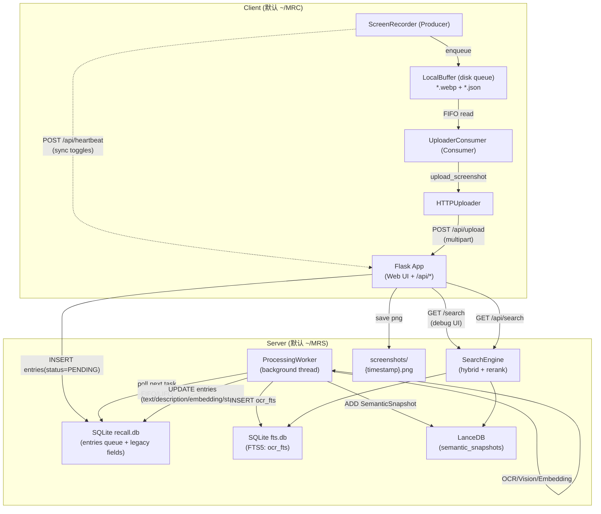
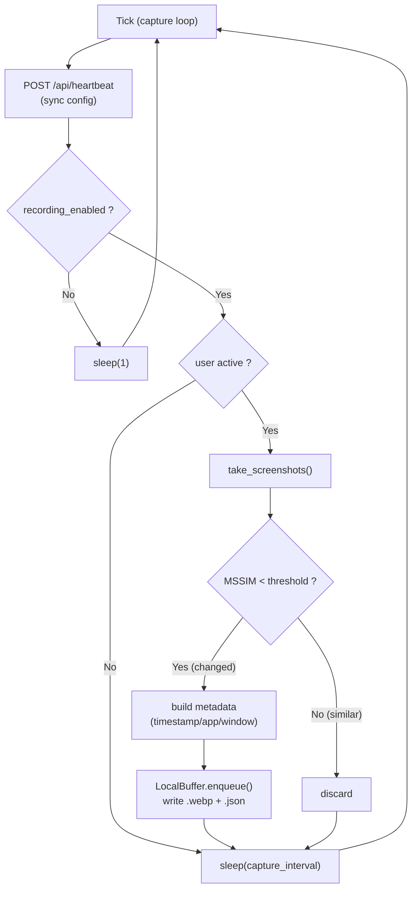
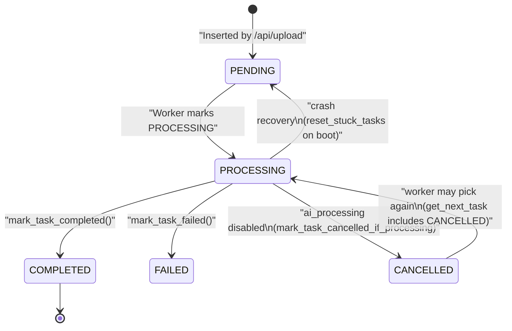
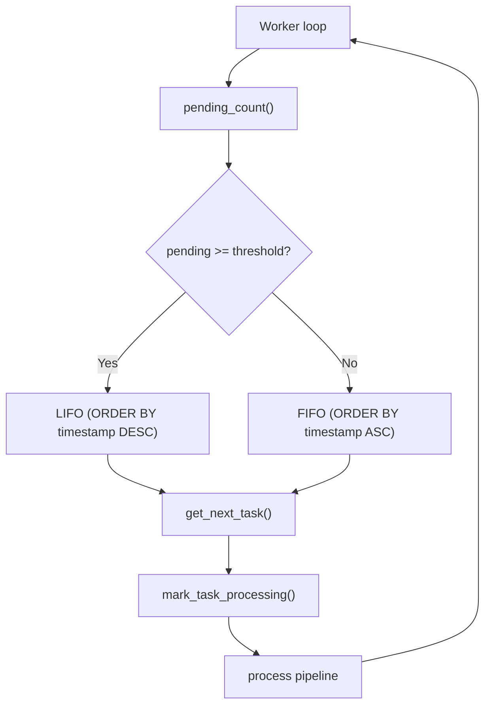
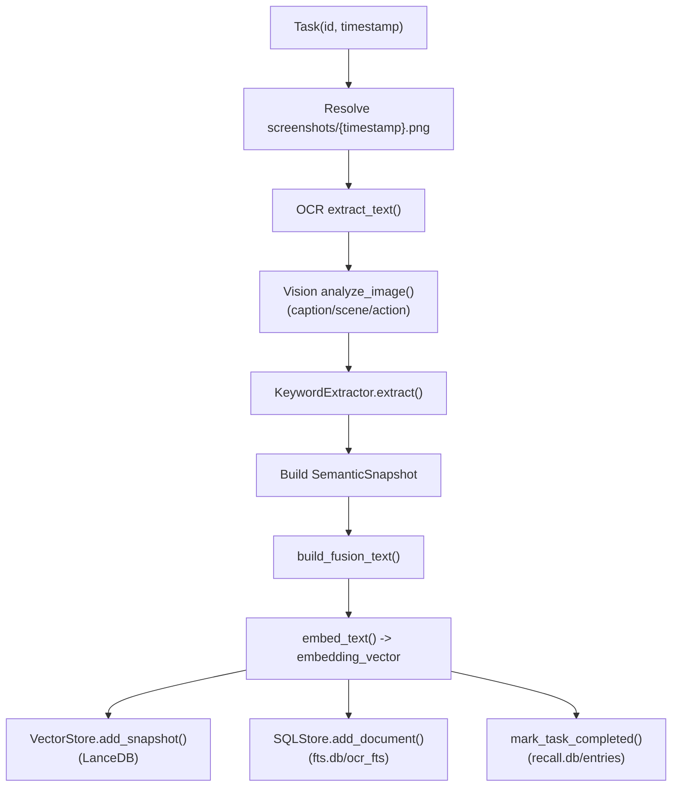
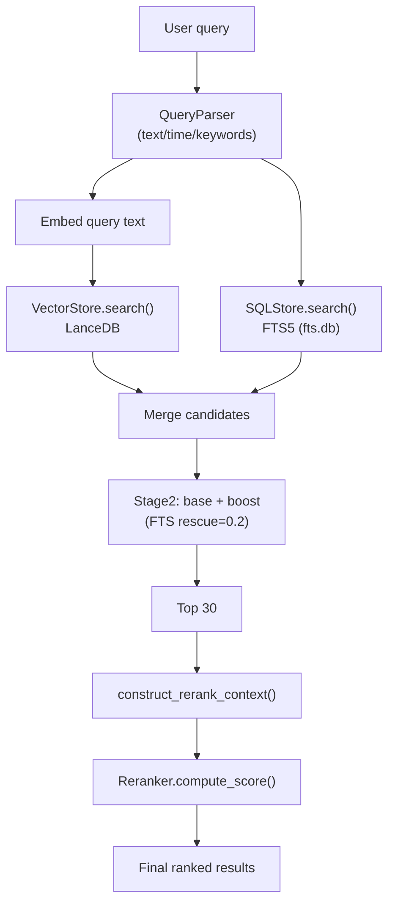

# MyRecall V2 数据流 & Pipeline 双语分析（ZH→EN）

> **说明（中文）**：本文以当前代码实现为唯一事实来源（source of truth），面向“端到端数据流”做系统性剖析：Client 截屏 → 本地缓冲 → HTTP 上传 → Server 异步处理 → 落盘/索引 → 混合检索 → Web UI/API 展示，并补齐运行时控制面与故障恢复语义。  
> **Note (English)**: This document is aligned to the current codebase as the single source of truth. It explains the end-to-end pipeline: Client capture → disk buffer → HTTP upload → async Server processing → storage/indexing → hybrid search → Web UI/API, including runtime toggles and failure modes.

> **默认数据目录（Defaults）**：
> - **Server**: `OPENRECALL_SERVER_DATA_DIR=~/MRS`
> - **Client**: `OPENRECALL_CLIENT_DATA_DIR=~/MRC`
> - 兼容字段：`OPENRECALL_DATA_DIR`（legacy）仅影响 Server 侧 `base_path`，不等价于 Client 数据目录。

## Sources of Truth / 对齐的源码位置

- Client：
  - `openrecall/client/recorder.py`（截图采集、去重、心跳同步）
  - `openrecall/client/buffer.py`（磁盘队列：`.webp + .json`）
  - `openrecall/client/consumer.py`（后台上传消费线程、退避重试）
  - `openrecall/client/uploader.py`（HTTP 上传：`multipart/form-data`）
- Server：
  - `openrecall/server/app.py`（Flask 应用、Web UI、启动 worker）
  - `openrecall/server/api.py`（`/api/upload`, `/api/heartbeat`, `/api/config`, `/api/search`, `/api/queue/status`）
  - `openrecall/server/worker.py`（异步处理流水线与取消/降级）
  - `openrecall/server/database/sql.py`（`recall.db` + `fts.db`）
  - `openrecall/server/database/vector_store.py`（LanceDB 向量库）
  - `openrecall/server/schema.py`（`SemanticSnapshot` 数据模型）
  - `openrecall/server/search/engine.py`（混合召回/融合/重排）
  - `openrecall/server/config_runtime.py`（运行时开关 `runtime_settings`）
- Entrypoints / 启动入口：
  - `openrecall/main.py`, `openrecall/server/__main__.py`, `openrecall/client/__main__.py`
  - `run_server.sh`, `run_client.sh`, `run_client_mac.sh`

---

## 0. TL;DR / 快速摘要

### TL;DR（中文）

- Client 侧 `ScreenRecorder` 定期截屏（`mss`），做 MSSIM 去重 + idle 检测，然后把“截图+元数据”落到磁盘队列 `~/MRC/buffer`。
- `UploaderConsumer` 以 FIFO 方式读取 buffer，调用 `HTTPUploader` 以 **`multipart/form-data`** 上传到 `POST /api/upload`（PNG + metadata JSON）。
- Server 摄入（`/api/upload`）做“快路径”：保存 `~/MRS/screenshots/{timestamp}.png`，并在 `~/MRS/db/recall.db` 插入 `entries(status='PENDING')`，立即返回 `202 Accepted`。
- Server 后台线程 `ProcessingWorker` 按 **FIFO/LIFO 动态策略**取队列任务，执行 OCR → Vision → keywords → fusion text → embedding，并写入三类存储：
  - `recall.db/entries`：更新 `text/description/embedding/status`
  - `fts.db/ocr_fts`：写入全文检索索引（OCR/caption/keywords）
  - `lancedb/semantic_snapshots`：写入 `SemanticSnapshot` 供向量检索
- SearchEngine：QueryParser（时间/强制关键词）→ 向量召回（LanceDB）+ 关键词召回（FTS5）→ 融合打分（base + boost）→ Top30 深度重排（reranker）。
- Control Center：Web UI 通过 `GET/POST /api/config` 改变运行时开关；Client 通过 `POST /api/heartbeat` 同步 `recording_enabled/upload_enabled`；Worker 通过 `ai_processing_enabled` + version 取消/暂停处理。

### TL;DR (English)

- On the Client, `ScreenRecorder` periodically captures screens (`mss`), applies MSSIM dedup + idle detection, then persists “image + metadata” into a disk queue at `~/MRC/buffer`.
- `UploaderConsumer` consumes the buffer FIFO and uploads via `HTTPUploader` using **`multipart/form-data`** to `POST /api/upload` (PNG + metadata JSON).
- Server ingestion (`/api/upload`) is a fast path: save `~/MRS/screenshots/{timestamp}.png`, insert `entries(status='PENDING')` into `~/MRS/db/recall.db`, and return `202 Accepted` immediately.
- A background thread `ProcessingWorker` drains the queue with a **FIFO/LIFO adaptive strategy**, runs OCR → Vision → keywords → fusion text → embedding, and writes to:
  - `recall.db/entries` (status + legacy fields)
  - `fts.db/ocr_fts` (FTS index)
  - `lancedb/semantic_snapshots` (vector search)
- Search pipeline: parse query → vector retrieval (LanceDB) + keyword retrieval (FTS5) → linear fusion (base + boost) → rerank Top30.
- Runtime control: Web UI toggles `GET/POST /api/config`; Client syncs via `POST /api/heartbeat`; Worker respects `ai_processing_enabled` with a version-based cancel mechanism.

---

## 1. Architecture / 总体架构

### TL;DR（中文）

- **Client（~/MRC）**：Producer（采集）与 Consumer（上传）解耦，通过磁盘队列实现“断网不丢”。
- **Server（~/MRS）**：Flask（Web UI + REST API）+ 后台 worker；处理结果写入 SQLite + LanceDB + 文件系统。
- 数据落地分为 3 层：`recall.db`（队列/legacy）、`fts.db`（FTS5）、`lancedb`（向量检索），以及 `screenshots/`（PNG 文件）。

### TL;DR (English)

- **Client (~/MRC)** decouples Producer (capture) and Consumer (upload) via a disk-backed queue for offline resilience.
- **Server (~/MRS)** is Flask (Web UI + REST API) plus a background worker; results are stored in SQLite + LanceDB + filesystem.
- Storage is split across `recall.db` (queue/legacy), `fts.db` (FTS5), `lancedb` (vector), and `screenshots/` (PNG).

### 1.1 宏观架构图（High-Level Overview）



### 1.2 组件职责（Component Roles）

**中文**
- **Producer / 采集端**：尽量只做“快速、可中断”的事情（截屏、去重、写磁盘队列），不做网络 I/O。
- **Consumer / 上传端**：后台线程读取队列，负责重试/退避，只有在 Server 确认成功后才删除本地文件。
- **Server API**：以“快响应”为第一原则，将重计算移到后台 worker。
- **Worker**：负责 OCR、视觉理解、embedding 与索引写入；支持取消与失败降级。
- **SearchEngine**：并行召回（向量 + FTS）→ 融合打分 → 深度重排 → 输出（UI/API）。

**English**
- **Producer** focuses on fast operations (capture, dedup, enqueue) and avoids network I/O.
- **Consumer** uploads in a background thread with retry/backoff and deletes local items only after server confirmation.
- **Server API** prioritizes fast responses and offloads heavy work to the background worker.
- **Worker** runs OCR, vision, embedding, and indexing; supports cancellation and graceful degradation.
- **SearchEngine** does dual retrieval (vector + FTS) → fusion scoring → deep reranking → outputs for UI/API.

---

## 2. Client Capture Pipeline / 客户端采集流水线

### TL;DR（中文）

- 心跳同步：`ScreenRecorder._send_heartbeat()` 每 ~5 秒调用一次 `POST /api/heartbeat` 拉取 runtime config。
- 采集门禁：`recording_enabled=false` 会暂停采集；`upload_enabled=false` 只会暂停上传（仍继续入 buffer）。
- 去重策略：对每个 monitor 计算 MSSIM；低于阈值才认为“有变化需要捕获”。
- 落地：buffer item 包含 `*.webp`（无损）与 `*.json`（metadata），并使用 `.json.tmp -> .json` 原子提交。

### TL;DR (English)

- Heartbeat sync: `ScreenRecorder._send_heartbeat()` calls `POST /api/heartbeat` roughly every 5 seconds to fetch runtime config.
- Gates: `recording_enabled=false` pauses capture; `upload_enabled=false` pauses uploads only (buffering continues).
- Dedup: MSSIM per monitor; only “changed” frames are captured.
- Persistence: each buffer item is `*.webp` + `*.json`, with atomic `.json.tmp -> .json` commit.

### 2.1 采集循环（Capture Loop）

**中文（按代码顺序，见 `openrecall/client/recorder.py::ScreenRecorder.run_capture_loop`）**
1. 每 5 秒左右发送心跳到 `POST /api/heartbeat`，同步 `recording_enabled/upload_enabled`。
2. 若 `recording_enabled` 为 false：打印 “Recording paused” 并 `sleep(1)`，不产生新数据。
3. 若用户处于 idle（`openrecall/shared/utils.py::is_user_active` 返回 false）：跳过本轮并 `sleep(capture_interval)`。
4. 使用 `mss` 抓取截图；对比上一帧计算 MSSIM（内部会做 resize 降采样），相似度高则丢弃。
5. 对于需要捕获的帧：生成 `timestamp=int(time.time())`，采集 `active_app/active_window`，然后 `LocalBuffer.enqueue()`。

**English**
1. Every ~5s, call `POST /api/heartbeat` to sync `recording_enabled/upload_enabled`.
2. If `recording_enabled` is false: log “Recording paused” and `sleep(1)`; no new data is produced.
3. If the user is idle (`is_user_active` is false): skip the cycle and `sleep(capture_interval)`.
4. Capture screens via `mss`; compare with previous frames using MSSIM (internally downscaled), discard if too similar.
5. For frames to capture: generate `timestamp=int(time.time())`, collect `active_app/active_window`, and enqueue via `LocalBuffer.enqueue()`.

### 2.2 Client 采集流程图（Capture Flowchart）



### 2.3 macOS 空白帧提示（Blank Frame Warning）

**中文**：当截屏内容平均亮度/方差都很低时，Client 会提示可能缺少 macOS Screen Recording 权限（只提示一次）。  
**English**: If captured frames look blank (low mean/std), the client warns about missing macOS Screen Recording permission (one-time warning).

---

## 3. Server Ingestion & Async Worker / 服务端摄入与异步处理

### TL;DR（中文）

- `/api/upload` 是“快路径”：落盘 PNG + 插入 `entries(status='PENDING')`，返回 `202`，不做 OCR/AI。
- `ProcessingWorker` 后台线程按队列积压量切换 **FIFO/LIFO**；处理时会将状态标记为 `PROCESSING`。
- 支持“取消”：关闭 `ai_processing_enabled` 会取消处理中任务（`PROCESSING -> CANCELLED`）并阻止继续拾取新任务。
- 崩溃恢复：Server 启动时会把遗留的 `PROCESSING` 任务重置回 `PENDING`（zombie recovery）。

### TL;DR (English)

- `/api/upload` is a fast path: write PNG + insert `entries(status='PENDING')`, return `202`, no OCR/AI in request thread.
- `ProcessingWorker` switches **FIFO/LIFO** based on backlog; tasks are marked `PROCESSING` during work.
- Cancellation: disabling `ai_processing_enabled` cancels in-flight tasks (`PROCESSING -> CANCELLED`) and stops picking new tasks.
- Crash recovery: on server boot, leftover `PROCESSING` tasks are reset to `PENDING` (zombie recovery).

### 3.1 摄入快路径：`POST /api/upload`（Fast Ingestion）

**中文（见 `openrecall/server/api.py::upload`）**
- 入参是 `multipart/form-data`：
  - `file`: PNG
  - `metadata`: JSON 字符串（必须包含 `timestamp/app_name/window_title`）
- 处理步骤：
  1. 保存文件到 `settings.screenshots_path/{timestamp}.png`
  2. 写入 `SQLStore.insert_pending_entry(..., status='PENDING')`
  3. 返回 `202 Accepted`（重复 timestamp 返回 `409 Conflict`）

**English**
- Input is `multipart/form-data`:
  - `file`: PNG
  - `metadata`: JSON string (`timestamp/app_name/window_title`)
- Steps:
  1. Save to `settings.screenshots_path/{timestamp}.png`
  2. Insert into `entries` with `status='PENDING'`
  3. Return `202 Accepted` (`409 Conflict` on duplicate timestamp)

**Example / 示例**
```bash
curl -sS -X POST "http://localhost:8083/api/upload" \
  -F "file=@/path/to/screenshot.png;type=image/png" \
  -F 'metadata={"timestamp": 1710000000, "app_name":"VS Code", "window_title":"main.py"}'
```

### 3.2 任务状态机（Task State Machine）



> **注意（中文）**：当前实现会把 `CANCELLED` 也当作可拾取任务（`get_next_task` 包含 `CANCELLED`），这意味着“取消”更像是一次中断标记，而不是永久终止。  
> **Note (English)**: `CANCELLED` tasks are still eligible for pickup (`get_next_task` includes `CANCELLED`), so cancellation behaves more like an interruption marker than a terminal state.

### 3.3 Worker 调度策略（FIFO/LIFO Adaptive Scheduling）

**中文**：当 `PENDING` 数量达到阈值 `OPENRECALL_PROCESSING_LIFO_THRESHOLD` 时，worker 使用 LIFO（优先处理最新数据）；否则使用 FIFO（追赶积压）。  
**English**: When pending backlog exceeds `OPENRECALL_PROCESSING_LIFO_THRESHOLD`, the worker uses LIFO (newest-first); otherwise FIFO.



### 3.4 处理流水线（Processing Pipeline）

**中文（见 `openrecall/server/worker.py::ProcessingWorker._process_task`）**
1. 根据 `task.timestamp` 重新定位图片路径：`screenshots/{timestamp}.png`（image_path 不写 DB，依赖 timestamp 约定）。
2. OCR：`ocr_provider.extract_text(image_path)` → `text`
3. Vision：`ai_provider.analyze_image(image_path)` → `caption/scene/action`（期望 JSON）
4. keywords：`KeywordExtractor.extract(text)` → `keywords`
5. 构造 `SemanticSnapshot` + `build_fusion_text(snapshot)` → `fusion_text`
6. embedding：`embedding_provider.embed_text(fusion_text)` → `embedding_vector`
7. 落地：
   - `VectorStore.add_snapshot(snapshot)` → LanceDB
   - `SQLStore.add_document(snapshot.id, text, caption, keywords)` → `fts.db`
   - `SQLStore.mark_task_completed(..., text, caption, embedding)` → `recall.db`

**English**
1. Resolve image path from `task.timestamp`: `screenshots/{timestamp}.png` (DB does not store the image path; timestamp convention is the link).
2. OCR via `ocr_provider.extract_text(...)` → `text`
3. Vision via `ai_provider.analyze_image(...)` → `caption/scene/action` (JSON expected)
4. Keyword extraction from OCR text.
5. Build `SemanticSnapshot` and fusion text via `build_fusion_text(...)`.
6. Embed fusion text via `embedding_provider.embed_text(...)`.
7. Persist to LanceDB + FTS DB + recall.db.



---

## 4. Hybrid Search Pipeline / 混合检索流水线

### TL;DR（中文）

- QueryParser 支持简单时间语义（today/yesterday/last week）与双引号关键词（强制匹配）。
- Stage1：向量检索在 LanceDB 上执行，FTS 在 SQLite FTS5 上执行（索引字段：OCR/caption/keywords）。
- Stage2：融合打分为“线性 base + boost”，并提供 FTS-only rescue（base=0.2）。
- Stage3：对 Top30 做 rerank（Cross-Encoder），其分数会覆盖 Stage2（若返回非全零）。

### TL;DR (English)

- QueryParser supports basic time phrases (today/yesterday/last week) and quoted mandatory keywords.
- Stage1: vector retrieval on LanceDB, keyword retrieval on SQLite FTS5 (OCR/caption/keywords).
- Stage2: linear fusion (base + boost), plus FTS-only rescue (base=0.2).
- Stage3: rerank Top30 via a cross-encoder; rerank scores overwrite Stage2 if not all zeros.

### 4.1 搜索流程图（Search Flow）



### 4.2 Stage 1：Query Parsing & Dual Retrieval

**中文（见 `openrecall/server/utils/query_parser.py` + `openrecall/server/search/engine.py`）**
- 解析：
  - `today/yesterday/last week` → `start_time/end_time`
  - `"quoted"` → `mandatory_keywords`
  - 其余文本 → `parsed.text`（用于 embedding）
- 向量分支：
  - `embedding_provider.embed_text(parsed.text)`
  - `VectorStore.search(query_vec, where="context.timestamp >= ...")`（若存在时间过滤）
- FTS 分支：
  - 若有 `mandatory_keywords`：构造 `fts_query='"k1" "k2"'`
  - `SQLStore.search(fts_query)` 返回 `(snapshot_id, bm25)`

**English**
- Parsing:
  - `today/yesterday/last week` → `start_time/end_time`
  - quoted terms → `mandatory_keywords`
  - remaining text → `parsed.text` for embedding
- Vector branch:
  - embed `parsed.text`
  - query LanceDB with optional `context.timestamp` filter
- FTS branch:
  - build quoted query when mandatory keywords exist
  - search FTS5 and get `(snapshot_id, bm25)`

### 4.3 Stage 2：Weighted Linear Fusion（base + boost）

**中文（见 `openrecall/server/search/engine.py::_search_impl`）**
- base 分：
  - 来自向量相似度：`base = vector_score`
  - 若只命中 FTS（向量 top 未包含）：`base = 0.2`（FTS rescue）
- boost 分：
  - 若命中 FTS：`boost = 0.3 * (1 - rank/total)`
  - 最终：`final = base + boost`

**English**
- Base score:
  - vector similarity as base
  - FTS-only rescue uses base=0.2
- Boost:
  - `boost = 0.3 * (1 - rank/total)` for FTS hits
  - `final = base + boost`

### 4.4 Stage 3：Deep Reranking（Top 30）

**中文**
- `construct_rerank_context(snapshot)` 组合 Metadata + Visual + OCR，形成长文本上下文。
- `reranker.compute_score(query, doc_texts)` 输出 relevance 分数列表：
  - 若分数非全零：覆盖 Stage2 score 并重排 Top30
  - 若全零：保留 Stage2 顺序

**English**
- Build a rich context string (Metadata + Visual + OCR).
- Rerank Top30; if scores are not all zero, overwrite Stage2 ordering; otherwise keep Stage2.

### 4.5 输出形态：Web UI vs API

**中文**
- Web UI：`GET /search` 调用 `search_engine.search_debug()`，返回带 debug 字段的条目（便于观察 vector/fts/rerank 的排名变化）。
- API：`GET /api/search?q=...` 返回“扁平字段 + full_data（SemanticSnapshot）”的 JSON。

**English**
- Web UI (`GET /search`) uses `search_debug()` and returns debug fields for inspection.
- API (`GET /api/search`) returns flattened fields plus `full_data` (the full `SemanticSnapshot`).

---

## 5. Storage & Data Schema / 数据落地与结构

### TL;DR（中文）

- Client 写入：`~/MRC/buffer/*.webp + *.json`（队列项），可选写入 `~/MRC/screenshots/*.webp`（本地留档）。
- Server 写入：`~/MRS/screenshots/{timestamp}.png`、`~/MRS/db/recall.db`、`~/MRS/fts.db`、`~/MRS/lancedb/`。
- 关联键：
  - `entries.timestamp` ↔ PNG 文件名 `{timestamp}.png`
  - `SemanticSnapshot.id` ↔ `ocr_fts.snapshot_id`

### TL;DR (English)

- Client persists queue items under `~/MRC/buffer` (webp+json), optionally keeps local screenshots under `~/MRC/screenshots`.
- Server writes PNGs, `recall.db`, `fts.db`, and LanceDB under `~/MRS`.
- Linking keys:
  - `entries.timestamp` ↔ `{timestamp}.png`
  - `SemanticSnapshot.id` ↔ `ocr_fts.snapshot_id`

### 5.1 默认目录树（Default Layout Tree）

```text
~/MRC/                          # OPENRECALL_CLIENT_DATA_DIR (default)
  buffer/
    <buffer_id>.webp            # buffered image (lossless)
    <buffer_id>.json            # metadata (timestamp, active_app, active_window, ...)
    <buffer_id>.json.tmp        # transient during atomic write
  screenshots/                  # optional (OPENRECALL_CLIENT_SAVE_LOCAL_SCREENSHOTS=true)
    <timestamp>.webp

~/MRS/                          # OPENRECALL_SERVER_DATA_DIR (default)
  screenshots/
    <timestamp>.png             # server-side canonical image
  db/
    recall.db                   # entries table: queue + legacy fields
  fts.db                        # SQLite FTS5: ocr_fts virtual table
  lancedb/                      # LanceDB dataset directory
  cache/                        # HF/torch/doctr caches (optional)
  models/                       # model cache (optional)
```

### 5.2 `recall.db`: `entries`（队列 + legacy 字段）

**中文（见 `openrecall/server/database/sql.py`）**
- 表：`entries`
- 关键字段（简化）：

| Column | Type | Meaning |
| --- | --- | --- |
| `id` | INTEGER PK | 自增主键 |
| `timestamp` | INTEGER UNIQUE | 截图时间戳（用于文件命名与去重） |
| `app` | TEXT | 应用名（server 侧字段名） |
| `title` | TEXT | 窗口标题 |
| `text` | TEXT | OCR 文本（PENDING 时通常为 NULL） |
| `description` | TEXT | 视觉描述（caption，PENDING 时通常为 NULL） |
| `embedding` | BLOB | float32 bytes（PENDING 时通常为 NULL） |
| `status` | TEXT | `PENDING/PROCESSING/COMPLETED/FAILED/CANCELLED` |

**English**
- Table: `entries`
- Key columns: timestamp-based queue + optional processed fields (text/description/embedding) and a status field.

### 5.3 `fts.db`: `ocr_fts`（FTS5 索引）

**中文**
- 位置：`settings.fts_path`（默认 `~/MRS/fts.db`）
- 虚表：`ocr_fts`（FTS5）
- 索引内容来自 `SQLStore.add_document(snapshot_id, ocr_text, caption, keywords)`：
  - `ocr_text`
  - `caption`
  - `keywords`（字符串拼接）

**English**
- Stored in `fts.db` as an FTS5 virtual table `ocr_fts`.
- Indexed fields come from `add_document(...)`: OCR text, caption, keywords.

### 5.4 LanceDB：`SemanticSnapshot`（向量检索主存储）

**中文（见 `openrecall/server/schema.py`）**
- `SemanticSnapshot.embedding_vector` 是 `Vector(1024)`（默认维度由 `OPENRECALL_EMBEDDING_DIM` 控制，需与 embedding provider 输出一致）。
- `score` 字段仅用于运行时展示（`exclude=True`），不持久化到 LanceDB schema。

**English**
- `embedding_vector` is stored as `Vector(1024)`; dimension must match your embedding provider.
- `score` is runtime-only and excluded from the persisted schema.

### 5.5 关键关联关系（How Records Link）

**中文**
- **PNG 关联**：worker 通过 `task.timestamp` 推导出 `screenshots/{timestamp}.png`，因此 timestamp 是“文件系统锚点”。
- **FTS 关联**：`ocr_fts.snapshot_id` 对应 LanceDB 的 `SemanticSnapshot.id`（UUID）。

**English**
- **PNG link**: worker resolves `screenshots/{timestamp}.png` purely from `entries.timestamp`.
- **FTS link**: `ocr_fts.snapshot_id` equals LanceDB `SemanticSnapshot.id` (UUID).

---

## 6. Configuration / 配置与关键开关（env）

### TL;DR（中文）

- 路径相关：优先使用 `OPENRECALL_SERVER_DATA_DIR` / `OPENRECALL_CLIENT_DATA_DIR`；`OPENRECALL_DATA_DIR` 是 legacy（Server 侧）。
- 性能相关：`OPENRECALL_PRELOAD_MODELS`、`OPENRECALL_DEVICE`、`OPENRECALL_CAPTURE_INTERVAL`。
- 质量相关：`OPENRECALL_SIMILARITY_THRESHOLD`、`OPENRECALL_DISABLE_SIMILARITY_FILTER`、AI provider 选择。

### TL;DR (English)

- Prefer `OPENRECALL_SERVER_DATA_DIR` / `OPENRECALL_CLIENT_DATA_DIR`. `OPENRECALL_DATA_DIR` is a server-side legacy alias.
- Performance knobs: `OPENRECALL_PRELOAD_MODELS`, `OPENRECALL_DEVICE`, `OPENRECALL_CAPTURE_INTERVAL`.
- Quality knobs: `OPENRECALL_SIMILARITY_THRESHOLD`, `OPENRECALL_DISABLE_SIMILARITY_FILTER`, provider selection.

| Variable | 中文含义 | English meaning | Default |
| --- | --- | --- | --- |
| `OPENRECALL_SERVER_DATA_DIR` | Server 数据根目录 | Server data root | `~/MRS` |
| `OPENRECALL_CLIENT_DATA_DIR` | Client 数据根目录 | Client data root | `~/MRC` |
| `OPENRECALL_API_URL` | Client 访问 Server 的 API base（含 `/api`） | Client API base (includes `/api`) | `http://localhost:8083/api` |
| `OPENRECALL_CAPTURE_INTERVAL` | 截屏间隔（秒） | Capture interval (seconds) | `10` |
| `OPENRECALL_PRIMARY_MONITOR_ONLY` | 仅捕获主显示器 | Capture primary monitor only | `true` |
| `OPENRECALL_SIMILARITY_THRESHOLD` | MSSIM 去重阈值 | MSSIM dedup threshold | `0.98` |
| `OPENRECALL_DISABLE_SIMILARITY_FILTER` | 关闭去重（每轮都捕获） | Disable dedup | `false` |
| `OPENRECALL_PROCESSING_LIFO_THRESHOLD` | 积压阈值（触发 LIFO） | Backlog threshold for LIFO | `10` |
| `OPENRECALL_AI_PROVIDER` | 默认 AI provider（vision/ocr/embedding 兜底） | Default provider fallback | `local` |
| `OPENRECALL_VISION_PROVIDER` | 视觉理解 provider override | Vision provider override | empty |
| `OPENRECALL_OCR_PROVIDER` | OCR provider override | OCR provider override | empty |
| `OPENRECALL_EMBEDDING_PROVIDER` | embedding provider override | Embedding provider override | empty |
| `OPENRECALL_RERANKER_MODE` | 重排执行模式（api/local） | Reranker mode (api/local) | `api` |
| `OPENRECALL_RERANKER_URL` | 重排 API 地址 | Reranker endpoint | `http://localhost:8080/rerank` |
| `OPENRECALL_FUSION_LOG_ENABLED` | 输出 fusion 调试日志 | Enable fusion debug log | `false` |

> **调试日志（中文）**：开启 `OPENRECALL_DEBUG=true` 会产生更多日志；搜索/重排会尝试写入 `logs/rerank_debug.log`，fusion 可写入 `logs/fusion_debug.log`。  
> **Debug logs (English)**: `OPENRECALL_DEBUG=true` enables verbose logs; rerank inputs may be written to `logs/rerank_debug.log`, fusion text to `logs/fusion_debug.log`.

---

## 7. Runtime Control Plane / 运行时控制面（Control Center）

### TL;DR（中文）

- Web UI（Control Center）每 5 秒轮询 `GET /api/config`，并通过 `POST /api/config` 修改运行时开关。
- Client 每 5 秒调用 `POST /api/heartbeat`：上报“在线”并拉取 `recording_enabled/upload_enabled`。
- Worker 读取 `ai_processing_enabled` 与 `ai_processing_version`：可即时取消处理中任务，并阻止继续拾取。

### TL;DR (English)

- Control Center polls `GET /api/config` every 5s and updates toggles via `POST /api/config`.
- Client calls `POST /api/heartbeat` every 5s to report liveness and fetch `recording_enabled/upload_enabled`.
- Worker watches `ai_processing_enabled` and `ai_processing_version` to cancel in-flight work and stop picking new tasks.

### 7.1 关键接口（Endpoints）

**中文（见 `openrecall/server/api.py` + `openrecall/server/templates/layout.html`）**
- `GET /api/config`：返回 runtime config + `client_online`（基于 `last_heartbeat` 计算）。
- `POST /api/config`：更新部分字段（`recording_enabled/upload_enabled/ai_processing_enabled/ui_show_ai`）。
- `POST /api/heartbeat`：Client 心跳；Server 更新 `last_heartbeat` 并回传当前 config。
- `GET /api/queue/status`：队列统计与当前 FIFO/LIFO 模式（debug）。

**English**
- `GET /api/config`: returns runtime config + `client_online`.
- `POST /api/config`: updates toggles.
- `POST /api/heartbeat`: client heartbeat (liveness + fetch config).
- `GET /api/queue/status`: debug queue stats and current FIFO/LIFO mode.

### 7.2 控制面序列图（Control Flow Sequence）

```mermaid
sequenceDiagram
  participant UI as Web UI (Control Center)
  participant API as Server /api/*
  participant RT as runtime_settings
  participant Client as Client (Recorder)
  participant Worker as ProcessingWorker

  UI->>API: GET /api/config (poll every 5s)
  API->>RT: read config + compute client_online
  API-->>UI: config JSON

  UI->>API: POST /api/config {"ai_processing_enabled": false}
  API->>RT: update + ai_processing_version++
  API-->>UI: updated config

  Client->>API: POST /api/heartbeat (every 5s)
  API->>RT: last_heartbeat=now; return config
  API-->>Client: {recording_enabled, upload_enabled, ...}

  Worker->>RT: check ai_processing_enabled/version
  Worker-->>Worker: cancel in-flight if disabled/version changed
```

---

## 8. How to Run / 启动方式（与数据流的关系）

### TL;DR（中文）

- 单机一体：`python -m openrecall.main`（同进程启动 server + client；适合本地开发/验证链路）。
- 分离部署：`python -m openrecall.server` + `python -m openrecall.client`（适合 Client/Server 分机）。
- 脚本启动：`run_server.sh` / `run_client.sh` / `run_client_mac.sh`（加载对应 env 文件）。

### TL;DR (English)

- Single-machine combined mode: `python -m openrecall.main` starts server + client in one process.
- Split processes: `python -m openrecall.server` and `python -m openrecall.client`.
- Foreground scripts load env files and start the appropriate module.

### 8.1 启动入口与数据流映射（Entrypoints → Pipeline）

**中文**
- `python -m openrecall.server`：
  - 启动 Flask（Web UI + API）
  - 预加载模型（可通过 `OPENRECALL_PRELOAD_MODELS` 关闭）
  - 启动 `ProcessingWorker`
- `python -m openrecall.client`：
  - 启动 `ScreenRecorder`（producer）与 `UploaderConsumer`（consumer）
  - buffer 路径由 `OPENRECALL_CLIENT_DATA_DIR` 决定
- `python -m openrecall.main`：
  - 先启动 server + worker，再启动 recorder 线程（方便一键跑通端到端）

**English**
- `python -m openrecall.server`: Flask + optional model preload + background worker.
- `python -m openrecall.client`: recorder + uploader consumer; buffer path comes from `OPENRECALL_CLIENT_DATA_DIR`.
- `python -m openrecall.main`: starts server/worker then recorder thread for end-to-end in one go.

### 8.2 Script 启动（Env 文件约定）

**中文**
- `run_server.sh` 默认加载 `myrecall_server.env`（不存在则回退 `openrecall.env`）
- `run_client.sh` 默认加载 `myrecall_client.env`（不存在则回退 `openrecall_client.env`，再回退 `openrecall.env`）
- `run_client_mac.sh` 会生成最小 `openrecall_client.env`，并在启动前检查 `GET {API_URL}/health`

**English**
- `run_server.sh` loads `myrecall_server.env` by default (fallback to `openrecall.env`).
- `run_client.sh` loads `myrecall_client.env` by default (fallback to `openrecall_client.env`, then `openrecall.env`).
- `run_client_mac.sh` can generate a minimal `openrecall_client.env` and checks server health before launching.

---

## 9. Edge Cases & Failure Modes / 边界情况与故障恢复

### TL;DR（中文）

- 网络故障不会丢数据，但可能导致 buffer 积压；恢复后自动上传。
- timestamp 冲突会导致 `409` 并造成某些 buffer 项“永远重试”；多显示器/高频采集时尤其明显。
- Worker 崩溃会触发 zombie recovery（`PROCESSING -> PENDING`），但失败任务不会自动重试。
- AI provider 异常会触发 fallback（空文本/零向量），导致搜索质量下降。

### TL;DR (English)

- Network outages don’t lose data, but buffer will grow; it drains automatically when the server is back.
- Timestamp collisions cause `409` and can make some buffer items retry forever (multi-monitor/high-rate capture).
- Worker crashes are handled via zombie recovery (`PROCESSING -> PENDING`), but `FAILED` is not automatically retried.
- AI provider failures fall back to empty/zero outputs, degrading search quality.

### 9.1 Server 不可达（Offline Accumulation）

**中文**
- 现象：`~/MRC/buffer` 文件持续增长；日志出现 upload failed/backoff。
- 恢复：修正 `OPENRECALL_API_URL` 或启动 Server；Consumer 会继续上传并在成功后 `commit()` 删除本地队列项。

**English**
- Symptom: `~/MRC/buffer` keeps growing; logs show upload failures/backoff.
- Fix: correct `OPENRECALL_API_URL` or start the server; the consumer will resume and commit items on success.

### 9.2 macOS 无 Screen Recording 权限（Blank Frames）

**中文**：日志提示 “Captured frames look blank…”；到系统设置开启 Screen Recording 权限后重启 Client。  
**English**: Enable Screen Recording permission in macOS settings and restart the client.

### 9.3 Timestamp 冲突（409 / 永久重试风险）

**中文**
- 原因：Client 使用 `timestamp=int(time.time())`（秒级）。在**多显示器**或**高频采集**时，多个截图可能共享同一 timestamp，Server 侧 `entries.timestamp` 有唯一约束，导致 `409 Conflict`。
- 影响：Consumer 将其视为失败并保留在 buffer 中，后续会一直重试但永远无法成功（需要人为干预或改代码）。
- 缓解（不改代码）：保持 `OPENRECALL_PRIMARY_MONITOR_ONLY=true`，提高 `OPENRECALL_CAPTURE_INTERVAL`，减少同秒多张的概率。

**English**
- Cause: timestamp is second-level (`int(time.time())`). Multi-monitor/high-rate capture can produce duplicates; server enforces unique `entries.timestamp` → `409`.
- Impact: consumer treats it as failure and retries indefinitely (buffer item never commits).
- Mitigation (no code change): keep `OPENRECALL_PRIMARY_MONITOR_ONLY=true` and/or increase `OPENRECALL_CAPTURE_INTERVAL`.

### 9.4 Worker 崩溃与 Zombie Recovery

**中文**
- Server 启动时会执行 `reset_stuck_tasks()`：把 `PROCESSING` 重置回 `PENDING`，避免“僵尸任务”永久卡住。
- `FAILED` 不会自动回到 `PENDING`（当前实现没有 retry policy）。

**English**
- On boot, the server resets `PROCESSING` tasks back to `PENDING`.
- `FAILED` is terminal unless you implement your own retry policy.

### 9.5 LanceDB Schema 变更风险（Drop & Recreate）

**中文**：`VectorStore._init_table()` 遇到 schema mismatch 时可能 drop 并重建表；这会导致向量索引数据丢失。变更 `SemanticSnapshot` 时应先考虑迁移策略与备份。  
**English**: `VectorStore._init_table()` may drop & recreate the table on schema mismatch, which can wipe the vector index; plan migrations/backups before schema changes.

---

## Glossary / 术语表

| Term | 中文 | English |
| --- | --- | --- |
| Producer | 生产者（采集线程） | Producer (capture/enqueue) |
| Consumer | 消费者（上传线程） | Consumer (upload/commit) |
| Buffer Item | 缓冲队列项（webp+json） | Disk queue item (webp+json) |
| Ingestion | 摄入（快路径） | Fast ingestion path |
| Worker | 后台处理线程 | Background processing thread |
| Entry | `entries` 表记录 | Row in `entries` table |
| SemanticSnapshot | 语义快照（LanceDB 主实体） | Semantic snapshot (primary vector entity) |
| Fusion Text | 融合文本（用于 embedding） | Fusion text (embedding input) |
| FTS5 | SQLite 全文检索 | SQLite full-text search |
| Reranker | 深度重排模型 | Cross-encoder reranker |
