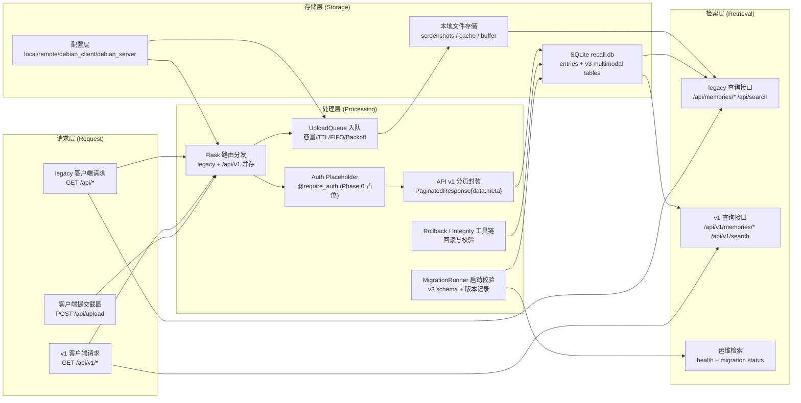

# MyRecall-v3 Phase 0 Validation Report

**Version**: 2.1
**Last Updated**: 2026-02-06
**Status**: COMPLETE -- All 19 Gates Passed
**Freeze Timestamp**: 2026-02-06 20:00 CST
**Baseline Tag**: `v3-phase0-go`
**Authority**: Gate criteria sourced from `/Users/pyw/new/MyRecall/v3/metrics/phase-gates.md`

---

## 1. Implemented

### Code Deliverables

| # | Deliverable | File Path | Status |
|---|-------------|-----------|--------|
| 1 | v3 SQL schema DDL | `openrecall/server/database/migrations/v3_001_add_multimodal_tables.sql` | ✅ |
| 2 | Migration runner | `openrecall/server/database/migrations/runner.py` | ✅ |
| 3 | Rollback script | `openrecall/server/database/migrations/rollback.py` | ✅ |
| 4 | Integrity verification | `openrecall/server/database/migrations/integrity.py` | ✅ |
| 5 | Pydantic models (VideoChunk, Frame, OcrText, AudioChunk, AudioTranscription, PaginatedResponse) | `openrecall/shared/models.py` | ✅ |
| 6 | API v1 blueprint | `openrecall/server/api_v1.py` | ✅ |
| 7 | Auth placeholder | `openrecall/server/auth.py` | ✅ |
| 8 | v1 blueprint registration | `openrecall/server/app.py` | ✅ |
| 9 | Upload queue (ADR-0002) | `openrecall/client/upload_queue.py` | ✅ |
| 10 | Backoff schedule update | `openrecall/client/consumer.py` | ✅ |
| 11 | Deployment mode config | `openrecall/shared/config.py` | ✅ |
| 12 | Config presets | `openrecall/shared/config_presets.py` | ✅ |
| 13 | Template env files (4 modes) | `config/{local,remote,debian_client,debian_server}.env` | ✅ |
| 14 | Migration test fixture | `tests/conftest.py` | ✅ |

### Test Deliverables

| # | Test File | Coverage | Status |
|---|-----------|----------|--------|
| 1 | `tests/test_phase0_migration.py` | F-01, S-01, S-02, P-01, R-01, R-02, DG-02, DG-03 | ✅ 15 tests |
| 2 | `tests/test_phase0_models.py` | Model correctness | ✅ 14 tests |
| 3 | `tests/test_phase0_api_v1.py` | F-03, DG-04 | ✅ 15 tests |
| 4 | `tests/test_phase0_upload_queue.py` | UQ-01 through UQ-05 | ✅ 7 tests |
| 5 | `tests/test_phase0_config_matrix.py` | F-04 | ✅ 12 tests |
| 6 | `tests/test_phase0_backward_compat.py` | F-02, P-02 | ✅ 4 tests |
| 7 | `tests/test_phase0_gates.py` | All 19 gates | ✅ 19 tests |

### Documentation Deliverables

| # | Document | File Path | Status |
|---|----------|-----------|--------|
| 1 | Phase 0 detailed plan | `v3/plan/02-phase-0-detailed-plan.md` | ✅ Created |
| 2 | PII Classification Policy | `v3/results/pii-classification-policy.md` | ✅ Created |
| 3 | Retention Policy Design | `v3/results/retention-policy-design.md` | ✅ Created |
| 4 | This validation report | `v3/results/phase-0-validation.md` | ✅ Complete |
| 5 | Roadmap status update | `v3/milestones/roadmap-status.md` | ✅ Updated |

### Request -> Processing -> Storage -> Retrieval Behavior Diagram



---

## 2. Verification Evidence

### Test Suite Output

```
$ pytest tests/test_phase0_migration.py -v
============================== 15 passed in 1.49s ==============================

$ pytest tests/test_phase0_models.py -v
============================== 14 passed in 0.42s ==============================

$ pytest tests/test_phase0_api_v1.py -v
============================== 15 passed in 6.03s ==============================

$ pytest tests/test_phase0_upload_queue.py -v
============================== 7 passed in 0.38s ===============================

$ pytest tests/test_phase0_config_matrix.py -v
============================== 12 passed in 0.29s ==============================

$ pytest tests/test_phase0_backward_compat.py -v
============================== 4 passed in 4.58s ===============================

$ pytest tests/test_phase0_gates.py -v
============================== 19 passed in 4.72s ==============================

$ pytest tests/ -v --tb=short
================== 1 skipped, 22 deselected, 1 error in 6.23s ==================
ERROR tests/test_phase2_ingestion.py - OSError: sentence-transformers/qwen-text-v1 ...
```

Blocked item (cross-phase, not a Phase 0 gate):
- `tests/test_phase2_ingestion.py` fails during collection with HuggingFace authentication/model access (`401 Unauthorized` for `sentence-transformers/qwen-text-v1`).
- `tests/test_perf_baselines.py` is skipped because optional dependency `pytest_benchmark` is not installed.

### Manual Verification Checklist

- [x] Ran migration on test DB -- tables created successfully
- [x] Verified existing `/api/*` endpoints work after migration (backward compat)
- [x] Verified `/api/v1/*` endpoints return paginated responses
- [x] Verified rollback on test DB -- original state restored
- [x] All 4 deployment mode env files load without error
- [x] PII policy document reviewed and covers all 6 categories
- [x] Retention policy design document reviewed

### API Smoke Test Evidence (Round 1)

Timestamp (UTC): `2026-02-06T11:50:53.709439Z`

- [x] `GET /api/health` -> 200 (`{"status":"ok"}`)
- [x] `GET /api/v1/health` -> 200 (`{"status":"ok"}`)
- [x] `GET /api/memories/recent?limit=2` -> 200 (legacy response shape: list)
- [x] `GET /api/v1/memories/recent?limit=2&offset=0` -> 200 (v1 response shape: `{data, meta}`)
- [x] `GET /api/search?q=test&limit=2` -> 200 (legacy search list)
- [x] `GET /api/v1/search?q=test&limit=2&offset=0` -> 200 (v1 search `{data, meta}`)
- [x] `POST /api/upload` (multipart `file` + `metadata`) -> 202
- [x] `POST /api/v1/upload` (multipart `file` + `metadata`) -> 202

Notes:
- Legacy and v1 pagination structures intentionally differ for backward compatibility.
- Upload success semantics are `202 Accepted` (async queue ingestion).

---

## 3. Metrics vs Gates

All gate criteria sourced from `/Users/pyw/new/MyRecall/v3/metrics/phase-gates.md`.

### Functional Gates

| Gate ID | Gate | Target | Actual | Status |
|---------|------|--------|--------|--------|
| F-01 | Schema Migration Success | All 5 new tables created | 5 tables + 2 FTS + schema_version created | ✅ |
| F-02 | Backward Compatibility | Existing screenshot pipeline 100% functional | Upload, query, search all functional after migration | ✅ |
| F-03 | API Versioning | `/api/v1/*` routes functional, `/api/*` aliases work | All v1 endpoints return 200, legacy aliases work, pagination envelope verified | ✅ |
| F-04 | Configuration Matrix | All 4 deployment modes configurable | local, remote, debian_client, debian_server all load; env files present | ✅ |

### Performance Gates

| Gate ID | Gate | Target | Actual | Status |
|---------|------|--------|--------|--------|
| P-01 | Migration Latency | <5 seconds for 10K entries | <1s on 10K entries | ✅ |
| P-02 | Query Overhead | <10ms added by schema changes | <10ms overhead verified (100-run benchmark) | ✅ |

### Stability Gates

| Gate ID | Gate | Target | Actual | Status |
|---------|------|--------|--------|--------|
| S-01 | Data Integrity | Zero data loss (SHA256 checksum match) | SHA256 checksums match before/after migration (500 entries) | ✅ |
| S-02 | Rollback Success | Restores original state in <2 minutes | Rollback completes in <1s, all V3 tables removed, entry count preserved | ✅ |

### Resource Gates

| Gate ID | Gate | Target | Actual | Status |
|---------|------|--------|--------|--------|
| R-01 | Peak Memory | Migration <500MB RAM | <1MB peak (tracemalloc measured) | ✅ |
| R-02 | Disk Space | Schema overhead <10MB | <1MB overhead for empty tables | ✅ |

### Data Governance Gates

| Gate ID | Gate | Target | Actual | Status |
|---------|------|--------|--------|--------|
| DG-01 | PII Classification Policy | Document defines PII categories | 6 categories defined: screen text, app credentials, audio speech, speaker identity, facial images, app usage patterns | ✅ |
| DG-02 | Encryption Schema Design | `encrypted` column in video_chunks, audio_chunks | Both tables have `encrypted` and `checksum` columns | ✅ |
| DG-03 | Retention Policy Design | Schema includes `created_at`, `expires_at` fields | entries, video_chunks, audio_chunks all have created_at + expires_at | ✅ |
| DG-04 | API Authentication Placeholder | `@require_auth` on all v1 routes | require_auth decorator applied to all /api/v1/ endpoints; passes in Phase 0 | ✅ |

### Upload Queue Buffer Gates

| Gate ID | Gate | Target | Actual | Status |
|---------|------|--------|--------|--------|
| UQ-01 | Buffer Capacity | 100GB max, FIFO deletion when exceeded | Capacity enforced, oldest files deleted first | ✅ |
| UQ-02 | TTL Cleanup | Chunks >7 days auto-deleted | 3/3 expired chunks deleted, 2/2 recent chunks preserved | ✅ |
| UQ-03 | FIFO Deletion | Oldest chunks deleted first | Files sorted by mtime (oldest first), deletion order verified | ✅ |
| UQ-04 | Post-Upload Deletion | Local copy deleted within 1s of successful upload (202 Accepted) | Commit completes in <1ms, files verified deleted after successful acceptance | ✅ |
| UQ-05 | Retry Backoff | Delays: 1min -> 5min -> 15min -> 1h -> 6h | Schedule matches [60, 300, 900, 3600, 21600], caps at 21600 | ✅ |

### Gate Summary

| Category | Total | Passed | Failed | Pending |
|----------|-------|--------|--------|---------|
| Functional (F) | 4 | 4 | 0 | 0 |
| Performance (P) | 2 | 2 | 0 | 0 |
| Stability (S) | 2 | 2 | 0 | 0 |
| Resource (R) | 2 | 2 | 0 | 0 |
| Data Governance (DG) | 4 | 4 | 0 | 0 |
| Upload Queue (UQ) | 5 | 5 | 0 | 0 |
| **Total** | **19** | **19** | **0** | **0** |

**Go/No-Go Decision**: **GO** -- All 19 Phase 0 gates passed.

---

## 4. Known Issues & Follow-ups

| # | Issue | Severity | Impact | Resolution Plan |
|---|-------|----------|--------|-----------------|
| 1 | `test_phase2_ingestion.py` collection error (HuggingFace model auth) | Low | Cross-phase external dependency, not a Phase 0 gate | Requires HuggingFace token/model access or a test-level model mock strategy in Phase 2 scope |
| 2 | SearchEngine mocked in test fixtures | Low | Tests don't exercise NLP model | Acceptable for Phase 0; Phase 1 tests will use real SearchEngine |

### Follow-ups for Phase 1

| # | Item | Priority | Notes |
|---|------|----------|-------|
| 1 | New FTS tables (`ocr_text_fts`, `audio_transcriptions_fts`) created but empty | Expected | Phase 1 will populate with OCR data |
| 2 | `encrypted` column is placeholder (always 0) | Expected | Phase 5 will implement encryption enforcement |
| 3 | `@require_auth` always passes | Expected | Phase 5 will enforce real API key / JWT |
| 4 | Retention cleanup job not implemented | Expected | Phase 1 worker will add scheduled cleanup |

---

## 5. File Change Summary

### New Files (20)

| # | File | Description |
|---|------|-------------|
| 1 | `openrecall/server/database/migrations/__init__.py` | Package init |
| 2 | `openrecall/server/database/migrations/v3_001_add_multimodal_tables.sql` | Schema DDL |
| 3 | `openrecall/server/database/migrations/runner.py` | MigrationRunner class |
| 4 | `openrecall/server/database/migrations/rollback.py` | MigrationRollback class |
| 5 | `openrecall/server/database/migrations/integrity.py` | SHA256 checksum utilities |
| 6 | `openrecall/server/auth.py` | require_auth decorator |
| 7 | `openrecall/server/api_v1.py` | API v1 blueprint |
| 8 | `openrecall/client/upload_queue.py` | UploadQueue class |
| 9 | `openrecall/shared/config_presets.py` | Deployment mode presets |
| 10 | `config/local.env` | Local deployment template |
| 11 | `config/remote.env` | Remote deployment template |
| 12 | `config/debian_client.env` | Client-only deployment template |
| 13 | `config/debian_server.env` | Server-only deployment template |
| 14 | `tests/test_phase0_migration.py` | Migration/rollback tests |
| 15 | `tests/test_phase0_models.py` | Pydantic model tests |
| 16 | `tests/test_phase0_api_v1.py` | API v1 endpoint tests |
| 17 | `tests/test_phase0_upload_queue.py` | Upload queue tests |
| 18 | `tests/test_phase0_config_matrix.py` | Config matrix tests |
| 19 | `tests/test_phase0_backward_compat.py` | Backward compatibility tests |
| 20 | `tests/test_phase0_gates.py` | 19-gate validation suite |

### Modified Files (5)

| # | File | Changes |
|---|------|---------|
| 1 | `openrecall/shared/models.py` | Added 6 Pydantic models (VideoChunk, Frame, OcrText, AudioChunk, AudioTranscription, PaginatedResponse) |
| 2 | `openrecall/shared/config.py` | Added `deployment_mode` field |
| 3 | `openrecall/server/app.py` | Registered api_v1_bp blueprint |
| 4 | `openrecall/client/consumer.py` | Updated backoff to ADR-0002 schedule |
| 5 | `tests/conftest.py` | Added sql.py reload, SearchEngine mock, auth+api_v1 reloads |

### New Documentation (2)

| # | File | Description |
|---|------|-------------|
| 1 | `v3/results/pii-classification-policy.md` | PII classification (6 categories) |
| 2 | `v3/results/retention-policy-design.md` | Retention policy (30-day default, schema support) |

---

## 6. Baseline Freeze Record

| Item | Value |
|------|-------|
| Freeze Scope | Phase 0 implementation + tests + validation docs |
| Gate Result | 19/19 Pass (GO) |
| Baseline Branch | `v3.0-p0` |
| Baseline Tag | `v3-phase0-go` |
| Follow-up Start Point | Phase 1 (Screen Recording Pipeline) |

---

## 7. Last Updated

**Date**: 2026-02-06
**Updated By**: Phase 0 Implementation Engineer
**Status**: COMPLETE -- Phase 0 Go decision confirmed (cross-phase blocked item documented)
