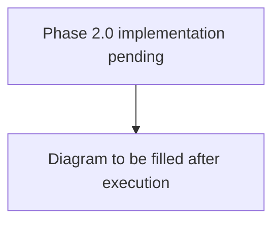

# Phase 2.0 Validation Report — Audio MVP (No Speaker ID)

**Version**: 0.1 (template)
**Last Updated**: TBD
**Status**: PENDING — Phase 2.0 execution not yet started
**Authority**: Gate criteria sourced from `/Users/pyw/new/MyRecall/v3/metrics/phase-gates.md`
**Detailed Plan**: `/Users/pyw/new/MyRecall/v3/plan/04-phase-2-detailed-plan.md`

---

## 1. Implemented

### Code Deliverables

| # | Component | File Path | Status |
|---|-----------|-----------|--------|
| 1 | AudioManager (sounddevice wrapper) | `openrecall/client/audio_manager.py` | ⬜️ |
| 2 | AudioRecorder (producer + buffer) | `openrecall/client/audio_recorder.py` | ⬜️ |
| 3 | UploaderConsumer audio dispatch | `openrecall/client/consumer.py` | ⬜️ |
| 4 | HTTPUploader.upload_audio_chunk() | `openrecall/client/uploader.py` | ⬜️ |
| 5 | Audio config settings | `openrecall/shared/config.py` | ⬜️ |
| 6 | VoiceActivityDetector (silero-vad) | `openrecall/server/audio/vad.py` | ⬜️ |
| 7 | WAV utilities | `openrecall/server/audio/wav_utils.py` | ⬜️ |
| 8 | WhisperTranscriber (faster-whisper) | `openrecall/server/audio/transcriber.py` | ⬜️ |
| 9 | AudioChunkProcessor (VAD→Whisper→DB→FTS) | `openrecall/server/audio/processor.py` | ⬜️ |
| 10 | AudioProcessingWorker (daemon thread) | `openrecall/server/audio/worker.py` | ⬜️ |
| 11 | v3_006 migration (audio_chunks status) | `openrecall/server/database/migrations/v3_006_add_audio_chunk_status.sql` | ⬜️ |
| 12 | SQLStore audio methods (~10 methods) | `openrecall/server/database/sql.py` | ⬜️ |
| 13 | Upload API audio detection | `openrecall/server/api_v1.py` | ⬜️ |
| 14 | Search engine audio FTS extension | `openrecall/server/search/engine.py` | ⬜️ |
| 15 | Unified timeline API (video + audio) | `openrecall/server/api_v1.py` | ⬜️ |
| 16 | Audio dedicated endpoints (/api/v1/audio/*) | `openrecall/server/api_v1.py` | ⬜️ |
| 17 | RetentionWorker audio extension | `openrecall/server/retention.py` | ⬜️ |
| 18 | Audio worker startup + shutdown | `openrecall/server/app.py`, `openrecall/server/__main__.py` | ⬜️ |
| 19 | Degradation handlers | Multiple files | ⬜️ |

### Test Deliverables

| # | Test File | Scope | Tests | Status |
|---|-----------|-------|-------|--------|
| 1 | `tests/test_phase2_audio_manager.py` | AudioManager lifecycle, WAV format | TBD | ⬜️ |
| 2 | `tests/test_phase2_audio_recorder.py` | AudioRecorder metadata, checksum, buffer | TBD | ⬜️ |
| 3 | `tests/test_phase2_vad.py` | VAD speech detection, thresholds | TBD | ⬜️ |
| 4 | `tests/test_phase2_transcriber.py` | Whisper output format, latency | TBD | ⬜️ |
| 5 | `tests/test_phase2_ingestion.py` | Upload → process → transcriptions | TBD | ⬜️ |
| 6 | `tests/test_phase2_worker.py` | Worker lifecycle, retention | TBD | ⬜️ |
| 7 | `tests/test_phase2_search.py` | Audio FTS search integration | TBD | ⬜️ |
| 8 | `tests/test_phase2_timeline.py` | Unified timeline (video + audio) | TBD | ⬜️ |
| 9 | `tests/test_phase2_performance.py` | Latency, throughput, CPU benchmarks | TBD | ⬜️ |
| 10 | `tests/test_phase2_quality.py` | WER measurement (clean + noisy) | TBD | ⬜️ |
| 11 | `tests/test_phase2_gates.py` | All Phase 2.0 gates | TBD | ⬜️ |

---

## 2. Verification Evidence

### Test Suite Output

```
# To be populated after execution
# python -m pytest tests/test_phase2_*.py -v --tb=short
```

### API Smoke Test

```
# To be populated after execution
# POST /api/v1/upload (audio/wav)
# GET /api/v1/search?q=<known_phrase>
# GET /api/v1/timeline?start=...&end=...
# GET /api/v1/audio/transcriptions
# GET /api/v1/audio/chunks
```

### Pipeline Stress Test

```
# To be populated after execution
# 1-hour continuous recording → processing → search verification
```

---

## 3. Metrics vs Gates

### Phase 2.0 Functional Gates

| Gate ID | Gate | Criteria | Actual | Status |
|---------|------|----------|--------|--------|
| 2-F-01 | Audio Capture Working | Both system audio and microphone captured for 1 hour. Verify audio chunk files created, playable. | TBD | ⬜️ |
| 2-F-02 | VAD Filtering | Only speech segments transcribed (silence skipped). Compare total audio vs transcribed duration (expect <50%). | TBD | ⬜️ |
| 2-F-03 | Whisper Transcription | All speech segments transcribed and stored in DB. Query `SELECT COUNT(*) FROM audio_transcriptions` after 1 hour. | TBD | ⬜️ |
| 2-F-04 | Audio FTS Indexed | Transcriptions searchable via FTS. Query `audio_fts` for known phrase, verify result returned. If implementation uses `audio_transcriptions_fts`, include mapping evidence. | TBD | ⬜️ |
| 2-F-05 | Unified Timeline | Timeline API returns both video frames AND audio transcriptions. `GET /api/v1/timeline`, verify both. | TBD | ⬜️ |

### Phase 2.0 Performance Gates

| Gate ID | Gate | Target | Actual | Status |
|---------|------|--------|--------|--------|
| 2-P-01 | Transcription Latency | <30s for 30s segment (GPU) or <90s (CPU) | TBD | ⬜️ |
| 2-P-02 | VAD Processing | <1s per 30s segment | TBD | ⬜️ |
| 2-P-03 | Transcription Throughput | Keeps up with real-time (no backlog growth) | TBD | ⬜️ |
| 2-P-04 | Audio Capture CPU | <3% CPU per audio device | TBD | ⬜️ |

### Phase 2.0 Quality Gates

| Gate ID | Gate | Target | Actual | Status |
|---------|------|--------|--------|--------|
| 2-Q-01 | Transcription WER (Clean) | ≤15% WER on LibriSpeech test-clean | TBD | ⬜️ |
| 2-Q-02 | Transcription WER (Noisy) | ≤30% WER on real-world recordings | TBD | ⬜️ |

### Phase 2.0 Stability Gates

| Gate ID | Gate | Target | Actual | Status |
|---------|------|--------|--------|--------|
| 2-S-01 | 24-Hour Continuous Run | Zero crashes over 24 hours | TBD | ⬜️ |

### Phase 2.0 Resource Gates

| Gate ID | Gate | Target | Actual | Status |
|---------|------|--------|--------|--------|
| 2-R-01 | Whisper GPU VRAM | <500MB GPU memory | TBD | ⬜️ |
| 2-R-02 | Audio Storage | <2GB per day (system + mic, 16kHz WAV) | TBD | ⬜️ |

### Phase 2.0 Data Governance Gates

| Gate ID | Gate | Criteria | Actual | Status |
|---------|------|----------|--------|--------|
| 2-DG-01 | Audio File Encryption | Audio chunks stored with filesystem encryption | TBD | ⬜️ |
| 2-DG-02 | Transcription Redaction (Optional) | Transcripts can redact detected PII | TBD | ⬜️ |
| 2-DG-03 | Retention Policy Active | Audio >30 days auto-deleted | TBD | ⬜️ |

### Gate Summary

| Category | Total | Passed | Failed | Pending | Skipped |
|----------|-------|--------|--------|---------|---------|
| Functional (F) | 5 | 0 | 0 | 5 | 0 |
| Performance (P) | 4 | 0 | 0 | 4 | 0 |
| Quality (Q) | 2 | 0 | 0 | 2 | 0 |
| Stability (S) | 1 | 0 | 0 | 1 | 0 |
| Resource (R) | 2 | 0 | 0 | 2 | 0 |
| Data Governance (DG) | 3 | 0 | 0 | 3 | 0 |
| **Total** | **17** | **0** | **0** | **17** | **0** |

**Go/No-Go Decision**: PENDING

---

## 4. Known Issues & Follow-ups

_None yet — to be populated during Phase 2.0 execution._

---

## 5. Request → Processing → Storage → Retrieval Behavior Diagram



---

## 6. Last Updated

**Date**: TBD
**Author**: Solo Developer
**Status**: TEMPLATE — Awaiting Phase 2.0 execution
