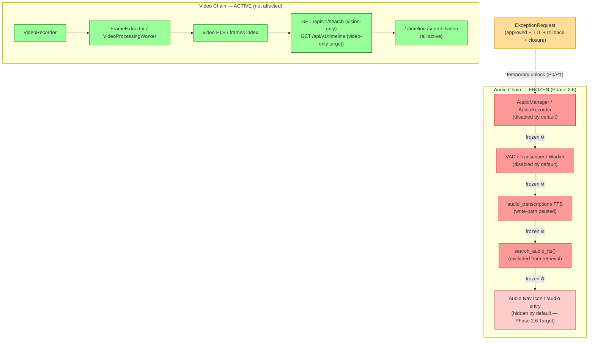

# Phase 2.6: Audio Freeze Governance — Validation Report

**Version**: Template 1.0（待执行期填充）
**Status**: ⬜️ Pending（本文件为模板；所有字段在 Phase 2.6 执行阶段填充；填充前不得预写 PASS / GO / Done）
**Gate Authority**: `v3/metrics/phase-gates.md` Phase 2.6 小节（唯一真源，禁止在本文件中改写 gate 定义）
**Detailed Plan**: `v3/plan/07-phase-2.6-audio-freeze-governance-detailed-plan.md`
**Evidence Directory**: `v3/evidence/phase2.6/`
**Last Updated**: 2026-02-25（初始模板创建）

---

## 1. Phase 概览

| 字段 | 内容 |
|------|------|
| Phase | 2.6 Audio Freeze Governance |
| 执行周期 | TBD（D1–D4） |
| Owner | Product Owner + Chief Architect |
| 前置 Phase | Phase 2.5（Status：✅ GO — 553 passed, `v3/results/phase-2.5-validation.md`） |
| 后置 Phase | Phase 2.7（Hard Block：需本 Phase 全部 `2.6-G-*` PASS） |
| Code Changes | NONE |
| Go/No-Go 结论 | **（待执行期填充）** |
| Go/No-Go 日期 | TBD |
| 审批者 | Product Owner: \_\_\_ / Chief Architect: \_\_\_ |

---

## 2. Gates Summary

> Gate 定义来源：`v3/metrics/phase-gates.md` Phase 2.6 小节（唯一真源）。
> 仅在 Phase 2.6 执行完成后填写结果列；模板阶段全部为 Pending。

| Gate ID | Gate 名称 | 类型 | Evidence Artifact（计划） | 结果 | 验证日期 | Reviewer |
|---------|-----------|------|--------------------------|------|---------|---------|
| **2.6-G-01** | Default Capture Pause | GATING | `v3/evidence/phase2.6/freeze_scope_matrix.md` + `20m_precheck_report.txt` + `24h_no_capture_report.txt` | ⬜️ Pending | TBD | Product Owner |
| **2.6-G-02** | Default Processing Pause | GATING | `v3/evidence/phase2.6/processing_path_manifest.txt` + `queue_worker_snapshot.txt` | ⬜️ Pending | TBD | Product Owner |
| **2.6-G-03** | UI and Retrieval Contract | GATING | `v3/webui/ROUTE_MAP.md`（更新版）+ `DATAFLOW.md`（更新版）+ `pages/audio.md`（Section 10） | ⬜️ Pending | TBD | Chief Architect |
| **2.6-G-04** | Exception Closure | GATING | `v3/evidence/phase2.6/exception_register.yaml` | ⬜️ Pending | TBD | Product Owner |
| **2.6-G-05** | Drift and Rollback Readiness | GATING | `v3/evidence/phase2.6/drift_audit_report.txt` + `rollback_drill_log.txt` | ⬜️ Pending | TBD | Chief Architect |

**Gate Summary（模板）**:
- PASS: 0 / 5
- NO-GO: 0 / 5
- Pending: 5 / 5
- **Overall**: ⬜️ Pending

---

## 3. GateEvidenceManifest

> 此表在执行期填充 `generated_at` 和 `result` 列。

| Gate ID | Artifact Path | Generated At | Validator | Result | Contract Scope | Exception Link |
|---------|--------------|--------------|-----------|--------|---------------|---------------|
| 2.6-G-01 | `v3/evidence/phase2.6/freeze_scope_matrix.md` | TBD | Product Owner | Pending | capture freeze | — |
| 2.6-G-01 | `v3/evidence/phase2.6/20m_precheck_report.txt` | TBD | Product Owner | Pending | 20m precheck evidence | — |
| 2.6-G-01 | `v3/evidence/phase2.6/24h_no_capture_report.txt` | TBD | Product Owner | Pending | 24h no-capture evidence | — |
| 2.6-G-02 | `v3/evidence/phase2.6/processing_path_manifest.txt` | TBD | Product Owner | Pending | processing freeze | — |
| 2.6-G-02 | `v3/evidence/phase2.6/queue_worker_snapshot.txt` | TBD | Product Owner | Pending | worker state snapshot | — |
| 2.6-G-03 | `v3/webui/ROUTE_MAP.md` | 2026-02-25（文档已更新） | Chief Architect | Pending verification | UI/retrieval contract | — |
| 2.6-G-03 | `v3/webui/DATAFLOW.md` | 2026-02-25（文档已更新） | Chief Architect | Pending verification | Target Dataflow contract | — |
| 2.6-G-03 | `v3/webui/pages/audio.md` | 2026-02-25（文档已更新） | Chief Architect | Pending verification | Audio page freeze status | — |
| 2.6-G-04 | `v3/evidence/phase2.6/exception_register.yaml` | TBD | Product Owner | Pending | exception governance | 见 register |
| 2.6-G-05 | `v3/evidence/phase2.6/drift_audit_report.txt` | TBD | Chief Architect | Pending | freeze integrity | — |
| 2.6-G-05 | `v3/evidence/phase2.6/rollback_drill_log.txt` | TBD | Chief Architect | Pending | rollback RTO < 2min | — |

---

## 4. Governance Evidence Summary

### 4.1 FreezeScopeMatrix 状态

> 填充说明：执行期对照 WB-01（Plan Section 5）逐行核查后填写。

| 维度 | 覆盖状态 | 核查日期 | 核查者 |
|------|---------|---------|--------|
| Capture | ⬜️ Pending | TBD | Product Owner |
| Processing | ⬜️ Pending | TBD | Product Owner |
| Indexing | ⬜️ Pending | TBD | Product Owner |
| Retrieval | ⬜️ Pending | TBD | Chief Architect |
| UI | ⬜️ Pending | TBD | Chief Architect |

### 4.2 ExceptionRequest Register 状态

> 执行期从 `v3/evidence/phase2.6/exception_register.yaml` 转录。

| Request ID | Severity | Status | TTL | Closure Evidence | Notes |
|-----------|---------|--------|-----|-----------------|-------|
| （执行期填充，若无例外申请则留空） | — | — | — | — | — |

**Register 结论**（Gate 2.6-G-04 依据）:
- OVERDUE 数量: \_\_\_（Pass 标准: 0）
- 未关闭 ACTIVE 数量: \_\_\_（Pass 标准: 0）
- 结果: ⬜️ Pending

### 4.3 双层采证（20 分钟预检 + 24h 正式验收）证据

> Gates 2.6-G-01 / 2.6-G-02 依据

```
# 执行期填充（从 v3/evidence/phase2.6/ 文件复制）

# 20 分钟预检
audio_chunks 20m baseline count:  [填充]
audio_chunks 20m final count:     [填充]
delta_20m:                        [填充]  # Pass 标准: 0

audio_transcriptions 20m baseline: [填充]
audio_transcriptions 20m final:    [填充]
delta_20m:                         [填充]  # Pass 标准: 0

# 24h 正式验收
audio_chunks 24h baseline count:  [填充]
audio_chunks 24h final count:     [填充]
delta_24h:                        [填充]  # Pass 标准: 0

audio_transcriptions 24h baseline: [填充]
audio_transcriptions 24h final:    [填充]
delta_24h:                         [填充]  # Pass 标准: 0

audio process detected:       [填充]  # Pass 标准: 空输出
```

### 4.4 Drift Audit 结果

> Gate 2.6-G-05 依据

```
# 执行期填充（从 v3/evidence/phase2.6/drift_audit_report.txt 复制）

git log --oneline 结果（audio 相关文件）:
[填充] # Pass 标准: 空（无未授权 commit）

unauthorized drift count: [填充]  # Pass 标准: 0
```

---

## 5. Failure Analysis（执行期填充）

> 若所有 gates 均 PASS，此节可简写为"N/A — All gates passed"。
> 若有 NO-GO gate，必须在此节详细记录原因和 remediation plan。

| Gate ID | Failure Description | Root Cause | Remediation Plan | Scheduled Re-review |
|---------|-------------------|-----------|-----------------|-------------------|
| （执行期填充） | — | — | — | — |

---

## 6. Go/No-Go 结论

> **仅在 Phase 2.6 D4 评审会后填写，不得提前预写。**

| 项目 | 内容 |
|------|------|
| **结论** | ⬜️ Pending（未填充） |
| **评审日期** | TBD |
| **Product Owner 签字** | \_\_\_（姓名 / 日期） |
| **Chief Architect 签字** | \_\_\_（姓名 / 日期） |
| **下一步** | — |
| **Phase 2.7 是否解 block** | 否（Pending 2.6 GO） |

---

## 7. Architecture State（Mermaid — 执行期确认）



**图示说明**:
- 红色节点（❄️ frozen）：Audio chain — 全链路默认冻结
- 绿色节点（active）：Video chain — 不受 Phase 2.6 影响
- 黄色节点（ExceptionRequest）：唯一合法的临时例外路径（需审批 + TTL + closure evidence）

---

*本模板由 Phase 2.6 规划代理创建于 2026-02-25。执行期由 Product Owner 负责填充并在 D4 Go/No-Go 评审后定稿。*
