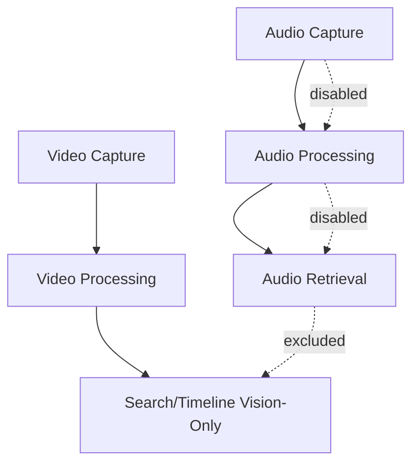

# Phase 2.6: Audio Hard Shutdown — Validation Report

**Version**: Template 2.0（待执行期填充）
**Status**: ⬜️ Pending（模板态，禁止预写 PASS / GO）
**Gate Authority**: `v3/metrics/phase-gates.md` Phase 2.6 小节（唯一真源）
**Detailed Plan**: `v3/plan/07-phase-2.6-audio-freeze-governance-detailed-plan.md`
**Evidence Directory**: `v3/evidence/phase2.6/`
**Last Updated**: 2026-02-25

---

## 1. Phase 概览

| 字段 | 内容 |
|------|------|
| Phase | 2.6 Audio Hard Shutdown |
| 执行周期 | TBD（D1–D5） |
| Owner | Product Owner + Chief Architect |
| 前置 Phase | Phase 2.5（✅ GO） |
| 后置 Phase | Phase 2.7（Hard Block：需 `2.6-G-*` 全部 PASS） |
| Go/No-Go 结论 | **待填充** |
| Go/No-Go 日期 | TBD |

---

## 2. Gates Summary

| Gate ID | Gate 名称 | Evidence Artifact（计划） | 结果 | 验证日期 | Reviewer |
|---------|-----------|---------------------------|------|---------|---------|
| **2.6-G-01** | Capture Off | `24h_capture_delta.txt` | ⬜️ Pending | TBD | Product Owner |
| **2.6-G-02** | Processing Off | `24h_processing_delta.txt` | ⬜️ Pending | TBD | Product Owner |
| **2.6-G-03** | Retrieval Off | `retrieval_contract_checks.txt` | ⬜️ Pending | TBD | Chief Architect |
| **2.6-G-04** | UI Off | `ui_surface_checks.txt` | ⬜️ Pending | TBD | Chief Architect |
| **2.6-G-05** | Anti-Bypass | `anti_bypass_checks.txt` | ⬜️ Pending | TBD | Product Owner |

**Gate Summary（模板）**:
- PASS: 0 / 5
- NO-GO: 0 / 5
- Pending: 5 / 5
- Overall: ⬜️ Pending

---

## 3. GateEvidenceManifest

| Gate ID | Artifact Path | Generated At | Validator | Result | Notes |
|---------|---------------|--------------|-----------|--------|-------|
| 2.6-G-01 | `v3/evidence/phase2.6/24h_capture_delta.txt` | TBD | Product Owner | Pending | `audio_chunks` 增量应为 0 |
| 2.6-G-02 | `v3/evidence/phase2.6/24h_processing_delta.txt` | TBD | Product Owner | Pending | `audio_transcriptions` 增量应为 0；无 audio worker |
| 2.6-G-03 | `v3/evidence/phase2.6/retrieval_contract_checks.txt` | TBD | Chief Architect | Pending | timeline/search audio count = 0 |
| 2.6-G-04 | `v3/evidence/phase2.6/ui_surface_checks.txt` | TBD | Chief Architect | Pending | 主导航与主流程无 audio 入口 |
| 2.6-G-05 | `v3/evidence/phase2.6/anti_bypass_checks.txt` | TBD | Product Owner | Pending | 配置/模式绕过失败 |

---

## 4. Evidence Fill Blocks（执行期填充）

### 4.1 Capture Off（2.6-G-01）

```text
audio_chunks baseline_count: [填充]
audio_chunks final_count:    [填充]
audio_chunks delta_24h:      [填充]  # PASS 标准: 0
```

### 4.2 Processing Off（2.6-G-02）

```text
audio_transcriptions baseline_count: [填充]
audio_transcriptions final_count:    [填充]
audio_transcriptions delta_24h:      [填充]  # PASS 标准: 0
active_audio_workers:                [填充]  # PASS 标准: none
```

### 4.3 Retrieval Off（2.6-G-03）

```text
/api/v1/search tested_paths audio_items:   [填充]  # PASS: 0
/api/v1/timeline tested_paths audio_items: [填充]  # PASS: 0
```

### 4.4 UI Off（2.6-G-04）

```text
main_nav_has_audio_entry: [填充]  # PASS: false
primary_flow_has_audio_link: [填充]  # PASS: false
```

### 4.5 Anti-Bypass（2.6-G-05）

```text
audio_env_toggle_reenabled_chain: [填充]  # PASS: false
runtime_mode_toggle_reenabled_chain: [填充]  # PASS: false
```

---

## 5. Failure Analysis（执行期填充）

| Gate ID | Failure Description | Root Cause | Remediation Plan | Scheduled Re-review |
|---------|-------------------|-----------|-----------------|-------------------|
| （执行期填充） | — | — | — | — |

---

## 6. Go/No-Go 结论（执行期填充）

| 项目 | 内容 |
|------|------|
| 结论 | ⬜️ Pending |
| 评审日期 | TBD |
| Product Owner 签字 | ___ |
| Chief Architect 签字 | ___ |
| Phase 2.7 是否解 block | 否（Pending 2.6 GO） |

---

## 7. Architecture State (Target)



*本模板由 2026-02-25 Phase 2.6 hard-shutdown 路线生成。*
