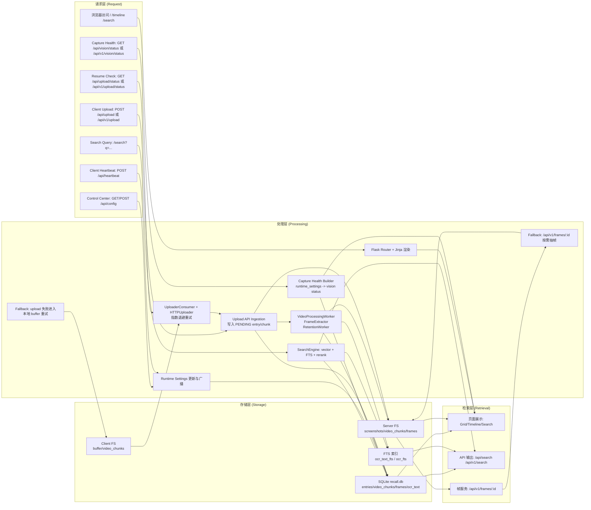
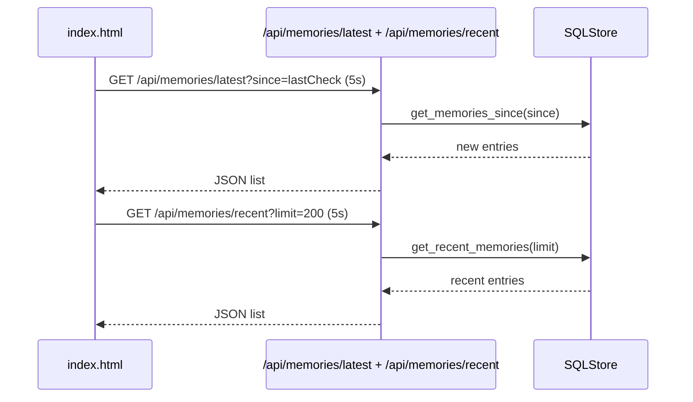
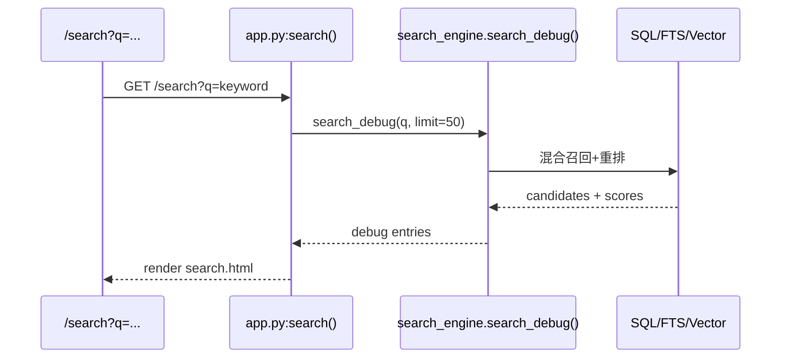
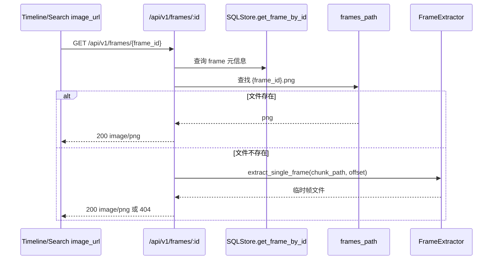
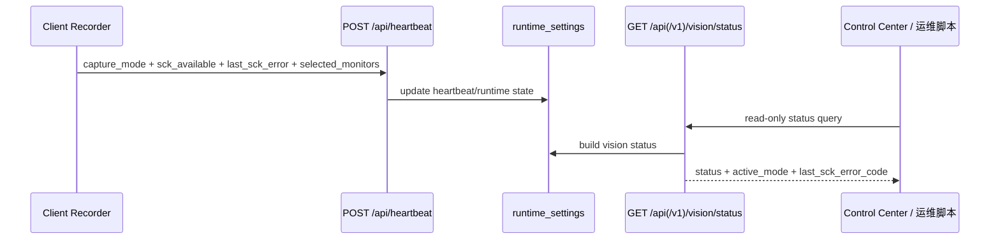

# WebUI 全局数据流（Request -> Processing -> Storage -> Retrieval）

## 1. 主链路图

## 2. 分层说明

### Request
- 页面请求来自浏览器：`/`、`/timeline`、`/search`。
- 控制请求来自 Control Center：`GET/POST /api/config`。
- 心跳请求来自 client：`POST /api/heartbeat`，用于 UI 在线状态显示。
- 上传请求来自 client uploader：`POST /api/upload` 与 `POST /api/v1/upload`。
- 断点续传状态查询：`GET /api/upload/status` 与 `GET /api/v1/upload/status`。
- 采集健康诊断查询：`GET /api/vision/status` 与 `GET /api/v1/vision/status`。

### Processing
- Flask 路由层负责页面渲染与 API 转发。
- SearchEngine 负责检索融合与结果排序。
- Runtime settings 负责运行时开关一致性。
- Capture health builder 从 `runtime_settings` 生成只读诊断视图（`status/active_mode/last_sck_error_code/...`）。
- Upload API 负责接收截图/视频并写入 PENDING 记录，再交由 worker 处理。
- Worker 管道负责采集后数据处理（抽帧/OCR/清理），间接影响 WebUI 展示内容。

### Storage
- `recall.db`：页面核心数据来源（entries + video tables）。
- FTS：文本检索索引来源。
- Server FS：图片、视频分片、帧文件。
- Client FS：上传失败时缓冲。

### Retrieval
- Web 页面主要通过 server 渲染与 API 拉取展示结果。
- 搜索页可视化显示多阶段评分字段（debug 视角）。
- 帧服务支持“已存在文件直出 + 按需抽帧 fallback”。
- Control Center 排障可配合 capture health 端点确认当前是 `monitor_id`、`legacy` 还是 `paused`。

## 3. 关键子链路

### 3.1 Home Grid 增量刷新链路

> 数据新鲜度说明：若上传处于退避重试阶段，Home Grid 的增量刷新会正常执行，但可见数据会延后出现。

### 3.2 Search 页面链路

### 3.3 Timeline 帧回退链路

### 3.4 Capture 健康观测链路

## 4. 失效与降级路径（必须可解释）

1. 上传失败：client 将内容留在本地 buffer，后续经 UploaderConsumer 按退避策略重试上传到 API，再进入 worker 管道；WebUI 可见数据延迟更新。
2. 心跳中断：Control Center 显示 `Offline`，但页面可继续查看已有数据。
3. 帧文件缺失：`/api/v1/frames/:id` 尝试按需抽帧，失败才返回 404。
4. 搜索 debug 视频-only 场景：已在 Phase 1 修复渲染崩溃路径。
5. SCK 启动异常：client 先按短退避重试；达阈值后降级 legacy；若配置允许则周期性 probe 并自动回切 monitor-id。

## 5. 证据来源

- `/Users/pyw/new/MyRecall/openrecall/server/app.py`
- `/Users/pyw/new/MyRecall/openrecall/server/api.py`
- `/Users/pyw/new/MyRecall/openrecall/server/api_v1.py`
- `/Users/pyw/new/MyRecall/openrecall/server/templates/layout.html`
- `/Users/pyw/new/MyRecall/openrecall/server/templates/index.html`
- `/Users/pyw/new/MyRecall/v3/results/phase-1-post-baseline-changelog.md`
