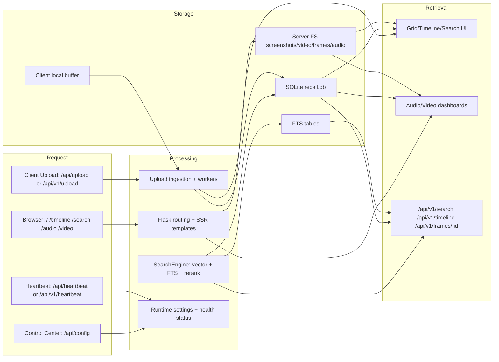

# WebUI 全局数据流（Current vs Target）

## 1. Current Dataflow (Verified)

## 2. Current Behavior Highlights

1. `/search` SSR route currently uses `q` as primary switch.
2. `/api/v1/search` empty `q` currently returns empty paginated payload.
3. `/api/v1/timeline` currently merges video + audio by default and supports `source` filtering.
4. SearchEngine still has audio FTS merge path in current implementation.

## 3. Target Dataflow (Phase 3/4 Contract)

1. `GET /api/v1/search` becomes canonical bounded retrieval primitive.
2. Empty `q` enters browse/feed over bounded time range.
3. Search/Chat grounding uses vision-only evidence path; audio candidates are excluded by default.
4. Timeline 默认/标准路径为 video-only；audio 不在主检索路径返回。
5. WebUI default navigation does not expose audio dashboard entrypoints.
6. **Audio Hard Shutdown 全链路契约（Phase 2.6）**: capture（AudioManager/AudioRecorder 关闭）→ processing（VAD/Transcriber/Worker 关闭）→ indexing（audio_transcriptions FTS 写入关闭）→ retrieval（search/timeline 默认与标准路径不返回 audio）→ UI（主导航与主流程无 `/audio` 入口）；无 Exception 开窗流程，偏差即失败信号并触发 `2.6-G-*` 重验证。

## 4. Failure and Degradation Paths (Current)

1. 上传失败：client 保留本地 buffer 并按退避重试。
2. 心跳中断：Control Center 显示 offline，但历史数据仍可读。
3. 帧文件缺失：`/api/v1/frames/:id` 触发按需抽帧 fallback。
4. dashboard 无数据：显示空态，不阻断页面加载。
5. **Audio Hard Shutdown 违规应急（Phase 2.6 Playbook）**: 若检测到 AudioManager/AudioRecorder 或音频处理链路被激活，立即停止相关进程（RTO < 2 分钟）；检查 `audio_chunks`/`audio_transcriptions` delta；记录 incident 到 `v3/results/phase-2.6-validation.md` Failure Analysis；修复后重跑 `2.6-G-01/02/05`。

## 5. Screenpipe 对齐层级

- `semantic`：检索过滤、排序、browse 心智模型。
- `discipline`：有界时间范围与小批量查询实践。
- `divergence`：MyRecall MVP 的 vision-only grounding 与阶段性冻结策略。

## 6. 文档维护要求

- 每次修改 Search/Timeline 契约，必须同步更新：
  1. `v3/milestones/roadmap-status.md`
  2. `v3/decisions/ADR-0006-screenpipe-search-contract.md`
  3. `v3/webui/pages/search.md`
- **Phase 2.6 Audio Hard Shutdown 契约维护规则**：任何涉及 audio 模块路径（AudioManager/AudioRecorder/VAD/Transcriber/Worker）的变更，必须同步更新本文件与 `v3/webui/ROUTE_MAP.md`，并重新验证受影响的 `2.6-G-*` gates。禁止通过配置或运行模式临时恢复 audio 主链路。
