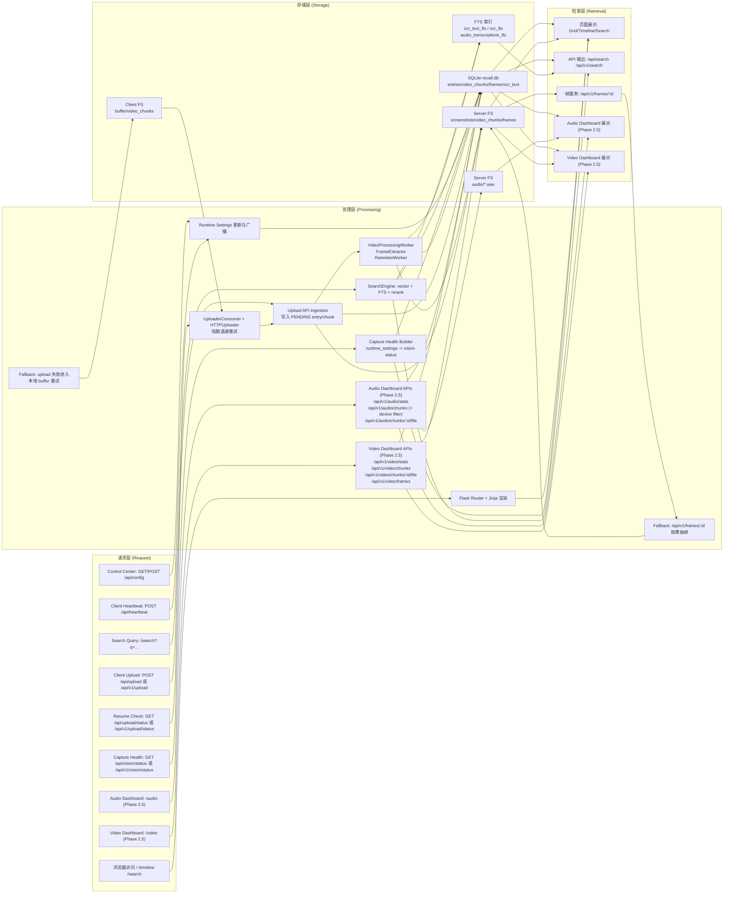
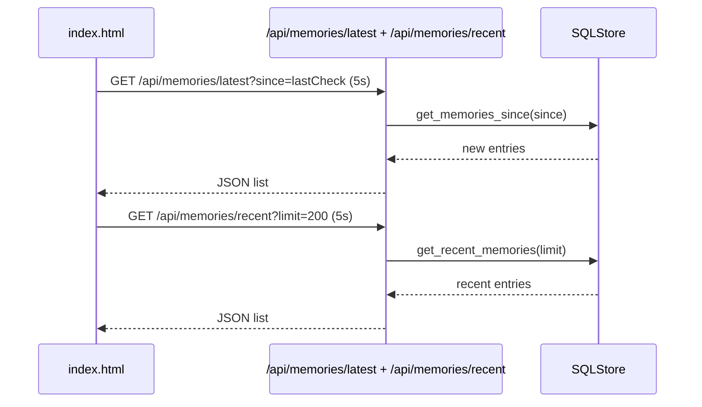
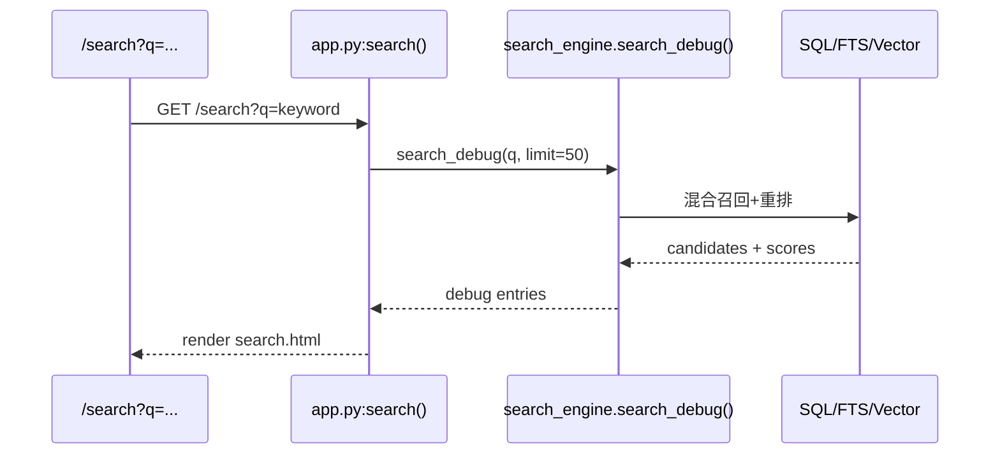
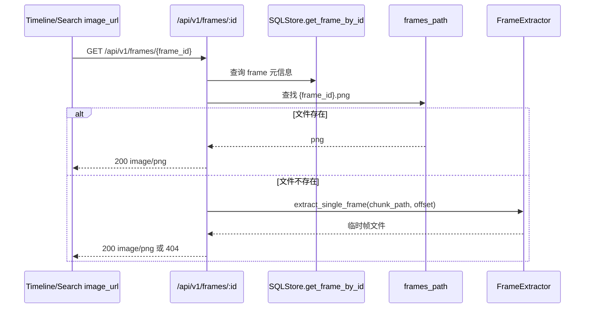
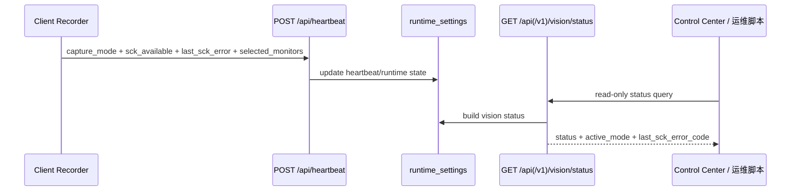
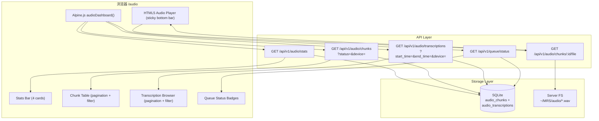
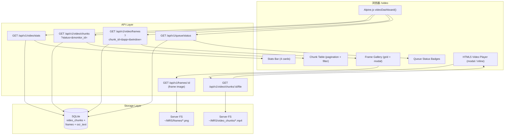

# WebUI 全局数据流（Request -> Processing -> Storage -> Retrieval）

## 1. 主链路图

## 2. 分层说明

### Request
- 页面请求来自浏览器：`/`、`/timeline`、`/search`。
- **Phase 2.5**：新增 `/audio` 和 `/video` dashboard 页面请求。
- 控制请求来自 Control Center：`GET/POST /api/config`。
- 心跳请求来自 client：`POST /api/heartbeat`，用于 UI 在线状态显示。
- 上传请求来自 client uploader：`POST /api/upload` 与 `POST /api/v1/upload`。
- 断点续传状态查询：`GET /api/upload/status` 与 `GET /api/v1/upload/status`。
- 采集健康诊断查询：`GET /api/vision/status` 与 `GET /api/v1/vision/status`。

### Processing
- Flask 路由层负责页面渲染与 API 转发。
- SearchEngine 负责检索融合与结果排序。
- Runtime settings 负责运行时开关一致性。
- Capture health builder 从 `runtime_settings` 生成只读诊断视图（`status/active_mode/last_sck_error_code/...`）。
- Upload API 负责接收截图/视频并写入 PENDING 记录，再交由 worker 处理。
- Worker 管道负责采集后数据处理（抽帧/OCR/清理），间接影响 WebUI 展示内容。
- Phase 1.5: Worker 管道新增 **metadata_resolver**（`app/window/focused/browser_url` 均按 `frame > chunk > null` 解析）和 **offset_guard**（帧-chunk 对齐预检验），在抽帧与帧写入之间执行；OCR 引擎名通过 `engine_name` 写入 `ocr_text.ocr_engine`。
- **Phase 2.5**：新增 Audio Dashboard APIs（`audio/stats`, `audio/chunks/:id/file`, extend `audio/chunks` with device filter）和 Video Dashboard APIs（`video/stats`, `video/chunks`, `video/chunks/:id/file`, `video/frames`），由新增 SQLStore 方法 `get_video_chunks_paginated()`、`get_frames_paginated()`、`get_video_stats()`、`get_audio_stats()` 驱动。

### Storage
- `recall.db`：页面核心数据来源（entries + video tables + audio tables）。
- FTS：文本检索索引来源（`ocr_text_fts`, `ocr_fts`, `audio_transcriptions_fts`）。
- Server FS：图片、视频分片、帧文件。
- **Phase 2.5**：新增 `audio/*.wav` 文件 serving 路径。
- Client FS：上传失败时缓冲。

### Retrieval
- Web 页面主要通过 server 渲染与 API 拉取展示结果。
- 搜索页可视化显示多阶段评分字段（debug 视角）。
- 帧服务支持"已存在文件直出 + 按需抽帧 fallback"。
- Phase 1.5: Timeline/Search 检索结果支持 `focused` (bool|null) 和 `browser_url` (string|null) 字段；`/api/v1/search` 中 video-frame 行返回真实值，snapshot 行返回 `null`（可选字段，兼容旧客户端）。
- Control Center 排障可配合 capture health 端点确认当前是 `monitor_id`、`legacy` 还是 `paused`。
- **Phase 2.5**：新增 Audio Dashboard（stats bar + chunk table + transcription browser + inline audio playback + queue status）和 Video Dashboard（stats bar + chunk table + frame gallery + inline video playback + queue status）。数据通过 SSR 注入 initial stats + Alpine.js client-side fetch 后续分页/过滤/刷新。

## 3. 关键子链路

### 3.1 Home Grid 增量刷新链路

> 数据新鲜度说明：若上传处于退避重试阶段，Home Grid 的增量刷新会正常执行，但可见数据会延后出现。

### 3.2 Search 页面链路

### 3.3 Timeline 帧回退链路

### 3.4 Capture 健康观测链路

## 4. 失效与降级路径（必须可解释）

1. 上传失败：client 将内容留在本地 buffer，后续经 UploaderConsumer 按退避策略重试上传到 API，再进入 worker 管道；WebUI 可见数据延迟更新。
2. 心跳中断：Control Center 显示 `Offline`，但页面可继续查看已有数据。
3. 帧文件缺失：`/api/v1/frames/:id` 尝试按需抽帧，失败才返回 404。
4. 搜索 debug 视频-only 场景：已在 Phase 1 修复渲染崩溃路径。
5. SCK 启动异常：client 先按短退避重试；达阈值后降级 legacy；若配置允许则周期性 probe 并自动回切 monitor-id。
6. **Phase 2.5** Audio/Video Dashboard 降级：
   - 无 chunks 数据：显示友好空态提示（"No audio/video chunks recorded yet"）。
   - API fetch 失败：Error banner + auto-retry 10s。
   - 媒体文件缺失（WAV/mp4 不在 disk 上）：API 返回 404 JSON；playback UI 显示 "File not available" toast。
   - 大视频文件：`<video preload="metadata">` 避免自动下载。
   - DB 表不存在（fresh install）：SQLStore 方法 guard 返回 zeros / empty list。

### 4.1 Audio Dashboard 数据流（Phase 2.5）

### 4.2 Video Dashboard 数据流（Phase 2.5）

## 5. 证据来源

- `/Users/pyw/new/MyRecall/openrecall/server/app.py`
- `/Users/pyw/new/MyRecall/openrecall/server/api.py`
- `/Users/pyw/new/MyRecall/openrecall/server/api_v1.py`
- `/Users/pyw/new/MyRecall/openrecall/server/templates/layout.html`
- `/Users/pyw/new/MyRecall/openrecall/server/templates/index.html`
- `/Users/pyw/new/MyRecall/v3/results/phase-1-post-baseline-changelog.md`

## 6. Phase 1.5 Evidence Matrix

| Change | Code Path | Test Command | Result | UTC Timestamp |
|---|---|---|---|---|
| Frame-level metadata flow uses resolver chain (`frame > chunk > null`) | `/Users/pyw/new/MyRecall/openrecall/server/video/metadata_resolver.py`, `/Users/pyw/new/MyRecall/openrecall/server/video/processor.py` | `python3 -m pytest tests/test_phase1_5_metadata_resolver.py -v` | 12 passed | 2026-02-08T07:50:52Z |
| Upload/process/retrieval flow carries `focused/browser_url` with null semantics | `/Users/pyw/new/MyRecall/openrecall/server/database/sql.py`, `/Users/pyw/new/MyRecall/openrecall/server/api_v1.py` | `python3 -m pytest tests/test_phase1_5_focused_browser_url.py -v` | 10 passed | 2026-02-08T07:50:52Z |
| Offset guard reject path observability in processing chain | `/Users/pyw/new/MyRecall/openrecall/server/video/processor.py` | `python3 -m pytest tests/test_phase1_5_offset_guard.py -v` | 8 passed | 2026-02-08T07:50:52Z |
| Full dataflow regression closure | `/Users/pyw/new/MyRecall/openrecall/server/video/metadata_resolver.py`, `/Users/pyw/new/MyRecall/openrecall/server/video/processor.py`, `/Users/pyw/new/MyRecall/openrecall/server/api_v1.py`, `/Users/pyw/new/MyRecall/openrecall/server/database/sql.py` | `python3 -m pytest tests/test_phase1_* -v` | 170 passed, 8 skipped | 2026-02-08T07:50:08Z |
