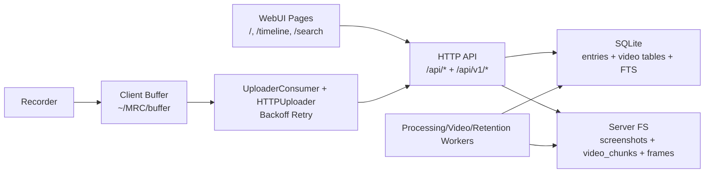

# WebUI 总览

## 1. 架构定位

MyRecall WebUI 是基于 Flask + Jinja 模板的服务器渲染界面，目标是：
- 让用户快速浏览采集结果（截图/视频帧）
- 提供时间线查看能力
- 提供搜索与调试可视化能力
- 提供运行时控制面（Control Center）

WebUI 本身不直接执行重计算任务，主要通过 HTTP API 驱动后端状态与数据展示。
WebUI 数据新鲜度受“client buffer -> uploader -> upload API -> worker”链路影响。

## 2. 页面矩阵

| 页面/组件 | URL | 模板 | 后端入口 | 核心用途 |
|---|---|---|---|---|
| Home Grid | `/` | `templates/index.html` | `app.py:index()` | 最近记忆网格浏览、状态观察、图片模态查看 |
| Timeline | `/timeline` | `templates/timeline.html` | `app.py:timeline()` | 按时间滑动查看截图/帧 |
| Search | `/search` | `templates/search.html` | `app.py:search()` | 搜索结果展示与调试评分可视化 |
| Control Center | 嵌入在上述页面 | `templates/layout.html` | 模板 JS + `/api/config` | 切换 recording/upload/AI/show AI 等运行时开关 |

## 3. 用户入口与常见路径

### 最小路径
1. 打开 `/` 查看最新记录。
2. 打开 `/timeline` 做时间回看。
3. 打开 `/search` 输入关键词定位信息。

### 运维路径
1. 在右上角打开 Control Center。
2. 调整 `recording_enabled`、`upload_enabled`、`ai_processing_enabled`、`ui_show_ai`。
3. 观察 `Connected/Offline` 状态判断 client 心跳是否正常。
4. 若关闭 `upload_enabled`，新数据会暂存本地 buffer，页面更新将延后到重新上传后。

## 4. 依赖关系

## 5. 设计边界

- WebUI 当前是传统 SSR + 少量前端脚本（Alpine.js + vanilla JS）。
- Phase 0/1 并未引入独立前端工程（例如 React/Vite）。
- Phase 1 重点在数据链路增强（视频帧、OCR、timeline/search API），不是 UI 重构。

## 6. 与 Roadmap 的关系

- 已实现：网格、时间线、搜索、控制面。
- 规划中：统一多模态检索、Chat 页面与 tool-call 可视化（见 roadmap 的 Phase 3/4）。
