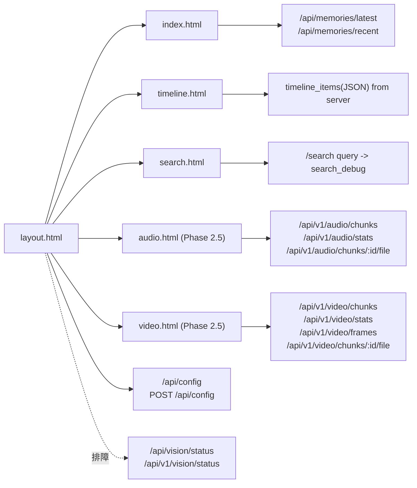
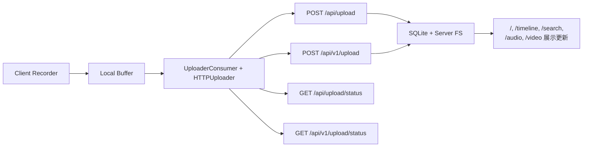

# WebUI 路由与接口映射

## 1. 页面路由映射

| 页面 | URL | Flask Handler | 模板 | 说明 |
|---|---|---|---|---|
| Home Grid | `/` | `openrecall/server/app.py:index()` | `openrecall/server/templates/index.html` | 默认落地页，展示 recent memories |
| Timeline | `/timeline` | `openrecall/server/app.py:timeline()` | `openrecall/server/templates/timeline.html` | 时间滑杆浏览 |
| Search | `/search` | `openrecall/server/app.py:search()` | `openrecall/server/templates/search.html` | 查询与结果调试展示 |
| Control Center | 嵌入布局（无单独 URL） | `layout.html` 中前端脚本 | `openrecall/server/templates/layout.html` | 全局运行时开关 |
| Audio Dashboard | `/audio` | `openrecall/server/app.py:audio()` | `openrecall/server/templates/audio.html` | Audio pipeline dashboard |
| Video Dashboard | `/video` | `openrecall/server/app.py:video()` | `openrecall/server/templates/video.html` | Video pipeline dashboard |

## 2. 页面模板关系

## 3. Control Center 接口映射

| 功能 | 前端触发 | API | 方法 | 说明 |
|---|---|---|---|---|
| 拉取配置 | `refreshConfig()` | `/api/config` | `GET` | 每 5 秒轮询 |
| 修改开关 | `toggleSetting(key)` | `/api/config` | `POST` | 更新 `recording_enabled/upload_enabled/ai_processing_enabled/ui_show_ai` |
| 采集健康诊断 | 手工调用（排障） | `/api/vision/status` | `GET` | 返回 `status/active_mode/last_sck_error_code/selected_monitors` |
| 事件广播 | `openrecall-config-changed` | 前端事件 | - | 通知页面刷新数据 |
| 心跳（由 client 发起） | Client runtime | `/api/heartbeat` | `POST` | 更新 `client_online` 状态 |

## 4. 页面依赖 API（本计划要求）

### 4.1 Legacy API

| API | 用途 | 主要调用方 |
|---|---|---|
| `GET /api/memories/recent` | 拉取最近记忆（含状态更新） | `index.html` |
| `GET /api/memories/latest` | 拉取增量记忆 | `index.html` |
| `GET /api/search` | 旧搜索接口（JSON） | 外部调用/兼容 |
| `GET /api/config` | 读运行时配置 | `layout.html` |
| `POST /api/config` | 写运行时配置 | `layout.html` |
| `POST /api/heartbeat` | 客户端心跳 | client 进程（间接影响 UI） |
| `GET /api/vision/status` | 采集健康诊断（只读） | Control Center 排障/运维脚本 |
| `POST /api/upload` | 截图/视频入口（视频会转发到 v1 视频处理） | client uploader（间接影响 UI 数据新鲜度） |
| `GET /api/upload/status` | 上传断点状态查询 | client uploader（间接影响 UI 数据新鲜度） |

### 4.2 v1 API

| API | 用途 | 与 WebUI 的关系 |
|---|---|---|
| `GET /api/v1/search` | v1 检索 | 目前页面主入口是 `/search`，但 v1 是远程优先标准接口 |
| `GET /api/v1/timeline` | 时间范围分页查询 | timeline 数据源能力（server 侧可接入） |
| `GET /api/v1/frames/:id` | 帧图片服务（含按需抽帧 fallback） | timeline/search 的 `image_url` 可指向该接口 |
| `GET /api/v1/config` | v1 配置读取 | 与 legacy config 语义一致（供远程模式） |
| `POST /api/v1/config` | v1 配置更新 | 与 legacy config 语义一致（供远程模式） |
| `POST /api/v1/heartbeat` | v1 心跳 | 远程模式下可替代 legacy heartbeat |
| `GET /api/v1/vision/status` | v1 采集健康诊断（只读） | 远程模式排障入口 |
| `POST /api/v1/upload` | v1 视频上传入口 | client uploader（间接影响 UI 数据新鲜度） |
| `GET /api/v1/upload/status` | v1 上传断点状态查询 | client uploader（间接影响 UI 数据新鲜度） |

### 4.3 Phase 1.5 API Response Extensions

Phase 1.5 在 timeline/search 返回中支持以下可选字段（向后兼容，旧客户端忽略新字段）：

| Field | Type | Source | Before Phase 1.5 | After Phase 1.5 | Breaking? |
|---|---|---|---|---|---|
| `focused` | `bool \| null` | `frames.focused` | _(absent)_ | `true`/`false`/`null` | No (additive) |
| `browser_url` | `string \| null` | `frames.browser_url` | _(absent)_ | URL string or `null` | No (additive) |

适用接口：
- `GET /api/v1/timeline` — 每个 frame dict 包含 `focused` 和 `browser_url`
- `GET /api/v1/search` — video-frame 结果返回真实 `focused/browser_url`，snapshot 结果返回 `null`（字段始终可选）
- `GET /api/memories/recent` / `GET /api/memories/latest` — frame memories 包含 `focused` 和 `browser_url`

NULL 语义：`null` = 未知（非 `false` / 非空字符串）。

### 4.4 Phase 2.5 API — Audio/Video Dashboard

Phase 2.5 新增以下 API endpoints 供 `/audio` 和 `/video` dashboard 页面使用：

| API | 方法 | 关键参数 | 返回摘要 | 与 WebUI 的关系 |
|---|---|---|---|---|
| `GET /api/v1/video/chunks` | GET | `limit/offset`, `status`, `monitor_id` | 分页 video chunks 列表 | `/video` chunk table 数据源 |
| `GET /api/v1/video/chunks/<id>/file` | GET | `chunk_id` (path) | `video/mp4` file (send_from_directory) | `/video` inline video playback |
| `GET /api/v1/video/frames` | GET | `limit/offset`, `chunk_id`, `app`, `window`, `start_time/end_time` | 分页 frames 列表（含 OCR text snippet） | `/video` frame gallery 数据源 |
| `GET /api/v1/video/stats` | GET | 无 | `{total_chunks, total_frames, total_duration_seconds, storage_bytes, status_counts}` | `/video` stats bar |
| `GET /api/v1/audio/chunks/<id>/file` | GET | `chunk_id` (path) | `audio/wav` file (send_from_directory) | `/audio` inline audio playback |
| `GET /api/v1/audio/stats` | GET | 无 | `{total_chunks, total_transcriptions, total_duration_seconds, storage_bytes, status_counts, device_counts}` | `/audio` stats bar |

**扩展已有 endpoint**:

| API | 新增参数 | 说明 | Breaking? |
|---|---|---|---|
| `GET /api/v1/audio/chunks` | `device` (optional) | 按 `device_name` 过滤（additive，无参数时行为不变） | No |

**复用已有 endpoints（无变更）**:
- `GET /api/v1/frames/:id` — frame gallery 图片源（Phase 1 已有）
- `GET /api/v1/queue/status` — queue status badges 数据源（Phase 2.0 已有）
- `GET /api/v1/audio/chunks` — audio chunk table 基础数据源（Phase 2.0 已有）
- `GET /api/v1/audio/transcriptions` — transcription browser 数据源（Phase 2.0 已有）
- `GET /api/config` — Control Center 配置（Phase 0 已有）

## 5. 上传链路与页面可见性映射

说明：
- `upload_enabled=false` 时，client 会继续采集但上传会暂停，页面更新可能延迟。
- 上传恢复后，buffer 数据回放上传，页面展示会追平。

## 6. Route Consistency Checklist

- [x] `app.py` 中页面路由：`/`、`/timeline`、`/search`、`/audio`、`/video`
- [x] `app.py` `/audio`、`/video` 路由（Phase 2.5 Complete）
- [x] Control Center 为布局内组件，无单独页面路由
- [x] `api.py` 与 `api_v1.py` 均存在 `config/heartbeat/search`
- [x] `api.py` 与 `api_v1.py` 均存在 `vision/status`
- [x] `api_v1.py` 存在 `timeline` 与 `frames/:id`
- [x] `api.py` 与 `api_v1.py` 均存在 `upload` 与 `upload/status`
- [x] `api_v1.py` 新增 `video/chunks`, `video/chunks/<id>/file`, `video/frames`, `video/stats`, `audio/chunks/<id>/file`, `audio/stats`（Phase 2.5 Complete）
- [x] `api_v1.py` 现有 `audio/chunks` 扩展 `device` 参数（Phase 2.5 Complete）

## 7. 代码来源

- 页面路由：`/Users/pyw/new/MyRecall/openrecall/server/app.py`
- Legacy API：`/Users/pyw/new/MyRecall/openrecall/server/api.py`
- v1 API：`/Users/pyw/new/MyRecall/openrecall/server/api_v1.py`
- 布局模板：`/Users/pyw/new/MyRecall/openrecall/server/templates/layout.html`

## 8. Phase 1.5 Evidence Matrix

| Change | Code Path | Test Command | Result | UTC Timestamp |
|---|---|---|---|---|
| Timeline response includes additive optional `focused/browser_url` | `/Users/pyw/new/MyRecall/openrecall/server/database/sql.py`, `/Users/pyw/new/MyRecall/openrecall/server/api_v1.py` | `python3 -m pytest tests/test_phase1_5_focused_browser_url.py::TestTimelineAPIFocusedBrowserUrl::test_timeline_response_includes_focused_and_browser_url -v` | 1 passed | 2026-02-08T07:50:52Z |
| Search response keeps old fields and adds optional `focused/browser_url` for compatibility | `/Users/pyw/new/MyRecall/openrecall/server/api_v1.py` | `python3 -m pytest tests/test_phase1_5_focused_browser_url.py::TestSearchAPIFocusedBrowserUrlCompatibility -v` | 2 passed | 2026-02-08T07:50:52Z |
| SQL video search path reads and normalizes `focused/browser_url` | `/Users/pyw/new/MyRecall/openrecall/server/database/sql.py` | `python3 -m pytest tests/test_phase1_5_focused_browser_url.py::TestQueryReturnsFocusedBrowserUrl::test_search_video_fts_returns_focused_browser_url -v` | 1 passed | 2026-02-08T07:50:52Z |
| Route-level regression remains stable after additive fields | `/Users/pyw/new/MyRecall/openrecall/server/api_v1.py` | `python3 -m pytest tests/test_phase1_timeline_api.py tests/test_phase1_search_integration.py -v` | 28 passed | 2026-02-08T07:50:25Z |
