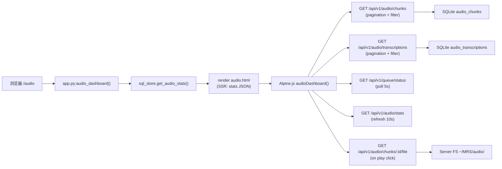

# Audio Dashboard 页面文档（`/audio`）

## 1. 页面定位

- 目标：Audio pipeline 综合 dashboard，提供 chunk 管理、媒体播放、transcription 浏览、队列状态和聚合统计。
- 目标用户：需要查看和管理 audio 采集数据的运维人员和开发者。
- 场景：检查 audio 采集状态、浏览 transcription 结果、播放 audio chunks、监控处理队列。

## 2. 入口与路由

- URL：`/audio`
- 后端路由：`/Users/pyw/new/MyRecall/openrecall/server/app.py` 中 `audio()`
- 模板文件：`/Users/pyw/new/MyRecall/openrecall/server/templates/audio.html`
- 布局依赖：`/Users/pyw/new/MyRecall/openrecall/server/templates/layout.html`

## 3. 功能清单

1. **Stats bar**：展示 4 个统计卡片（Total Chunks、Total Transcriptions、Total Duration、Storage Size）。
2. **Chunk 列表**：分页表格展示 audio chunks，支持 status/device 过滤。每行显示 ID、Device、Status、Created At、Duration、Checksum（截取）。
3. **Inline audio playback**：每个 chunk 行有 Play 按钮，点击后在页面底部 sticky bar 中使用 HTML5 `<audio>` 播放。`preload="metadata"` 避免自动下载大文件。
4. **Transcription browser**：分页列表展示 audio transcriptions（timestamp, device, text 截取, duration），支持 time range 和 device 过滤。
5. **Queue status**：4 个 colored badges 展示处理状态分布（Pending=yellow, Processing=blue, Completed=green, Failed=red）。每 5s 自动刷新。

限制与降级：
- 页面不提供搜索功能，搜索请使用 `/search`。
- 无 waveform 或 spectrum 可视化，使用浏览器原生 audio controls。
- `speaker_id` 始终为 NULL（Phase 2.0），不展示。
- 上传暂停/重试对数据新鲜度的影响：upload buffer 中的 audio chunks 在上传成功前不会出现在 chunk 列表中，页面展示可能有延迟。
- API fetch 失败时显示 error banner，10s 后自动重试。
- 无数据时显示友好的空态提示："No audio chunks recorded yet"。
- WAV 文件在 disk 上缺失时，playback UI 显示 "File not available" 提示。

## 4. 如何使用

### 最小路径
1. 打开 `/audio`。
2. 查看 stats bar 了解 audio pipeline 概况。
3. 浏览 chunk 列表和 transcription 列表。

### 常见路径
1. 在 `/audio` 查看 chunk status 分布。
2. 使用 device filter 过滤特定设备（如 "microphone"）。
3. 点击 chunk 的 Play 按钮播放 audio。
4. 查看 transcription browser 阅读转写文本。
5. 如需文本搜索，切换到 `/search`。

## 5. 数据流与 Pipeline

关键数据对象：
- `stats`: `{total_chunks, total_transcriptions, total_duration_seconds, storage_bytes, status_counts, device_counts}` — SSR 注入 + 周期性刷新。
- `chunks[]`: paginated audio_chunks list with status/device metadata。
- `transcriptions[]`: paginated audio_transcriptions list。
- `queueStatus`: from `/api/v1/queue/status`, 包含 `audio_queue` object。
- Audio file source: `/api/v1/audio/chunks/{id}/file` returns `audio/wav`。

## 6. 依赖接口

| 接口 | 方法 | 关键参数 | 返回摘要 |
|---|---|---|---|
| `/audio` | GET | 无 | SSR 页面 + stats JSON |
| `/api/v1/audio/chunks` | GET | `limit/offset`, `status`, `device` | 分页 audio chunks 列表 |
| `/api/v1/audio/chunks/:id/file` | GET | `chunk_id` | WAV audio file (audio/wav) |
| `/api/v1/audio/transcriptions` | GET | `limit/offset`, `start_time/end_time`, `device_name` | 分页 transcriptions 列表 |
| `/api/v1/audio/stats` | GET | 无 | Audio 聚合统计 |
| `/api/v1/queue/status` | GET | 无 | 处理队列状态 (audio_queue + video_queue) |
| `/api/config` | GET | 无 | Runtime config (Control Center 使用) |

## 7. 前后变化（相比之前）

| 维度 | 之前 | 当前 |
|---|---|---|
| 页面形态 | 无独立 audio 页面；audio 数据仅通过 `/api/v1/timeline` 和 `/search` 间接展示 | 独立 Audio Dashboard with chunk management + playback + transcription browser |
| 数据可视化 | Transcription text 仅在 timeline/search 结果中出现 | Dedicated transcription browser with pagination + device filter |
| 媒体播放 | 无 audio playback | HTML5 `<audio>` inline playback support |
| 队列监控 | 仅通过 `/api/v1/queue/status` API 获取 | Dashboard 页面直接展示 queue status badges |
| 统计概览 | 无 audio 聚合统计 UI | Stats bar 展示 total chunks/transcriptions/duration/storage |
| API 覆盖 | `GET /api/v1/audio/chunks`（无 device filter）、`GET /api/v1/audio/transcriptions` | 新增 `audio/chunks/:id/file` + `audio/stats` + extend chunks with `device` filter |
| Navigation | 3 page icons (Home/Timeline/Search) + Control Center | 5 page icons (+Audio/Video) |

变化原因与影响：
- 原因：Phase 2.0 完成了 audio pipeline engineering，但缺少专属 UI 入口。用户需要一个集中查看和管理 audio 数据的 dashboard。
- 影响：运维人员可直接在 browser 中检查 audio pipeline 健康状态、播放 audio chunks、浏览 transcription 结果，减少对命令行检查的依赖。

## 8. 故障与排查

1. 症状：Audio playback 无声或失败。
- 检查：chunk 对应的 WAV 文件是否存在于 `~/MRS/audio/` 目录。
- 定位：`GET /api/v1/audio/chunks/{id}/file` 是否返回 200 或 404。
- 补充：检查 browser console 是否有 CORS 或 MIME type 错误。

2. 症状：Chunk 列表为空（但确实有 audio 采集）。
- 检查：audio chunks 是否已上传到 server（client buffer 中是否有堆积）。
- 定位：`GET /api/v1/queue/status` 查看 audio_queue。UploaderConsumer 日志检查 upload 状态。

3. 症状：Stats 全为 0。
- 检查：audio_chunks 和 audio_transcriptions 表是否有数据。
- 定位：`sqlite3 ~/MRS/db/openrecall.db "SELECT COUNT(*) FROM audio_chunks"`

4. 症状：Transcription browser 为空但 chunks 状态为 COMPLETED。
- 检查：AudioChunkProcessor 是否成功写入了 audio_transcriptions。
- 定位：`sqlite3 ~/MRS/db/openrecall.db "SELECT COUNT(*) FROM audio_transcriptions"`

5. 症状：Device filter 无效果。
- 检查：filter 值是否与 audio_chunks.device_name 精确匹配。
- 定位：`GET /api/v1/audio/chunks?device=microphone` 手动测试。

## 9. 测试与验收点

- [x] `/audio` 页面可正常渲染（GET /audio → 200）。
- [x] Stats bar 展示正确数据（与 API 返回一致）。
- [x] Chunk 列表分页正常工作（next/prev page）。
- [x] Status filter 生效（COMPLETED/PENDING/FAILED）。
- [x] Device filter 生效。
- [x] Play button 点击后 audio 播放（HTML5 `<audio>` controls 出现）。
- [x] Transcription browser 分页正常工作。
- [x] Transcription browser time range filter 生效。
- [x] Queue status badges 正确反映处理状态。
- [x] 空数据库时显示友好空态提示。
- [x] WAV 文件缺失时 playback 显示 error 而非 crash。
- [x] Navigation 中 Audio icon 在 `/audio` 页面 highlighted。
- [x] 不影响已有页面（`/`, `/timeline`, `/search`）。

相关验证来源：
- `/Users/pyw/new/MyRecall/tests/test_phase25_api.py` — 30 passed
- `/Users/pyw/new/MyRecall/tests/test_phase25_audio_page.py` — 8 passed
- `/Users/pyw/new/MyRecall/tests/test_phase25_navigation.py` — 13 passed
- `/Users/pyw/new/MyRecall/v3/results/phase-2.5-validation.md`

---

## 10. Phase 2.6 Freeze Status

**Phase**: 2.6 Audio Freeze Governance
**状态**: ⬜️ Planned（未执行；本节内容均为计划态契约，不是 Done/Pass 预写）
**Code Changes**: NONE
**权威文档**: `v3/decisions/ADR-0007-phase-2.6-audio-freeze-governance.md`，`v3/metrics/phase-gates.md`

### 10.1 `/audio` 页面在 Phase 2.6 中的地位

| 维度 | Current Behavior | Phase 2.6 Target Contract | 收敛阶段 |
|------|-----------------|--------------------------|--------|
| 页面可访问性 | **可访问**（URL 直接打开，返回 200） | 保持 可访问（历史兼容）；不在 Phase 2.6 封锁 | N/A |
| Nav 图标常驻 | **常驻**（Phase 2.5 实现 5-page toolbar） | Phase 2.6 **target：默认不渲染** | Phase 3 代码收敛 |
| 页面内容 searchability | **不索引**（音频配置可见，但 audio 数据默认不采集） | 保持现状；展示"暂停采集"状态标识（计划态） | Phase 3 |
| Audio FTS 检索 | 技术上可调用 | **Phase 2.6 target：配置总记中标记 vision-only**；代码封锁 Phase 3 | Phase 3 |

### 10.2 Audio 全链路冻结范围（FreezeScopeMatrix 摘要）

| 模块 | 路径 | 冻结状态 |
|------|------|----------|
| `AudioManager` | `openrecall/client/audio_manager.py` | **disabled by default** |
| `AudioRecorder` | `openrecall/client/audio_recorder.py` | **disabled by default** |
| `VoiceActivityDetector` | `openrecall/server/audio/vad.py` | **disabled by default** |
| `WhisperTranscriber` | `openrecall/server/audio/transcriber.py` | **disabled by default** |
| `AudioChunkProcessor` | `openrecall/server/audio/processor.py` | **disabled by default** |
| `AudioProcessingWorker` | `openrecall/server/audio/worker.py` | **disabled by default** |
| `audio_transcriptions_fts` | SQLite FTS5 table | **write-path paused** |
| `search_audio_fts()` | `openrecall/server/search/engine.py` | **vision-only（excluded）** |
| Audio nav icon | `layout.html` | **target: hidden by default** |

### 10.3 关联 Gates

- **2.6-G-01**: Default capture pause — `AudioManager`/`AudioRecorder` 默认不启动
- **2.6-G-02**: Default processing pause — VAD/Transcriber/Worker 默认不启动
- **2.6-G-03**: UI/retrieval contract — `/audio` 入口默认隐藏；Search vision-only；Timeline target video-only—**本页此节即是 2.6-G-03 的主要 evidence artifact**

### 10.4 例外运用（ExceptionRequest）

若需临时开启 audio 功能（如 debug 录音测试）：

1. 提交 `ExceptionRequest`（字段：request_id / severity / reason / impact_scope / ttl / approvers）
2. 得到 Product Owner + Chief Architect 双签批准（P0）或 Product Owner 单签（P1）
3. 在 `enable_window` 内运行；TTL 到期自动回滇
4. 关闭阶段提交 `closure_evidence`（包含 `revert_timestamp` + `no_drift_check`）
5. 更新 `v3/evidence/phase2.6/exception_register.yaml` 中对应记录为 CLOSED

**详细 template 见**: `v3/plan/07-phase-2.6-audio-freeze-governance-detailed-plan.md` WB-02 / Appendix B
