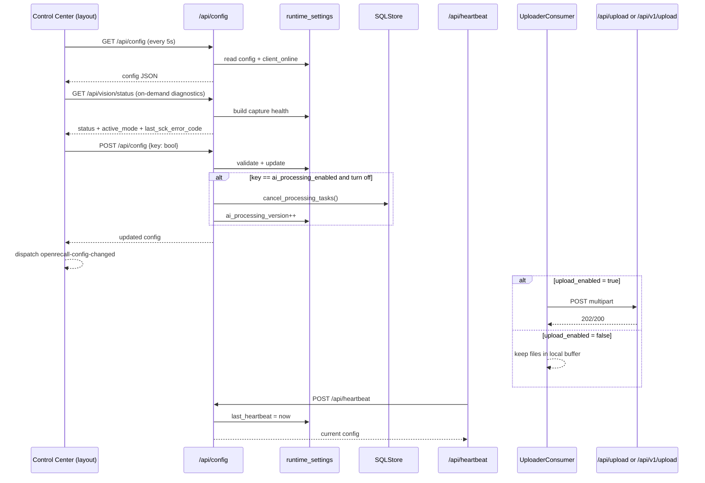

# Control Center 组件文档（布局内全局控制面）

## 1. 页面定位

- 目标：提供运行时开关控制与在线状态可视化。
- 目标用户：运维、调试、需要动态开关采集/上传/AI 的用户。
- 场景：快速暂停录制、暂停上传、暂停 AI 处理、切换 UI 文案显示。
- 当前语义：`recording_enabled=false` 是 pause（暂停采集）而不是整机 offline；恢复后会尝试回到原采集模式。

## 2. 入口与路由

- URL：无独立 URL（嵌入在 header）。
- 所在模板：`/Users/pyw/new/MyRecall/openrecall/server/templates/layout.html`
- 可见页面：`/`、`/timeline`、`/search`
- 后端接口：
  - `/api/config`（GET/POST）
  - `/api/heartbeat`（POST，client 调用，间接影响 UI）
  - `/api/vision/status`（GET，只读诊断）
  - `/api/v1/vision/status`（GET，只读诊断）

## 3. 功能清单

1. 展示连接状态：`Connected/Offline`。
2. 可通过 capture health 诊断当前采集模式：`monitor_id|legacy|paused`。
3. 切换 `recording_enabled`。
4. 切换 `upload_enabled`。
5. 切换 `ai_processing_enabled`。
6. 切换 `ui_show_ai`。
7. 每 5 秒自动拉取最新配置。

限制与降级：
- 若 `/api/config` 请求失败，前端将 `client_online=false` 并保持现有开关显示。
- 提交失败会回滚本地 optimistic toggle 状态。
- `upload_enabled=false` 不会删除本地采集数据，而是让数据停留在 buffer，直到重新开启上传。
- `recording_enabled=false` 时，client 会暂停采集 source；`recording_enabled=true` 时会恢复 source/管道，不应被解释为客户端退出。

## 4. 如何使用

### 最小路径
1. 在任意页面点击右上角 sliders 图标。
2. 在弹出的 Control Center 中切换开关。
3. 观察状态是否即时更新；必要时用 `/api/v1/vision/status` 交叉确认采集模式。

### 常见路径
1. 排障时先确认 `Connected/Offline`。
2. 排障时再看 capture health：`status/active_mode/last_sck_error_code`。
3. 需要降负载时关闭 `ai_processing_enabled`。
4. 需要隐私优先时关闭 `recording_enabled` / `upload_enabled`。

## 5. 数据流与Pipeline

关键数据对象：
- `config`: `recording_enabled/upload_enabled/ai_processing_enabled/ui_show_ai/client_online`。
- `ai_processing_version`: AI 处理开关切换时用于任务取消语义。
- `vision_status`: `status/active_mode/selected_monitors/last_sck_error_code/sck_available`。

## 6. 依赖接口

| 接口 | 方法 | 请求体/参数 | 返回摘要 |
|---|---|---|---|
| `/api/config` | GET | 无 | 当前配置 + `client_online` |
| `/api/config` | POST | `{key: bool}` | 更新后配置 |
| `/api/vision/status` | GET | 无 | 采集健康状态（只读） |
| `/api/heartbeat` | POST | client 心跳 | `{status: ok, config}` |
| `/api/v1/config` | GET/POST | 同上 | v1 兼容路径 |
| `/api/v1/vision/status` | GET | 无 | v1 采集健康状态（只读） |
| `/api/v1/heartbeat` | POST | 同上 | v1 兼容路径 |
| `/api/upload` | POST | multipart(file+metadata) | legacy 上传入口，受 `upload_enabled` 间接影响 |
| `/api/v1/upload` | POST | multipart(file+metadata) | v1 上传入口，受 `upload_enabled` 间接影响 |
| `/api/upload/status` | GET | `checksum` | legacy 断点续传状态 |
| `/api/v1/upload/status` | GET | `checksum` | v1 断点续传状态 |

## 7. 前后变化（相比之前）

| 维度 | 之前 | 当前 |
|---|---|---|
| 组件位置 | 布局内全局组件 | 保持不变 |
| 控制字段 | recording/upload/ai/ui | 保持不变 |
| 在线判断 | heartbeat 15 秒窗口 | 保持不变 |
| 录制开关语义 | 易被误解为“停客户端” | 明确为 pause/resume source，不拆 monitor pipeline |
| 采集诊断 | 需靠日志拼接判断 | 新增 `/api(/v1)/vision/status` 统一观测 |
| API 版本化 | 主要 `/api/config` | 新增 `/api/v1/config` 与 `/api/v1/heartbeat` 兼容路径 |

变化原因与影响：
- 原因：Phase 0/1 重点是后端能力升级与版本化，不改变用户操作模型。
- 影响：运维流程稳定，同时为 remote-first 接口统一做准备。

## 8. 故障与排查

1. 症状：一直显示 Offline。
- 检查：client 是否在发送 `/api/heartbeat`。
- 定位：`run_client.sh` 状态、server 日志、`api.py:heartbeat()`。

2. 症状：录制 toggle 后误判为“客户端离线”。
- 检查：`/api/v1/vision/status` 的 `active_mode` 是否为 `paused`（这属于暂停，不是退出）。
- 定位：`video_recorder.py` 的 runtime pause/resume 分支与 heartbeat 连续性。

3. 症状：开关点击后自动弹回。
- 检查：`POST /api/config` 是否返回 4xx/5xx。
- 定位：字段名是否有效、值是否为 bool。

4. 症状：关闭 AI 后仍有处理任务。
- 检查：是否已触发 `cancel_processing_tasks()`。
- 定位：`api.py:update_config()` 中 AI 开关分支。

5. 症状：已开启录制但页面长时间没有新数据。
- 检查：`upload_enabled` 是否关闭、upload status 是否长期停在 `partial/not_found`。
- 定位：client uploader 日志、`/api/upload/status` 或 `/api/v1/upload/status` 返回值。

6. 症状：SCK 启动失败反复切模式。
- 检查：`/api/v1/vision/status` 的 `last_sck_error_code` 与 `status` 是否进入 `degraded_legacy/permission_denied/no_monitors`。
- 定位：client SCK 重试与恢复探针配置（`OPENRECALL_SCK_*`）。

## 9. 测试与验收点

- [ ] Control Center 在 `/`、`/timeline`、`/search` 三个页面可用。
- [ ] 5 秒轮询可刷新在线状态。
- [ ] 4 个开关可切换并持久反映到 API。
- [ ] 切换失败时前端能回滚。
- [ ] `ai_processing_enabled` 关闭时触发任务取消语义。
- [ ] `recording_enabled` 关闭后 `vision/status.active_mode=paused`，恢复后回到 `monitor_id` 或 `legacy`。
- [ ] `vision/status` 返回 `status/active_mode/last_sck_error_code/selected_monitors/sck_available`。

相关验证来源：
- `/Users/pyw/new/MyRecall/openrecall/server/templates/layout.html`
- `/Users/pyw/new/MyRecall/openrecall/server/api.py`
- `/Users/pyw/new/MyRecall/openrecall/server/api_v1.py`
