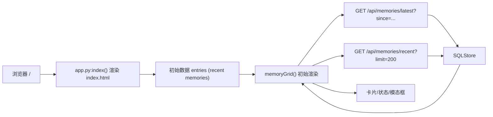

# Home Grid 页面文档（`/`）

## 1. 页面定位

- 目标：展示最近记忆卡片，提供“最新状态 + 快速预览 + 大图浏览”。
- 目标用户：日常回看用户、排障与验证人员。
- 场景：确认采集是否正常、查看最近记录、快速浏览 AI 描述。

## 2. 入口与路由

- URL：`/`
- 后端路由：`/Users/pyw/new/MyRecall/openrecall/server/app.py` 中 `index()`
- 模板文件：`/Users/pyw/new/MyRecall/openrecall/server/templates/index.html`
- 布局依赖：`/Users/pyw/new/MyRecall/openrecall/server/templates/layout.html`

## 3. 功能清单

1. 网格卡片展示（app、时间、图片、状态）。
2. 状态统计（Completed/Processing/Pending）。
3. 卡片点击大图弹窗（支持左右切换、键盘导航）。
4. 增量刷新（latest）+ 全量同步（recent）。
5. 可选 AI 文案显示（受 `ui_show_ai` 控制）。

限制与降级：
- 若图片路径缺失，回退到 `/screenshots/{filename}`。
- 若 API 拉取失败，页面保留当前数据，不中断 UI。
- 若上传被暂停或进入重试，页面轮询仍执行，但新数据到达会延后。

## 4. 如何使用

### 最小路径
1. 打开 `/`。
2. 查看顶部统计和卡片状态。
3. 点击卡片看大图。

### 常见路径
1. 打开 Control Center。
2. 关闭/开启 `Show AI`，观察文案显示变化。
3. 等待 5 秒轮询，检查是否有新记录自动插入。

## 5. 数据流与Pipeline

关键数据对象：
- `entries[]`：包含 `id/timestamp/app/status/description/image_url/filename` 等。
- `lastCheck`：前端增量刷新游标。
- `upload_enabled`（间接依赖）：影响数据何时从 client 进入 server 可见范围。

## 6. 依赖接口

| 接口 | 方法 | 关键参数 | 返回摘要 |
|---|---|---|---|
| `/api/memories/latest` | GET | `since` | 新增记忆列表 |
| `/api/memories/recent` | GET | `limit` | 最近记忆列表 |
| `/api/config` | GET/POST | 布局控制面开关 | 运行时配置 + `client_online` |
| `/api/upload` | POST | multipart(file+metadata) | 采集数据入库入口（间接影响页面数据新鲜度） |
| `/api/v1/upload` | POST | multipart(file+metadata) | v1 视频上传入口（间接影响页面数据新鲜度） |

## 7. 前后变化（相比之前）

| 维度 | 之前 | 当前 |
|---|---|---|
| 页面入口 | `/` | `/`（不变） |
| 刷新机制 | latest/recent 轮询 | 保持不变（稳定兼容） |
| 数据覆盖 | 以 screenshot 为主 | 可承载视频链路派生字段（例如 `image_url` 指向帧） |

变化原因与影响：
- 原因：Phase 1 强化后端数据链路但避免 UI 大改。
- 影响：用户入口稳定，数据表达能力增强。

## 8. 故障与排查

1. 症状：页面不刷新。
- 检查：浏览器网络是否持续请求 `/api/memories/latest` 与 `/api/memories/recent`。
- 定位：`index.html` 的 `setInterval` 与 `checkNew()/refreshRecent()`。

2. 症状：AI 文案不显示。
- 检查：`ui_show_ai` 是否关闭。
- 定位：`layout.html` `toggleSetting('ui_show_ai')` 与 `index.html` 条件渲染。

3. 症状：图片 404。
- 检查：`image_url` / `filename` 是否正确。
- 定位：`imageSrc(entry)` 回退逻辑与 server screenshots 目录。

## 9. 测试与验收点

- [ ] 打开 `/` 可看到卡片列表或空状态。
- [ ] `Completed/Processing/Pending` 统计与卡片状态一致。
- [ ] 新增数据后 5 秒内可自动刷新。
- [ ] 模态框支持 ESC / 左右键。
- [ ] 关闭 `Show AI` 后文案隐藏，打开后恢复。

相关验证来源：
- `/Users/pyw/new/MyRecall/v3/results/phase-0-validation.md`
- `/Users/pyw/new/MyRecall/v3/results/phase-1-validation.md`
