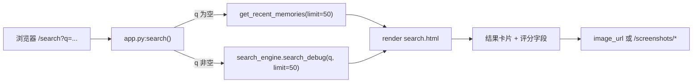

# Search 页面文档（`/search`）

## 1. 页面定位

- 目标：提供可解释的检索结果视图（含 debug 评分维度）。
- 目标用户：需要按关键词定位历史内容的用户与调试人员。
- 场景：搜索文本线索、分析检索排序质量。

## 2. 入口与路由

- URL：`/search`
- 后端路由：`/Users/pyw/new/MyRecall/openrecall/server/app.py` 中 `search()`
- 模板文件：`/Users/pyw/new/MyRecall/openrecall/server/templates/search.html`
- 布局依赖：`/Users/pyw/new/MyRecall/openrecall/server/templates/layout.html`

## 3. 功能清单

1. 搜索表单（`q/start_time/end_time` 字段，当前核心仍是 `q`）。
2. 结果卡片展示（应用、时间、图片、评分）。
3. 多评分维度展示：Final/Rerank/Vector/FTS/Combined。
4. 图片模态预览（左右切换 + 键盘导航）。
5. 无结果空态展示。

限制与降级：
- 页面主路径使用 `search_debug()` 结果结构，强调可解释性而非精简 API。
- 时间字段在模板中可填写，但后端 `search()` 目前未将其作为强过滤参数传入主检索。
- 上传重试期间，最新 OCR 候选可能尚未入检索库，结果会出现短时滞后。

## 4. 如何使用

### 最小路径
1. 打开 `/search`。
2. 输入关键词并提交。
3. 观察卡片与评分，点击图片看大图。

### 常见路径
1. 先用短关键词粗搜。
2. 根据 app/time 缩小候选。
3. 回到 `/timeline` 做时间回放。

## 5. 数据流与Pipeline

关键数据对象：
- `entries[]`：包含 `final_rank/final_score/vector_score/fts_bm25/...` 调试字段。
- 图片来源可来自 `entry.image_url`（含帧 URL）或 screenshot 回退路径。

## 6. 依赖接口

| 接口 | 方法 | 关键参数 | 返回摘要 |
|---|---|---|---|
| `/search` | GET | `q` | SSR 页面（debug 结果） |
| `/api/search` | GET | `q, limit` | legacy JSON 搜索接口 |
| `/api/v1/search` | GET | `q, limit/offset 或 page/page_size` | v1 分页 JSON 搜索接口 |
| `/api/v1/frames/:id` | GET | `frame_id` | 帧图片服务（若 image_url 指向帧） |
| `/api/v1/upload` | POST | multipart(file+metadata) | 检索数据进入管道的上游入口（间接依赖） |

## 7. 前后变化（相比之前）

| 维度 | 之前 | 当前 |
|---|---|---|
| 页面入口 | `/search` | `/search`（不变） |
| 搜索稳定性 | video-only 候选可能触发渲染崩溃 | Phase 1 已修复，video-only 可稳定显示 |
| 数据覆盖 | 以 screenshot 检索语义为主 | 扩展到视频 OCR 候选进入检索 |
| API 标准化 | legacy `/api/search` | 新增 `/api/v1/search` 标准分页接口 |

变化原因与影响：
- 原因：Phase 1 强化视频可检索能力并修复搜索渲染稳定性。
- 影响：搜索结果更完整，且异常路径可控。

## 8. 故障与排查

1. 症状：搜索结果为空。
- 检查：`q` 是否为空、数据是否已完成 OCR/索引。
- 定位：`app.py:search()` 分支与 `search_engine.search_debug()`。
- 补充：若近期采集刚发生且网络不稳，检查 upload status 以确认是否仍在 buffer 重试。

2. 症状：页面报错/卡片无法渲染。
- 检查：是否出现 video-only 特殊候选。
- 定位：Phase 1 已修复该类崩溃，参考 post-baseline changelog。

3. 症状：评分字段全为空。
- 检查：是否走了“空 query -> recent memories”分支。
- 定位：`app.py:search()` `if not q` 分支。

## 9. 测试与验收点

- [ ] 输入关键词后返回结果列表。
- [ ] 评分字段按预期显示（有值或占位）。
- [ ] video-only 结果不崩溃。
- [ ] 图片模态支持 ESC / 左右键。
- [ ] `/api/v1/search` 分页参数兼容（`page/page_size` 与 `limit/offset`）。

相关验证来源：
- `/Users/pyw/new/MyRecall/tests/test_phase1_search_integration.py`
- `/Users/pyw/new/MyRecall/tests/test_phase1_search_debug_render.py`
- `/Users/pyw/new/MyRecall/tests/test_phase1_timeline_api.py`
- `/Users/pyw/new/MyRecall/v3/results/phase-1-validation.md`
