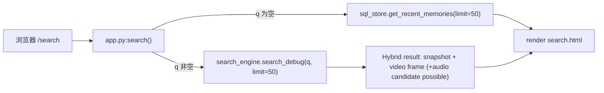

# Search 页面文档（`/search`）

## 1. 页面定位

- 目标：提供可解释检索结果视图（调试优先）。
- 用户：需要按关键词定位历史内容的用户与调试人员。
- 语义定位：Search 页面文档采用 `Current (verified)` 与 `Target (Phase 3 contract)` 双轨。

## 2. 入口与路由

- URL：`/search`
- 后端路由：`openrecall/server/app.py` 中 `search()`
- 模板：`openrecall/server/templates/search.html`
- 布局依赖：`openrecall/server/templates/layout.html`

## 3. Current (Verified)

### 3.1 当前行为（已验证）

1. 表单包含 `q/start_time/end_time` 字段。
2. `/search` 路由当前只读取 `q`，未使用 `start_time/end_time` 进行过滤。
3. 当 `q` 为空：返回 recent memories（最多 50 条），不是有界 browse feed 合同实现。
4. 当 `q` 非空：调用 `search_engine.search_debug(q, limit=50)`。
5. `search_debug` 结果当前仍可能包含 audio transcription 候选（来自 SearchEngine）。

### 3.2 关键证据路径

- `openrecall/server/app.py:search()`
- `openrecall/server/templates/search.html`（表单字段）
- `openrecall/server/search/engine.py`（audio FTS 合并路径）
- `openrecall/server/api_v1.py:search_api()`（空 `q` 返回空分页 payload）

## 4. Target (Phase 3 Contract)

### 4.1 目标契约

1. `GET /api/v1/search` 支持 browse/feed：空 `q` 返回按时间倒序结果。
2. `start_time` 作为有界检索硬约束（MyRecall policy）。
3. Search/Chat grounding 收敛为 vision-only（OCR 证据路径）。
4. 过滤能力统一：`app_name/window_name/focused/browser_url`。

### 4.2 与 Screenpipe 对齐层级

- `semantic`：空 query browse 语义、过滤器心智模型、排序规则。
- `discipline`：默认短时间窗与有界查询实践（防止超大范围扫描）。
- `divergence`：MyRecall 目标阶段的 vision-only 收敛与参数策略。

## 5. 数据流（Current）

## 6. 接口映射

| 接口 | 方法 | Current | Target |
|---|---|---|---|
| `/search` | GET | SSR 调试页；仅 `q` 生效 | 保持为调试/观察入口 |
| `/api/search` | GET | legacy JSON 搜索 | 兼容保留 |
| `/api/v1/search` | GET | 空 `q` 返回空分页；`start_time` 未强制 | browse/feed + bounded 合同 |
| `/api/v1/frames/:id` | GET | 帧图片服务 | 作为 evidence drill-down 核心 |

## 7. 风险与盲点

1. 将 target 契约写成 current 事实会误导测试与排障。
2. 若不显式标注 audio 候选仍在 SearchEngine 中，容易与 vision-only MVP 口径冲突。
3. 若不区分 API 层行为与 agent 操作纪律，容易错误声称“已与 screenpipe 完全同构”。

## 8. 验收清单（文档层）

- [x] 明确 `Current (verified)` 与 `Target`。
- [x] 明确 `/search` 与 `/api/v1/search` 当前差异。
- [x] 明确 screenpipe 对齐层级（semantic/discipline/divergence）。
- [x] 明确 vision-only 是 Search/Chat 目标约束，而非当前全部链路现实。

## 9. 相关文档

- `v3/milestones/roadmap-status.md`
- `v3/decisions/ADR-0006-screenpipe-search-contract.md`
- `v3/plan/06-vision-chat-mvp-spec.md`
