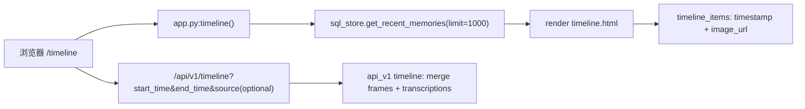

# Timeline 页面文档（`/timeline`）

## 1. 页面定位

- 目标：按时间顺序回看历史画面。
- 用户：回顾特定时间段行为的用户与调试人员。
- 文档模式：`Current (verified)` 与 `Target positioning` 双轨。

## 2. 入口与路由

- URL：`/timeline`
- 后端路由：`openrecall/server/app.py` 中 `timeline()`
- 模板：`openrecall/server/templates/timeline.html`
- 布局：`openrecall/server/templates/layout.html`

## 3. Current (Verified)

1. `/timeline` 页面当前由 `get_recent_memories(limit=1000)` 预聚合注入 `timeline_items`。
2. 页面主视图展示 `timestamp + image_url`，偏向视觉回看。
3. `/api/v1/timeline` 当前默认返回 mixed 数据（video frames + audio transcriptions）。
4. `/api/v1/timeline` 支持 `source` 过滤（如 `source=audio` / `source=video`）。

关键证据路径：

- `openrecall/server/app.py:timeline()`
- `openrecall/server/api_v1.py:timeline_api()`
- `tests/test_phase2_timeline.py`

## 4. Target Positioning

1. Timeline 在 target 合同中默认返回 video-only（证据主链优先）。
2. Phase 2.6 起，主路径与标准检索路径不返回 audio 项。
3. Search/Chat grounding 维持 vision-only 主线，不依赖 timeline audio 路径。
4. 文档语义必须区分 current mixed 现实与 target video-only 默认合同。

## 5. 数据流（Current）

## 6. 接口映射

| 接口 | 方法 | Current | Target |
|---|---|---|---|
| `/timeline` | GET | SSR 页面，视觉回看主入口 | 保持 |
| `/api/v1/timeline` | GET | 默认 mixed；可按 `source` 过滤 | 默认/标准路径 video-only；不返回 audio |
| `/api/v1/frames/:id` | GET | 帧图片服务（含 fallback） | 证据 drill-down 基础能力 |

## 7. 风险与盲点

1. 若把 target 合同误写成 current 现实，会造成排障与验收误判。
2. 若不声明 target 默认 video-only，Search/Chat 的证据边界会继续被 mixed 语义污染。
3. 若运行时仍可通过配置/模式绕回 audio 返回，会直接违反 2.6-G-05（Anti-Bypass）。

## 8. 验收清单（文档层）

- [x] 明确 timeline 页面与 timeline API 的语义差异。
- [x] 明确 `/api/v1/timeline` 当前 mixed 默认行为。
- [x] 明确 target 合同默认/标准路径 video-only，audio 不在主检索路径返回。

## 9. 相关文档

- `v3/milestones/roadmap-status.md`
- `v3/webui/ROUTE_MAP.md`
- `v3/webui/DATAFLOW.md`
