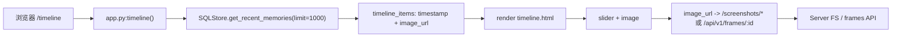

# Timeline 页面文档（`/timeline`）

## 1. 页面定位

- 目标：按时间顺序回看历史画面。
- 目标用户：回顾特定时间段行为的用户。
- 场景：快速拖动查看“某个时间点屏幕内容”。

## 2. 入口与路由

- URL：`/timeline`
- 后端路由：`/Users/pyw/new/MyRecall/openrecall/server/app.py` 中 `timeline()`
- 模板文件：`/Users/pyw/new/MyRecall/openrecall/server/templates/timeline.html`
- 布局依赖：`/Users/pyw/new/MyRecall/openrecall/server/templates/layout.html`

## 3. 功能清单

1. 时间滑杆（离散索引）切换画面。
2. 显示对应时间戳（24h 格式）。
3. 展示对应图片（截图或帧 URL）。
4. 无数据时显示空提示。

限制与降级：
- 时间线数据当前由 server 预聚合后一次性注入页面（非流式）。
- 图片不可用时浏览器显示加载失败；帧路径可依赖后端 on-demand 抽帧 fallback。
- 上传暂停或重试时，最新时间段数据可能暂时缺失，待上传完成后补齐。

## 4. 如何使用

### 最小路径
1. 打开 `/timeline`。
2. 拖动滑杆。
3. 查看时间与图片变化。

### 常见路径
1. 先在 `/search` 定位大致时间。
2. 再到 `/timeline` 做精细回看。

## 5. 数据流与Pipeline

关键数据对象：
- `timeline_items[]`：`{timestamp, image_url}`。
- 前端使用反向索引实现“最新在右侧”的拖动体验。
- `frame_id`（通过 `image_url` 间接承载）：对应 `/api/v1/frames/:id` 的检索键。

## 6. 依赖接口

| 接口 | 方法 | 关键参数 | 返回摘要 |
|---|---|---|---|
| `/timeline` | GET | 无 | SSR 页面 + timeline_items JSON |
| `/api/v1/frames/:id` | GET | `frame_id` | 帧图片（可按需抽帧） |
| `/api/v1/timeline` | GET | `start_time/end_time/page/page_size` | 标准时间线分页 JSON（用于 API 客户端） |
| `/api/v1/upload` | POST | multipart(file+metadata) | 视频进入时间线数据的上游入口（间接依赖） |

## 7. 前后变化（相比之前）

| 维度 | 之前 | 当前 |
|---|---|---|
| 页面形态 | 滑杆 + 单图浏览 | 维持不变 |
| 数据语义 | 以截图为主 | 支持视频帧 URL（`/api/v1/frames/:id`） |
| API 基座 | 非 v1 主路径 | 已具备 `/api/v1/timeline` 与帧接口能力 |

变化原因与影响：
- 原因：Phase 1 主要强化视频管道与可检索帧，不做大规模 UI 重构。
- 影响：UI 外观稳定，但底层数据可表达连续视频信息。

## 8. 故障与排查

1. 症状：滑杆可动但图片不变。
- 检查：`timeline_items` 内容是否都指向同一 URL。
- 定位：`app.py:timeline()` 组装逻辑与数据源质量。

2. 症状：帧图片 404。
- 检查：`/api/v1/frames/:id` 是否可访问。
- 定位：`api_v1.py:serve_frame()` 的文件存在/按需抽帧逻辑。

3. 症状：时间显示异常。
- 检查：timestamp 是否为秒级数字。
- 定位：`timeline.html` 中 `formatDate24Hour()` 与 `Number(item.timestamp)`。

## 9. 测试与验收点

- [ ] `/timeline` 可正常渲染。
- [ ] 滑杆移动时图片与时间同步变化。
- [ ] 无数据时显示空提示。
- [ ] `image_url` 为 `/api/v1/frames/:id` 时可正常显示。
- [ ] `/api/v1/timeline` 支持分页参数且返回正确 meta。

相关验证来源：
- `/Users/pyw/new/MyRecall/tests/test_phase1_timeline_api.py`
- `/Users/pyw/new/MyRecall/v3/results/phase-1-validation.md`
