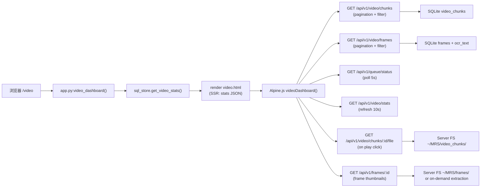

# Video Dashboard 页面文档（`/video`）

## 1. 页面定位

- 目标：Video pipeline 综合 dashboard，提供 chunk 管理、视频播放、frame gallery 浏览、队列状态和聚合统计。
- 目标用户：需要查看和管理 video 采集数据的运维人员和开发者。
- 场景：检查 video 采集状态、浏览帧画面、播放 video chunks、监控处理队列。

## 2. 入口与路由

- URL：`/video`
- 后端路由：`/Users/pyw/new/MyRecall/openrecall/server/app.py` 中 `video()`
- 模板文件：`/Users/pyw/new/MyRecall/openrecall/server/templates/video.html`
- 布局依赖：`/Users/pyw/new/MyRecall/openrecall/server/templates/layout.html`

## 3. 功能清单

1. **Stats bar**：展示 4 个统计卡片（Total Chunks、Total Frames、Total Duration、Storage Size）。
2. **Chunk 列表**：分页表格展示 video chunks，支持 status/monitor_id 过滤。每行显示 ID、Device、Monitor、Status、Start Time、End Time、Created At。
3. **Inline video playback**：每个 chunk 行有 Play 按钮，点击后使用 HTML5 `<video>` 在 modal 或 inline player 中播放 mp4 文件。`preload="metadata"` 避免预加载大文件。
4. **Frame gallery**：网格缩略图展示 video frames（source: `/api/v1/frames/{frame_id}`），分页浏览，支持 app/window/time range 过滤。点击 thumbnail 打开大图 modal（复用 `index.html` modal 模式，含 OCR text 展示）。
5. **Queue status**：4 个 colored badges 展示处理状态分布。每 5s 自动刷新。

限制与降级：
- 不提供 frame-accurate seeking 或帧级 scrubbing，video playback 为整个 mp4 chunk。
- 不提供搜索功能，搜索请使用 `/search`。
- 上传暂停/重试对数据新鲜度的影响：upload buffer 中的 video chunks 在上传成功前不会出现在 chunk 列表中。
- API fetch 失败时显示 error banner，10s 后自动重试。
- 无数据时显示友好空态提示："No video chunks recorded yet"。
- mp4 文件在 disk 上缺失时，playback UI 显示 "File not available" 提示。
- Frame image 加载失败时显示 placeholder（浏览器默认 broken image icon 或 custom fallback）。

## 4. 如何使用

### 最小路径
1. 打开 `/video`。
2. 查看 stats bar 了解 video pipeline 概况。
3. 浏览 chunk 列表和 frame gallery。

### 常见路径
1. 在 `/video` 查看 chunk status 分布。
2. 使用 monitor filter 过滤特定显示器的 chunks。
3. 点击 chunk 的 Play 按钮播放 video。
4. 在 frame gallery 中浏览帧画面，使用 app/window filter 查看特定应用截图。
5. 点击 frame thumbnail 查看大图和 OCR 文本。
6. 如需全文搜索，切换到 `/search`。

## 5. 数据流与 Pipeline

关键数据对象：
- `stats`: `{total_chunks, total_frames, total_duration_seconds, storage_bytes, status_counts}` — SSR 注入 + 周期性刷新。
- `chunks[]`: paginated video_chunks list with status/monitor metadata。
- `frames[]`: paginated frames list (from `/api/v1/video/frames`)，每帧含 `frame_url`, `app_name`, `window_name`, `ocr_text` (snippet)。
- `queueStatus`: from `/api/v1/queue/status`, 包含 `video_queue` object。
- Video file source: `/api/v1/video/chunks/{id}/file` returns `video/mp4`。
- Frame image source: `/api/v1/frames/{frame_id}` returns `image/png`（支持 on-demand extraction fallback）。

## 6. 依赖接口

| 接口 | 方法 | 关键参数 | 返回摘要 |
|---|---|---|---|
| `/video` | GET | 无 | SSR 页面 + stats JSON |
| `/api/v1/video/chunks` | GET | `limit/offset`, `status`, `monitor_id` | 分页 video chunks 列表 |
| `/api/v1/video/chunks/:id/file` | GET | `chunk_id` | mp4 video file (video/mp4) |
| `/api/v1/video/frames` | GET | `limit/offset`, `chunk_id`, `app`, `window`, `start_time/end_time` | 分页 frames 列表（含 OCR text snippet） |
| `/api/v1/video/stats` | GET | 无 | Video 聚合统计 |
| `/api/v1/frames/:id` | GET | `frame_id` | Frame image (image/png)（已有 Phase 1 endpoint） |
| `/api/v1/queue/status` | GET | 无 | 处理队列状态 |
| `/api/config` | GET | 无 | Runtime config (Control Center 使用) |

## 7. 前后变化（相比之前）

| 维度 | 之前 | 当前 |
|---|---|---|
| 页面形态 | 无独立 video 页面；video frames 通过 `/timeline` 和 `/search` 间接展示 | 独立 Video Dashboard with chunk management + playback + frame gallery |
| 数据可视化 | Frames 仅在 timeline slider 和 search results 中出现 | Dedicated frame gallery with grid layout + modal + filter |
| 媒体播放 | 无 video playback（仅帧图片展示） | HTML5 `<video>` inline playback support for mp4 chunks |
| Chunk 管理 | 无视觉化 chunk 列表 | Paginated chunk table with status/monitor filter |
| 队列监控 | 仅通过 API 获取 | Dashboard 直接展示 queue status badges |
| 统计概览 | 无 video 聚合统计 UI | Stats bar 展示 chunks/frames/duration/storage |
| API 覆盖 | `GET /api/v1/timeline`（unified）、`GET /api/v1/frames/:id` | 新增 `video/chunks` + `video/chunks/:id/file` + `video/frames` + `video/stats` |
| Navigation | 3 page icons | 5 page icons (+Audio/Video) |

变化原因与影响：
- 原因：Phase 1 完成了 video pipeline 但缺少专属管理入口。Video data 仅通过 timeline/search 间接访问，缺少 chunk-level 管理和 video playback 功能。
- 影响：运维人员可直接查看 video chunks 状态、播放 video 回放、按 app/window 浏览帧画面。Frame gallery 提供比 timeline slider 更灵活的浏览方式。

## 8. 故障与排查

1. 症状：Video playback 无法播放或黑屏。
- 检查：chunk 对应的 mp4 文件是否存在于 `~/MRS/video_chunks/` 目录。
- 定位：`GET /api/v1/video/chunks/{id}/file` 是否返回 200 或 404。
- 补充：确认 mp4 编码为 H.264（browser 兼容），检查 browser console 错误。

2. 症状：Frame gallery thumbnails 不显示。
- 检查：`/api/v1/frames/{frame_id}` 是否可正常返回 image。
- 定位：`api_v1.py:serve_frame()` 的文件存在/按需抽帧逻辑。
- 补充：frame 文件可能需要 on-demand extraction，首次加载较慢。

3. 症状：Chunk 列表为空。
- 检查：video chunks 是否已上传（client buffer 堆积检查）。
- 定位：`GET /api/v1/queue/status` 查看 video_queue。

4. 症状：Stats 数字异常（如 duration 为 0）。
- 检查：video_chunks 表的 `start_time` / `end_time` 列是否被正确填充。
- 定位：`sqlite3 ~/MRS/db/openrecall.db "SELECT start_time, end_time FROM video_chunks LIMIT 5"`

5. 症状：Monitor filter 无效果。
- 检查：filter 值是否与 video_chunks.monitor_id 精确匹配。
- 定位：`GET /api/v1/video/chunks?monitor_id=69734144` 手动测试。

## 9. 测试与验收点

- [x] `/video` 页面可正常渲染（GET /video → 200）。
- [x] Stats bar 展示正确数据。
- [x] Chunk 列表分页正常工作。
- [x] Status filter 生效。
- [x] Monitor filter 生效。
- [x] Play button 点击后 video 播放（HTML5 `<video>` controls 出现）。
- [x] Frame gallery 展示缩略图。
- [x] Frame gallery 分页正常工作。
- [x] Frame gallery app/window/time filter 生效。
- [x] 点击 frame thumbnail 打开 modal 大图。
- [x] Queue status badges 正确反映处理状态。
- [x] 空数据库时显示友好空态提示。
- [x] mp4 文件缺失时 playback 显示 error。
- [x] Frame image 404 时显示 fallback。
- [x] Navigation 中 Video icon 在 `/video` 页面 highlighted。
- [x] 不影响已有页面。

相关验证来源：
- `/Users/pyw/new/MyRecall/tests/test_phase25_api.py` — 30 passed
- `/Users/pyw/new/MyRecall/tests/test_phase25_video_page.py` — 8 passed
- `/Users/pyw/new/MyRecall/tests/test_phase25_navigation.py` — 13 passed
- `/Users/pyw/new/MyRecall/v3/results/phase-2.5-validation.md`
